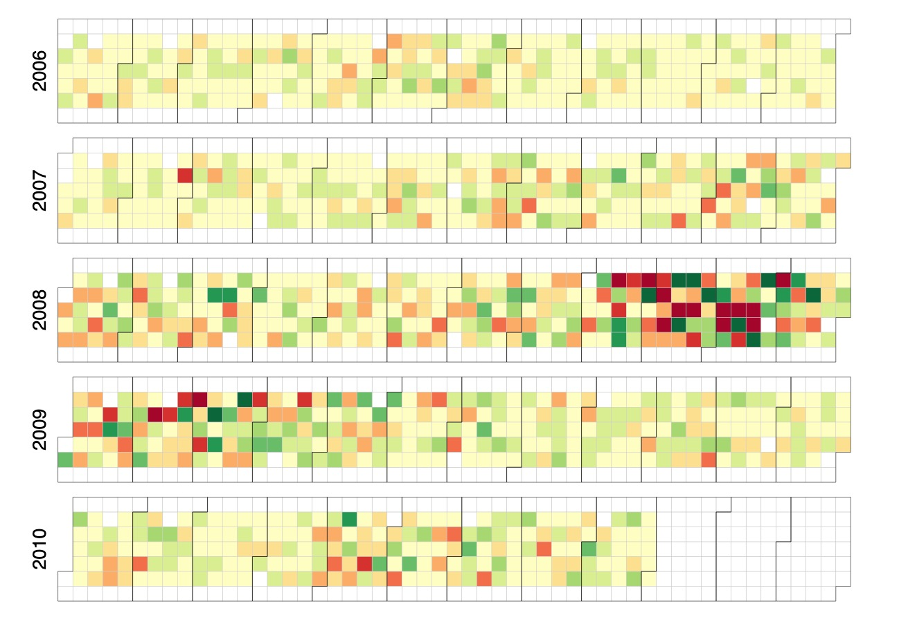

<script type="text/x-mathjax-config">
  MathJax.Hub.Config({ TeX: { equationNumbers: {autoNumber: "all"} } });
</script>

```{r echo = FALSE}
 library(rmarkdown)
# setwd("")
# f <- list.files()[1]
# render(f, output_format='pdf_document')
# render(f, output_format='pdf_document')
```

```{r, set-options, echo = FALSE, cache = FALSE}
options(width=100)
knitr::opts_chunk$set(
 eval = F, # run all code
 # echo = FALSE, # show code chunks in output 
 comment = "",
 tidy.opts=list(width.cutoff=100), # set width of code chunks in output
 tidy=TRUE, # make output as tidy
 message = FALSE,  # mask all messages
 warning = FALSE, # mask all warnings 
 size="small" # set code chunk size
)

# https://github.com/ucb-stat133/stat133-fall-2016/blob/master/hws/hw02-tables-ggplot.Rmd
knitr::opts_knit$set(root.dir=paste0(params$dir,"/")) # set working dir

setwd(paste0(params$dir,"/")) # for running just in R not knitr
```

\  

Date: `r params$date`  
`R` version: `r params$version`  
*Corresponding author: `r params$email`  
This document can be found at `r params$doi`

\newpage  

## Overview

Same deal as Useful Code, but the second instalment because the first one has too much stuff in it and now runs slow.   

### Colour palettes
`Colorspace`  
```{r, col1, eval=T}
require(colorspace)
hcl_palettes(plot = TRUE) # show all palettes
```

```{r,echo=F}
require(dplyr)
```


```{r, col1_}
# https://cran.r-project.org/web/packages/colorspace/vignettes/colorspace.html
require(colorspace)
q4 <- qualitative_hcl(4, palette = "Dark 3") # discrete
s9 <- sequential_hcl(9, "Purples 3") # continuous
# for ggplot
scale_color_discrete_sequential(palette = "Purples 3", nmax = 6, order = 2:6)
# for colospace functions: 
# hcl_palettes() %>% str
# hcl_palettes()["type"]
```
      
Neon colour palettes      
```{r, col2,eval=T}
# https://www.shutterstock.com/blog/neon-color-palettes
neon1 <-  c("#3B27BA","#FF61BE","#13CA91","#FF9472")
neon2 <- c("#FFDEF3","#FF61BE","#3B55CE","#35212A")
neon3 <- c("#FEA0FE","#F85125","#02B8A2","#535EEB")
neon4 <- c("#535EEB","#001437","#C6BDEA","#FFAA01")
scales::show_col(c(neon1,neon2,neon3,neon4))
```

Hexadecimal color code for transparency  
See https://gist.github.com/lopspower/03fb1cc0ac9f32ef38f4.  
```{r,col3}
require(colorspace)
require(stringr)
colv <- c("#004616",sequential_hcl(5,"Lajolla"))
str_sub(colv,0,1) <- "#66" # add alpha opac to col vector
```

    
### D3      

Links    
- [](https://github.com/d3/d3/wiki/Gallery)  
- [](https://bl.ocks.org/mbostock)  
- [](https://vida.io/explore)  


D3 and leaflet  
```{r, d31, eval=T}

# devtools::install_github("jcheng5/d3scatter")
require(pacman)
p_load(d3scatter,crosstalk,leaflet,tibble,httpuv)

sd <- SharedData$new(quakes[sample(nrow(quakes), 100),])
# sd$data() %>% head 

bscols(widths = c(12, 6, 6),
       filter_slider("stations", "Stations", sd, ~stations),
       leaflet(sd, width = "100%", height = 400) %>% 
         addTiles() %>% 
         addCircleMarkers(lng=sd$data()[,"long"],
                    lat=sd$data()[,"lat"],
                    stroke = F,
                    fill = T,
                    color = "red",
                    fillOpacity = 0.5,
                    radius = ~mag + 2,
                    label = ~paste0("Depth: ",as.character(depth))
                    ),
       d3scatter(sd, width = "100%", height = 400, ~mag, ~depth, color = ~stations)
)

```

Convert R code to D3 
https://rstudio.github.io/r2d3/articles/visualization_options.html  

Create calendar plot   
```{r, d32, eval=T}
# https://rstudio.github.io/r2d3/articles/gallery/calendar/ install.packages('r2d3')
require(r2d3)
require(readr)
require(dplyr)
require(colorspace);require(scales);require(stringr)

# col pal
col <- "PuBuGn" # seq
col2 <- "Tropic" # diverge

# seq
pal <- sequential_hcl(12, col) 
# pal %>% show_col(borders = NA,labels=F)
paste0('"',pal,'"') %>% cat(sep=",")

# diverge
pal <- diverge_hcl(12, col2) 
# pal %>% show_col(borders = NA,labels=F)
# paste0('"',pal,'"') %>% cat(sep=",")

cal <- read_csv("https://raw.githubusercontent.com/rstudio/r2d3/master/vignettes/gallery/calendar/dji-latest.csv")

r2d3(data = cal,
     d3_version = 4,
     container = "div",
     options = list(start = 2006, end = 2011),
     script = "calendar.js"
)

```

<!--  -->


### Data frames  
Reversing order of rows in dataframe
```{r,d1}
# df = data.frame
require(tidyverse)
df %>% map_df(rev)
```

Visualise data structure as tree
```{r, d2, eval = T}
#explore package
require(DataExplorer)
require(palmerpenguins)
p <- penguins
plot_str(p)
```

### `dplyr` basics 
```{r,dplyr1}
require(dplyr,gapminder)
pacman::p_load(gapminder)

# mutate
africa_ranked <- mutate(gapminder, 
       "African" = continent == "Africa",
       "RankPop" = rank(desc(pop))
       ) 

africa_ranked %>% glimpse() # visualise the data
africa_ranked %>% filter(continent=="Africa") %>% glimpse # visualise just africa

# summarise data into one line  
gapminder %>% 
  summarise("MinYear" = min(year,na.rm = T),
            "MaxYear" = max(year),
            "CountryCount" = n_distinct(country),
            "Counts" = n()
            )

gapminder %>%  
  summarise(median(lifeExp))

# filter
require(gapminder)
gapminder %>% 
  filter(continent == "Africa") 

# group by 
gapminder %>%  
  group_by(continent) %>% 
  summarise(median(lifeExp))


# group by continent and filter by year
gapminder %>% 
  group_by("Continent" = continent) %>% 
  filter(year == 1992) %>% 
  summarise(LifeExpect = median(lifeExp)) -> life_cont_1992


```

Execute unfriendly pipe functions inline in pipes       
```{r}
require(palmerpenguins)
require(dplyr)
p <- penguins

# %T>%
p %T>% glimpse %>% select(island) 

# with()
p %>% 
    with(lm(body_mass_g ~ flipper_length_mm)) %>%
    summary()

# %$%  
# when var on lhs is undefined     
require(magrittr)
data.frame(z = rnorm(100)) %$%
  ts.plot(z)
```

Apply function easily using `mutate_at`
```{r}
# eg 1
df %>% 
  mutate_at("var1", ~str_replace_all(.," ","<br>"))

# eg 2
df %>% 
  mutate_at("layer", ~replace(.,is.nan(.), 0))
```


### Generic functions 

Convert character class to numeric (ideal when creating colour palettes to turn string cols in df to numeric)
```{r}
require(dplyr)
set.seed(12)
df <- data.frame("X"=LETTERS[sample(20)])
int_vec <- df$X %>% unlist %>% as.factor %>% as.integer # converts to numbers 
int_vec ; df$I <- int_vec
df
```

Pipe vector to multiple arguments  
```{r}
require(dplyr)


# as list
Sys.time() %>% list(format(.,c(
  "%y-%m",
  "%Y-%m",
  "%Y-%m"))) 

# use curly braces to keep original class
Sys.time() %>% {
  format(.,c(
  "%y-%m",
  "%Y-%m",
  "%Y-%m"))
}
```

Merge/combine/match/fill rows of two data frames based on value and retain original number of rows  
```{r}
merge(a, b, by = "ID", sort = F) 
```

Access vars in df/tibble that failed to load eg. time series that return NA 
```{r}
# as tibble
df %>% attr("problems")
```

### Google drive  

Access files on Google Drive   
Common commands: find, ls, mv, cp, mkdir, rm  
http://googledrive.tidyverse.org/  
```{r, eval=F}
require(googledrive)
drive_find(n_max=10) # set output limits
drive_find(type = "folder")
drive_get("~/Data/eli/feb.csv")
```


### HTML code  

```{r}
code <- "<!DOCTYPE html>
  <html>
<body>

<h1>My First Heading</h1>

<p>My first paragraph.</p>

</body>
</html>"

code <- paste(as.character(code), collapse = "\n")

write.table(code, 
            file="/Users/code.html", 
            quote = FALSE,
            col.names = FALSE,
            row.names = FALSE)
```


Extracting multiple nodes/range of nodes at once  
```{r}
# require(dplyr,rvest,xml2,readr,magrittr)
url <- "https://www.postholer.com/databook/Appalachian-Trail/3"
url %>% read_html() %>% html_nodes("table") %>% .[1:3]  # get range (node)
url %>% read_html() %>% html_nodes("table") %>% .[[1]] # get individual (nodeset)
```


### Interactive plots  
Clickme, NVD3, Polychart, rCharts, Rickshaw, and xCharts in `R`.  
[Link to collated Github page](https://github.com/darwinanddavis/rInteractive).    

### Leaflet  

```{r, eval=T, echo=F}
require(leaflet)  
require(dplyr)
require(geosphere) # for flight arc paths 

setview <- c(9.145000,40.489674)
mp <- data.frame(
  "name" = c("Melbourne","Amsterdam","Leipzig","Medellin","Atlanta"),
  "lat" = c(-37.813629,52.370216,51.339695,6.244203,33.748997),
  "lon" = c(144.963058,4.895168,12.373075,-75.581215,-84.387985)
)
# write.csv(mp,"/Users/malishev/Documents/Data/reveal_test/reveal_test/data/mp.csv")


latlon_matrix <- matrix(c(mp[,"lon"],mp[,"lat"]),ncol=2)
custom_tile <- "http://d.sm.mapstack.stamen.com/((darkmatter,$00ffff[hsl-color]),(mapbox-water,$00589c[hsl-color]),(parks,$ff9a30[source-in]))/{z}/{x}/{y}.png"


par(bg="black")
colv <- "orange"
opac <- 0.5
site_names <- mp$name
map <- gcIntermediate(latlon_matrix[2,],
                      latlon_matrix,
                      n=100, 
                      addStartEnd=T,
                      sp=T) %>%
  leaflet() %>% 
  setView(setview[2],setview[1],zoom=2) %>% 
  addTiles(custom_tile) %>% 
  addCircleMarkers(mp[,"lon"],
                   mp[,"lat"],
                   radius = 10,
                   stroke = TRUE,
                   weight = 3, 
                   opacity = opac,
                   color = colv,
                   fillColor = colv,
                   popup=paste0("<br>",mp$name,"<br>"),
                   # popupOptions = 
                   #   popupOptions(closeButton = T,autoPan = T),
                   label=paste(site_names),
                   labelOptions = 
                     labelOptions(textsize = "20px",opacity = 0.5)
  ) %>%
  # addProviderTiles(
  #   "CartoDB.DarkMatter"
  #   # "Stamen.TonerLite"
  #   ) %>%
  addPolylines(
    color = colv,
    opacity = opac)
map
```


Interactive label options and custom tiles    

```{r}
require(leaflet)
require(dplyr)
require(geosphere)
require(htmltools)

setview <- c(7.369722, 12.354722)
mp <- data.frame(name = c("Melbourne", "Atlanta"), lat = c(-37.813629, 33.748997), lon = c(144.963058, 
                                                                                           -84.387985))
latlon_matrix <- matrix(c(mp[, "lon"], mp[, "lat"]), ncol = 2)
custom_tile <- "http://a.sm.mapstack.stamen.com/(positron,(mapbox-water,$776699[hsl-color]),(buildings,$002bff[hsl-color]),(parks,$6abb9d[hsl-color]))/{z}/{x}/{y}.png"
colv <- "#4C3661"
opac <- 0.5
site_names <- mp$name
ttl <- "Debunking Flat Earth theory 101"
weblink <- "https://github.com/darwinanddavis"  # weblink
webname <- "My github"
href <- paste0("<b><a href=", weblink, ">", webname, "</a></b>")
text_label <- paste(sep = "<br/>", href, "606 5th Ave. S", "Seattle, WA 98138")
# label options
marker_label_opt <- labelOptions(textsize = "20px", opacity = 0.5, offset = c(0, 0))
text_label_opt <- labelOptions(noHide = T, direction = "top", textOnly = T, opacity = 1, offset = c(0,0))

# title
tag.map.title <- tags$style(
  HTML(".leaflet-control.map-title { 
       transform: translate(-50%,20%);
       position: fixed !important;
       left: 50%;
       text-align: center;
       padding-left: 10px; 
       padding-right: 10px; 
       background: white; opacity: 0.7;
       font-weight: bold;
       font-size: 25px;
       }"
       ))
title <- tags$div(
  tag.map.title, HTML(ttl)
)  


# map
map <- gcIntermediate(latlon_matrix[1, ], latlon_matrix[2, ], n = 100, addStartEnd = T, sp = T) %>% 
  leaflet() %>% 
  setView(setview[2], setview[1], zoom = 3) %>% 
  addTiles(custom_tile) %>% addCircleMarkers(mp[, "lon"], mp[, "lat"], 
                                             radius = 10, stroke = TRUE, weight = 3, opacity = opac, color = colv, fillColor = colv, 
                                             label = paste(site_names), labelOptions = marker_label_opt) %>%
  addPolylines(color = colv, opacity = opac) %>% 
  addPopups(-122.327298, 47.597131, 
            text_label, options = 
              popupOptions(closeButton = FALSE, textOnly = T)) %>% 
  addLabelOnlyMarkers(setview[2], setview[1], 
                      label = text_label, labelOptions = text_label_opt) %>% 
  addControl("@darwinanddavis", position = "topright") %>%
  addControl(title, position = "topleft", className="map-title")
map


```

### Lists  
Transpose list (flip list elements)     
```{r, list1}
l <- list(1:2, 3:4, 5:7, 8:10);l
b <- data.table::transpose(l)
b
```

`lengths` for getting length of list indices  
```{r}
require(dplyr)
ls = list(rep(list(sample(50,replace=T)),5))
ls %>% length
ls %>% lengths
lapply(ls,lengths)

```

Split list into smaller sublists  
```{r list3}
la = rep(list(1:5),6)
names(la) = rep(LETTERS[1:3],2)
u <- length(unique(names(la)))
n <- length(la)/u
split(la, rep(1:n, each=u))

# for when list has two elements in the name that change 
# create a list of 10 letters with 5 lists in each 
big_list <- rep(list(1:10),5) %>% pmap(list) 
names(big_list) <- LETTERS[1:10]
# to index the upper list
big_list["B"] # 1
pluck(big_list,"B") # 2
# to index the sublists
map(big_list["B"],3) # 1
bb_final <- list() # 2
for(i in 1:10){ 
  bb <- big_list["B"]
  bb_final <- c(bb_final,bb)
}; bb_final


```

Fill list elements with NAs to match length of longest element
```{r,list4}
# https://stackoverflow.com/questions/34570860/add-nas-to-make-all-list-elements-equal-length

#for single index list
set.seed(1)
ls = replicate(5, sample(1:100,10), simplify=FALSE)
names(ls) = LETTERS[1:length(ls)]
lapply(ls, `length<-`, max(lengths(ls)))

# for sublists
ls = list(replicate(5, sample(1:100,10), simplify=FALSE))
n.ticks = 20
fillvec = function(x){
  nv = lapply(x,`length<-`, n.ticks) # fill remaining vec with NAs to match total length
  rapply(nv, f=function(x) ifelse(is.na(x),0,x), how="replace" ) # replace NAs with 0s
}
lapply(ls,fillvec) # apply fillvec to list


```
  
Access list elements in loop by name/string    
```{r,list5}
set.seed(12)

# inputs
time <- 5
time_vec <- 1:10
a_vec <- runif(10)
beta1_vec <- 1:10
beta2_vec <- 11:20
param_vec <- list(a_vec,beta1_vec,beta2_vec)
names(param_vec) <-c("alpha","beta1","beta2") 
params <- sapply(rep(NA,length(param_vec)),list) # create empty final params vector
names(params) <- names(param_vec)

# select parameter to test 
param_input <- "alpha" #beta1 #beta2

# run from here -----------------------------------------------------------
for(time in time_vec) {
  p_in = param_vec[`param_input`][[1]][time] # get parameter value by name
  # create new list of with updated param_input value
  params <- c(param_vec[-which(names(param_vec)==param_input)], # everything but param_input
              param_input = p_in # param_input
              )
  # get just the latest value
  # remove this if you want all list elements
  params <- sapply(params,function(x) x[1]) %>% as.numeric 
  # rename this new list
  names(params) <- c(names(param_vec)[-which(names(param_vec)==param_input)], # everything but param_input
                     param_input
                     )
  print(params)
} # end loop
params # each list element changes depending on user input 
```

Apply function to nested lists  
```{r,list6}
ls = list(replicate(5, sample(1:100,10), simplify=FALSE))
ls %>% glimpse
lapply(ls, lapply, mean) 
lapply(ls, sapply, mean)   # return as one list 
rapply(ls, mean, how='unlist')  # unlist, replace, or list

```

Apply function to list (without lapply)
```{r, list7}
require(lubridate)
ft <- c(now(), now() %>% rollback(), now() %>%  rollback(roll_to_first = T))
ftl <- ft %>% list(isoyear(.), epiyear(.), wday(.), wday(., label = T), qday(.), week(.), semester(.), 
    am(.), pm(.))
names(ftl) <- c("data", "international standard date-time code (ISO 8601)", "epidemiological year", "weekday", 
    "weekday as label", "day into yearly quarter", "week of year", "semester", "AM?", "PM?")
```


### Loading packages 
`pacman`    
```{r,load1}
require(pacman)
p_load(dplyr,mapdeck)
```


### Plotting 

Hand drawn plotting using `roughViz.js`. [Link to package page](https://rdrr.io/github/XiangyunHuang/roughviz/).      

```{r, plot1}
# install.packages("remotes")
# remotes::install_github("XiangyunHuang/roughviz")
require(roughviz)
  

```


### Read in data    
Read in csv data sources directly from web  
``` {r, read1, results='hide',eval=F}
# link to raw csv link on e.g. github
require(readr)
url <- 'https://raw.githubusercontent.com/plotly/datasets/master/2011_february_aa_flight_paths.csv'
flights <- read_csv(url)  
```

### Regex  

```{r,reg1}
resource_type <- "algae"
# this regex expression
list.files(pattern=
  paste0("^",resource_type,"_[0,5]{1}_[0-9]{1,2}_hostpop50_predpop","[0-9]{1,3}_rep[1-5]{1}\\.R$")
)
# returns this
# begins with resource_type, either 0 or 5 as one integer, 0 to 9 as either one or two integers, 0 to 9 as one to three integers, and 1 to 5 as one integer  
"algae_0_5_hostpop50_predpop5_rep1.R"
"algae_5_20_hostpop50_predpop30_rep2.R" 
"algae_0_15_hostpop50_predpop150_rep5.R"
```


### `Rmarkdown`  

<!-- ———————————————————————————————————————————————————————————————————————————— -->
***  
Split page into three columns (displays best in browser).  
_`R` code is in Rmd file._    

<!-- #https://holtzy.github.io/Pimp-my-rmd/ -->
<div class = "row">

<div class = "col-md-4">
```{r, rmarkdown1, message=F, echo=T, eval=T}
# r plot code
require(ggplot2)
ggplot(mtcars, aes(x=mpg)) + 
  geom_histogram(fill="skyblue", alpha=0.5) + 
  theme_classic()
```
</div>
  
<div class = "col-md-4">
<br><br>  

>Praise the lord, I was born to travel  
>Feeling like Slash in front of the chapel  
>I'm leaned back with the Les Paul  
>Shit I smoke is like cholesterol  
>Spilled dressin' on the vest at the festival  
>The best of all, had a midget Puerto Rican at my beckon call

</div>
  
<div class = "col-md-4">
<br><br>
Pump the bass in the trunk  
It rattled like a baby hand  
Except this toy cost 80 grand  
And I'm crazy tan, from all the places that I've been  
Just from writing words with a pen  

</div>
<!-- close div -->
</div> 

***
<!-- ———————————————————————————————————————————————————————————————————————————— -->

Inserting text within indented equations    
$$
p(x) = \theta^{x} (1 - \theta)^{1-x} ~~\mbox{ for }~~x = 0,1  
$$

### `plotly`     

HTML widget with plotly and crosstalk
```{r, plotly1, eval=T, echo=T}

require(pacman)
p_load(plotly,tidyr,crosstalk)

m <- gather(mpg, variable, value, -c(year,cyl))
msd <- highlight_key(m, ~variable)
gg <- ggplot(m, aes(factor(year), value)) + 
  geom_jitter(alpha = 0.3) +
  labs(x = "Year") +
  theme_classic()

bscols(
  widths = c(11, rep(5,2)),
  filter_select("id", "Select a variable", msd, ~variable, multiple = F),
  ggplotly(gg, dynamicTicks = "y") %>% 
    layout(margin = list(l = 30)),
  plot_ly(msd, x = ~jitter(cyl), y = ~value, alpha = ~cyl, linetype = NULL,
          mode = "markers",
          hoverinfo = "text", 
          text = ~paste0("Cyl: ", round(cyl),
                        "\n",variable,": ", value,
                        "\nYear: ", year)
          ) %>% 
    add_markers(alpha = 0.3) %>%
    layout(xaxis = list(showgrid = F,
                        title = "Cylinder"),
           yaxis = list(showgrid = F)
    )
)

# example 2 with changing output margins to fill browser 


require(htmltools)

# title
plotbg <- tags$html(
  HTML("<body style=\"background-color: black;\"></body>"))

resource_type <- "detritus"
memi_df <- readr::read_csv("https://raw.githubusercontent.com/darwinanddavis/mybio/master/data/memi_df.csv")
memi_df <- data.frame(memi_df)
memi_df %>% str
# heatmap -----------------------------------------------------------------
require(viridis)
require(ggthemes)
require(plotly)

me_day_vec <- c("skip30","skip60","skip90","skip120")
me_day_names <- as.factor(c("Skip~30", "Skip~60", "Skip~90", "Skip120")) # char vec for labelling facets
ttl <- ""
subttl = ""
xlab <- "Time (days)"
ylab <- "Control intensity"
# turn names into function for labeller for facets
me_im_names <- c("No control","50%", "75%", "90%", "95%", "99%")
dens <- memi_df[,"Cercs"]
yy <- memi_df[,"ControlImpact"]
xx <- memi_df[,"Time"]
facet1 <- memi_df[,"ControlDay"]
p <- ggplot(memi_df,aes(x=xx,y=yy,fill=dens)) +
  geom_tile(colour= "gray",size=0.01, width=2, linetype = 0) +
  scale_fill_viridis(name="Density",option ="magma")
p <- p + facet_wrap(~ ControlDay_names,nrow=length(me_day_names), ncol=1, drop= F, labeller=label_parsed) # use for adding facet labels
# p <-p + facet_wrap(facet1, nrow=3, ncol=1, drop= F)
p <- p + scale_y_continuous(breaks = unique(yy), labels = me_im_names, trans = "reverse")
p <- p + scale_x_continuous(breaks = seq(0,max(xx),30), expand =c(0,2)) 
p <- p + geom_segment(aes(x = 152, xend = 152, y= 4, yend= 4),
                      arrow=arrow(length=unit(0.2,"cm")))
p <- p + theme_calc() + 
  theme(text = element_text(size=18)) +
  # labs(title= paste0("Density of ",ttl, " by ",subttl), y=ylab, x=xlab) +
  labs(title = paste0("\n","\n",ttl), y=ylab, x=xlab,size=3) +
  theme(plot.title = element_text(vjust=-7)) +
  theme(legend.position = "bottom",legend.direction = "horizontal") +
  theme(legend.text = element_text(size=12)) +
  theme(plot.background = element_rect(fill = "black")) +
  ggpubr::theme_transparent() 
  # plot_it_gg("black","white")

m <- list(
  t = 100,
  r = 1,
  b = 1,
  l = 1,
  padding = 4
)

p <- ggplotly(p)

require(htmlwidgets)
h <- p %>% 
  layout(
         plot_bgcolor = 'black',
         paper_bgcolor = 'black',
         font = list(color = 'black'),
         autosize = T, margin=m) %>% 
  sizingPolicy(padding = 0, browser.fill = TRUE,plotbg)
  
```

Crosstalk example 2

```{r,eval=T,echo=T}
# time series plotly
pacman::p_load(dplyr,lubridate,ggplot2,plotly,gridExtra,plyr,ggthemes)
# install.packages("crosstalk")
library(crosstalk)

# load mock data
df <- readr::read_csv("/Users/malishev/Documents/Data/time_series/call_activity/call_activity.csv")
df %>% head
xinter <- seq(min(df$Date),max(df$Date),length.out = length(df$Date))

# plot data
p <- ggplot() +
  geom_vline(mapping=NULL, xintercept=xinter,colour='grey80',size=0.03) +
  geom_point(data=df,aes(Date,Hour,color=Person,size=Calls)) +
  scale_y_continuous(limits=c(1,23)) +
  scale_x_datetime(date_breaks = "1 week", 
                   date_minor_breaks = "1 day",
                   date_labels = "%D") +
  theme(axis.text.x = element_text(angle = 45)) +
  labs(title = "Calls per hour of day",
       x = "Date (M/D/Y)",
       y = "Hour of day") +
  theme(panel.border = element_blank(), 
        panel.grid.major = element_line(color = "gray"), 
        panel.grid.minor = element_line(color = "light gray"), 
        axis.line = element_line(color = "gray"))
p <- p + theme_hc()
ggplotly(p)

# plotly crosstalk
calls_person <- highlight_key(df, ~Hour)
person_person <- highlight_key(df)

pp <- bscols(
  widths = 12,
  p1 <- plot_ly(df, 
                x = ~Date,
                y = ~Hour,
                color = ~Person,
                size = ~Calls, 
                type = "scatter",
                hoverinfo = "text",
                text = ~paste0("Date: ", Date,
                               "\nName: ", Person,
                               "\nCalls: ", Calls)
  ) %>%
    layout(title = "Calls per hour of day",
           xaxis = list(tickangle=45,showgrid=T),
           yaxis = list(range=c(0,23), showgrid=T),
           margin = list(l = 0.5)
    ),
  filter_select("id", "Select hour of day", calls_person, ~Hour, multiple = F),
  p2 <- plot_ly(calls_person, 
                x = ~Person, 
                color = ~Person,
                type = "histogram"
  ) %>% 
    layout(title = "Calls per person",
           yaxis = list(showgrid = F)
    )
) 

pp <- htmltools::tagList(list(p1, p2))
??tagList

Sys.setenv("plotly_username"="malishev")
Sys.setenv("plotly_api_key"="uApW9Ar4GpjbEbagDeAn")

ff <- plotly::api_create(p1,username="malishev")

subplot(p1,p2,nrows=2)
htmltools::knit_print.shiny.tag.list(pp)
```

Gather/melt dfs to make dfs plotly friendly  
```{r, plotly3,eval=T}
require(tidyr)
require(plotly)
sm <- as.data.frame(EuStockMarkets) %>% 
  gather(index,price) %>% 
  mutate(time=rep(EuStockMarkets %>% time(),4))

sm %>% plot_ly(x=sm$time,y=sm$price,color=sm$index)

```

### Strings

Detect strings in data frame or vector based on partial pattern. Useful when you don't know the complete name of data frame col.    
```{r}
df_names <- df %>% pull(var1) %>% unique
df %>% filter(var1 == df_names[str_detect(df_names,"va")]) # use partial string to pull df col
```


### Time  

Get just HMS portion of POSIX class  
```{r}
require(dplyr)
Sys.time() %>% format(format="%H:%M:%S")

```

Convert character to hms format, esp for erraneous timedate data
```{r}
pacman::p_load(lubridate,hms)

df %>% pull(var1) %>% as.factor %>% lubridate::hms() %>% period_to_seconds() %>% hms::as_hms() 
```

Timezone converter 
```{r}
# get local tz
require(dplyr)
require(lubridate)
require(stringr)
itz <- "2021-02-01T02:22:59.000Z"
lubridate::ymd_hms(itz) %>% 
  with_tz(OlsonNames()[OlsonNames() %>% str_which("Melb")])
```

