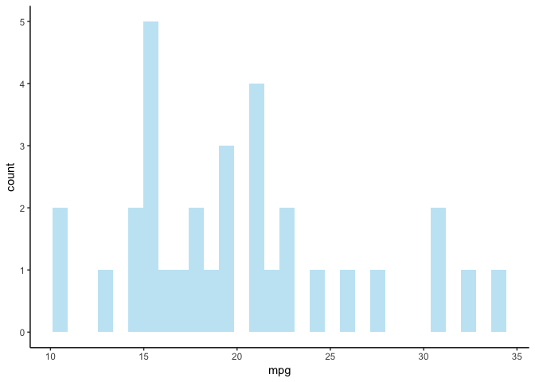

<script type="text/x-mathjax-config">
  MathJax.Hub.Config({ TeX: { equationNumbers: {autoNumber: "all"} } });
</script>
    ## Warning: package 'rmarkdown' was built under R version 3.5.2

 

Date: 2019-07-16
`R` version: 3.5.0
\*Corresponding author: <matthew.malishev@gmail.com>
This document can be found at <https://github.com/darwinanddavis/UsefulCode>

Overview
--------

Same deal as Useful Code, but the second instalment because the first one has too much stuff in it and now runs slow.

### D3

``` r
devtools::install_github("jcheng5/d3scatter")
library(d3scatter)
library(crosstalk)
library(leaflet)
library(tibble)

sd <- SharedData$new(quakes[sample(nrow(quakes), 100), ])

bscols(widths = c(12, 6, 6), filter_slider("stations", "Stations", sd, ~stations), leaflet(sd, width = "100%", 
    height = 400) %>% addTiles() %>% addCircleMarkers(lng = sd$data()[, "long"], lat = sd$data()[, "lat"], 
    stroke = F, fill = T, color = "red", fillOpacity = 0.5, radius = ~mag + 2, label = ~paste0("Depth: ", 
        as.character(depth))), d3scatter(sd, width = "100%", height = 400, ~mag, ~depth, color = ~stations))
```

<!--html_preserve-->
<label class="control-label" for="stations">Stations</label> <input data-type="double" data-min="10" data-max="83" data-from="10" data-to="83" data-step="1" data-grid="true" data-grid-num="9.125" data-grid-snap="false" data-prettify-separator="," data-keyboard="true" data-keyboard-step="1.36986301369863" data-drag-interval="true" data-data-type="number"/>
<script type="application/json" data-for="stations">{
  "values": [10, 10, 11, 11, 11, 11, 13, 14, 14, 14, 14, 15, 15, 15, 15, 16, 16, 16, 17, 17, 17, 17, 18, 18, 18, 18, 19, 19, 20, 21, 21, 21, 21, 21, 21, 21, 22, 22, 22, 22, 22, 23, 24, 25, 25, 25, 26, 27, 27, 27, 27, 28, 28, 28, 28, 28, 29, 29, 30, 30, 31, 31, 32, 32, 32, 34, 34, 35, 35, 35, 37, 39, 39, 40, 41, 41, 41, 42, 42, 42, 43, 45, 47, 47, 48, 55, 57, 57, 57, 60, 62, 63, 67, 67, 70, 70, 71, 72, 78, 83],
  "keys": ["690", "778", "707", "274", "122", "979", "739", "971", "316", "174", "515", "79", "542", "86", "705", "696", "772", "793", "836", "777", "679", "722", "716", "567", "481", "641", "584", "813", "498", "447", "452", "982", "194", "954", "285", "773", "469", "658", "896", "228", "215", "955", "622", "518", "107", "66", "768", "863", "792", "555", "654", "639", "505", "613", "121", "931", "789", "286", "523", "943", "866", "640", "976", "643", "262", "511", "41", "950", "612", "203", "166", "484", "388", "822", "487", "169", "195", "754", "577", "962", "260", "672", "181", "759", "783", "325", "719", "295", "940", "847", "186", "149", "925", "948", "893", "528", "890", "463", "869", "17"],
  "group": ["SharedData0eb9f4fe"]
}</script>

<script type="application/json" data-for="htmlwidget-24b47a5febd558f93a3b">{"x":{"options":{"crs":{"crsClass":"L.CRS.EPSG3857","code":null,"proj4def":null,"projectedBounds":null,"options":{}}},"calls":[{"method":"addSelect","args":["SharedData0eb9f4fe"]},{"method":"addTiles","args":["//{s}.tile.openstreetmap.org/{z}/{x}/{y}.png",null,null,{"minZoom":0,"maxZoom":18,"tileSize":256,"subdomains":"abc","errorTileUrl":"","tms":false,"noWrap":false,"zoomOffset":0,"zoomReverse":false,"opacity":1,"zIndex":1,"detectRetina":false,"attribution":"&copy; <a href=\"http://openstreetmap.org\">OpenStreetMap<\/a> contributors, <a href=\"http://creativecommons.org/licenses/by-sa/2.0/\">CC-BY-SA<\/a>"}]},{"method":"addCircleMarkers","args":[[-21.81,-18.04,-17.03,-23.9,-30.04,-24.04,-12.34,-27.64,-23.73,-12.49,-34.4,-13.64,-17.68,-25.79,-18.08,-15.72,-24.68,-20.64,-23.73,-17.93,-17.4,-26,-28.15,-20.16,-15.29,-24.09,-21.56,-32.42,-16.4,-19.94,-19.9,-23.49,-23.79,-23.44,-15.85,-38.28,-27.6,-13.36,-24.4,-26.54,-22.95,-15.2,-23.1,-17.74,-13.8,-23.43,-24.08,-27.75,-17.4,-20.75,-21.39,-20.9,-20.04,-18.35,-23.47,-25.63,-17.6,-23.87,-19.36,-37.37,-19.1,-34.2,-15.24,-17.95,-21.23,-34.89,-19.85,-20.3,-23.46,-13.26,-20.21,-10.78,-17.95,-17.81,-27.23,-17.99,-14.65,-22.75,-23.58,-23.93,-21.05,-19.6,-16.24,-32.2,-15.78,-18.83,-21.8,-23.11,-15.83,-17.1,-17.91,-17.63,-17.67,-23.55,-34.63,-16.23,-21.14,-19.66,-19.45,-27.89],[181.71,181.75,185.74,179.9,181.2,184.85,167.43,182.22,184.49,166.36,180.5,165.96,181.11,182.38,180.7,185.64,183.33,169.66,179.98,181.89,181.02,178.43,183.4,181.99,166.9,179.68,185.5,181.21,182.73,182.39,178.9,180.06,179.89,184.6,185.9,177.1,182.1,172.76,179.85,183.63,170.56,184.68,180.12,181.31,166.53,180,179.5,182.26,186.54,184.52,180.68,181.51,181.87,185.27,179.95,180.26,181.5,180.15,186.36,176.78,169.63,179.43,186.21,184.68,181.09,180.6,184.51,181.4,180.09,167.01,181.9,166.1,181.73,181.82,180.98,168.98,166.97,170.99,180.17,180.18,180.9,184.53,185.75,179.61,167.44,182.26,183.6,179.15,167.1,184.93,181.48,185.13,187.09,180.27,179.1,183.59,174.21,184.31,184.48,182.92],[6.2,6.5,6.2,6.4,6.8,7,7.1,7.1,6.7,6.9,6.4,8,6.4,6.4,7.2,6.3,6.7,6.9,6.6,6.1,6.4,6.9,7,6.2,6.2,6.3,6.5,6.9,6,6.6,6.3,6,6.9,6.8,6.1,7.4,6.6,6.4,6.7,6.7,6.7,6.1,6.4,6.6,7.5,6.7,6.1,6.5,6.2,6.3,6.5,6.7,6.7,6.7,6.1,6.8,6.1,6.4,6.7,6.7,6.8,7,7,6.4,6.6,6.4,6.4,6.6,6.6,7.1,6.1,6.9,6.7,6.1,6.5,6.7,6.8,6.8,7.3,6.6,6.3,6.3,6.5,6.6,6.8,6.3,6.4,6.7,6.5,6.7,6,6.5,6.9,6.3,6.7,6.7,7.7,6.3,6.3,7.5],null,null,{"interactive":true,"className":"","stroke":false,"color":"red","weight":5,"opacity":0.5,"fill":true,"fillColor":"red","fillOpacity":0.5},null,null,null,null,["Depth: 323","Depth: 640","Depth: 178","Depth: 579","Depth: 49","Depth: 70","Depth: 50","Depth: 162","Depth: 60","Depth: 74","Depth: 201","Depth: 50","Depth: 568","Depth: 172","Depth: 628","Depth: 138","Depth: 70","Depth: 89","Depth: 524","Depth: 567","Depth: 479","Depth: 644","Depth: 57","Depth: 504","Depth: 100","Depth: 538","Depth: 47","Depth: 47","Depth: 391","Depth: 544","Depth: 81","Depth: 530","Depth: 526","Depth: 63","Depth: 121","Depth: 100","Depth: 154","Depth: 618","Depth: 522","Depth: 66","Depth: 42","Depth: 99","Depth: 533","Depth: 575","Depth: 42","Depth: 553","Depth: 605","Depth: 174","Depth: 85","Depth: 144","Depth: 617","Depth: 548","Depth: 577","Depth: 201","Depth: 543","Depth: 464","Depth: 548","Depth: 524","Depth: 100","Depth: 263","Depth: 266","Depth: 40","Depth: 158","Depth: 260","Depth: 613","Depth: 42","Depth: 184","Depth: 608","Depth: 543","Depth: 213","Depth: 576","Depth: 195","Depth: 583","Depth: 598","Depth: 401","Depth: 234","Depth: 82","Depth: 67","Depth: 462","Depth: 525","Depth: 616","Depth: 199","Depth: 154","Depth: 422","Depth: 40","Depth: 575","Depth: 213","Depth: 564","Depth: 43","Depth: 286","Depth: 555","Depth: 219","Depth: 45","Depth: 535","Depth: 278","Depth: 367","Depth: 40","Depth: 170","Depth: 246","Depth: 87"],{"interactive":false,"permanent":false,"direction":"auto","opacity":1,"offset":[0,0],"textsize":"10px","textOnly":false,"className":"","sticky":true},{"ctKey":["79","181","976","696","498","783","759","925","950","325","487","17","469","971","463","447","523","754","707","863","316","792","643","274","542","452","789","484","772","943","122","955","260","555","836","890","658","716","286","511","982","174","654","577","893","169","194","567","639","518","481","262","584","719","954","847","690","896","822","41","866","166","295","285","641","107","768","739","505","528","793","672","940","515","388","613","121","612","149","640","778","773","228","195","962","979","777","679","813","66","722","931","186","215","622","203","869","86","705","948"],"ctGroup":"SharedData0eb9f4fe"}]}],"limits":{"lat":[-38.28,-10.78],"lng":[165.96,187.09]}},"evals":[],"jsHooks":[]}</script>

<script type="application/json" data-for="htmlwidget-d993388f6d63d7a47f08">{"x":{"data":{"x":[4.2,4.5,4.2,4.4,4.8,5,5.1,5.1,4.7,4.9,4.4,6,4.4,4.4,5.2,4.3,4.7,4.9,4.6,4.1,4.4,4.9,5,4.2,4.2,4.3,4.5,4.9,4,4.6,4.3,4,4.9,4.8,4.1,5.4,4.6,4.4,4.7,4.7,4.7,4.1,4.4,4.6,5.5,4.7,4.1,4.5,4.2,4.3,4.5,4.7,4.7,4.7,4.1,4.8,4.1,4.4,4.7,4.7,4.8,5,5,4.4,4.6,4.4,4.4,4.6,4.6,5.1,4.1,4.9,4.7,4.1,4.5,4.7,4.8,4.8,5.3,4.6,4.3,4.3,4.5,4.6,4.8,4.3,4.4,4.7,4.5,4.7,4,4.5,4.9,4.3,4.7,4.7,5.7,4.3,4.3,5.5],"y":[323,640,178,579,49,70,50,162,60,74,201,50,568,172,628,138,70,89,524,567,479,644,57,504,100,538,47,47,391,544,81,530,526,63,121,100,154,618,522,66,42,99,533,575,42,553,605,174,85,144,617,548,577,201,543,464,548,524,100,263,266,40,158,260,613,42,184,608,543,213,576,195,583,598,401,234,82,67,462,525,616,199,154,422,40,575,213,564,43,286,555,219,45,535,278,367,40,170,246,87],"key":["79","181","976","696","498","783","759","925","950","325","487","17","469","971","463","447","523","754","707","863","316","792","643","274","542","452","789","484","772","943","122","955","260","555","836","890","658","716","286","511","982","174","654","577","893","169","194","567","639","518","481","262","584","719","954","847","690","896","822","41","866","166","295","285","641","107","768","739","505","528","793","672","940","515","388","613","121","612","149","640","778","773","228","195","962","979","777","679","813","66","722","931","186","215","622","203","869","86","705","948"],"color":[15,47,32,16,20,48,47,67,35,55,41,83,22,14,72,21,30,42,11,27,14,27,32,11,15,21,29,39,16,30,11,23,43,27,17,71,22,18,29,34,21,14,27,42,70,41,21,18,28,25,18,32,19,57,21,60,10,22,40,34,31,37,57,21,18,25,26,13,28,70,16,45,57,14,39,28,28,35,63,31,10,21,22,41,42,11,17,17,19,25,17,28,62,22,24,35,78,15,15,67]},"color_spec":{"type":"linear","range":[10,83]},"color":[15,47,32,16,20,48,47,67,35,55,41,83,22,14,72,21,30,42,11,27,14,27,32,11,15,21,29,39,16,30,11,23,43,27,17,71,22,18,29,34,21,14,27,42,70,41,21,18,28,25,18,32,19,57,21,60,10,22,40,34,31,37,57,21,18,25,26,13,28,70,16,45,57,14,39,28,28,35,63,31,10,21,22,41,42,11,17,17,19,25,17,28,62,22,24,35,78,15,15,67],"x_label":"mag","y_label":"depth","x_lim":null,"y_lim":null,"group":"SharedData0eb9f4fe"},"evals":[],"jsHooks":[]}</script>

<!--/html_preserve-->
### Loading packages

`pacman`

``` r
require(pacman)
p_load(dplyr, mapdeck)
```

### Read in data

Read in csv data sources directly from web

``` r
# link to raw csv link on e.g. github
url <- "https://raw.githubusercontent.com/plotly/datasets/master/2011_february_aa_flight_paths.csv"
flights <- read.csv(url)
```

### `Rmarkdown`

<!-- ———————————————————————————————————————————————————————————————————————————— -->

------------------------------------------------------------------------

Split page into three columns (displays best in browser).
*`R` code is in Rmd file.*

<!-- #https://holtzy.github.io/Pimp-my-rmd/ -->
``` r
# r plot code
require(ggplot2)
ggplot(mtcars, aes(x = mpg)) + geom_histogram(fill = "skyblue", alpha = 0.5) + theme_classic()
```



<br><br>

> Praise the lord, I was born to travel
> Feeling like Slash in front of the chapel
> I'm leaned back with the Les Paul
> Shit I smoke is like cholesterol
> Spilled dressin' on the vest at the festival
> The best of all, had a midget Puerto Rican at my beckon call

<br><br> Pump the bass in the trunk
It rattled like a baby hand
Except this toy cost 80 grand
And I'm crazy tan, from all the places that I've been
Just from writing words with a pen

<!-- close div -->

------------------------------------------------------------------------

<!-- ———————————————————————————————————————————————————————————————————————————— -->
`plotly`
========

HTML widget with plotly and crosstalk

``` r
require(plotly)
require(tidyr)
require(crosstalk)

m <- gather(mpg, variable, value, -c(year, cyl))
msd <- highlight_key(m, ~variable)
gg <- ggplot(m, aes(factor(year), value)) + geom_jitter(alpha = 0.3) + labs(x = "Year") + theme_classic()

bscols(widths = c(11, rep(5, 2)), filter_select("id", "Select a variable", msd, ~variable, multiple = F), 
    ggplotly(gg, dynamicTicks = "y") %>% layout(margin = list(l = 30)), plot_ly(msd, x = ~jitter(cyl), 
        y = ~value, alpha = ~cyl, linetype = NULL, mode = "markers", hoverinfo = "text", text = ~paste0("Cyl: ", 
            round(cyl), "\n", variable, ": ", value, "\nYear: ", year)) %>% add_markers(alpha = 0.3) %>% 
        layout(xaxis = list(showgrid = F, title = "Cylinder"), yaxis = list(showgrid = F)))
```

<!--html_preserve-->
<label class="control-label" for="id">Select a variable</label>
<select></select>
<script type="application/json" data-for="id">{
  "items": {
    "value": ["class", "cty", "displ", "drv", "fl", "hwy", "manufacturer", "model", "trans"],
    "label": ["class", "cty", "displ", "drv", "fl", "hwy", "manufacturer", "model", "trans"]
  },
  "map": {
    "class": ["class", "class", "class", "class", "class", "class", "class", "class", "class", "class", "class", "class", "class", "class", "class", "class", "class", "class", "class", "class", "class", "class", "class", "class", "class", "class", "class", "class", "class", "class", "class", "class", "class", "class", "class", "class", "class", "class", "class", "class", "class", "class", "class", "class", "class", "class", "class", "class", "class", "class", "class", "class", "class", "class", "class", "class", "class", "class", "class", "class", "class", "class", "class", "class", "class", "class", "class", "class", "class", "class", "class", "class", "class", "class", "class", "class", "class", "class", "class", "class", "class", "class", "class", "class", "class", "class", "class", "class", "class", "class", "class", "class", "class", "class", "class", "class", "class", "class", "class", "class", "class", "class", "class", "class", "class", "class", "class", "class", "class", "class", "class", "class", "class", "class", "class", "class", "class", "class", "class", "class", "class", "class", "class", "class", "class", "class", "class", "class", "class", "class", "class", "class", "class", "class", "class", "class", "class", "class", "class", "class", "class", "class", "class", "class", "class", "class", "class", "class", "class", "class", "class", "class", "class", "class", "class", "class", "class", "class", "class", "class", "class", "class", "class", "class", "class", "class", "class", "class", "class", "class", "class", "class", "class", "class", "class", "class", "class", "class", "class", "class", "class", "class", "class", "class", "class", "class", "class", "class", "class", "class", "class", "class", "class", "class", "class", "class", "class", "class", "class", "class", "class", "class", "class", "class", "class", "class", "class", "class", "class", "class", "class", "class", "class", "class", "class", "class", "class", "class", "class", "class", "class", "class", "class", "class", "class", "class", "class", "class", "class", "class", "class", "class", "class", "class"],
    "cty": ["cty", "cty", "cty", "cty", "cty", "cty", "cty", "cty", "cty", "cty", "cty", "cty", "cty", "cty", "cty", "cty", "cty", "cty", "cty", "cty", "cty", "cty", "cty", "cty", "cty", "cty", "cty", "cty", "cty", "cty", "cty", "cty", "cty", "cty", "cty", "cty", "cty", "cty", "cty", "cty", "cty", "cty", "cty", "cty", "cty", "cty", "cty", "cty", "cty", "cty", "cty", "cty", "cty", "cty", "cty", "cty", "cty", "cty", "cty", "cty", "cty", "cty", "cty", "cty", "cty", "cty", "cty", "cty", "cty", "cty", "cty", "cty", "cty", "cty", "cty", "cty", "cty", "cty", "cty", "cty", "cty", "cty", "cty", "cty", "cty", "cty", "cty", "cty", "cty", "cty", "cty", "cty", "cty", "cty", "cty", "cty", "cty", "cty", "cty", "cty", "cty", "cty", "cty", "cty", "cty", "cty", "cty", "cty", "cty", "cty", "cty", "cty", "cty", "cty", "cty", "cty", "cty", "cty", "cty", "cty", "cty", "cty", "cty", "cty", "cty", "cty", "cty", "cty", "cty", "cty", "cty", "cty", "cty", "cty", "cty", "cty", "cty", "cty", "cty", "cty", "cty", "cty", "cty", "cty", "cty", "cty", "cty", "cty", "cty", "cty", "cty", "cty", "cty", "cty", "cty", "cty", "cty", "cty", "cty", "cty", "cty", "cty", "cty", "cty", "cty", "cty", "cty", "cty", "cty", "cty", "cty", "cty", "cty", "cty", "cty", "cty", "cty", "cty", "cty", "cty", "cty", "cty", "cty", "cty", "cty", "cty", "cty", "cty", "cty", "cty", "cty", "cty", "cty", "cty", "cty", "cty", "cty", "cty", "cty", "cty", "cty", "cty", "cty", "cty", "cty", "cty", "cty", "cty", "cty", "cty", "cty", "cty", "cty", "cty", "cty", "cty", "cty", "cty", "cty", "cty", "cty", "cty", "cty", "cty", "cty", "cty", "cty", "cty", "cty", "cty", "cty", "cty", "cty", "cty"],
    "displ": ["displ", "displ", "displ", "displ", "displ", "displ", "displ", "displ", "displ", "displ", "displ", "displ", "displ", "displ", "displ", "displ", "displ", "displ", "displ", "displ", "displ", "displ", "displ", "displ", "displ", "displ", "displ", "displ", "displ", "displ", "displ", "displ", "displ", "displ", "displ", "displ", "displ", "displ", "displ", "displ", "displ", "displ", "displ", "displ", "displ", "displ", "displ", "displ", "displ", "displ", "displ", "displ", "displ", "displ", "displ", "displ", "displ", "displ", "displ", "displ", "displ", "displ", "displ", "displ", "displ", "displ", "displ", "displ", "displ", "displ", "displ", "displ", "displ", "displ", "displ", "displ", "displ", "displ", "displ", "displ", "displ", "displ", "displ", "displ", "displ", "displ", "displ", "displ", "displ", "displ", "displ", "displ", "displ", "displ", "displ", "displ", "displ", "displ", "displ", "displ", "displ", "displ", "displ", "displ", "displ", "displ", "displ", "displ", "displ", "displ", "displ", "displ", "displ", "displ", "displ", "displ", "displ", "displ", "displ", "displ", "displ", "displ", "displ", "displ", "displ", "displ", "displ", "displ", "displ", "displ", "displ", "displ", "displ", "displ", "displ", "displ", "displ", "displ", "displ", "displ", "displ", "displ", "displ", "displ", "displ", "displ", "displ", "displ", "displ", "displ", "displ", "displ", "displ", "displ", "displ", "displ", "displ", "displ", "displ", "displ", "displ", "displ", "displ", "displ", "displ", "displ", "displ", "displ", "displ", "displ", "displ", "displ", "displ", "displ", "displ", "displ", "displ", "displ", "displ", "displ", "displ", "displ", "displ", "displ", "displ", "displ", "displ", "displ", "displ", "displ", "displ", "displ", "displ", "displ", "displ", "displ", "displ", "displ", "displ", "displ", "displ", "displ", "displ", "displ", "displ", "displ", "displ", "displ", "displ", "displ", "displ", "displ", "displ", "displ", "displ", "displ", "displ", "displ", "displ", "displ", "displ", "displ", "displ", "displ", "displ", "displ", "displ", "displ", "displ", "displ", "displ", "displ", "displ", "displ"],
    "drv": ["drv", "drv", "drv", "drv", "drv", "drv", "drv", "drv", "drv", "drv", "drv", "drv", "drv", "drv", "drv", "drv", "drv", "drv", "drv", "drv", "drv", "drv", "drv", "drv", "drv", "drv", "drv", "drv", "drv", "drv", "drv", "drv", "drv", "drv", "drv", "drv", "drv", "drv", "drv", "drv", "drv", "drv", "drv", "drv", "drv", "drv", "drv", "drv", "drv", "drv", "drv", "drv", "drv", "drv", "drv", "drv", "drv", "drv", "drv", "drv", "drv", "drv", "drv", "drv", "drv", "drv", "drv", "drv", "drv", "drv", "drv", "drv", "drv", "drv", "drv", "drv", "drv", "drv", "drv", "drv", "drv", "drv", "drv", "drv", "drv", "drv", "drv", "drv", "drv", "drv", "drv", "drv", "drv", "drv", "drv", "drv", "drv", "drv", "drv", "drv", "drv", "drv", "drv", "drv", "drv", "drv", "drv", "drv", "drv", "drv", "drv", "drv", "drv", "drv", "drv", "drv", "drv", "drv", "drv", "drv", "drv", "drv", "drv", "drv", "drv", "drv", "drv", "drv", "drv", "drv", "drv", "drv", "drv", "drv", "drv", "drv", "drv", "drv", "drv", "drv", "drv", "drv", "drv", "drv", "drv", "drv", "drv", "drv", "drv", "drv", "drv", "drv", "drv", "drv", "drv", "drv", "drv", "drv", "drv", "drv", "drv", "drv", "drv", "drv", "drv", "drv", "drv", "drv", "drv", "drv", "drv", "drv", "drv", "drv", "drv", "drv", "drv", "drv", "drv", "drv", "drv", "drv", "drv", "drv", "drv", "drv", "drv", "drv", "drv", "drv", "drv", "drv", "drv", "drv", "drv", "drv", "drv", "drv", "drv", "drv", "drv", "drv", "drv", "drv", "drv", "drv", "drv", "drv", "drv", "drv", "drv", "drv", "drv", "drv", "drv", "drv", "drv", "drv", "drv", "drv", "drv", "drv", "drv", "drv", "drv", "drv", "drv", "drv", "drv", "drv", "drv", "drv", "drv", "drv"],
    "fl": ["fl", "fl", "fl", "fl", "fl", "fl", "fl", "fl", "fl", "fl", "fl", "fl", "fl", "fl", "fl", "fl", "fl", "fl", "fl", "fl", "fl", "fl", "fl", "fl", "fl", "fl", "fl", "fl", "fl", "fl", "fl", "fl", "fl", "fl", "fl", "fl", "fl", "fl", "fl", "fl", "fl", "fl", "fl", "fl", "fl", "fl", "fl", "fl", "fl", "fl", "fl", "fl", "fl", "fl", "fl", "fl", "fl", "fl", "fl", "fl", "fl", "fl", "fl", "fl", "fl", "fl", "fl", "fl", "fl", "fl", "fl", "fl", "fl", "fl", "fl", "fl", "fl", "fl", "fl", "fl", "fl", "fl", "fl", "fl", "fl", "fl", "fl", "fl", "fl", "fl", "fl", "fl", "fl", "fl", "fl", "fl", "fl", "fl", "fl", "fl", "fl", "fl", "fl", "fl", "fl", "fl", "fl", "fl", "fl", "fl", "fl", "fl", "fl", "fl", "fl", "fl", "fl", "fl", "fl", "fl", "fl", "fl", "fl", "fl", "fl", "fl", "fl", "fl", "fl", "fl", "fl", "fl", "fl", "fl", "fl", "fl", "fl", "fl", "fl", "fl", "fl", "fl", "fl", "fl", "fl", "fl", "fl", "fl", "fl", "fl", "fl", "fl", "fl", "fl", "fl", "fl", "fl", "fl", "fl", "fl", "fl", "fl", "fl", "fl", "fl", "fl", "fl", "fl", "fl", "fl", "fl", "fl", "fl", "fl", "fl", "fl", "fl", "fl", "fl", "fl", "fl", "fl", "fl", "fl", "fl", "fl", "fl", "fl", "fl", "fl", "fl", "fl", "fl", "fl", "fl", "fl", "fl", "fl", "fl", "fl", "fl", "fl", "fl", "fl", "fl", "fl", "fl", "fl", "fl", "fl", "fl", "fl", "fl", "fl", "fl", "fl", "fl", "fl", "fl", "fl", "fl", "fl", "fl", "fl", "fl", "fl", "fl", "fl", "fl", "fl", "fl", "fl", "fl", "fl"],
    "hwy": ["hwy", "hwy", "hwy", "hwy", "hwy", "hwy", "hwy", "hwy", "hwy", "hwy", "hwy", "hwy", "hwy", "hwy", "hwy", "hwy", "hwy", "hwy", "hwy", "hwy", "hwy", "hwy", "hwy", "hwy", "hwy", "hwy", "hwy", "hwy", "hwy", "hwy", "hwy", "hwy", "hwy", "hwy", "hwy", "hwy", "hwy", "hwy", "hwy", "hwy", "hwy", "hwy", "hwy", "hwy", "hwy", "hwy", "hwy", "hwy", "hwy", "hwy", "hwy", "hwy", "hwy", "hwy", "hwy", "hwy", "hwy", "hwy", "hwy", "hwy", "hwy", "hwy", "hwy", "hwy", "hwy", "hwy", "hwy", "hwy", "hwy", "hwy", "hwy", "hwy", "hwy", "hwy", "hwy", "hwy", "hwy", "hwy", "hwy", "hwy", "hwy", "hwy", "hwy", "hwy", "hwy", "hwy", "hwy", "hwy", "hwy", "hwy", "hwy", "hwy", "hwy", "hwy", "hwy", "hwy", "hwy", "hwy", "hwy", "hwy", "hwy", "hwy", "hwy", "hwy", "hwy", "hwy", "hwy", "hwy", "hwy", "hwy", "hwy", "hwy", "hwy", "hwy", "hwy", "hwy", "hwy", "hwy", "hwy", "hwy", "hwy", "hwy", "hwy", "hwy", "hwy", "hwy", "hwy", "hwy", "hwy", "hwy", "hwy", "hwy", "hwy", "hwy", "hwy", "hwy", "hwy", "hwy", "hwy", "hwy", "hwy", "hwy", "hwy", "hwy", "hwy", "hwy", "hwy", "hwy", "hwy", "hwy", "hwy", "hwy", "hwy", "hwy", "hwy", "hwy", "hwy", "hwy", "hwy", "hwy", "hwy", "hwy", "hwy", "hwy", "hwy", "hwy", "hwy", "hwy", "hwy", "hwy", "hwy", "hwy", "hwy", "hwy", "hwy", "hwy", "hwy", "hwy", "hwy", "hwy", "hwy", "hwy", "hwy", "hwy", "hwy", "hwy", "hwy", "hwy", "hwy", "hwy", "hwy", "hwy", "hwy", "hwy", "hwy", "hwy", "hwy", "hwy", "hwy", "hwy", "hwy", "hwy", "hwy", "hwy", "hwy", "hwy", "hwy", "hwy", "hwy", "hwy", "hwy", "hwy", "hwy", "hwy", "hwy", "hwy", "hwy", "hwy", "hwy", "hwy", "hwy", "hwy", "hwy", "hwy", "hwy", "hwy", "hwy", "hwy", "hwy", "hwy", "hwy", "hwy", "hwy", "hwy"],
    "manufacturer": ["manufacturer", "manufacturer", "manufacturer", "manufacturer", "manufacturer", "manufacturer", "manufacturer", "manufacturer", "manufacturer", "manufacturer", "manufacturer", "manufacturer", "manufacturer", "manufacturer", "manufacturer", "manufacturer", "manufacturer", "manufacturer", "manufacturer", "manufacturer", "manufacturer", "manufacturer", "manufacturer", "manufacturer", "manufacturer", "manufacturer", "manufacturer", "manufacturer", "manufacturer", "manufacturer", "manufacturer", "manufacturer", "manufacturer", "manufacturer", "manufacturer", "manufacturer", "manufacturer", "manufacturer", "manufacturer", "manufacturer", "manufacturer", "manufacturer", "manufacturer", "manufacturer", "manufacturer", "manufacturer", "manufacturer", "manufacturer", "manufacturer", "manufacturer", "manufacturer", "manufacturer", "manufacturer", "manufacturer", "manufacturer", "manufacturer", "manufacturer", "manufacturer", "manufacturer", "manufacturer", "manufacturer", "manufacturer", "manufacturer", "manufacturer", "manufacturer", "manufacturer", "manufacturer", "manufacturer", "manufacturer", "manufacturer", "manufacturer", "manufacturer", "manufacturer", "manufacturer", "manufacturer", "manufacturer", "manufacturer", "manufacturer", "manufacturer", "manufacturer", "manufacturer", "manufacturer", "manufacturer", "manufacturer", "manufacturer", "manufacturer", "manufacturer", "manufacturer", "manufacturer", "manufacturer", "manufacturer", "manufacturer", "manufacturer", "manufacturer", "manufacturer", "manufacturer", "manufacturer", "manufacturer", "manufacturer", "manufacturer", "manufacturer", "manufacturer", "manufacturer", "manufacturer", "manufacturer", "manufacturer", "manufacturer", "manufacturer", "manufacturer", "manufacturer", "manufacturer", "manufacturer", "manufacturer", "manufacturer", "manufacturer", "manufacturer", "manufacturer", "manufacturer", "manufacturer", "manufacturer", "manufacturer", "manufacturer", "manufacturer", "manufacturer", "manufacturer", "manufacturer", "manufacturer", "manufacturer", "manufacturer", "manufacturer", "manufacturer", "manufacturer", "manufacturer", "manufacturer", "manufacturer", "manufacturer", "manufacturer", "manufacturer", "manufacturer", "manufacturer", "manufacturer", "manufacturer", "manufacturer", "manufacturer", "manufacturer", "manufacturer", "manufacturer", "manufacturer", "manufacturer", "manufacturer", "manufacturer", "manufacturer", "manufacturer", "manufacturer", "manufacturer", "manufacturer", "manufacturer", "manufacturer", "manufacturer", "manufacturer", "manufacturer", "manufacturer", "manufacturer", "manufacturer", "manufacturer", "manufacturer", "manufacturer", "manufacturer", "manufacturer", "manufacturer", "manufacturer", "manufacturer", "manufacturer", "manufacturer", "manufacturer", "manufacturer", "manufacturer", "manufacturer", "manufacturer", "manufacturer", "manufacturer", "manufacturer", "manufacturer", "manufacturer", "manufacturer", "manufacturer", "manufacturer", "manufacturer", "manufacturer", "manufacturer", "manufacturer", "manufacturer", "manufacturer", "manufacturer", "manufacturer", "manufacturer", "manufacturer", "manufacturer", "manufacturer", "manufacturer", "manufacturer", "manufacturer", "manufacturer", "manufacturer", "manufacturer", "manufacturer", "manufacturer", "manufacturer", "manufacturer", "manufacturer", "manufacturer", "manufacturer", "manufacturer", "manufacturer", "manufacturer", "manufacturer", "manufacturer", "manufacturer", "manufacturer", "manufacturer", "manufacturer", "manufacturer", "manufacturer", "manufacturer", "manufacturer", "manufacturer", "manufacturer", "manufacturer", "manufacturer", "manufacturer", "manufacturer", "manufacturer", "manufacturer", "manufacturer"],
    "model": ["model", "model", "model", "model", "model", "model", "model", "model", "model", "model", "model", "model", "model", "model", "model", "model", "model", "model", "model", "model", "model", "model", "model", "model", "model", "model", "model", "model", "model", "model", "model", "model", "model", "model", "model", "model", "model", "model", "model", "model", "model", "model", "model", "model", "model", "model", "model", "model", "model", "model", "model", "model", "model", "model", "model", "model", "model", "model", "model", "model", "model", "model", "model", "model", "model", "model", "model", "model", "model", "model", "model", "model", "model", "model", "model", "model", "model", "model", "model", "model", "model", "model", "model", "model", "model", "model", "model", "model", "model", "model", "model", "model", "model", "model", "model", "model", "model", "model", "model", "model", "model", "model", "model", "model", "model", "model", "model", "model", "model", "model", "model", "model", "model", "model", "model", "model", "model", "model", "model", "model", "model", "model", "model", "model", "model", "model", "model", "model", "model", "model", "model", "model", "model", "model", "model", "model", "model", "model", "model", "model", "model", "model", "model", "model", "model", "model", "model", "model", "model", "model", "model", "model", "model", "model", "model", "model", "model", "model", "model", "model", "model", "model", "model", "model", "model", "model", "model", "model", "model", "model", "model", "model", "model", "model", "model", "model", "model", "model", "model", "model", "model", "model", "model", "model", "model", "model", "model", "model", "model", "model", "model", "model", "model", "model", "model", "model", "model", "model", "model", "model", "model", "model", "model", "model", "model", "model", "model", "model", "model", "model", "model", "model", "model", "model", "model", "model", "model", "model", "model", "model", "model", "model", "model", "model", "model", "model", "model", "model", "model", "model", "model", "model", "model", "model"],
    "trans": ["trans", "trans", "trans", "trans", "trans", "trans", "trans", "trans", "trans", "trans", "trans", "trans", "trans", "trans", "trans", "trans", "trans", "trans", "trans", "trans", "trans", "trans", "trans", "trans", "trans", "trans", "trans", "trans", "trans", "trans", "trans", "trans", "trans", "trans", "trans", "trans", "trans", "trans", "trans", "trans", "trans", "trans", "trans", "trans", "trans", "trans", "trans", "trans", "trans", "trans", "trans", "trans", "trans", "trans", "trans", "trans", "trans", "trans", "trans", "trans", "trans", "trans", "trans", "trans", "trans", "trans", "trans", "trans", "trans", "trans", "trans", "trans", "trans", "trans", "trans", "trans", "trans", "trans", "trans", "trans", "trans", "trans", "trans", "trans", "trans", "trans", "trans", "trans", "trans", "trans", "trans", "trans", "trans", "trans", "trans", "trans", "trans", "trans", "trans", "trans", "trans", "trans", "trans", "trans", "trans", "trans", "trans", "trans", "trans", "trans", "trans", "trans", "trans", "trans", "trans", "trans", "trans", "trans", "trans", "trans", "trans", "trans", "trans", "trans", "trans", "trans", "trans", "trans", "trans", "trans", "trans", "trans", "trans", "trans", "trans", "trans", "trans", "trans", "trans", "trans", "trans", "trans", "trans", "trans", "trans", "trans", "trans", "trans", "trans", "trans", "trans", "trans", "trans", "trans", "trans", "trans", "trans", "trans", "trans", "trans", "trans", "trans", "trans", "trans", "trans", "trans", "trans", "trans", "trans", "trans", "trans", "trans", "trans", "trans", "trans", "trans", "trans", "trans", "trans", "trans", "trans", "trans", "trans", "trans", "trans", "trans", "trans", "trans", "trans", "trans", "trans", "trans", "trans", "trans", "trans", "trans", "trans", "trans", "trans", "trans", "trans", "trans", "trans", "trans", "trans", "trans", "trans", "trans", "trans", "trans", "trans", "trans", "trans", "trans", "trans", "trans", "trans", "trans", "trans", "trans", "trans", "trans", "trans", "trans", "trans", "trans", "trans", "trans", "trans", "trans", "trans", "trans", "trans", "trans"]
  },
  "group": ["SharedData24b47a5f"]
}</script>

<script type="application/json" data-for="htmlwidget-a4cfcfd20d02bc7e43f6">{"x":{"data":[{"x":[1.33641655538231,1.26731915436685,1.87670022249222,2.3795858155936,0.783421297557652,0.786265061795712,2.27988825049251,1.06206837594509,0.777838719449937,2.04781810659915,1.94070947226137,0.910474921576679,1.27400071248412,2.11252631880343,1.99833993073553,0.62578006722033,2.11267109848559,2.24699942823499,2.24932139348239,2.25812895782292,1.64343335274607,0.607871778123081,2.18870263602585,0.994597576372325,0.809879686310887,2.36897928100079,2.11234805304557,2.18775565158576,1.86088506989181,2.20595965404063,1.37544277198613,1.29884958975017,0.888967705518007,1.69064543154091,1.2963737655431,1.61494975183159,2.20841260999441,0.911506372690201,1.36947688777,1.36372941043228,1.19345556404442,1.69449305739254,2.03871738445014,2.08142397385091,1.09489204250276,0.970114683173597,1.68323551863432,2.0997150843963,2.27053078338504,1.94923346564174,1.19340000543743,0.897377542220056,2.1927486570552,1.68969080597162,2.06201068442315,0.856968851387501,1.33104336932302,1.20807644296438,2.26194399297237,2.32585650514811,1.87832791879773,1.24831248503178,2.30600063484162,0.647693242132664,1.80466037541628,1.92134437318891,1.87996310126036,1.85831870455295,1.75601795520633,1.72024238929152,1.38170991707593,1.02643793318421,1.78961624875665,0.632320777699351,0.712880853004754,0.841062440350652,2.39518234692514,0.808168555609882,1.08283500839025,1.0633859321475,2.23278300520033,1.76790789365768,0.874714868329465,1.1373514926061,0.601281746290624,0.725350097380579,0.808667402714491,2.17349116895348,0.935571483336389,1.69188550468534,0.907951171696186,0.811662529595196,2.21505655329675,1.87479166984558,1.36931352782995,0.663923323526978,2.02556108534336,2.28144546467811,2.20139264781028,0.7892811704427,1.24707514923066,1.33049586899579,1.32101629823446,0.811251189373434,1.84736760873348,1.77821624148637,1.85834466163069,2.36413329225034,0.79477747939527,1.0185531757772,2.00431623179466,2.2390838464722,1.32141604349017,0.678820943646133,1.62894076835364,1.36236027050763,1.01583131719381,2.00705326199532,2.1971305495128,1.88728484082967,1.61184370275587,1.74306810479611,2.16249177418649,1.82507291249931,1.04963071066886,0.906907891482115,1.88728000856936,1.67776479832828,1.93223171066493,1.99807102233171,1.00330038815737,2.23902794774622,1.61612483523786,0.908459804952145,1.29683864377439,0.968700957670808,1.97426239904016,0.646572613343597,1.75804264377803,1.62341642230749,0.910783998481929,1.32939294893295,1.01197912991047,2.08110128398985,1.90132353547961,2.1776164341718,1.75222257841378,1.01807353645563,1.35438850075006,2.07681549135596,1.04860263578594,1.00046913940459,1.70161182712764,1.6990335566923,0.724982703849673,1.00942642465234,1.30578054897487,2.39492454938591,1.94996035266668,1.25881465114653,0.911482942290604,1.99140048734844,2.154650230892,2.32371792439371,1.95638628173619,1.24006858840585,1.3443058764562,1.18353165462613,0.699021368287504,2.20796867664903,2.0244215188548,1.80622560158372,1.92494146823883,0.718513828702271,0.818210294283926,0.762316182442009,0.854239780455828,2.00865590553731,1.87960159461945,1.19869189951569,1.12260112203658,1.93235054239631,2.07448787186295,0.665441631153226,0.625208519585431,2.38683743271977,0.939749263040721,1.37189641334116,2.23631574194878,1.73105920664966,0.992801242507994,1.39743818938732,2.14244125522673,0.794320233911276,1.09526749756187,0.745088586769998,2.0707775073126,1.72667587194592,1.18688622582704,2.02587224729359,1.23727639820427,1.02965381965041,1.87399422097951,0.607699266076088,0.636634421721101,2.21304330416024,1.8732576219365,1.19838804118335,0.658012129925191,1.83294025007635,2.30330211110413,0.820701191574335,1.25626014992595,0.857647778280079,0.848872169293463,1.60835367850959,2.24165853075683,1.92543863188475,2.14800791293383,1.27722380217165,1.0240408224985,0.682910186052322,0.958762385137379,1.27760680131614,1.10791583247483,1.78651701882482,2.19163985811174,0.667610717564821,1.25894260611385,2.31616150569171,2.26865204833448,1.36093871705234,1.28158918730915,2.3350999141112,0.806499771401286,0.844899536855519,2.26130013540387,2.07077517658472,1.3018687793985,1.07739572394639,1.91567223649472,0.713297846354544,0.853626978956163,1.64365272819996,2.29333601929247,0.724514310620725,1.28263753242791,2.2111146228388,1.8735935760662,0.936847028695047,2.06862260997295,2.27627117782831,2.07452711109072,2.02727013733238,1.99140869304538,1.20131947882473,2.20569786801934,0.900574864633381,0.869306275062263,2.37546904906631,2.30157156065106,2.27233202662319,1.73383692484349,2.08168931007385,1.17003560792655,1.38820500224829,0.68281788341701,2.27253487333655,1.26822968237102,2.02891215328127,1.83606354054064,0.98465810585767,0.677152857929468,1.00872721597552,0.881945664435625,1.987610017322,1.64889021217823,1.8500066626817,1.06459916587919,0.786536043323576,1.62156127188355,2.07728282064199,1.9951478978619,1.88774670362473,0.994775061309338,1.2682644719258,2.21222400199622,1.88540671281517,2.39289698135108,1.10200004912913,1.22284345980734,1.0774153534323,2.15025997254997,1.80082784276456,1.93621066696942,1.23049642052501,1.66387441270053,1.03524986542761,2.34866413418204,2.17022552322596,2.30969023499638,2.38848441597074,2.0201354008168,2.16864661499858,1.12298343684524,1.38027807492763,2.37227455321699,1.13552591521293,1.05301385261118,1.0522854745388,1.63070001006126,1.03186880107969,0.987899375706911,1.19156885910779,1.80472409725189,2.31702985800803,1.17499129809439,0.687429005466402,1.02333102729172,1.2231516096741,0.957288864254952,1.94223713446409,0.979710485972464,1.68177996650338,1.0066462803632,0.903782343305647,2.2766215171665,1.71767225414515,0.859426956810057,1.38839982729405,2.14066117219627,2.20317626427859,1.98708793204278,1.14013763964176,1.20680835917592,1.15316951218992,0.776045358926058,1.26418801750988,2.09975583124906,1.73886993676424,2.2788845192641,2.20082833468914,1.30478799957782,0.631045227870345,2.35366370528936,2.0548235764727,1.21437871176749,0.853419251739979,1.76241719480604,1.3837096279487,1.07199169341475,1.84426984041929,2.10953102521598,1.96425901260227,1.85631854627281,2.32618484012783,1.93513501510024,2.13850324768573,1.34276059120893,0.65775122884661,1.94979001004249,2.00989643186331,1.70159847699106,2.25923120006919,1.13456328567117,2.0557773899287,2.1735166542232,1.37583397775888,1.07708254512399,1.07190783191472,2.25790341496468,1.11900754235685,1.88051580805331,2.01654925029725,1.38310750629753,0.665692076273263,0.974175434932113,2.17271977420896,2.17897850181907,1.91782357450575,1.96121770720929,0.942409588210285,1.37173076346517,1.72924224659801,0.960799066349864,1.25398775413632,2.18084743451327,2.08809074927121,1.38848754279315,1.31594040244818,1.3602047841996,2.00541875977069,1.79135160073638,1.04360896591097,1.39273297917098,1.75031497720629,1.69306401908398,2.3162837093696,2.13378073591739,1.34481920879334,1.04100932423025,1.31036256607622,1.14393645450473,1.88482471555471,1.71055148765445,1.82867886591703,2.28453655429184,1.02800516486168,0.706603492610157,0.730235920473933,0.761385316215456,1.79531948585063,2.20197709109634,0.860474084690213,1.19157490953803,1.92030993234366,1.69713136069477,0.958039225637913,1.34574636276811,2.32654719073325,1.12784423902631,1.05210043266416,2.02352856881917,1.71888256464154,0.733710349351168,0.827683419361711,1.65832922887057,0.901195511594415,0.69997485615313,0.991798297129571,2.39111331086606,1.97446950152516,1.20454361829907,1.65018483251333,1.00654922500253,1.06929792556912,1.88346686065197,0.7500922171399,0.87714761570096,1.81156934648752,2.38693030886352,1.25635577272624,0.942414721287787,1.86038207933307,2.15488695278764,1.06121446993202,1.39834856968373,0.858821314945817,1.29402433466166,2.19132095128298,2.23655095845461,2.25118685849011,2.2718250086531,1.31910842843354,0.649943323805928,0.788875528052449,1.34636898990721,1.13388342931867,0.901992135122418,2.39866666365415,1.99782918132842,0.817324923723936,1.03159681782126,1.86718546785414,2.09701136145741,0.663982919789851,1.12566433288157,1.70735918879509,1.31686177942902,1.29895698558539,2.33262193594128,1.87431649733335,0.755781916715205,1.10736158266664,2.17923571243882,1.26042877305299,1.21417785845697,1.76988461092114,1.92413820438087,1.25532797090709,1.19339912813157,2.20098537281156,2.31086780522019,1.36248289812356,1.8031899780035,2.33964132722467,1.80642362907529,2.14792860038578,2.2001538189128,0.997751482576132,2.19764225631952,0.786924184672534,1.01931670308113,1.80880957841873,2.23012501504272,2.00098969973624,1.60281357783824,1.7470231551677,0.849682153016329,1.19388546086848,1.34562494065613,2.01675651744008,0.760357304848731,1.92448778580874,2.31733008474112,1.209717483446,1.26189660038799,1.04100135751069,0.831519616022706,1.63230757284909,1.76886468920857,2.06548797674477,0.615926026180386,1.07538703214377,2.18818043712527,1.66273206584156,1.85634505692869,1.9748664278537,1.20433216001838,0.984668774716556,2.23681184388697,1.90773592647165,2.23582962285727,0.70841739717871,0.714857495948672,0.905236522853375,2.04811132308096,2.09347390681505,1.97208170313388,1.25971790086478,2.34464707896113,1.33516546450555,1.74474724754691,1.81447213664651,1.66075584944338,2.30262947455049,1.84741051029414,2.2241922037676,1.39943412989378,0.739177507534623,2.11881050169468,0.978495947644115,0.881167056597769,1.16813367977738,1.88586500901729,1.03327748756856,1.18313628435135,0.62377813924104,2.30525467135012,2.16742398180068,1.13965977802873,1.0624068107456,0.784967171028256,1.37309011891484,0.637848115712404,2.03264694381505,0.821906194463372,1.93266671039164,1.31095498781651,1.16997931096703,2.37648835815489,1.88664655443281,1.20852678753436,1.22563128899783,1.62326141037047,2.02379916291684,1.79658960774541,1.08518028054386,1.03078441172838,0.763108175620437,0.863663623295724,0.823949942737818,1.755200054124,1.99170720558614,2.31059099901468,2.22612448949367,1.24191853236407,0.650085200555623,2.13356383275241,2.263140392676,0.850507147423923,1.29116446077824,2.3783695153892,1.08397212289274,1.14515478648245,1.98499175980687,1.74948423840106,1.81937954388559,1.91246528998017,1.98842113129795,1.66844790503383,2.33030367158353,1.05126345623285,1.32860672976822,2.21589959170669,2.23556446284056,1.79597771838307,1.79011610224843,0.81523886974901,1.73144265599549,2.33878050856292,0.784879256226122,1.06687324475497,1.29042723346502,2.25610906984657,1.29165145102888,2.29103477336466,1.82195895332843,1.00367320906371,1.32763784620911,0.631815722770989,1.74062919337302,2.05228307507932,1.78453370146453,2.08808965217322,0.900318806804717,1.03263729903847,1.85973234176636,1.17449758369476,1.07489574048668,2.1227548899129,1.69141001068056,0.906351161189377,0.908169987797737,0.704588174261153,1.71180505063385,1.60224486347288,1.38231047037989,0.888607850298285,1.92218908201903,2.32222275063396,1.90039124786854,2.35595307387412,1.26515666674823,0.935554070025682,0.875523437745869,0.919870242848992,1.70815811790526,1.98327375035733,2.17559291850775,1.90775185413659,0.835124834440649,1.30502774883062,1.23556167203933,0.667523540742695,2.06239266954362,1.626888403669,0.80741800237447,0.632728283852339,1.61689546965063,1.6966484464705,0.834038405679166,1.07338390182704,2.18859650697559,0.85761399846524,0.642280823178589,1.89881192166358,1.86891809254885,1.0635756412521,1.06586657874286,1.98467327803373,0.807611113600433,0.771328491345048,0.627300730906427,1.99720246382058,2.08426181748509,1.17048514783382,1.67487693335861,0.758487005531788,1.33369471020997,2.25634351596236,1.04966694209725,0.85777963232249,1.98620026018471,2.25624827370048,0.764708161726594,0.896239329501986,2.34062910377979,1.90354925692081,1.3121511194855,0.963340314105153,1.36285106986761,1.10944051388651,2.18531101737171,1.77545317579061,2.16081714257598,2.25362076796591,0.970675596036017,1.33908944670111,0.948641167394817,0.956113072484732,1.15304167885333,0.801785598322749,2.2957399930805,2.30607452969998,0.666584062576294,0.942004808783531,1.83797644414008,2.24704824984074,1.37687349095941,0.991208534128964,1.60820245593786,1.35788295883685,0.617760157771408,2.3889945436269,1.89007176551968,0.681946872733533,1.34936492387205,2.09204065911472,1.34089021105319,0.639652201719582,2.19480527658015,2.29058516062796,0.631890715286136,0.733803008683026,1.67532181311399,1.60447631385177,1.03533218428493,2.06887596081942,1.63872912507504,2.25611405726522,2.16460375320166,1.91800772249699,0.906619556620717,2.26900847721845,0.804027279652655,0.713781903125346,1.99775354433805,2.11029432956129,2.15426398143172,1.64158099424094,2.14049809165299,1.10633065607399,1.00275587383658,1.20473423618823,2.26759407706559,1.06530815903097,2.39651676956564,1.70844970215112,0.907929401099682,1.3625132188201,0.876209274306893,0.885088781453669,2.28214060924947,2.31633488219231,1.71307550221682,1.31706119608134,1.24440227337182,1.81657035760581,2.37992949970067,1.70038741398603,2.16759359519929,0.706451031379402,1.07549160514027,1.90889659412205,2.04294322878122,1.93224502168596,0.88803581520915,0.819337659329176,1.0577925350517,2.11622905489057,2.22153722327203,2.30822006948292,1.36672869585454,2.34860892314464,0.784986427798867,2.21125308293849,2.02919773142785,1.77673676703125,2.09713398441672,1.97028602454811,1.61024872772396,0.756178019195795,0.944792953319848,1.6004747916013,0.795719389989972,0.659757038205862,0.783710209652781,1.61679068151861,0.805473389849067,0.94114752728492,0.873701589740813,2.37759395446628,1.78970657773316,1.09787329118699,1.1851574935019,1.15341290775687,0.876811151951551,1.18214118760079,1.78603977896273,0.726937295682728,1.75344443321228,0.602557598799467,0.654034571535885,1.74197972621769,2.24036872889847,1.17394643221051,1.13799575902522,2.1445667013526,1.82461544889957,2.09457349143922,1.21869853269309,0.654936424456537,0.629362786188722,0.746384081244469,0.787020672485232,2.39130031485111,1.64702197611332,1.95852014832199,2.15398317053914,1.31279498748481,0.831913889758289,2.38953406140208,2.23284409623593,1.27649954278022,1.15125104505569,2.24266875647008,1.10615536142141,0.870567897520959,2.08970387224108,1.88465223535895,2.26455693561584,2.0172237643972,1.82317805048078,2.0500819997862,1.79820172507316,1.23974591530859,0.608557806350291,1.84442226625979,2.15189051944762,1.91850930545479,1.84061689041555,1.27476098760962,1.91285107601434,2.12994597777724,1.39718715623021,1.35415334925056,1.31343493070453,2.01380663309246,1.2948608411476,2.22751271147281,1.91859649568796,0.692897338047624,1.35594946686178,0.68780928850174,2.03054440170526,2.17450752779841,2.26296766661108,1.93875315487385,0.901316820830107,1.39637453332543,1.61880686264485,0.806125311739743,0.99563079494983,1.90575802288949,2.26510527376086,0.635232410021126,1.22932437844574,1.07744343969971,1.70430913306773,1.87689706515521,1.35144383311272,1.10127700511366,2.184463705495,1.66779261361808,1.76302792876959,1.808007097058,0.784442119114101,1.35920514129102,0.886769987083971,1.12585979346186,2.16990894563496,2.14863768350333,1.97608743980527,2.32528889514506,0.733811124227941,1.25649329312146,0.769610108435154,1.29934251904488,2.12835455778986,2.17104676719755,1.35098031200469,0.76295830514282,1.94365132916719,1.81502932179719,1.14005754925311,1.38281690590084,2.17534086816013,0.891260013356805,1.13059346806258,1.60543319936842,2.17729782648385,0.94494546931237,1.36234576683491,1.88062850888819,0.996207963488996,1.11667633242905,0.872968539223075,1.76863077227026,1.94848134294152,1.30560930687934,1.9881636235863,0.978912015073001,0.781733307801187,1.72989429216832,1.38697432987392,0.67744548805058,1.65903459861875,1.86429429017007,1.31870730463415,0.830064815282822,2.17920451499522,1.79018500335515,0.803606933541596,0.80821584071964,1.32998677995056,0.732327223196626,2.05616419315338,2.08696526121348,1.84987986721098,2.39314641878009,1.38289332948625,1.0292354317382,1.01118063051254,1.26020679641515,1.21382471267134,0.727741288021207,1.72855968400836,1.63208871334791,0.865828823670745,1.03086940068752,2.05899029579014,2.32642210032791,0.719885523617268,0.890915767289698,1.79825006723404,0.871648651733995,0.837442818842828,1.78174524027854,2.01726253665984,1.32312041446567,0.789204552024603,1.67097652368248,1.3417622724548,1.22722304575145,2.38410100210458,1.64880579672754,1.01475714612752,1.35316062346101,2.31816565152258,1.85156160630286,0.823467606678605,2.09812394082546,2.29735292438418,2.36406930442899,2.05029903445393,1.7514943998307,1.24106216039509,2.05238324869424,0.787921087816358,1.27547083348036,2.0925802052021,1.84263137895614,2.18724555261433,1.77960486616939,1.73779762145132,0.802604662813246,0.739956728182733,1.12816127054393,2.29224029034376,1.30859172418714,2.2528071757406,1.77471087425947,0.806659845262766,0.718115353025496,0.855835799872875,0.987854240648449,2.26135027650744,2.30904191751033,1.84147304501385,1.35072659887373,0.813454237394035,1.9854361763224,2.30447667613626,1.8873660614714,2.18771550394595,1.37229452747852,0.741099680587649,2.10528691913933,1.8732493000105,1.79470497500151,1.33556463681161,0.905040720850229,1.0055372653529,1.80065050460398,1.81232578493655,2.20833072438836,0.770938059873879,1.9371494634077,0.875415586307645,1.90969630368054,1.83871581386775,2.24451206661761,1.90959545113146,1.90455647725612,1.61443663388491,0.611031692102551,0.646590233594179,2.36599686071277,1.38161960244179,1.28942279554904,1.22519427854568,1.82856797482818,0.871299476549029,1.37364232428372,0.953208854235709,2.31545290891081,1.95866730809212,0.632110873237252,1.08330417312682,1.11949185021222,1.3514748480171,0.631722740270197,1.77119262218475,1.30761798731983,1.7255604127422,1.21072249300778,1.24023801162839,2.33643762674183,1.68016539551318,1.008414821513,0.88705878611654,2.3179244980216,2.31917346268892,1.76716471239924,1.05846175774932,0.602536957152188,0.622730119340122,0.842357204295695,1.20718297492713,1.81249083261937,1.76333739794791,1.82666290346533,1.81119192782789,0.954305902309716,0.99068247731775,2.14185380674899,2.11307638753206,0.721580380387604,1.11187901515514,2.03147120326757,0.999426590278745,1.39427852258086,1.79877163954079,1.60121085233986,2.30845995955169,2.24021804705262,1.71303330138326,2.38618536498398,1.96730577852577,1.37599533572793,0.989235357195139,1.83263393267989,1.83103892859071,2.10878983121365,1.61725522335619,1.07939969878644,2.09740999937058,2.22015374563634,0.930124043859541,0.87601503636688,1.16245681643486,1.92673721909523,1.23193563446403,1.93541182931513,2.20539873633534,0.699949215166271,1.0502231489867,1.176289874129,1.67910029664636,2.37161106690764,1.70898353680968,1.75535934325308,1.21705819461495,0.871353131718934,2.22543482538313,0.842136730626226,0.689865242317319,2.02694186381996,2.27540670204908,1.07167169060558,1.30659212805331,0.893395126797259,1.74739313628525,1.81158826164901,1.24790761880577,0.63357088919729,2.33296527098864,2.14165939949453,1.67746505718678,2.16102188583463,0.678939059749246,0.932759840041399,0.884636631608009,1.32470572013408,1.82838014420122,2.19127123188227,2.29690560773015,2.05059028100222,0.691675635613501,0.983080125972629,0.851942003518343,1.36075082663447,1.945039723441,1.75827253758907,1.33712648488581,1.16604039929807,2.30975827183574,1.85285619273782,0.817243512347341,1.23057263419032,1.78971433229744,1.22276282068342,1.3159147568047,2.11919138450176,2.23122443147004,0.754991984926164,1.37785772457719,2.39069515001029,0.851913131214678,1.26310532987118,0.854528672248125,2.06490995083004,2.15669040437788,1.19994136840105,2.13762183301151,1.20298756472766,0.957846548780799,1.75388694461435,0.782414568401873,0.829694966040552,1.72607289813459,2.25320611819625,1.15278384480625,0.85428171120584,2.00519895944744,2.01266335491091,0.896599390730262,1.30318173896521,0.950485170260072,0.678262889012694,1.74524988476187,2.3196922801435,2.02711459062994,2.26991525236517,1.24143438134342,0.610535294376314,0.908014165423811,0.909420776925981,0.662222274206579,1.15728975236416,1.8714397283271,2.26733144950122,0.793084192834794,0.631080369837582,2.13173737563193,2.15990858562291,1.22065059039742,1.17092569470406,2.29414340257645,0.605981582030654,1.14354280158877,2.1842913325876,1.93229641783983,0.74485654104501,1.09817497655749,1.8979894708842,1.30383005477488,0.926776404120028,1.62257410846651,1.77593025267124,1.10804217178375,1.39381624385715,1.67465915195644,2.19995588567108,0.681872673891485,2.00410320796072,2.25238518081605,1.96331240609288,2.27229853086174,2.06995455808938,0.779070615768433,1.75587198976427,1.07299426421523,1.00611722357571,2.22478350047022,1.62360556256026,2.00343678668141,2.31412315610796,1.8577824940905,0.830186394229531,0.983481347374618,0.965851480700076,2.08942179828882,1.21235533282161,1.8933481592685,1.96792404223233,1.0867830786854,0.729068987630308,1.18688000403345,0.60064596273005,1.67182930205017,1.71578084044158,2.39052058141679,1.0098626120016,1.10032847244292,1.94078413825482,2.15989124495536,2.16364860385656,2.19629315324128,1.15797583088279,0.951816179975867,1.88874877449125,2.07076727766544,1.81365754250437,1.16779159381986,0.962649744935334,0.750570022501051,2.34489955995232,2.24186247587204,1.96612749323249,1.32158359885216,2.28003861326724,0.804671390540898,1.91798408608884,2.18559920694679,2.22236362062395,1.73252290245146,2.21853938177228,1.97237480655313,0.956731222569942,0.939947777613998,2.04675903394818,0.789409248158336,0.758038651011884,0.967444190010428,2.24555316995829,1.32205923311412,1.26358780022711,1.06416526753455,2.28057611379772,1.77966977953911,0.634454582259059,0.98198088016361,0.893605353869498,0.742767219059169,1.23109902571887,1.92243832945824,1.1802885832265,1.98610126655549,0.830571131594479,0.856230553612113,1.83388056773692,2.16649608034641,1.00307513363659,1.07687347065657,1.88831926155835,2.15727836098522,2.33360192086548,1.12753494065255,0.754150468483567,1.04099576156586,1.37360399868339,0.61361397691071,1.61133557595313,1.84208858460188,1.8229620968923,2.37238012496382,0.989682257547975,0.910098493658006,2.27116115838289,1.83482890613377,0.747868110053241,0.901953628100455,1.74417338017374,0.733390866033733,1.26553768385202,2.22294660266489,2.18900466058403,1.9558617355302,1.93369936645031,1.73016434479505,2.19472904261202,1.78592634294182,0.683649725653231,0.938555202446878,1.60378652047366,1.84514886327088,2.1763014247641,1.70306735895574,1.15372943561524,1.66840884871781,2.02387215904891,0.851756869070232,1.29828292746097,0.656182261742651,2.22225492484868,0.935442074015737,1.76695962268859,2.21756465211511,0.663522960431874,1.31253935284913,1.3365215646103,2.16452214512974,1.98534601312131,1.65837325342,2.27214657925069,0.818582782894373,1.17274691108614,2.02005824167281,0.862035727873445,0.968240709416568,2.30590353514999,1.81701945066452,1.31154602728784,1.26469475589693,1.09946912769228,2.15335316434503,2.37082285135984,0.785182896256447,0.805351148173213,1.93446701113135,1.66905270125717,1.74937067888677,2.12733038086444,0.879020778648555,0.83444877192378,1.34949111640453,1.34051323533058,2.39053240530193,1.99563152268529,2.09289924874902,1.60784171987325,0.795837800763547,0.676197430863976,1.3922156330198,1.24276466351002,1.7791831202805,1.90900153089315,1.36153404470533,0.906836065836251,2.25714110974222,2.07225940506905,0.633138071186841,1.38518497571349,1.9134449603036,0.788801527582109,0.883784587308764,1.69619349148124,1.62574793566018,0.615215086750686,1.26433527041227,2.0179281828925,0.826340613700449,1.39351421464235,0.608725820854306,1.92654336448759,1.79540624953806,0.970633562654257,1.79646346252412,1.12835053540766,0.694807736389339,2.3719790359959,1.36343208607286,1.37962115574628,2.20096334218979,2.06033907067031,1.28572358805686,0.770027232728899,2.04883205797523,1.99661095682532,0.762266919016838,1.37113245669752,1.25852803084999,1.15166009757668,2.17887153420597,2.19472304414958,1.92800207734108,1.99088829252869,0.623582055605948,1.13640848789364,0.86052293498069,0.96100251339376,0.704335148073733,1.09505563583225,1.60342753045261,1.72409770749509,1.01409761980176,0.75568391866982,1.82095742672682,2.18477133922279,0.841202646680176,1.34454051852226,2.13356563653797,0.845123831368983,0.838101031444967,1.60947397369891,2.15792058035731,0.990769008733332,0.884680019132793,2.20019356179982,1.11347979139537,1.30154851544648,2.30131497718394,1.74549681805074,1.15373985692859,1.11396015398204,1.95412065349519,1.7469630619511,0.627795420959592,2.23989700935781,2.37111251540482,2.39414667226374,1.78089174963534,1.66701693870127,0.953367660008371,2.08910139966756,1.19807605184615,1.10597227681428,1.63288233857602,2.06849327478558,1.61624777466059,1.71554295886308,1.94282292183489,1.12517553661019,1.29259164817631,0.931038457155228,2.14774385988712,0.796101702563465,1.67416858393699,2.27614886127412,1.00677342098206,0.851109805889428,0.662577401287854,1.34567864090204,1.7049294680357,2.28516417499632,2.15167948305607,1.11087055802345,1.21834662742913,2.00788458064198,2.08642853181809,1.73611575830728,1.68819495327771,1.16712575126439,1.36075348779559,1.88804263416678,2.18051195479929,2.10066599957645,1.18480141796172,0.946403286792338,1.32402649167925,2.21399366799742,2.38952000681311,2.31949016973376,1.31468385849148,2.33525625430048,1.20140067599714,1.68769954983145,2.20315990522504,2.31527939196676,1.85232329312712,2.15431805849075,1.66037978660315,1.26672603115439,0.876764408312738,1.6085157616064,1.24471354335547,1.08327260073274,0.851564058288932,2.00760481189936,0.853016961738467,0.816768815740943,1.16318654362112,2.20631833616644,1.87924209851772,1.26693273074925,0.67176642306149,1.24736071247607,1.38493300992996,1.07998952809721,2.22583847865462,1.2965050894767,1.67005259767175,0.794724649563432,0.94654737599194,2.34264421388507,1.86439005620778,0.884615189395845,0.688419798947871,2.10119275469333,1.62527262251824,2.3523600474,1.211227173917,0.65444700550288,1.33061789050698,0.719651626981795,0.782251705229282,1.73282585013658,2.14042578972876,1.61467320919037,1.96389588396996,1.27467107158154,1.06918060202152,1.81915213391185,1.74744762089103,1.24519325122237,1.33044240102172,2.19819654636085,0.742818682827055,1.2993142766878,1.60487901102751,1.83760502003133,2.26271407585591,2.28197502158582,1.71914446856827,2.30177165865898,1.88496120180935,1.02942079901695,1.17792765814811,1.7714189581573,1.67485829237849,2.19923905637115,1.66753554046154,0.723313798196614,2.34712076485157,1.73329181335866,1.36974297910929,1.29043298512697,0.852228246070445,1.69542290121317,1.36076850742102,1.79402283765376,1.68641975149512,1.01401826292276,0.853165796212852,0.856321266293526,2.35722520556301,2.16912771742791,1.61364821717143,2.09347522053868,0.768800454959273,0.673045574128628,2.06260778419673,0.740975927934051,1.17493428271264,1.60522913876921,2.25681664068252,1.01327015534043,0.886788852699101,1.04903347026557,2.28082010820508,1.60754879675806,0.687870426476002,1.0122969686985,1.81863078847528,1.6172031968832,2.3929290952161,1.67098149172962,0.802677354775369,0.764629383571446,1.27605101261288,1.31463294904679,1.77705259788781,1.74033725317568,1.91081320364028,1.78645200561732,0.713135443814099,1.34690789692104,1.18918707631528,1.09773774556816,2.26618884988129,1.91298754122108,1.10422493480146,1.23805780299008,2.09136050231755,1.9009103693068,0.945210182480514,1.35384160298854,2.13246709201485,1.34253787696362,0.697498426586389,1.60814259555191,2.10238965917379,0.991351853124797,0.819387398287654,2.25717791542411,0.827234160155058,0.715028694085777,1.35381420832127,2.36604333575815,2.2661957025528,0.92223849594593,2.08047319985926,0.60129023026675,1.27200660929084,1.64143062774092,0.99494246467948,0.894005607813597,2.14651279468089,1.67320923767984,0.75061427410692,0.712884941324592,2.10885765459388,1.95226686764508,1.13925185091794,1.16452454775572,0.896717873029411,1.0011976569891,2.33443610090762,1.71621218137443,1.91350494660437,2.18857882730663,1.28930908292532,0.60888560693711,0.610274437442422,1.17303821146488,1.24538277108222,0.884554321877658,1.86649759933352,2.39064066745341,1.21008154638112,0.716730048321187,1.79467601086944,2.35916630718857,0.793647260032594,1.15518799927086,2.17344505283982,0.933666479028761,0.740970909781754,1.95939186979085,2.05737329628319,1.34318603444844,0.941588816419244,1.60933051481843,1.37347992137074,1.37913739811629,1.93665111586452,2.0564159957692,1.08788333181292,0.79225794468075,2.30847606118768,1.60482852179557,1.2790190294385,2.34722634833306,2.08215369470417,2.30196970980614,1.82207634504884,2.11401182301343,1.08240936491638,2.28896250743419,0.884595847129822,0.66435978077352,2.1831463271752,2.23348006829619,1.88276609145105,1.63835232891142,2.29333710558713,0.626138814166188,1.18192501477897,0.671679132059216,1.716919808276,0.714416409097612,1.91974329948425,2.16604352537543,1.04607147611678,1.31608431842178,1.0341791536659,0.970588656701148,2.23481330331415,2.29474635086954,1.75090336557478,0.917217805236578,1.02525582369417,2.16501973923296,1.84608970675617,2.3790261156857,2.16205409169197,1.179871218279,1.16673055849969,1.73370006140321,1.9155720628798,1.73569228053093,0.994034220091999,1.04672266859561,1.18307441417128,2.07425538823009,2.21459170933813,2.26131740063429,1.28501196224242,1.6160750541836,0.768653687648475,1.98083621617407,1.85659119859338,2.15442828331143,2.21275084484369,1.67232483830303,2.15951386168599,1.09608202576637,0.680598016083241,1.84707647897303,0.962188046611846,0.768220089934766,1.06295351833105,2.31218289211392,1.18517642728984,0.754897743277252,0.711470661498606,2.18318855669349,1.85385196246207,1.19253289587796,0.963257940486073,1.26428995151073,0.836260526254773,1.36333482358605,1.72927183583379,0.943052517622709,1.77553869746625,1.27894208729267,1.11155658960342,2.10234299879521,2.31623736266047,0.635899224318564,0.990488352254033,2.23737385571003,2.38192422017455,2.11044462081045,0.629045318625867,0.605772504210472,1.08924846164882,0.927053978294134,1.03291940540075,2.3551366917789,1.93051086477935,2.02826836910099,2.07321397345513,0.714650543965399,0.927706817723811,2.33432580400258,2.0415081391111,0.929950614459813,0.94942093025893,1.86430164854974,1.22816474791616,1.27254706434906,1.92836777195334,1.78804179225117,2.15097330715507,2.05548918880522,1.95934451390058,2.07357434835285,2.24838321134448,1.15905255172402,0.942857210710645,1.88451412804425,1.90739203616977,1.61984905619174,2.39416221361607,0.869873286224902,1.82780765295029,2.37319026812911,1.20211592596024,1.38077068850398,1.36307548955083,1.8300151405856,1.01366559565067,2.00033586304635,2.11297549065202,1.240993251279,1.20889889784157,1.34873145893216,2.33076971303672,2.36103136260062,2.20371637362987,1.80174227710813,1.19358515515923,1.38340770099312,2.22161660250276,0.92528419252485,0.8136908210814,1.62377661317587,2.08505029976368,0.871439068391919,0.818132850714028,0.642678607814014,1.87636674810201,2.09159537125379,1.04980378579348,1.28319749776274,1.82561744321138,1.70180804450065,1.87887240033597,2.29485688712448,0.712282480113208,1.33381866700947,1.25699590276927,0.709829600527883,1.91459944229573,2.22137067448348,2.13421588633209,2.26516837347299,0.669507172144949,0.974702121689916,1.28811118490994,1.34385542869568,1.89825237393379,2.32097034528852,0.942611358501017,0.60486967433244,2.18882592096925,2.15348106902093,1.37901018802077,1.19103774446994,1.77693343237042,1.1127967890352,1.221268379502,1.74450453091413,1.92323798108846,0.712352222204208,0.853216355293989,2.28053518142551,0.798277657479048,0.641904794238508,0.764395364560187,2.03706519138068,1.95847018621862,1.36962433476001,2.10014363378286,0.902858161553741,1.06430859006941,1.76480123922229,0.942159291915596,1.15528130717576,2.39384618066251,1.8258630272001,1.31607160512358,0.896587906591594,1.97339660841972,2.30377690903842,0.608055802434683,1.15922467466444,1.26890501081944,1.19615726415068,2.12981604449451,1.81171545125544,1.64601587224752,2.11600365955383,0.6737643962726,1.10590375605971,0.745074434019625,1.2559842672199,1.16700864806771,0.732851327955723,2.01768949218094,1.79189528226852,1.18648727871478,1.04984758105129,2.33973574247211,2.11177619546652,0.876124913059175,0.894852734543383,2.24984960351139,0.726676067523658,1.32155529726297,1.71865285988897,1.94038224313408,1.14761006198823,0.963326447457075,2.04486179035157,0.994211138412356,0.703274055570364,1.64039497766644,2.25373969282955,1.10953423101455,1.27498195637017,1.62227780800313,2.09786909781396,1.29913539588451,1.64681626018137,1.85224873777479,2.33677293751389,2.33751693908125,1.9267404012382,0.989069636166096,1.79478718135506,1.20667068064213,1.31786873787642,1.8107120482251,1.9464752016589,2.1315797328949,1.9442045180127,1.94091639183462,1.13643392939121,0.670256042480469,0.704745552688837,1.82458471637219,0.947885843552649,1.65447175689042,2.23968424852937,0.983268139883876,1.02480327170342,0.889576309546828,1.05744432173669,2.07909581139684,2.05973172038794,2.0118199467659,0.892245801724493,1.11269988231361,1.87504398692399,2.24751722104847,1.62625352013856,2.14014976061881,1.03592049162835,1.23298784922808,2.21942454818636,1.83937683515251,1.86038972344249,0.930370217747986,0.874332996085286,0.899300467036664,1.849542472139,2.30798852611333,1.64882993474603,1.30388108678162,1.6274764271453,1.18306763228029,1.95664717946202,2.36408545244485,2.03943824674934,2.3723937317729,2.18845304362476,1.7465906040743,0.875707975775003,1.00262969676405,2.09256187397987,1.08934536129236,1.21135616954416,0.981846557557583,2.15944900885224,0.680509686470032,0.801722277514637,0.985704300925136,2.07161980867386,2.07651704363525,1.30315607395023,0.840017614513636,1.21059297807515,0.659910374321043,0.634963912889361,1.94305763319135,0.614438394084573,2.27231108751148,1.09297606125474,0.943368643335998,1.60585647113621,1.72976336963475,0.792172819748521,1.0294072644785,1.60999956429005,2.1071481116116,2.14018851090223,0.705889993906021,1.11846658606082,0.66170662343502,1.06564084663987,0.607735205441713,1.70305494777858,1.8300000526011,2.3131566580385,2.07835428174585,0.654669084958732,0.977621782384813,1.65097709726542,2.38068191669881,1.25312581192702,1.10515326745808,2.00794016774744,0.845441353879869,0.666226488910615,1.88901048675179,1.64757501482964,2.08507729656994,2.1050617992878,2.22707073073834,2.05257565416396,2.10598471984267,0.641551389172673,0.825217928178608,1.78237386830151,1.86385614015162,1.77581142969429,2.16258923951536,0.737343392148614,1.68652249295264,2.32555088046938,1.10594004131854,1.03583686128259,0.802407558262348,2.20683922767639,1.15210953354836,2.19189082868397,2.11287214290351,0.897671599313617,1.05308733135462,1.0797671219334,1.63195096068084,1.66395346801728,2.10836632922292,2.25225928183645,1.04332627858967,1.0861645931378,1.64745981264859,1.19414826631546,0.644139420054853,1.66767824646086,2.31296786703169,0.817180372774601,1.23015723694116,1.39005204103887,1.76412214580923,2.11210292950273,0.650452960468829,0.739348430372775,1.64471772238612,1.93117383606732,2.33477764893323,2.06241057701409,0.89751191213727,1.0507211484015,1.25487915351987,0.952941742353141,2.32771806586534,1.84485398139805,2.37383434437215,2.15997984502465,1.00550195109099,1.0588892320171,0.890464298799634,1.35168033223599,2.07301693018526,2.31242061853409,1.31898569837213,0.970268619991839,1.75219775233418,1.91192018035799,1.00102003253996,1.24135338310152,1.84237009640783,1.20259336456656,0.705615494772792,1.67508667763323,1.69790918659419,1.09398002643138,1.27310909107327,2.00986637081951,0.974166750907898,0.837637131102383,0.640781595930457,2.05806516818702,2.13377867583185,0.992902592010796,2.10531264338642,1.00558386463672,0.850344038195908,2.26166923679411,0.695921800099313,0.828699508309364,2.07878623604774,2.06585804484785,0.934787948057055,0.878474622033536,2.00551053304225,1.8401484914124,1.37056217696518,0.787200803495944,0.876599496044218,1.04849002584815,2.31306086461991,1.85978423748165,2.02983013186604,2.18279132060707,0.71798892300576,1.15010648667812,1.15605416595936,0.973678708449006,0.652533018402755,1.23325956109911,2.3989858739078,2.32740286644548,1.24146097768098,1.26483158823103,2.11998730450869,2.30394062399864,0.647260923869908,1.23403594642878,1.85759527813643],"y":["audi","audi","audi","audi","audi","audi","audi","audi","audi","audi","audi","audi","audi","audi","audi","audi","audi","audi","chevrolet","chevrolet","chevrolet","chevrolet","chevrolet","chevrolet","chevrolet","chevrolet","chevrolet","chevrolet","chevrolet","chevrolet","chevrolet","chevrolet","chevrolet","chevrolet","chevrolet","chevrolet","chevrolet","dodge","dodge","dodge","dodge","dodge","dodge","dodge","dodge","dodge","dodge","dodge","dodge","dodge","dodge","dodge","dodge","dodge","dodge","dodge","dodge","dodge","dodge","dodge","dodge","dodge","dodge","dodge","dodge","dodge","dodge","dodge","dodge","dodge","dodge","dodge","dodge","dodge","ford","ford","ford","ford","ford","ford","ford","ford","ford","ford","ford","ford","ford","ford","ford","ford","ford","ford","ford","ford","ford","ford","ford","ford","ford","honda","honda","honda","honda","honda","honda","honda","honda","honda","hyundai","hyundai","hyundai","hyundai","hyundai","hyundai","hyundai","hyundai","hyundai","hyundai","hyundai","hyundai","hyundai","hyundai","jeep","jeep","jeep","jeep","jeep","jeep","jeep","jeep","land rover","land rover","land rover","land rover","lincoln","lincoln","lincoln","mercury","mercury","mercury","mercury","nissan","nissan","nissan","nissan","nissan","nissan","nissan","nissan","nissan","nissan","nissan","nissan","nissan","pontiac","pontiac","pontiac","pontiac","pontiac","subaru","subaru","subaru","subaru","subaru","subaru","subaru","subaru","subaru","subaru","subaru","subaru","subaru","subaru","toyota","toyota","toyota","toyota","toyota","toyota","toyota","toyota","toyota","toyota","toyota","toyota","toyota","toyota","toyota","toyota","toyota","toyota","toyota","toyota","toyota","toyota","toyota","toyota","toyota","toyota","toyota","toyota","toyota","toyota","toyota","toyota","toyota","toyota","volkswagen","volkswagen","volkswagen","volkswagen","volkswagen","volkswagen","volkswagen","volkswagen","volkswagen","volkswagen","volkswagen","volkswagen","volkswagen","volkswagen","volkswagen","volkswagen","volkswagen","volkswagen","volkswagen","volkswagen","volkswagen","volkswagen","volkswagen","volkswagen","volkswagen","volkswagen","volkswagen","a4","a4","a4","a4","a4","a4","a4","a4 quattro","a4 quattro","a4 quattro","a4 quattro","a4 quattro","a4 quattro","a4 quattro","a4 quattro","a6 quattro","a6 quattro","a6 quattro","c1500 suburban 2wd","c1500 suburban 2wd","c1500 suburban 2wd","c1500 suburban 2wd","c1500 suburban 2wd","corvette","corvette","corvette","corvette","corvette","k1500 tahoe 4wd","k1500 tahoe 4wd","k1500 tahoe 4wd","k1500 tahoe 4wd","malibu","malibu","malibu","malibu","malibu","caravan 2wd","caravan 2wd","caravan 2wd","caravan 2wd","caravan 2wd","caravan 2wd","caravan 2wd","caravan 2wd","caravan 2wd","caravan 2wd","caravan 2wd","dakota pickup 4wd","dakota pickup 4wd","dakota pickup 4wd","dakota pickup 4wd","dakota pickup 4wd","dakota pickup 4wd","dakota pickup 4wd","dakota pickup 4wd","dakota pickup 4wd","durango 4wd","durango 4wd","durango 4wd","durango 4wd","durango 4wd","durango 4wd","durango 4wd","ram 1500 pickup 4wd","ram 1500 pickup 4wd","ram 1500 pickup 4wd","ram 1500 pickup 4wd","ram 1500 pickup 4wd","ram 1500 pickup 4wd","ram 1500 pickup 4wd","ram 1500 pickup 4wd","ram 1500 pickup 4wd","ram 1500 pickup 4wd","expedition 2wd","expedition 2wd","expedition 2wd","explorer 4wd","explorer 4wd","explorer 4wd","explorer 4wd","explorer 4wd","explorer 4wd","f150 pickup 4wd","f150 pickup 4wd","f150 pickup 4wd","f150 pickup 4wd","f150 pickup 4wd","f150 pickup 4wd","f150 pickup 4wd","mustang","mustang","mustang","mustang","mustang","mustang","mustang","mustang","mustang","civic","civic","civic","civic","civic","civic","civic","civic","civic","sonata","sonata","sonata","sonata","sonata","sonata","sonata","tiburon","tiburon","tiburon","tiburon","tiburon","tiburon","tiburon","grand cherokee 4wd","grand cherokee 4wd","grand cherokee 4wd","grand cherokee 4wd","grand cherokee 4wd","grand cherokee 4wd","grand cherokee 4wd","grand cherokee 4wd","range rover","range rover","range rover","range rover","navigator 2wd","navigator 2wd","navigator 2wd","mountaineer 4wd","mountaineer 4wd","mountaineer 4wd","mountaineer 4wd","altima","altima","altima","altima","altima","altima","maxima","maxima","maxima","pathfinder 4wd","pathfinder 4wd","pathfinder 4wd","pathfinder 4wd","grand prix","grand prix","grand prix","grand prix","grand prix","forester awd","forester awd","forester awd","forester awd","forester awd","forester awd","impreza awd","impreza awd","impreza awd","impreza awd","impreza awd","impreza awd","impreza awd","impreza awd","4runner 4wd","4runner 4wd","4runner 4wd","4runner 4wd","4runner 4wd","4runner 4wd","camry","camry","camry","camry","camry","camry","camry","camry solara","camry solara","camry solara","camry solara","camry solara","camry solara","camry solara","corolla","corolla","corolla","corolla","corolla","land cruiser wagon 4wd","land cruiser wagon 4wd","toyota tacoma 4wd","toyota tacoma 4wd","toyota tacoma 4wd","toyota tacoma 4wd","toyota tacoma 4wd","toyota tacoma 4wd","toyota tacoma 4wd","gti","gti","gti","gti","gti","jetta","jetta","jetta","jetta","jetta","jetta","jetta","jetta","jetta","new beetle","new beetle","new beetle","new beetle","new beetle","new beetle","passat","passat","passat","passat","passat","passat","passat","1.8","1.8","2","2","2.8","2.8","3.1","1.8","1.8","2","2","2.8","2.8","3.1","3.1","2.8","3.1","4.2","5.3","5.3","5.3","5.7","6","5.7","5.7","6.2","6.2","7","5.3","5.3","5.7","6.5","2.4","2.4","3.1","3.5","3.6","2.4","3","3.3","3.3","3.3","3.3","3.3","3.8","3.8","3.8","4","3.7","3.7","3.9","3.9","4.7","4.7","4.7","5.2","5.2","3.9","4.7","4.7","4.7","5.2","5.7","5.9","4.7","4.7","4.7","4.7","4.7","4.7","5.2","5.2","5.7","5.9","4.6","5.4","5.4","4","4","4","4","4.6","5","4.2","4.2","4.6","4.6","4.6","5.4","5.4","3.8","3.8","4","4","4.6","4.6","4.6","4.6","5.4","1.6","1.6","1.6","1.6","1.6","1.8","1.8","1.8","2","2.4","2.4","2.4","2.4","2.5","2.5","3.3","2","2","2","2","2.7","2.7","2.7","3","3.7","4","4.7","4.7","4.7","5.7","6.1","4","4.2","4.4","4.6","5.4","5.4","5.4","4","4","4.6","5","2.4","2.4","2.5","2.5","3.5","3.5","3","3","3.5","3.3","3.3","4","5.6","3.1","3.8","3.8","3.8","5.3","2.5","2.5","2.5","2.5","2.5","2.5","2.2","2.2","2.5","2.5","2.5","2.5","2.5","2.5","2.7","2.7","3.4","3.4","4","4.7","2.2","2.2","2.4","2.4","3","3","3.5","2.2","2.2","2.4","2.4","3","3","3.3","1.8","1.8","1.8","1.8","1.8","4.7","5.7","2.7","2.7","2.7","3.4","3.4","4","4","2","2","2","2","2.8","1.9","2","2","2","2","2.5","2.5","2.8","2.8","1.9","1.9","2","2","2.5","2.5","1.8","1.8","2","2","2.8","2.8","3.6","auto(l5)","manual(m5)","manual(m6)","auto(av)","auto(l5)","manual(m5)","auto(av)","manual(m5)","auto(l5)","manual(m6)","auto(s6)","auto(l5)","manual(m5)","auto(s6)","manual(m6)","auto(l5)","auto(s6)","auto(s6)","auto(l4)","auto(l4)","auto(l4)","auto(l4)","auto(l4)","manual(m6)","auto(l4)","manual(m6)","auto(s6)","manual(m6)","auto(l4)","auto(l4)","auto(l4)","auto(l4)","auto(l4)","auto(l4)","auto(l4)","auto(l4)","auto(s6)","auto(l3)","auto(l4)","auto(l4)","auto(l4)","auto(l4)","auto(l4)","auto(l4)","auto(l4)","auto(l4)","auto(l6)","auto(l6)","manual(m6)","auto(l4)","auto(l4)","manual(m5)","auto(l5)","auto(l5)","auto(l5)","manual(m5)","auto(l4)","auto(l4)","auto(l5)","auto(l5)","auto(l5)","auto(l4)","auto(l5)","auto(l4)","manual(m6)","auto(l5)","auto(l5)","auto(l5)","manual(m6)","manual(m6)","auto(l4)","manual(m5)","auto(l5)","auto(l4)","auto(l4)","auto(l4)","auto(l6)","auto(l5)","manual(m5)","auto(l5)","auto(l5)","auto(l6)","auto(l4)","auto(l4)","manual(m5)","manual(m5)","auto(l4)","auto(l4)","auto(l4)","auto(l4)","manual(m5)","auto(l4)","manual(m5)","auto(l5)","auto(l4)","manual(m5)","manual(m5)","auto(l5)","manual(m6)","manual(m5)","auto(l4)","manual(m5)","manual(m5)","auto(l4)","manual(m5)","auto(l5)","auto(l5)","manual(m6)","auto(l4)","manual(m5)","auto(l4)","manual(m5)","auto(l4)","manual(m5)","auto(l5)","auto(l4)","manual(m5)","manual(m5)","auto(l4)","auto(l4)","manual(m6)","manual(m5)","auto(l5)","auto(l5)","auto(l4)","auto(l4)","auto(l5)","auto(l5)","auto(l5)","auto(l5)","auto(l4)","auto(s6)","auto(s6)","auto(l4)","auto(l4)","auto(l4)","auto(l6)","auto(l5)","auto(l5)","auto(l6)","auto(l4)","manual(m5)","auto(l4)","auto(av)","manual(m6)","manual(m6)","auto(av)","auto(l4)","manual(m5)","auto(av)","auto(l4)","manual(m5)","auto(l5)","auto(s5)","auto(l4)","auto(l4)","auto(l4)","auto(l4)","auto(s4)","manual(m5)","auto(l4)","manual(m5)","manual(m5)","auto(l4)","auto(l4)","auto(l4)","manual(m5)","manual(m5)","auto(l4)","auto(s4)","auto(s4)","manual(m5)","manual(m5)","manual(m5)","auto(l4)","auto(l4)","manual(m5)","auto(l5)","auto(l5)","manual(m5)","auto(l4)","manual(m5)","auto(l5)","auto(l4)","manual(m5)","auto(s6)","auto(l4)","manual(m5)","manual(m5)","auto(s5)","auto(l4)","manual(m5)","auto(s5)","auto(l3)","auto(l4)","manual(m5)","manual(m5)","auto(l4)","auto(l4)","auto(s6)","manual(m5)","auto(l4)","manual(m5)","manual(m5)","auto(l4)","manual(m6)","auto(l5)","manual(m5)","auto(l4)","manual(m6)","auto(s6)","manual(m5)","manual(m5)","manual(m5)","auto(l4)","auto(s6)","manual(m6)","auto(s6)","manual(m5)","auto(l4)","manual(m5)","manual(m5)","auto(l4)","manual(m5)","auto(l4)","manual(m5)","auto(s6)","manual(m5)","auto(l5)","auto(s6)","manual(m6)","auto(l5)","manual(m5)","auto(s6)","f","f","f","f","f","f","f","4","4","4","4","4","4","4","4","4","4","4","r","r","r","r","r","r","r","r","r","r","4","4","4","4","f","f","f","f","f","f","f","f","f","f","f","f","f","f","f","f","4","4","4","4","4","4","4","4","4","4","4","4","4","4","4","4","4","4","4","4","4","4","4","4","4","4","r","r","r","4","4","4","4","4","4","4","4","4","4","4","4","4","r","r","r","r","r","r","r","r","r","f","f","f","f","f","f","f","f","f","f","f","f","f","f","f","f","f","f","f","f","f","f","f","4","4","4","4","4","4","4","4","4","4","4","4","r","r","r","4","4","4","4","f","f","f","f","f","f","f","f","f","4","4","4","4","f","f","f","f","f","4","4","4","4","4","4","4","4","4","4","4","4","4","4","4","4","4","4","4","4","f","f","f","f","f","f","f","f","f","f","f","f","f","f","f","f","f","f","f","4","4","4","4","4","4","4","4","4","f","f","f","f","f","f","f","f","f","f","f","f","f","f","f","f","f","f","f","f","f","f","f","f","f","f","f","18","21","20","21","16","18","18","18","16","20","19","15","17","17","15","15","17","16","14","11","14","13","12","16","15","16","15","15","14","11","11","14","19","22","18","18","17","18","17","16","16","17","17","11","15","15","16","16","15","14","13","14","14","14","9","11","11","13","13","9","13","11","13","11","12","9","13","13","12","9","11","11","13","11","11","11","12","14","15","14","13","13","13","14","14","13","13","13","11","13","18","18","17","16","15","15","15","15","14","28","24","25","23","24","26","25","24","21","18","18","21","21","18","18","19","19","19","20","20","17","16","17","17","15","15","14","9","14","13","11","11","12","12","11","11","11","12","14","13","13","13","21","19","23","23","19","19","18","19","19","14","15","14","12","18","16","17","18","16","18","18","20","19","20","18","21","19","19","19","20","20","19","20","15","16","15","15","16","14","21","21","21","21","18","18","19","21","21","21","22","18","18","18","24","24","26","28","26","11","13","15","16","17","15","15","15","16","21","19","21","22","17","33","21","19","22","21","21","21","16","17","35","29","21","19","20","20","21","18","19","21","16","18","17","29","29","31","30","26","26","27","26","25","28","27","25","25","25","25","24","25","23","20","15","20","17","17","26","23","26","25","24","19","14","15","17","27","30","26","29","26","24","24","22","22","24","24","17","22","21","23","23","19","18","17","17","19","19","12","17","15","17","17","12","17","16","18","15","16","12","17","17","16","12","15","16","17","15","17","17","18","17","19","17","19","19","17","17","17","16","16","17","15","17","26","25","26","24","21","22","23","22","20","33","32","32","29","32","34","36","36","29","26","27","30","31","26","26","28","26","29","28","27","24","24","24","22","19","20","17","12","19","18","14","15","18","18","15","17","16","18","17","19","19","17","29","27","31","32","27","26","26","25","25","17","17","20","18","26","26","27","28","25","25","24","27","25","26","23","26","26","26","26","25","27","25","27","20","20","19","17","20","17","29","27","31","31","26","26","28","27","29","31","31","26","26","27","30","33","35","37","35","15","18","20","20","22","17","19","18","20","29","26","29","29","24","44","29","26","29","29","29","29","23","24","44","41","29","26","28","29","29","29","28","29","26","26","26","p","p","p","p","p","p","p","p","p","p","p","p","p","p","p","p","p","p","r","e","r","r","r","p","p","p","p","p","r","e","r","d","r","r","r","r","r","r","r","r","r","r","r","e","r","r","r","r","r","r","r","r","r","r","e","r","r","r","r","e","r","r","r","r","r","e","r","r","r","e","r","r","r","r","r","r","r","r","r","r","r","r","r","r","r","r","r","r","r","r","r","r","r","r","r","r","r","r","p","r","r","r","p","r","r","r","c","p","r","r","r","r","r","r","r","r","r","r","r","r","r","r","d","r","r","r","e","r","r","p","p","r","r","p","r","p","r","r","r","r","r","r","r","r","r","p","p","r","r","p","r","r","p","p","r","p","r","r","p","r","r","r","p","r","p","r","r","r","r","p","r","p","r","r","r","r","r","r","r","r","r","r","r","r","r","r","r","r","r","r","r","r","r","r","r","r","r","r","r","r","r","r","r","r","r","r","r","r","r","p","p","r","d","r","r","p","p","r","r","r","r","d","d","r","r","r","r","p","p","p","p","p","p","p","compact","compact","compact","compact","compact","compact","compact","compact","compact","compact","compact","compact","compact","compact","compact","midsize","midsize","midsize","suv","suv","suv","suv","suv","2seater","2seater","2seater","2seater","2seater","suv","suv","suv","suv","midsize","midsize","midsize","midsize","midsize","minivan","minivan","minivan","minivan","minivan","minivan","minivan","minivan","minivan","minivan","minivan","pickup","pickup","pickup","pickup","pickup","pickup","pickup","pickup","pickup","suv","suv","suv","suv","suv","suv","suv","pickup","pickup","pickup","pickup","pickup","pickup","pickup","pickup","pickup","pickup","suv","suv","suv","suv","suv","suv","suv","suv","suv","pickup","pickup","pickup","pickup","pickup","pickup","pickup","subcompact","subcompact","subcompact","subcompact","subcompact","subcompact","subcompact","subcompact","subcompact","subcompact","subcompact","subcompact","subcompact","subcompact","subcompact","subcompact","subcompact","subcompact","midsize","midsize","midsize","midsize","midsize","midsize","midsize","subcompact","subcompact","subcompact","subcompact","subcompact","subcompact","subcompact","suv","suv","suv","suv","suv","suv","suv","suv","suv","suv","suv","suv","suv","suv","suv","suv","suv","suv","suv","compact","compact","midsize","midsize","midsize","midsize","midsize","midsize","midsize","suv","suv","suv","suv","midsize","midsize","midsize","midsize","midsize","suv","suv","suv","suv","suv","suv","subcompact","subcompact","subcompact","subcompact","compact","compact","compact","compact","suv","suv","suv","suv","suv","suv","midsize","midsize","midsize","midsize","midsize","midsize","midsize","compact","compact","compact","compact","compact","compact","compact","compact","compact","compact","compact","compact","suv","suv","pickup","pickup","pickup","pickup","pickup","pickup","pickup","compact","compact","compact","compact","compact","compact","compact","compact","compact","compact","compact","compact","compact","compact","subcompact","subcompact","subcompact","subcompact","subcompact","subcompact","midsize","midsize","midsize","midsize","midsize","midsize","midsize"],"text":["factor(year): 1999<br />value: audi","factor(year): 1999<br />value: audi","factor(year): 2008<br />value: audi","factor(year): 2008<br />value: audi","factor(year): 1999<br />value: audi","factor(year): 1999<br />value: audi","factor(year): 2008<br />value: audi","factor(year): 1999<br />value: audi","factor(year): 1999<br />value: audi","factor(year): 2008<br />value: audi","factor(year): 2008<br />value: audi","factor(year): 1999<br />value: audi","factor(year): 1999<br />value: audi","factor(year): 2008<br />value: audi","factor(year): 2008<br />value: audi","factor(year): 1999<br />value: audi","factor(year): 2008<br />value: audi","factor(year): 2008<br />value: audi","factor(year): 2008<br />value: chevrolet","factor(year): 2008<br />value: chevrolet","factor(year): 2008<br />value: chevrolet","factor(year): 1999<br />value: chevrolet","factor(year): 2008<br />value: chevrolet","factor(year): 1999<br />value: chevrolet","factor(year): 1999<br />value: chevrolet","factor(year): 2008<br />value: chevrolet","factor(year): 2008<br />value: chevrolet","factor(year): 2008<br />value: chevrolet","factor(year): 2008<br />value: chevrolet","factor(year): 2008<br />value: chevrolet","factor(year): 1999<br />value: chevrolet","factor(year): 1999<br />value: chevrolet","factor(year): 1999<br />value: chevrolet","factor(year): 2008<br />value: chevrolet","factor(year): 1999<br />value: chevrolet","factor(year): 2008<br />value: chevrolet","factor(year): 2008<br />value: chevrolet","factor(year): 1999<br />value: dodge","factor(year): 1999<br />value: dodge","factor(year): 1999<br />value: dodge","factor(year): 1999<br />value: dodge","factor(year): 2008<br />value: dodge","factor(year): 2008<br />value: dodge","factor(year): 2008<br />value: dodge","factor(year): 1999<br />value: dodge","factor(year): 1999<br />value: dodge","factor(year): 2008<br />value: dodge","factor(year): 2008<br />value: dodge","factor(year): 2008<br />value: dodge","factor(year): 2008<br />value: dodge","factor(year): 1999<br />value: dodge","factor(year): 1999<br />value: dodge","factor(year): 2008<br />value: dodge","factor(year): 2008<br />value: dodge","factor(year): 2008<br />value: dodge","factor(year): 1999<br />value: dodge","factor(year): 1999<br />value: dodge","factor(year): 1999<br />value: dodge","factor(year): 2008<br />value: dodge","factor(year): 2008<br />value: dodge","factor(year): 2008<br />value: dodge","factor(year): 1999<br />value: dodge","factor(year): 2008<br />value: dodge","factor(year): 1999<br />value: dodge","factor(year): 2008<br />value: dodge","factor(year): 2008<br />value: dodge","factor(year): 2008<br />value: dodge","factor(year): 2008<br />value: dodge","factor(year): 2008<br />value: dodge","factor(year): 2008<br />value: dodge","factor(year): 1999<br />value: dodge","factor(year): 1999<br />value: dodge","factor(year): 2008<br />value: dodge","factor(year): 1999<br />value: dodge","factor(year): 1999<br />value: ford","factor(year): 1999<br />value: ford","factor(year): 2008<br />value: ford","factor(year): 1999<br />value: ford","factor(year): 1999<br />value: ford","factor(year): 1999<br />value: ford","factor(year): 2008<br />value: ford","factor(year): 2008<br />value: ford","factor(year): 1999<br />value: ford","factor(year): 1999<br />value: ford","factor(year): 1999<br />value: ford","factor(year): 1999<br />value: ford","factor(year): 1999<br />value: ford","factor(year): 2008<br />value: ford","factor(year): 1999<br />value: ford","factor(year): 2008<br />value: ford","factor(year): 1999<br />value: ford","factor(year): 1999<br />value: ford","factor(year): 2008<br />value: ford","factor(year): 2008<br />value: ford","factor(year): 1999<br />value: ford","factor(year): 1999<br />value: ford","factor(year): 2008<br />value: ford","factor(year): 2008<br />value: ford","factor(year): 2008<br />value: ford","factor(year): 1999<br />value: honda","factor(year): 1999<br />value: honda","factor(year): 1999<br />value: honda","factor(year): 1999<br />value: honda","factor(year): 1999<br />value: honda","factor(year): 2008<br />value: honda","factor(year): 2008<br />value: honda","factor(year): 2008<br />value: honda","factor(year): 2008<br />value: honda","factor(year): 1999<br />value: hyundai","factor(year): 1999<br />value: hyundai","factor(year): 2008<br />value: hyundai","factor(year): 2008<br />value: hyundai","factor(year): 1999<br />value: hyundai","factor(year): 1999<br />value: hyundai","factor(year): 2008<br />value: hyundai","factor(year): 1999<br />value: hyundai","factor(year): 1999<br />value: hyundai","factor(year): 2008<br />value: hyundai","factor(year): 2008<br />value: hyundai","factor(year): 2008<br />value: hyundai","factor(year): 2008<br />value: hyundai","factor(year): 2008<br />value: hyundai","factor(year): 2008<br />value: jeep","factor(year): 2008<br />value: jeep","factor(year): 1999<br />value: jeep","factor(year): 1999<br />value: jeep","factor(year): 2008<br />value: jeep","factor(year): 2008<br />value: jeep","factor(year): 2008<br />value: jeep","factor(year): 2008<br />value: jeep","factor(year): 1999<br />value: land rover","factor(year): 2008<br />value: land rover","factor(year): 2008<br />value: land rover","factor(year): 1999<br />value: land rover","factor(year): 1999<br />value: lincoln","factor(year): 1999<br />value: lincoln","factor(year): 2008<br />value: lincoln","factor(year): 1999<br />value: mercury","factor(year): 2008<br />value: mercury","factor(year): 2008<br />value: mercury","factor(year): 1999<br />value: mercury","factor(year): 1999<br />value: nissan","factor(year): 1999<br />value: nissan","factor(year): 2008<br />value: nissan","factor(year): 2008<br />value: nissan","factor(year): 2008<br />value: nissan","factor(year): 2008<br />value: nissan","factor(year): 1999<br />value: nissan","factor(year): 1999<br />value: nissan","factor(year): 2008<br />value: nissan","factor(year): 1999<br />value: nissan","factor(year): 1999<br />value: nissan","factor(year): 2008<br />value: nissan","factor(year): 2008<br />value: nissan","factor(year): 1999<br />value: pontiac","factor(year): 1999<br />value: pontiac","factor(year): 1999<br />value: pontiac","factor(year): 2008<br />value: pontiac","factor(year): 2008<br />value: pontiac","factor(year): 1999<br />value: subaru","factor(year): 1999<br />value: subaru","factor(year): 2008<br />value: subaru","factor(year): 2008<br />value: subaru","factor(year): 2008<br />value: subaru","factor(year): 2008<br />value: subaru","factor(year): 1999<br />value: subaru","factor(year): 1999<br />value: subaru","factor(year): 1999<br />value: subaru","factor(year): 1999<br />value: subaru","factor(year): 2008<br />value: subaru","factor(year): 2008<br />value: subaru","factor(year): 2008<br />value: subaru","factor(year): 2008<br />value: subaru","factor(year): 1999<br />value: toyota","factor(year): 1999<br />value: toyota","factor(year): 1999<br />value: toyota","factor(year): 1999<br />value: toyota","factor(year): 2008<br />value: toyota","factor(year): 2008<br />value: toyota","factor(year): 1999<br />value: toyota","factor(year): 1999<br />value: toyota","factor(year): 2008<br />value: toyota","factor(year): 2008<br />value: toyota","factor(year): 1999<br />value: toyota","factor(year): 1999<br />value: toyota","factor(year): 2008<br />value: toyota","factor(year): 1999<br />value: toyota","factor(year): 1999<br />value: toyota","factor(year): 2008<br />value: toyota","factor(year): 2008<br />value: toyota","factor(year): 1999<br />value: toyota","factor(year): 1999<br />value: toyota","factor(year): 2008<br />value: toyota","factor(year): 1999<br />value: toyota","factor(year): 1999<br />value: toyota","factor(year): 1999<br />value: toyota","factor(year): 2008<br />value: toyota","factor(year): 2008<br />value: toyota","factor(year): 1999<br />value: toyota","factor(year): 2008<br />value: toyota","factor(year): 1999<br />value: toyota","factor(year): 1999<br />value: toyota","factor(year): 2008<br />value: toyota","factor(year): 1999<br />value: toyota","factor(year): 1999<br />value: toyota","factor(year): 2008<br />value: toyota","factor(year): 2008<br />value: toyota","factor(year): 1999<br />value: volkswagen","factor(year): 1999<br />value: volkswagen","factor(year): 2008<br />value: volkswagen","factor(year): 2008<br />value: volkswagen","factor(year): 1999<br />value: volkswagen","factor(year): 1999<br />value: volkswagen","factor(year): 1999<br />value: volkswagen","factor(year): 1999<br />value: volkswagen","factor(year): 2008<br />value: volkswagen","factor(year): 2008<br />value: volkswagen","factor(year): 2008<br />value: volkswagen","factor(year): 2008<br />value: volkswagen","factor(year): 1999<br />value: volkswagen","factor(year): 1999<br />value: volkswagen","factor(year): 1999<br />value: volkswagen","factor(year): 1999<br />value: volkswagen","factor(year): 1999<br />value: volkswagen","factor(year): 1999<br />value: volkswagen","factor(year): 2008<br />value: volkswagen","factor(year): 2008<br />value: volkswagen","factor(year): 1999<br />value: volkswagen","factor(year): 1999<br />value: volkswagen","factor(year): 2008<br />value: volkswagen","factor(year): 2008<br />value: volkswagen","factor(year): 1999<br />value: volkswagen","factor(year): 1999<br />value: volkswagen","factor(year): 2008<br />value: volkswagen","factor(year): 1999<br />value: a4","factor(year): 1999<br />value: a4","factor(year): 2008<br />value: a4","factor(year): 2008<br />value: a4","factor(year): 1999<br />value: a4","factor(year): 1999<br />value: a4","factor(year): 2008<br />value: a4","factor(year): 1999<br />value: a4 quattro","factor(year): 1999<br />value: a4 quattro","factor(year): 2008<br />value: a4 quattro","factor(year): 2008<br />value: a4 quattro","factor(year): 1999<br />value: a4 quattro","factor(year): 1999<br />value: a4 quattro","factor(year): 2008<br />value: a4 quattro","factor(year): 2008<br />value: a4 quattro","factor(year): 1999<br />value: a6 quattro","factor(year): 2008<br />value: a6 quattro","factor(year): 2008<br />value: a6 quattro","factor(year): 2008<br />value: c1500 suburban 2wd","factor(year): 2008<br />value: c1500 suburban 2wd","factor(year): 2008<br />value: c1500 suburban 2wd","factor(year): 1999<br />value: c1500 suburban 2wd","factor(year): 2008<br />value: c1500 suburban 2wd","factor(year): 1999<br />value: corvette","factor(year): 1999<br />value: corvette","factor(year): 2008<br />value: corvette","factor(year): 2008<br />value: corvette","factor(year): 2008<br />value: corvette","factor(year): 2008<br />value: k1500 tahoe 4wd","factor(year): 2008<br />value: k1500 tahoe 4wd","factor(year): 1999<br />value: k1500 tahoe 4wd","factor(year): 1999<br />value: k1500 tahoe 4wd","factor(year): 1999<br />value: malibu","factor(year): 2008<br />value: malibu","factor(year): 1999<br />value: malibu","factor(year): 2008<br />value: malibu","factor(year): 2008<br />value: malibu","factor(year): 1999<br />value: caravan 2wd","factor(year): 1999<br />value: caravan 2wd","factor(year): 1999<br />value: caravan 2wd","factor(year): 1999<br />value: caravan 2wd","factor(year): 2008<br />value: caravan 2wd","factor(year): 2008<br />value: caravan 2wd","factor(year): 2008<br />value: caravan 2wd","factor(year): 1999<br />value: caravan 2wd","factor(year): 1999<br />value: caravan 2wd","factor(year): 2008<br />value: caravan 2wd","factor(year): 2008<br />value: caravan 2wd","factor(year): 2008<br />value: dakota pickup 4wd","factor(year): 2008<br />value: dakota pickup 4wd","factor(year): 1999<br />value: dakota pickup 4wd","factor(year): 1999<br />value: dakota pickup 4wd","factor(year): 2008<br />value: dakota pickup 4wd","factor(year): 2008<br />value: dakota pickup 4wd","factor(year): 2008<br />value: dakota pickup 4wd","factor(year): 1999<br />value: dakota pickup 4wd","factor(year): 1999<br />value: dakota pickup 4wd","factor(year): 1999<br />value: durango 4wd","factor(year): 2008<br />value: durango 4wd","factor(year): 2008<br />value: durango 4wd","factor(year): 2008<br />value: durango 4wd","factor(year): 1999<br />value: durango 4wd","factor(year): 2008<br />value: durango 4wd","factor(year): 1999<br />value: durango 4wd","factor(year): 2008<br />value: ram 1500 pickup 4wd","factor(year): 2008<br />value: ram 1500 pickup 4wd","factor(year): 2008<br />value: ram 1500 pickup 4wd","factor(year): 2008<br />value: ram 1500 pickup 4wd","factor(year): 2008<br />value: ram 1500 pickup 4wd","factor(year): 2008<br />value: ram 1500 pickup 4wd","factor(year): 1999<br />value: ram 1500 pickup 4wd","factor(year): 1999<br />value: ram 1500 pickup 4wd","factor(year): 2008<br />value: ram 1500 pickup 4wd","factor(year): 1999<br />value: ram 1500 pickup 4wd","factor(year): 1999<br />value: expedition 2wd","factor(year): 1999<br />value: expedition 2wd","factor(year): 2008<br />value: expedition 2wd","factor(year): 1999<br />value: explorer 4wd","factor(year): 1999<br />value: explorer 4wd","factor(year): 1999<br />value: explorer 4wd","factor(year): 2008<br />value: explorer 4wd","factor(year): 2008<br />value: explorer 4wd","factor(year): 1999<br />value: explorer 4wd","factor(year): 1999<br />value: f150 pickup 4wd","factor(year): 1999<br />value: f150 pickup 4wd","factor(year): 1999<br />value: f150 pickup 4wd","factor(year): 1999<br />value: f150 pickup 4wd","factor(year): 2008<br />value: f150 pickup 4wd","factor(year): 1999<br />value: f150 pickup 4wd","factor(year): 2008<br />value: f150 pickup 4wd","factor(year): 1999<br />value: mustang","factor(year): 1999<br />value: mustang","factor(year): 2008<br />value: mustang","factor(year): 2008<br />value: mustang","factor(year): 1999<br />value: mustang","factor(year): 1999<br />value: mustang","factor(year): 2008<br />value: mustang","factor(year): 2008<br />value: mustang","factor(year): 2008<br />value: mustang","factor(year): 1999<br />value: civic","factor(year): 1999<br />value: civic","factor(year): 1999<br />value: civic","factor(year): 1999<br />value: civic","factor(year): 1999<br />value: civic","factor(year): 2008<br />value: civic","factor(year): 2008<br />value: civic","factor(year): 2008<br />value: civic","factor(year): 2008<br />value: civic","factor(year): 1999<br />value: sonata","factor(year): 1999<br />value: sonata","factor(year): 2008<br />value: sonata","factor(year): 2008<br />value: sonata","factor(year): 1999<br />value: sonata","factor(year): 1999<br />value: sonata","factor(year): 2008<br />value: sonata","factor(year): 1999<br />value: tiburon","factor(year): 1999<br />value: tiburon","factor(year): 2008<br />value: tiburon","factor(year): 2008<br />value: tiburon","factor(year): 2008<br />value: tiburon","factor(year): 2008<br />value: tiburon","factor(year): 2008<br />value: tiburon","factor(year): 2008<br />value: grand cherokee 4wd","factor(year): 2008<br />value: grand cherokee 4wd","factor(year): 1999<br />value: grand cherokee 4wd","factor(year): 1999<br />value: grand cherokee 4wd","factor(year): 2008<br />value: grand cherokee 4wd","factor(year): 2008<br />value: grand cherokee 4wd","factor(year): 2008<br />value: grand cherokee 4wd","factor(year): 2008<br />value: grand cherokee 4wd","factor(year): 1999<br />value: range rover","factor(year): 2008<br />value: range rover","factor(year): 2008<br />value: range rover","factor(year): 1999<br />value: range rover","factor(year): 1999<br />value: navigator 2wd","factor(year): 1999<br />value: navigator 2wd","factor(year): 2008<br />value: navigator 2wd","factor(year): 1999<br />value: mountaineer 4wd","factor(year): 2008<br />value: mountaineer 4wd","factor(year): 2008<br />value: mountaineer 4wd","factor(year): 1999<br />value: mountaineer 4wd","factor(year): 1999<br />value: altima","factor(year): 1999<br />value: altima","factor(year): 2008<br />value: altima","factor(year): 2008<br />value: altima","factor(year): 2008<br />value: altima","factor(year): 2008<br />value: altima","factor(year): 1999<br />value: maxima","factor(year): 1999<br />value: maxima","factor(year): 2008<br />value: maxima","factor(year): 1999<br />value: pathfinder 4wd","factor(year): 1999<br />value: pathfinder 4wd","factor(year): 2008<br />value: pathfinder 4wd","factor(year): 2008<br />value: pathfinder 4wd","factor(year): 1999<br />value: grand prix","factor(year): 1999<br />value: grand prix","factor(year): 1999<br />value: grand prix","factor(year): 2008<br />value: grand prix","factor(year): 2008<br />value: grand prix","factor(year): 1999<br />value: forester awd","factor(year): 1999<br />value: forester awd","factor(year): 2008<br />value: forester awd","factor(year): 2008<br />value: forester awd","factor(year): 2008<br />value: forester awd","factor(year): 2008<br />value: forester awd","factor(year): 1999<br />value: impreza awd","factor(year): 1999<br />value: impreza awd","factor(year): 1999<br />value: impreza awd","factor(year): 1999<br />value: impreza awd","factor(year): 2008<br />value: impreza awd","factor(year): 2008<br />value: impreza awd","factor(year): 2008<br />value: impreza awd","factor(year): 2008<br />value: impreza awd","factor(year): 1999<br />value: 4runner 4wd","factor(year): 1999<br />value: 4runner 4wd","factor(year): 1999<br />value: 4runner 4wd","factor(year): 1999<br />value: 4runner 4wd","factor(year): 2008<br />value: 4runner 4wd","factor(year): 2008<br />value: 4runner 4wd","factor(year): 1999<br />value: camry","factor(year): 1999<br />value: camry","factor(year): 2008<br />value: camry","factor(year): 2008<br />value: camry","factor(year): 1999<br />value: camry","factor(year): 1999<br />value: camry","factor(year): 2008<br />value: camry","factor(year): 1999<br />value: camry solara","factor(year): 1999<br />value: camry solara","factor(year): 2008<br />value: camry solara","factor(year): 2008<br />value: camry solara","factor(year): 1999<br />value: camry solara","factor(year): 1999<br />value: camry solara","factor(year): 2008<br />value: camry solara","factor(year): 1999<br />value: corolla","factor(year): 1999<br />value: corolla","factor(year): 1999<br />value: corolla","factor(year): 2008<br />value: corolla","factor(year): 2008<br />value: corolla","factor(year): 1999<br />value: land cruiser wagon 4wd","factor(year): 2008<br />value: land cruiser wagon 4wd","factor(year): 1999<br />value: toyota tacoma 4wd","factor(year): 1999<br />value: toyota tacoma 4wd","factor(year): 2008<br />value: toyota tacoma 4wd","factor(year): 1999<br />value: toyota tacoma 4wd","factor(year): 1999<br />value: toyota tacoma 4wd","factor(year): 2008<br />value: toyota tacoma 4wd","factor(year): 2008<br />value: toyota tacoma 4wd","factor(year): 1999<br />value: gti","factor(year): 1999<br />value: gti","factor(year): 2008<br />value: gti","factor(year): 2008<br />value: gti","factor(year): 1999<br />value: gti","factor(year): 1999<br />value: jetta","factor(year): 1999<br />value: jetta","factor(year): 1999<br />value: jetta","factor(year): 2008<br />value: jetta","factor(year): 2008<br />value: jetta","factor(year): 2008<br />value: jetta","factor(year): 2008<br />value: jetta","factor(year): 1999<br />value: jetta","factor(year): 1999<br />value: jetta","factor(year): 1999<br />value: new beetle","factor(year): 1999<br />value: new beetle","factor(year): 1999<br />value: new beetle","factor(year): 1999<br />value: new beetle","factor(year): 2008<br />value: new beetle","factor(year): 2008<br />value: new beetle","factor(year): 1999<br />value: passat","factor(year): 1999<br />value: passat","factor(year): 2008<br />value: passat","factor(year): 2008<br />value: passat","factor(year): 1999<br />value: passat","factor(year): 1999<br />value: passat","factor(year): 2008<br />value: passat","factor(year): 1999<br />value: 1.8","factor(year): 1999<br />value: 1.8","factor(year): 2008<br />value: 2","factor(year): 2008<br />value: 2","factor(year): 1999<br />value: 2.8","factor(year): 1999<br />value: 2.8","factor(year): 2008<br />value: 3.1","factor(year): 1999<br />value: 1.8","factor(year): 1999<br />value: 1.8","factor(year): 2008<br />value: 2","factor(year): 2008<br />value: 2","factor(year): 1999<br />value: 2.8","factor(year): 1999<br />value: 2.8","factor(year): 2008<br />value: 3.1","factor(year): 2008<br />value: 3.1","factor(year): 1999<br />value: 2.8","factor(year): 2008<br />value: 3.1","factor(year): 2008<br />value: 4.2","factor(year): 2008<br />value: 5.3","factor(year): 2008<br />value: 5.3","factor(year): 2008<br />value: 5.3","factor(year): 1999<br />value: 5.7","factor(year): 2008<br />value: 6","factor(year): 1999<br />value: 5.7","factor(year): 1999<br />value: 5.7","factor(year): 2008<br />value: 6.2","factor(year): 2008<br />value: 6.2","factor(year): 2008<br />value: 7","factor(year): 2008<br />value: 5.3","factor(year): 2008<br />value: 5.3","factor(year): 1999<br />value: 5.7","factor(year): 1999<br />value: 6.5","factor(year): 1999<br />value: 2.4","factor(year): 2008<br />value: 2.4","factor(year): 1999<br />value: 3.1","factor(year): 2008<br />value: 3.5","factor(year): 2008<br />value: 3.6","factor(year): 1999<br />value: 2.4","factor(year): 1999<br />value: 3","factor(year): 1999<br />value: 3.3","factor(year): 1999<br />value: 3.3","factor(year): 2008<br />value: 3.3","factor(year): 2008<br />value: 3.3","factor(year): 2008<br />value: 3.3","factor(year): 1999<br />value: 3.8","factor(year): 1999<br />value: 3.8","factor(year): 2008<br />value: 3.8","factor(year): 2008<br />value: 4","factor(year): 2008<br />value: 3.7","factor(year): 2008<br />value: 3.7","factor(year): 1999<br />value: 3.9","factor(year): 1999<br />value: 3.9","factor(year): 2008<br />value: 4.7","factor(year): 2008<br />value: 4.7","factor(year): 2008<br />value: 4.7","factor(year): 1999<br />value: 5.2","factor(year): 1999<br />value: 5.2","factor(year): 1999<br />value: 3.9","factor(year): 2008<br />value: 4.7","factor(year): 2008<br />value: 4.7","factor(year): 2008<br />value: 4.7","factor(year): 1999<br />value: 5.2","factor(year): 2008<br />value: 5.7","factor(year): 1999<br />value: 5.9","factor(year): 2008<br />value: 4.7","factor(year): 2008<br />value: 4.7","factor(year): 2008<br />value: 4.7","factor(year): 2008<br />value: 4.7","factor(year): 2008<br />value: 4.7","factor(year): 2008<br />value: 4.7","factor(year): 1999<br />value: 5.2","factor(year): 1999<br />value: 5.2","factor(year): 2008<br />value: 5.7","factor(year): 1999<br />value: 5.9","factor(year): 1999<br />value: 4.6","factor(year): 1999<br />value: 5.4","factor(year): 2008<br />value: 5.4","factor(year): 1999<br />value: 4","factor(year): 1999<br />value: 4","factor(year): 1999<br />value: 4","factor(year): 2008<br />value: 4","factor(year): 2008<br />value: 4.6","factor(year): 1999<br />value: 5","factor(year): 1999<br />value: 4.2","factor(year): 1999<br />value: 4.2","factor(year): 1999<br />value: 4.6","factor(year): 1999<br />value: 4.6","factor(year): 2008<br />value: 4.6","factor(year): 1999<br />value: 5.4","factor(year): 2008<br />value: 5.4","factor(year): 1999<br />value: 3.8","factor(year): 1999<br />value: 3.8","factor(year): 2008<br />value: 4","factor(year): 2008<br />value: 4","factor(year): 1999<br />value: 4.6","factor(year): 1999<br />value: 4.6","factor(year): 2008<br />value: 4.6","factor(year): 2008<br />value: 4.6","factor(year): 2008<br />value: 5.4","factor(year): 1999<br />value: 1.6","factor(year): 1999<br />value: 1.6","factor(year): 1999<br />value: 1.6","factor(year): 1999<br />value: 1.6","factor(year): 1999<br />value: 1.6","factor(year): 2008<br />value: 1.8","factor(year): 2008<br />value: 1.8","factor(year): 2008<br />value: 1.8","factor(year): 2008<br />value: 2","factor(year): 1999<br />value: 2.4","factor(year): 1999<br />value: 2.4","factor(year): 2008<br />value: 2.4","factor(year): 2008<br />value: 2.4","factor(year): 1999<br />value: 2.5","factor(year): 1999<br />value: 2.5","factor(year): 2008<br />value: 3.3","factor(year): 1999<br />value: 2","factor(year): 1999<br />value: 2","factor(year): 2008<br />value: 2","factor(year): 2008<br />value: 2","factor(year): 2008<br />value: 2.7","factor(year): 2008<br />value: 2.7","factor(year): 2008<br />value: 2.7","factor(year): 2008<br />value: 3","factor(year): 2008<br />value: 3.7","factor(year): 1999<br />value: 4","factor(year): 1999<br />value: 4.7","factor(year): 2008<br />value: 4.7","factor(year): 2008<br />value: 4.7","factor(year): 2008<br />value: 5.7","factor(year): 2008<br />value: 6.1","factor(year): 1999<br />value: 4","factor(year): 2008<br />value: 4.2","factor(year): 2008<br />value: 4.4","factor(year): 1999<br />value: 4.6","factor(year): 1999<br />value: 5.4","factor(year): 1999<br />value: 5.4","factor(year): 2008<br />value: 5.4","factor(year): 1999<br />value: 4","factor(year): 2008<br />value: 4","factor(year): 2008<br />value: 4.6","factor(year): 1999<br />value: 5","factor(year): 1999<br />value: 2.4","factor(year): 1999<br />value: 2.4","factor(year): 2008<br />value: 2.5","factor(year): 2008<br />value: 2.5","factor(year): 2008<br />value: 3.5","factor(year): 2008<br />value: 3.5","factor(year): 1999<br />value: 3","factor(year): 1999<br />value: 3","factor(year): 2008<br />value: 3.5","factor(year): 1999<br />value: 3.3","factor(year): 1999<br />value: 3.3","factor(year): 2008<br />value: 4","factor(year): 2008<br />value: 5.6","factor(year): 1999<br />value: 3.1","factor(year): 1999<br />value: 3.8","factor(year): 1999<br />value: 3.8","factor(year): 2008<br />value: 3.8","factor(year): 2008<br />value: 5.3","factor(year): 1999<br />value: 2.5","factor(year): 1999<br />value: 2.5","factor(year): 2008<br />value: 2.5","factor(year): 2008<br />value: 2.5","factor(year): 2008<br />value: 2.5","factor(year): 2008<br />value: 2.5","factor(year): 1999<br />value: 2.2","factor(year): 1999<br />value: 2.2","factor(year): 1999<br />value: 2.5","factor(year): 1999<br />value: 2.5","factor(year): 2008<br />value: 2.5","factor(year): 2008<br />value: 2.5","factor(year): 2008<br />value: 2.5","factor(year): 2008<br />value: 2.5","factor(year): 1999<br />value: 2.7","factor(year): 1999<br />value: 2.7","factor(year): 1999<br />value: 3.4","factor(year): 1999<br />value: 3.4","factor(year): 2008<br />value: 4","factor(year): 2008<br />value: 4.7","factor(year): 1999<br />value: 2.2","factor(year): 1999<br />value: 2.2","factor(year): 2008<br />value: 2.4","factor(year): 2008<br />value: 2.4","factor(year): 1999<br />value: 3","factor(year): 1999<br />value: 3","factor(year): 2008<br />value: 3.5","factor(year): 1999<br />value: 2.2","factor(year): 1999<br />value: 2.2","factor(year): 2008<br />value: 2.4","factor(year): 2008<br />value: 2.4","factor(year): 1999<br />value: 3","factor(year): 1999<br />value: 3","factor(year): 2008<br />value: 3.3","factor(year): 1999<br />value: 1.8","factor(year): 1999<br />value: 1.8","factor(year): 1999<br />value: 1.8","factor(year): 2008<br />value: 1.8","factor(year): 2008<br />value: 1.8","factor(year): 1999<br />value: 4.7","factor(year): 2008<br />value: 5.7","factor(year): 1999<br />value: 2.7","factor(year): 1999<br />value: 2.7","factor(year): 2008<br />value: 2.7","factor(year): 1999<br />value: 3.4","factor(year): 1999<br />value: 3.4","factor(year): 2008<br />value: 4","factor(year): 2008<br />value: 4","factor(year): 1999<br />value: 2","factor(year): 1999<br />value: 2","factor(year): 2008<br />value: 2","factor(year): 2008<br />value: 2","factor(year): 1999<br />value: 2.8","factor(year): 1999<br />value: 1.9","factor(year): 1999<br />value: 2","factor(year): 1999<br />value: 2","factor(year): 2008<br />value: 2","factor(year): 2008<br />value: 2","factor(year): 2008<br />value: 2.5","factor(year): 2008<br />value: 2.5","factor(year): 1999<br />value: 2.8","factor(year): 1999<br />value: 2.8","factor(year): 1999<br />value: 1.9","factor(year): 1999<br />value: 1.9","factor(year): 1999<br />value: 2","factor(year): 1999<br />value: 2","factor(year): 2008<br />value: 2.5","factor(year): 2008<br />value: 2.5","factor(year): 1999<br />value: 1.8","factor(year): 1999<br />value: 1.8","factor(year): 2008<br />value: 2","factor(year): 2008<br />value: 2","factor(year): 1999<br />value: 2.8","factor(year): 1999<br />value: 2.8","factor(year): 2008<br />value: 3.6","factor(year): 1999<br />value: auto(l5)","factor(year): 1999<br />value: manual(m5)","factor(year): 2008<br />value: manual(m6)","factor(year): 2008<br />value: auto(av)","factor(year): 1999<br />value: auto(l5)","factor(year): 1999<br />value: manual(m5)","factor(year): 2008<br />value: auto(av)","factor(year): 1999<br />value: manual(m5)","factor(year): 1999<br />value: auto(l5)","factor(year): 2008<br />value: manual(m6)","factor(year): 2008<br />value: auto(s6)","factor(year): 1999<br />value: auto(l5)","factor(year): 1999<br />value: manual(m5)","factor(year): 2008<br />value: auto(s6)","factor(year): 2008<br />value: manual(m6)","factor(year): 1999<br />value: auto(l5)","factor(year): 2008<br />value: auto(s6)","factor(year): 2008<br />value: auto(s6)","factor(year): 2008<br />value: auto(l4)","factor(year): 2008<br />value: auto(l4)","factor(year): 2008<br />value: auto(l4)","factor(year): 1999<br />value: auto(l4)","factor(year): 2008<br />value: auto(l4)","factor(year): 1999<br />value: manual(m6)","factor(year): 1999<br />value: auto(l4)","factor(year): 2008<br />value: manual(m6)","factor(year): 2008<br />value: auto(s6)","factor(year): 2008<br />value: manual(m6)","factor(year): 2008<br />value: auto(l4)","factor(year): 2008<br />value: auto(l4)","factor(year): 1999<br />value: auto(l4)","factor(year): 1999<br />value: auto(l4)","factor(year): 1999<br />value: auto(l4)","factor(year): 2008<br />value: auto(l4)","factor(year): 1999<br />value: auto(l4)","factor(year): 2008<br />value: auto(l4)","factor(year): 2008<br />value: auto(s6)","factor(year): 1999<br />value: auto(l3)","factor(year): 1999<br />value: auto(l4)","factor(year): 1999<br />value: auto(l4)","factor(year): 1999<br />value: auto(l4)","factor(year): 2008<br />value: auto(l4)","factor(year): 2008<br />value: auto(l4)","factor(year): 2008<br />value: auto(l4)","factor(year): 1999<br />value: auto(l4)","factor(year): 1999<br />value: auto(l4)","factor(year): 2008<br />value: auto(l6)","factor(year): 2008<br />value: auto(l6)","factor(year): 2008<br />value: manual(m6)","factor(year): 2008<br />value: auto(l4)","factor(year): 1999<br />value: auto(l4)","factor(year): 1999<br />value: manual(m5)","factor(year): 2008<br />value: auto(l5)","factor(year): 2008<br />value: auto(l5)","factor(year): 2008<br />value: auto(l5)","factor(year): 1999<br />value: manual(m5)","factor(year): 1999<br />value: auto(l4)","factor(year): 1999<br />value: auto(l4)","factor(year): 2008<br />value: auto(l5)","factor(year): 2008<br />value: auto(l5)","factor(year): 2008<br />value: auto(l5)","factor(year): 1999<br />value: auto(l4)","factor(year): 2008<br />value: auto(l5)","factor(year): 1999<br />value: auto(l4)","factor(year): 2008<br />value: manual(m6)","factor(year): 2008<br />value: auto(l5)","factor(year): 2008<br />value: auto(l5)","factor(year): 2008<br />value: auto(l5)","factor(year): 2008<br />value: manual(m6)","factor(year): 2008<br />value: manual(m6)","factor(year): 1999<br />value: auto(l4)","factor(year): 1999<br />value: manual(m5)","factor(year): 2008<br />value: auto(l5)","factor(year): 1999<br />value: auto(l4)","factor(year): 1999<br />value: auto(l4)","factor(year): 1999<br />value: auto(l4)","factor(year): 2008<br />value: auto(l6)","factor(year): 1999<br />value: auto(l5)","factor(year): 1999<br />value: manual(m5)","factor(year): 1999<br />value: auto(l5)","factor(year): 2008<br />value: auto(l5)","factor(year): 2008<br />value: auto(l6)","factor(year): 1999<br />value: auto(l4)","factor(year): 1999<br />value: auto(l4)","factor(year): 1999<br />value: manual(m5)","factor(year): 1999<br />value: manual(m5)","factor(year): 1999<br />value: auto(l4)","factor(year): 2008<br />value: auto(l4)","factor(year): 1999<br />value: auto(l4)","factor(year): 2008<br />value: auto(l4)","factor(year): 1999<br />value: manual(m5)","factor(year): 1999<br />value: auto(l4)","factor(year): 2008<br />value: manual(m5)","factor(year): 2008<br />value: auto(l5)","factor(year): 1999<br />value: auto(l4)","factor(year): 1999<br />value: manual(m5)","factor(year): 2008<br />value: manual(m5)","factor(year): 2008<br />value: auto(l5)","factor(year): 2008<br />value: manual(m6)","factor(year): 1999<br />value: manual(m5)","factor(year): 1999<br />value: auto(l4)","factor(year): 1999<br />value: manual(m5)","factor(year): 1999<br />value: manual(m5)","factor(year): 1999<br />value: auto(l4)","factor(year): 2008<br />value: manual(m5)","factor(year): 2008<br />value: auto(l5)","factor(year): 2008<br />value: auto(l5)","factor(year): 2008<br />value: manual(m6)","factor(year): 1999<br />value: auto(l4)","factor(year): 1999<br />value: manual(m5)","factor(year): 2008<br />value: auto(l4)","factor(year): 2008<br />value: manual(m5)","factor(year): 1999<br />value: auto(l4)","factor(year): 1999<br />value: manual(m5)","factor(year): 2008<br />value: auto(l5)","factor(year): 1999<br />value: auto(l4)","factor(year): 1999<br />value: manual(m5)","factor(year): 2008<br />value: manual(m5)","factor(year): 2008<br />value: auto(l4)","factor(year): 2008<br />value: auto(l4)","factor(year): 2008<br />value: manual(m6)","factor(year): 2008<br />value: manual(m5)","factor(year): 2008<br />value: auto(l5)","factor(year): 2008<br />value: auto(l5)","factor(year): 1999<br />value: auto(l4)","factor(year): 1999<br />value: auto(l4)","factor(year): 2008<br />value: auto(l5)","factor(year): 2008<br />value: auto(l5)","factor(year): 2008<br />value: auto(l5)","factor(year): 2008<br />value: auto(l5)","factor(year): 1999<br />value: auto(l4)","factor(year): 2008<br />value: auto(s6)","factor(year): 2008<br />value: auto(s6)","factor(year): 1999<br />value: auto(l4)","factor(year): 1999<br />value: auto(l4)","factor(year): 1999<br />value: auto(l4)","factor(year): 2008<br />value: auto(l6)","factor(year): 1999<br />value: auto(l5)","factor(year): 2008<br />value: auto(l5)","factor(year): 2008<br />value: auto(l6)","factor(year): 1999<br />value: auto(l4)","factor(year): 1999<br />value: manual(m5)","factor(year): 1999<br />value: auto(l4)","factor(year): 2008<br />value: auto(av)","factor(year): 2008<br />value: manual(m6)","factor(year): 2008<br />value: manual(m6)","factor(year): 2008<br />value: auto(av)","factor(year): 1999<br />value: auto(l4)","factor(year): 1999<br />value: manual(m5)","factor(year): 2008<br />value: auto(av)","factor(year): 1999<br />value: auto(l4)","factor(year): 1999<br />value: manual(m5)","factor(year): 2008<br />value: auto(l5)","factor(year): 2008<br />value: auto(s5)","factor(year): 1999<br />value: auto(l4)","factor(year): 1999<br />value: auto(l4)","factor(year): 1999<br />value: auto(l4)","factor(year): 2008<br />value: auto(l4)","factor(year): 2008<br />value: auto(s4)","factor(year): 1999<br />value: manual(m5)","factor(year): 1999<br />value: auto(l4)","factor(year): 2008<br />value: manual(m5)","factor(year): 2008<br />value: manual(m5)","factor(year): 2008<br />value: auto(l4)","factor(year): 2008<br />value: auto(l4)","factor(year): 1999<br />value: auto(l4)","factor(year): 1999<br />value: manual(m5)","factor(year): 1999<br />value: manual(m5)","factor(year): 1999<br />value: auto(l4)","factor(year): 2008<br />value: auto(s4)","factor(year): 2008<br />value: auto(s4)","factor(year): 2008<br />value: manual(m5)","factor(year): 2008<br />value: manual(m5)","factor(year): 1999<br />value: manual(m5)","factor(year): 1999<br />value: auto(l4)","factor(year): 1999<br />value: auto(l4)","factor(year): 1999<br />value: manual(m5)","factor(year): 2008<br />value: auto(l5)","factor(year): 2008<br />value: auto(l5)","factor(year): 1999<br />value: manual(m5)","factor(year): 1999<br />value: auto(l4)","factor(year): 2008<br />value: manual(m5)","factor(year): 2008<br />value: auto(l5)","factor(year): 1999<br />value: auto(l4)","factor(year): 1999<br />value: manual(m5)","factor(year): 2008<br />value: auto(s6)","factor(year): 1999<br />value: auto(l4)","factor(year): 1999<br />value: manual(m5)","factor(year): 2008<br />value: manual(m5)","factor(year): 2008<br />value: auto(s5)","factor(year): 1999<br />value: auto(l4)","factor(year): 1999<br />value: manual(m5)","factor(year): 2008<br />value: auto(s5)","factor(year): 1999<br />value: auto(l3)","factor(year): 1999<br />value: auto(l4)","factor(year): 1999<br />value: manual(m5)","factor(year): 2008<br />value: manual(m5)","factor(year): 2008<br />value: auto(l4)","factor(year): 1999<br />value: auto(l4)","factor(year): 2008<br />value: auto(s6)","factor(year): 1999<br />value: manual(m5)","factor(year): 1999<br />value: auto(l4)","factor(year): 2008<br />value: manual(m5)","factor(year): 1999<br />value: manual(m5)","factor(year): 1999<br />value: auto(l4)","factor(year): 2008<br />value: manual(m6)","factor(year): 2008<br />value: auto(l5)","factor(year): 1999<br />value: manual(m5)","factor(year): 1999<br />value: auto(l4)","factor(year): 2008<br />value: manual(m6)","factor(year): 2008<br />value: auto(s6)","factor(year): 1999<br />value: manual(m5)","factor(year): 1999<br />value: manual(m5)","factor(year): 1999<br />value: manual(m5)","factor(year): 1999<br />value: auto(l4)","factor(year): 2008<br />value: auto(s6)","factor(year): 2008<br />value: manual(m6)","factor(year): 2008<br />value: auto(s6)","factor(year): 2008<br />value: manual(m5)","factor(year): 1999<br />value: auto(l4)","factor(year): 1999<br />value: manual(m5)","factor(year): 1999<br />value: manual(m5)","factor(year): 1999<br />value: auto(l4)","factor(year): 1999<br />value: manual(m5)","factor(year): 1999<br />value: auto(l4)","factor(year): 2008<br />value: manual(m5)","factor(year): 2008<br />value: auto(s6)","factor(year): 1999<br />value: manual(m5)","factor(year): 1999<br />value: auto(l5)","factor(year): 2008<br />value: auto(s6)","factor(year): 2008<br />value: manual(m6)","factor(year): 1999<br />value: auto(l5)","factor(year): 1999<br />value: manual(m5)","factor(year): 2008<br />value: auto(s6)","factor(year): 1999<br />value: f","factor(year): 1999<br />value: f","factor(year): 2008<br />value: f","factor(year): 2008<br />value: f","factor(year): 1999<br />value: f","factor(year): 1999<br />value: f","factor(year): 2008<br />value: f","factor(year): 1999<br />value: 4","factor(year): 1999<br />value: 4","factor(year): 2008<br />value: 4","factor(year): 2008<br />value: 4","factor(year): 1999<br />value: 4","factor(year): 1999<br />value: 4","factor(year): 2008<br />value: 4","factor(year): 2008<br />value: 4","factor(year): 1999<br />value: 4","factor(year): 2008<br />value: 4","factor(year): 2008<br />value: 4","factor(year): 2008<br />value: r","factor(year): 2008<br />value: r","factor(year): 2008<br />value: r","factor(year): 1999<br />value: r","factor(year): 2008<br />value: r","factor(year): 1999<br />value: r","factor(year): 1999<br />value: r","factor(year): 2008<br />value: r","factor(year): 2008<br />value: r","factor(year): 2008<br />value: r","factor(year): 2008<br />value: 4","factor(year): 2008<br />value: 4","factor(year): 1999<br />value: 4","factor(year): 1999<br />value: 4","factor(year): 1999<br />value: f","factor(year): 2008<br />value: f","factor(year): 1999<br />value: f","factor(year): 2008<br />value: f","factor(year): 2008<br />value: f","factor(year): 1999<br />value: f","factor(year): 1999<br />value: f","factor(year): 1999<br />value: f","factor(year): 1999<br />value: f","factor(year): 2008<br />value: f","factor(year): 2008<br />value: f","factor(year): 2008<br />value: f","factor(year): 1999<br />value: f","factor(year): 1999<br />value: f","factor(year): 2008<br />value: f","factor(year): 2008<br />value: f","factor(year): 2008<br />value: 4","factor(year): 2008<br />value: 4","factor(year): 1999<br />value: 4","factor(year): 1999<br />value: 4","factor(year): 2008<br />value: 4","factor(year): 2008<br />value: 4","factor(year): 2008<br />value: 4","factor(year): 1999<br />value: 4","factor(year): 1999<br />value: 4","factor(year): 1999<br />value: 4","factor(year): 2008<br />value: 4","factor(year): 2008<br />value: 4","factor(year): 2008<br />value: 4","factor(year): 1999<br />value: 4","factor(year): 2008<br />value: 4","factor(year): 1999<br />value: 4","factor(year): 2008<br />value: 4","factor(year): 2008<br />value: 4","factor(year): 2008<br />value: 4","factor(year): 2008<br />value: 4","factor(year): 2008<br />value: 4","factor(year): 2008<br />value: 4","factor(year): 1999<br />value: 4","factor(year): 1999<br />value: 4","factor(year): 2008<br />value: 4","factor(year): 1999<br />value: 4","factor(year): 1999<br />value: r","factor(year): 1999<br />value: r","factor(year): 2008<br />value: r","factor(year): 1999<br />value: 4","factor(year): 1999<br />value: 4","factor(year): 1999<br />value: 4","factor(year): 2008<br />value: 4","factor(year): 2008<br />value: 4","factor(year): 1999<br />value: 4","factor(year): 1999<br />value: 4","factor(year): 1999<br />value: 4","factor(year): 1999<br />value: 4","factor(year): 1999<br />value: 4","factor(year): 2008<br />value: 4","factor(year): 1999<br />value: 4","factor(year): 2008<br />value: 4","factor(year): 1999<br />value: r","factor(year): 1999<br />value: r","factor(year): 2008<br />value: r","factor(year): 2008<br />value: r","factor(year): 1999<br />value: r","factor(year): 1999<br />value: r","factor(year): 2008<br />value: r","factor(year): 2008<br />value: r","factor(year): 2008<br />value: r","factor(year): 1999<br />value: f","factor(year): 1999<br />value: f","factor(year): 1999<br />value: f","factor(year): 1999<br />value: f","factor(year): 1999<br />value: f","factor(year): 2008<br />value: f","factor(year): 2008<br />value: f","factor(year): 2008<br />value: f","factor(year): 2008<br />value: f","factor(year): 1999<br />value: f","factor(year): 1999<br />value: f","factor(year): 2008<br />value: f","factor(year): 2008<br />value: f","factor(year): 1999<br />value: f","factor(year): 1999<br />value: f","factor(year): 2008<br />value: f","factor(year): 1999<br />value: f","factor(year): 1999<br />value: f","factor(year): 2008<br />value: f","factor(year): 2008<br />value: f","factor(year): 2008<br />value: f","factor(year): 2008<br />value: f","factor(year): 2008<br />value: f","factor(year): 2008<br />value: 4","factor(year): 2008<br />value: 4","factor(year): 1999<br />value: 4","factor(year): 1999<br />value: 4","factor(year): 2008<br />value: 4","factor(year): 2008<br />value: 4","factor(year): 2008<br />value: 4","factor(year): 2008<br />value: 4","factor(year): 1999<br />value: 4","factor(year): 2008<br />value: 4","factor(year): 2008<br />value: 4","factor(year): 1999<br />value: 4","factor(year): 1999<br />value: r","factor(year): 1999<br />value: r","factor(year): 2008<br />value: r","factor(year): 1999<br />value: 4","factor(year): 2008<br />value: 4","factor(year): 2008<br />value: 4","factor(year): 1999<br />value: 4","factor(year): 1999<br />value: f","factor(year): 1999<br />value: f","factor(year): 2008<br />value: f","factor(year): 2008<br />value: f","factor(year): 2008<br />value: f","factor(year): 2008<br />value: f","factor(year): 1999<br />value: f","factor(year): 1999<br />value: f","factor(year): 2008<br />value: f","factor(year): 1999<br />value: 4","factor(year): 1999<br />value: 4","factor(year): 2008<br />value: 4","factor(year): 2008<br />value: 4","factor(year): 1999<br />value: f","factor(year): 1999<br />value: f","factor(year): 1999<br />value: f","factor(year): 2008<br />value: f","factor(year): 2008<br />value: f","factor(year): 1999<br />value: 4","factor(year): 1999<br />value: 4","factor(year): 2008<br />value: 4","factor(year): 2008<br />value: 4","factor(year): 2008<br />value: 4","factor(year): 2008<br />value: 4","factor(year): 1999<br />value: 4","factor(year): 1999<br />value: 4","factor(year): 1999<br />value: 4","factor(year): 1999<br />value: 4","factor(year): 2008<br />value: 4","factor(year): 2008<br />value: 4","factor(year): 2008<br />value: 4","factor(year): 2008<br />value: 4","factor(year): 1999<br />value: 4","factor(year): 1999<br />value: 4","factor(year): 1999<br />value: 4","factor(year): 1999<br />value: 4","factor(year): 2008<br />value: 4","factor(year): 2008<br />value: 4","factor(year): 1999<br />value: f","factor(year): 1999<br />value: f","factor(year): 2008<br />value: f","factor(year): 2008<br />value: f","factor(year): 1999<br />value: f","factor(year): 1999<br />value: f","factor(year): 2008<br />value: f","factor(year): 1999<br />value: f","factor(year): 1999<br />value: f","factor(year): 2008<br />value: f","factor(year): 2008<br />value: f","factor(year): 1999<br />value: f","factor(year): 1999<br />value: f","factor(year): 2008<br />value: f","factor(year): 1999<br />value: f","factor(year): 1999<br />value: f","factor(year): 1999<br />value: f","factor(year): 2008<br />value: f","factor(year): 2008<br />value: f","factor(year): 1999<br />value: 4","factor(year): 2008<br />value: 4","factor(year): 1999<br />value: 4","factor(year): 1999<br />value: 4","factor(year): 2008<br />value: 4","factor(year): 1999<br />value: 4","factor(year): 1999<br />value: 4","factor(year): 2008<br />value: 4","factor(year): 2008<br />value: 4","factor(year): 1999<br />value: f","factor(year): 1999<br />value: f","factor(year): 2008<br />value: f","factor(year): 2008<br />value: f","factor(year): 1999<br />value: f","factor(year): 1999<br />value: f","factor(year): 1999<br />value: f","factor(year): 1999<br />value: f","factor(year): 2008<br />value: f","factor(year): 2008<br />value: f","factor(year): 2008<br />value: f","factor(year): 2008<br />value: f","factor(year): 1999<br />value: f","factor(year): 1999<br />value: f","factor(year): 1999<br />value: f","factor(year): 1999<br />value: f","factor(year): 1999<br />value: f","factor(year): 1999<br />value: f","factor(year): 2008<br />value: f","factor(year): 2008<br />value: f","factor(year): 1999<br />value: f","factor(year): 1999<br />value: f","factor(year): 2008<br />value: f","factor(year): 2008<br />value: f","factor(year): 1999<br />value: f","factor(year): 1999<br />value: f","factor(year): 2008<br />value: f","factor(year): 1999<br />value: 18","factor(year): 1999<br />value: 21","factor(year): 2008<br />value: 20","factor(year): 2008<br />value: 21","factor(year): 1999<br />value: 16","factor(year): 1999<br />value: 18","factor(year): 2008<br />value: 18","factor(year): 1999<br />value: 18","factor(year): 1999<br />value: 16","factor(year): 2008<br />value: 20","factor(year): 2008<br />value: 19","factor(year): 1999<br />value: 15","factor(year): 1999<br />value: 17","factor(year): 2008<br />value: 17","factor(year): 2008<br />value: 15","factor(year): 1999<br />value: 15","factor(year): 2008<br />value: 17","factor(year): 2008<br />value: 16","factor(year): 2008<br />value: 14","factor(year): 2008<br />value: 11","factor(year): 2008<br />value: 14","factor(year): 1999<br />value: 13","factor(year): 2008<br />value: 12","factor(year): 1999<br />value: 16","factor(year): 1999<br />value: 15","factor(year): 2008<br />value: 16","factor(year): 2008<br />value: 15","factor(year): 2008<br />value: 15","factor(year): 2008<br />value: 14","factor(year): 2008<br />value: 11","factor(year): 1999<br />value: 11","factor(year): 1999<br />value: 14","factor(year): 1999<br />value: 19","factor(year): 2008<br />value: 22","factor(year): 1999<br />value: 18","factor(year): 2008<br />value: 18","factor(year): 2008<br />value: 17","factor(year): 1999<br />value: 18","factor(year): 1999<br />value: 17","factor(year): 1999<br />value: 16","factor(year): 1999<br />value: 16","factor(year): 2008<br />value: 17","factor(year): 2008<br />value: 17","factor(year): 2008<br />value: 11","factor(year): 1999<br />value: 15","factor(year): 1999<br />value: 15","factor(year): 2008<br />value: 16","factor(year): 2008<br />value: 16","factor(year): 2008<br />value: 15","factor(year): 2008<br />value: 14","factor(year): 1999<br />value: 13","factor(year): 1999<br />value: 14","factor(year): 2008<br />value: 14","factor(year): 2008<br />value: 14","factor(year): 2008<br />value: 9","factor(year): 1999<br />value: 11","factor(year): 1999<br />value: 11","factor(year): 1999<br />value: 13","factor(year): 2008<br />value: 13","factor(year): 2008<br />value: 9","factor(year): 2008<br />value: 13","factor(year): 1999<br />value: 11","factor(year): 2008<br />value: 13","factor(year): 1999<br />value: 11","factor(year): 2008<br />value: 12","factor(year): 2008<br />value: 9","factor(year): 2008<br />value: 13","factor(year): 2008<br />value: 13","factor(year): 2008<br />value: 12","factor(year): 2008<br />value: 9","factor(year): 1999<br />value: 11","factor(year): 1999<br />value: 11","factor(year): 2008<br />value: 13","factor(year): 1999<br />value: 11","factor(year): 1999<br />value: 11","factor(year): 1999<br />value: 11","factor(year): 2008<br />value: 12","factor(year): 1999<br />value: 14","factor(year): 1999<br />value: 15","factor(year): 1999<br />value: 14","factor(year): 2008<br />value: 13","factor(year): 2008<br />value: 13","factor(year): 1999<br />value: 13","factor(year): 1999<br />value: 14","factor(year): 1999<br />value: 14","factor(year): 1999<br />value: 13","factor(year): 1999<br />value: 13","factor(year): 2008<br />value: 13","factor(year): 1999<br />value: 11","factor(year): 2008<br />value: 13","factor(year): 1999<br />value: 18","factor(year): 1999<br />value: 18","factor(year): 2008<br />value: 17","factor(year): 2008<br />value: 16","factor(year): 1999<br />value: 15","factor(year): 1999<br />value: 15","factor(year): 2008<br />value: 15","factor(year): 2008<br />value: 15","factor(year): 2008<br />value: 14","factor(year): 1999<br />value: 28","factor(year): 1999<br />value: 24","factor(year): 1999<br />value: 25","factor(year): 1999<br />value: 23","factor(year): 1999<br />value: 24","factor(year): 2008<br />value: 26","factor(year): 2008<br />value: 25","factor(year): 2008<br />value: 24","factor(year): 2008<br />value: 21","factor(year): 1999<br />value: 18","factor(year): 1999<br />value: 18","factor(year): 2008<br />value: 21","factor(year): 2008<br />value: 21","factor(year): 1999<br />value: 18","factor(year): 1999<br />value: 18","factor(year): 2008<br />value: 19","factor(year): 1999<br />value: 19","factor(year): 1999<br />value: 19","factor(year): 2008<br />value: 20","factor(year): 2008<br />value: 20","factor(year): 2008<br />value: 17","factor(year): 2008<br />value: 16","factor(year): 2008<br />value: 17","factor(year): 2008<br />value: 17","factor(year): 2008<br />value: 15","factor(year): 1999<br />value: 15","factor(year): 1999<br />value: 14","factor(year): 2008<br />value: 9","factor(year): 2008<br />value: 14","factor(year): 2008<br />value: 13","factor(year): 2008<br />value: 11","factor(year): 1999<br />value: 11","factor(year): 2008<br />value: 12","factor(year): 2008<br />value: 12","factor(year): 1999<br />value: 11","factor(year): 1999<br />value: 11","factor(year): 1999<br />value: 11","factor(year): 2008<br />value: 12","factor(year): 1999<br />value: 14","factor(year): 2008<br />value: 13","factor(year): 2008<br />value: 13","factor(year): 1999<br />value: 13","factor(year): 1999<br />value: 21","factor(year): 1999<br />value: 19","factor(year): 2008<br />value: 23","factor(year): 2008<br />value: 23","factor(year): 2008<br />value: 19","factor(year): 2008<br />value: 19","factor(year): 1999<br />value: 18","factor(year): 1999<br />value: 19","factor(year): 2008<br />value: 19","factor(year): 1999<br />value: 14","factor(year): 1999<br />value: 15","factor(year): 2008<br />value: 14","factor(year): 2008<br />value: 12","factor(year): 1999<br />value: 18","factor(year): 1999<br />value: 16","factor(year): 1999<br />value: 17","factor(year): 2008<br />value: 18","factor(year): 2008<br />value: 16","factor(year): 1999<br />value: 18","factor(year): 1999<br />value: 18","factor(year): 2008<br />value: 20","factor(year): 2008<br />value: 19","factor(year): 2008<br />value: 20","factor(year): 2008<br />value: 18","factor(year): 1999<br />value: 21","factor(year): 1999<br />value: 19","factor(year): 1999<br />value: 19","factor(year): 1999<br />value: 19","factor(year): 2008<br />value: 20","factor(year): 2008<br />value: 20","factor(year): 2008<br />value: 19","factor(year): 2008<br />value: 20","factor(year): 1999<br />value: 15","factor(year): 1999<br />value: 16","factor(year): 1999<br />value: 15","factor(year): 1999<br />value: 15","factor(year): 2008<br />value: 16","factor(year): 2008<br />value: 14","factor(year): 1999<br />value: 21","factor(year): 1999<br />value: 21","factor(year): 2008<br />value: 21","factor(year): 2008<br />value: 21","factor(year): 1999<br />value: 18","factor(year): 1999<br />value: 18","factor(year): 2008<br />value: 19","factor(year): 1999<br />value: 21","factor(year): 1999<br />value: 21","factor(year): 2008<br />value: 21","factor(year): 2008<br />value: 22","factor(year): 1999<br />value: 18","factor(year): 1999<br />value: 18","factor(year): 2008<br />value: 18","factor(year): 1999<br />value: 24","factor(year): 1999<br />value: 24","factor(year): 1999<br />value: 26","factor(year): 2008<br />value: 28","factor(year): 2008<br />value: 26","factor(year): 1999<br />value: 11","factor(year): 2008<br />value: 13","factor(year): 1999<br />value: 15","factor(year): 1999<br />value: 16","factor(year): 2008<br />value: 17","factor(year): 1999<br />value: 15","factor(year): 1999<br />value: 15","factor(year): 2008<br />value: 15","factor(year): 2008<br />value: 16","factor(year): 1999<br />value: 21","factor(year): 1999<br />value: 19","factor(year): 2008<br />value: 21","factor(year): 2008<br />value: 22","factor(year): 1999<br />value: 17","factor(year): 1999<br />value: 33","factor(year): 1999<br />value: 21","factor(year): 1999<br />value: 19","factor(year): 2008<br />value: 22","factor(year): 2008<br />value: 21","factor(year): 2008<br />value: 21","factor(year): 2008<br />value: 21","factor(year): 1999<br />value: 16","factor(year): 1999<br />value: 17","factor(year): 1999<br />value: 35","factor(year): 1999<br />value: 29","factor(year): 1999<br />value: 21","factor(year): 1999<br />value: 19","factor(year): 2008<br />value: 20","factor(year): 2008<br />value: 20","factor(year): 1999<br />value: 21","factor(year): 1999<br />value: 18","factor(year): 2008<br />value: 19","factor(year): 2008<br />value: 21","factor(year): 1999<br />value: 16","factor(year): 1999<br />value: 18","factor(year): 2008<br />value: 17","factor(year): 1999<br />value: 29","factor(year): 1999<br />value: 29","factor(year): 2008<br />value: 31","factor(year): 2008<br />value: 30","factor(year): 1999<br />value: 26","factor(year): 1999<br />value: 26","factor(year): 2008<br />value: 27","factor(year): 1999<br />value: 26","factor(year): 1999<br />value: 25","factor(year): 2008<br />value: 28","factor(year): 2008<br />value: 27","factor(year): 1999<br />value: 25","factor(year): 1999<br />value: 25","factor(year): 2008<br />value: 25","factor(year): 2008<br />value: 25","factor(year): 1999<br />value: 24","factor(year): 2008<br />value: 25","factor(year): 2008<br />value: 23","factor(year): 2008<br />value: 20","factor(year): 2008<br />value: 15","factor(year): 2008<br />value: 20","factor(year): 1999<br />value: 17","factor(year): 2008<br />value: 17","factor(year): 1999<br />value: 26","factor(year): 1999<br />value: 23","factor(year): 2008<br />value: 26","factor(year): 2008<br />value: 25","factor(year): 2008<br />value: 24","factor(year): 2008<br />value: 19","factor(year): 2008<br />value: 14","factor(year): 1999<br />value: 15","factor(year): 1999<br />value: 17","factor(year): 1999<br />value: 27","factor(year): 2008<br />value: 30","factor(year): 1999<br />value: 26","factor(year): 2008<br />value: 29","factor(year): 2008<br />value: 26","factor(year): 1999<br />value: 24","factor(year): 1999<br />value: 24","factor(year): 1999<br />value: 22","factor(year): 1999<br />value: 22","factor(year): 2008<br />value: 24","factor(year): 2008<br />value: 24","factor(year): 2008<br />value: 17","factor(year): 1999<br />value: 22","factor(year): 1999<br />value: 21","factor(year): 2008<br />value: 23","factor(year): 2008<br />value: 23","factor(year): 2008<br />value: 19","factor(year): 2008<br />value: 18","factor(year): 1999<br />value: 17","factor(year): 1999<br />value: 17","factor(year): 2008<br />value: 19","factor(year): 2008<br />value: 19","factor(year): 2008<br />value: 12","factor(year): 1999<br />value: 17","factor(year): 1999<br />value: 15","factor(year): 1999<br />value: 17","factor(year): 2008<br />value: 17","factor(year): 2008<br />value: 12","factor(year): 2008<br />value: 17","factor(year): 1999<br />value: 16","factor(year): 2008<br />value: 18","factor(year): 1999<br />value: 15","factor(year): 2008<br />value: 16","factor(year): 2008<br />value: 12","factor(year): 2008<br />value: 17","factor(year): 2008<br />value: 17","factor(year): 2008<br />value: 16","factor(year): 2008<br />value: 12","factor(year): 1999<br />value: 15","factor(year): 1999<br />value: 16","factor(year): 2008<br />value: 17","factor(year): 1999<br />value: 15","factor(year): 1999<br />value: 17","factor(year): 1999<br />value: 17","factor(year): 2008<br />value: 18","factor(year): 1999<br />value: 17","factor(year): 1999<br />value: 19","factor(year): 1999<br />value: 17","factor(year): 2008<br />value: 19","factor(year): 2008<br />value: 19","factor(year): 1999<br />value: 17","factor(year): 1999<br />value: 17","factor(year): 1999<br />value: 17","factor(year): 1999<br />value: 16","factor(year): 1999<br />value: 16","factor(year): 2008<br />value: 17","factor(year): 1999<br />value: 15","factor(year): 2008<br />value: 17","factor(year): 1999<br />value: 26","factor(year): 1999<br />value: 25","factor(year): 2008<br />value: 26","factor(year): 2008<br />value: 24","factor(year): 1999<br />value: 21","factor(year): 1999<br />value: 22","factor(year): 2008<br />value: 23","factor(year): 2008<br />value: 22","factor(year): 2008<br />value: 20","factor(year): 1999<br />value: 33","factor(year): 1999<br />value: 32","factor(year): 1999<br />value: 32","factor(year): 1999<br />value: 29","factor(year): 1999<br />value: 32","factor(year): 2008<br />value: 34","factor(year): 2008<br />value: 36","factor(year): 2008<br />value: 36","factor(year): 2008<br />value: 29","factor(year): 1999<br />value: 26","factor(year): 1999<br />value: 27","factor(year): 2008<br />value: 30","factor(year): 2008<br />value: 31","factor(year): 1999<br />value: 26","factor(year): 1999<br />value: 26","factor(year): 2008<br />value: 28","factor(year): 1999<br />value: 26","factor(year): 1999<br />value: 29","factor(year): 2008<br />value: 28","factor(year): 2008<br />value: 27","factor(year): 2008<br />value: 24","factor(year): 2008<br />value: 24","factor(year): 2008<br />value: 24","factor(year): 2008<br />value: 22","factor(year): 2008<br />value: 19","factor(year): 1999<br />value: 20","factor(year): 1999<br />value: 17","factor(year): 2008<br />value: 12","factor(year): 2008<br />value: 19","factor(year): 2008<br />value: 18","factor(year): 2008<br />value: 14","factor(year): 1999<br />value: 15","factor(year): 2008<br />value: 18","factor(year): 2008<br />value: 18","factor(year): 1999<br />value: 15","factor(year): 1999<br />value: 17","factor(year): 1999<br />value: 16","factor(year): 2008<br />value: 18","factor(year): 1999<br />value: 17","factor(year): 2008<br />value: 19","factor(year): 2008<br />value: 19","factor(year): 1999<br />value: 17","factor(year): 1999<br />value: 29","factor(year): 1999<br />value: 27","factor(year): 2008<br />value: 31","factor(year): 2008<br />value: 32","factor(year): 2008<br />value: 27","factor(year): 2008<br />value: 26","factor(year): 1999<br />value: 26","factor(year): 1999<br />value: 25","factor(year): 2008<br />value: 25","factor(year): 1999<br />value: 17","factor(year): 1999<br />value: 17","factor(year): 2008<br />value: 20","factor(year): 2008<br />value: 18","factor(year): 1999<br />value: 26","factor(year): 1999<br />value: 26","factor(year): 1999<br />value: 27","factor(year): 2008<br />value: 28","factor(year): 2008<br />value: 25","factor(year): 1999<br />value: 25","factor(year): 1999<br />value: 24","factor(year): 2008<br />value: 27","factor(year): 2008<br />value: 25","factor(year): 2008<br />value: 26","factor(year): 2008<br />value: 23","factor(year): 1999<br />value: 26","factor(year): 1999<br />value: 26","factor(year): 1999<br />value: 26","factor(year): 1999<br />value: 26","factor(year): 2008<br />value: 25","factor(year): 2008<br />value: 27","factor(year): 2008<br />value: 25","factor(year): 2008<br />value: 27","factor(year): 1999<br />value: 20","factor(year): 1999<br />value: 20","factor(year): 1999<br />value: 19","factor(year): 1999<br />value: 17","factor(year): 2008<br />value: 20","factor(year): 2008<br />value: 17","factor(year): 1999<br />value: 29","factor(year): 1999<br />value: 27","factor(year): 2008<br />value: 31","factor(year): 2008<br />value: 31","factor(year): 1999<br />value: 26","factor(year): 1999<br />value: 26","factor(year): 2008<br />value: 28","factor(year): 1999<br />value: 27","factor(year): 1999<br />value: 29","factor(year): 2008<br />value: 31","factor(year): 2008<br />value: 31","factor(year): 1999<br />value: 26","factor(year): 1999<br />value: 26","factor(year): 2008<br />value: 27","factor(year): 1999<br />value: 30","factor(year): 1999<br />value: 33","factor(year): 1999<br />value: 35","factor(year): 2008<br />value: 37","factor(year): 2008<br />value: 35","factor(year): 1999<br />value: 15","factor(year): 2008<br />value: 18","factor(year): 1999<br />value: 20","factor(year): 1999<br />value: 20","factor(year): 2008<br />value: 22","factor(year): 1999<br />value: 17","factor(year): 1999<br />value: 19","factor(year): 2008<br />value: 18","factor(year): 2008<br />value: 20","factor(year): 1999<br />value: 29","factor(year): 1999<br />value: 26","factor(year): 2008<br />value: 29","factor(year): 2008<br />value: 29","factor(year): 1999<br />value: 24","factor(year): 1999<br />value: 44","factor(year): 1999<br />value: 29","factor(year): 1999<br />value: 26","factor(year): 2008<br />value: 29","factor(year): 2008<br />value: 29","factor(year): 2008<br />value: 29","factor(year): 2008<br />value: 29","factor(year): 1999<br />value: 23","factor(year): 1999<br />value: 24","factor(year): 1999<br />value: 44","factor(year): 1999<br />value: 41","factor(year): 1999<br />value: 29","factor(year): 1999<br />value: 26","factor(year): 2008<br />value: 28","factor(year): 2008<br />value: 29","factor(year): 1999<br />value: 29","factor(year): 1999<br />value: 29","factor(year): 2008<br />value: 28","factor(year): 2008<br />value: 29","factor(year): 1999<br />value: 26","factor(year): 1999<br />value: 26","factor(year): 2008<br />value: 26","factor(year): 1999<br />value: p","factor(year): 1999<br />value: p","factor(year): 2008<br />value: p","factor(year): 2008<br />value: p","factor(year): 1999<br />value: p","factor(year): 1999<br />value: p","factor(year): 2008<br />value: p","factor(year): 1999<br />value: p","factor(year): 1999<br />value: p","factor(year): 2008<br />value: p","factor(year): 2008<br />value: p","factor(year): 1999<br />value: p","factor(year): 1999<br />value: p","factor(year): 2008<br />value: p","factor(year): 2008<br />value: p","factor(year): 1999<br />value: p","factor(year): 2008<br />value: p","factor(year): 2008<br />value: p","factor(year): 2008<br />value: r","factor(year): 2008<br />value: e","factor(year): 2008<br />value: r","factor(year): 1999<br />value: r","factor(year): 2008<br />value: r","factor(year): 1999<br />value: p","factor(year): 1999<br />value: p","factor(year): 2008<br />value: p","factor(year): 2008<br />value: p","factor(year): 2008<br />value: p","factor(year): 2008<br />value: r","factor(year): 2008<br />value: e","factor(year): 1999<br />value: r","factor(year): 1999<br />value: d","factor(year): 1999<br />value: r","factor(year): 2008<br />value: r","factor(year): 1999<br />value: r","factor(year): 2008<br />value: r","factor(year): 2008<br />value: r","factor(year): 1999<br />value: r","factor(year): 1999<br />value: r","factor(year): 1999<br />value: r","factor(year): 1999<br />value: r","factor(year): 2008<br />value: r","factor(year): 2008<br />value: r","factor(year): 2008<br />value: e","factor(year): 1999<br />value: r","factor(year): 1999<br />value: r","factor(year): 2008<br />value: r","factor(year): 2008<br />value: r","factor(year): 2008<br />value: r","factor(year): 2008<br />value: r","factor(year): 1999<br />value: r","factor(year): 1999<br />value: r","factor(year): 2008<br />value: r","factor(year): 2008<br />value: r","factor(year): 2008<br />value: e","factor(year): 1999<br />value: r","factor(year): 1999<br />value: r","factor(year): 1999<br />value: r","factor(year): 2008<br />value: r","factor(year): 2008<br />value: e","factor(year): 2008<br />value: r","factor(year): 1999<br />value: r","factor(year): 2008<br />value: r","factor(year): 1999<br />value: r","factor(year): 2008<br />value: r","factor(year): 2008<br />value: e","factor(year): 2008<br />value: r","factor(year): 2008<br />value: r","factor(year): 2008<br />value: r","factor(year): 2008<br />value: e","factor(year): 1999<br />value: r","factor(year): 1999<br />value: r","factor(year): 2008<br />value: r","factor(year): 1999<br />value: r","factor(year): 1999<br />value: r","factor(year): 1999<br />value: r","factor(year): 2008<br />value: r","factor(year): 1999<br />value: r","factor(year): 1999<br />value: r","factor(year): 1999<br />value: r","factor(year): 2008<br />value: r","factor(year): 2008<br />value: r","factor(year): 1999<br />value: r","factor(year): 1999<br />value: r","factor(year): 1999<br />value: r","factor(year): 1999<br />value: r","factor(year): 1999<br />value: r","factor(year): 2008<br />value: r","factor(year): 1999<br />value: r","factor(year): 2008<br />value: r","factor(year): 1999<br />value: r","factor(year): 1999<br />value: r","factor(year): 2008<br />value: r","factor(year): 2008<br />value: r","factor(year): 1999<br />value: r","factor(year): 1999<br />value: r","factor(year): 2008<br />value: r","factor(year): 2008<br />value: r","factor(year): 2008<br />value: p","factor(year): 1999<br />value: r","factor(year): 1999<br />value: r","factor(year): 1999<br />value: r","factor(year): 1999<br />value: p","factor(year): 1999<br />value: r","factor(year): 2008<br />value: r","factor(year): 2008<br />value: r","factor(year): 2008<br />value: c","factor(year): 2008<br />value: p","factor(year): 1999<br />value: r","factor(year): 1999<br />value: r","factor(year): 2008<br />value: r","factor(year): 2008<br />value: r","factor(year): 1999<br />value: r","factor(year): 1999<br />value: r","factor(year): 2008<br />value: r","factor(year): 1999<br />value: r","factor(year): 1999<br />value: r","factor(year): 2008<br />value: r","factor(year): 2008<br />value: r","factor(year): 2008<br />value: r","factor(year): 2008<br />value: r","factor(year): 2008<br />value: r","factor(year): 2008<br />value: d","factor(year): 2008<br />value: r","factor(year): 1999<br />value: r","factor(year): 1999<br />value: r","factor(year): 2008<br />value: e","factor(year): 2008<br />value: r","factor(year): 2008<br />value: r","factor(year): 2008<br />value: p","factor(year): 1999<br />value: p","factor(year): 2008<br />value: r","factor(year): 2008<br />value: r","factor(year): 1999<br />value: p","factor(year): 1999<br />value: r","factor(year): 1999<br />value: p","factor(year): 2008<br />value: r","factor(year): 1999<br />value: r","factor(year): 2008<br />value: r","factor(year): 2008<br />value: r","factor(year): 1999<br />value: r","factor(year): 1999<br />value: r","factor(year): 1999<br />value: r","factor(year): 2008<br />value: r","factor(year): 2008<br />value: r","factor(year): 2008<br />value: p","factor(year): 2008<br />value: p","factor(year): 1999<br />value: r","factor(year): 1999<br />value: r","factor(year): 2008<br />value: p","factor(year): 1999<br />value: r","factor(year): 1999<br />value: r","factor(year): 2008<br />value: p","factor(year): 2008<br />value: p","factor(year): 1999<br />value: r","factor(year): 1999<br />value: p","factor(year): 1999<br />value: r","factor(year): 2008<br />value: r","factor(year): 2008<br />value: p","factor(year): 1999<br />value: r","factor(year): 1999<br />value: r","factor(year): 2008<br />value: r","factor(year): 2008<br />value: p","factor(year): 2008<br />value: r","factor(year): 2008<br />value: p","factor(year): 1999<br />value: r","factor(year): 1999<br />value: r","factor(year): 1999<br />value: r","factor(year): 1999<br />value: r","factor(year): 2008<br />value: p","factor(year): 2008<br />value: r","factor(year): 2008<br />value: p","factor(year): 2008<br />value: r","factor(year): 1999<br />value: r","factor(year): 1999<br />value: r","factor(year): 1999<br />value: r","factor(year): 1999<br />value: r","factor(year): 2008<br />value: r","factor(year): 2008<br />value: r","factor(year): 1999<br />value: r","factor(year): 1999<br />value: r","factor(year): 2008<br />value: r","factor(year): 2008<br />value: r","factor(year): 1999<br />value: r","factor(year): 1999<br />value: r","factor(year): 2008<br />value: r","factor(year): 1999<br />value: r","factor(year): 1999<br />value: r","factor(year): 2008<br />value: r","factor(year): 2008<br />value: r","factor(year): 1999<br />value: r","factor(year): 1999<br />value: r","factor(year): 2008<br />value: r","factor(year): 1999<br />value: r","factor(year): 1999<br />value: r","factor(year): 1999<br />value: r","factor(year): 2008<br />value: r","factor(year): 2008<br />value: r","factor(year): 1999<br />value: r","factor(year): 2008<br />value: r","factor(year): 1999<br />value: r","factor(year): 1999<br />value: r","factor(year): 2008<br />value: r","factor(year): 1999<br />value: r","factor(year): 1999<br />value: r","factor(year): 2008<br />value: r","factor(year): 2008<br />value: r","factor(year): 1999<br />value: r","factor(year): 1999<br />value: r","factor(year): 2008<br />value: p","factor(year): 2008<br />value: p","factor(year): 1999<br />value: r","factor(year): 1999<br />value: d","factor(year): 1999<br />value: r","factor(year): 1999<br />value: r","factor(year): 2008<br />value: p","factor(year): 2008<br />value: p","factor(year): 2008<br />value: r","factor(year): 2008<br />value: r","factor(year): 1999<br />value: r","factor(year): 1999<br />value: r","factor(year): 1999<br />value: d","factor(year): 1999<br />value: d","factor(year): 1999<br />value: r","factor(year): 1999<br />value: r","factor(year): 2008<br />value: r","factor(year): 2008<br />value: r","factor(year): 1999<br />value: p","factor(year): 1999<br />value: p","factor(year): 2008<br />value: p","factor(year): 2008<br />value: p","factor(year): 1999<br />value: p","factor(year): 1999<br />value: p","factor(year): 2008<br />value: p","factor(year): 1999<br />value: compact","factor(year): 1999<br />value: compact","factor(year): 2008<br />value: compact","factor(year): 2008<br />value: compact","factor(year): 1999<br />value: compact","factor(year): 1999<br />value: compact","factor(year): 2008<br />value: compact","factor(year): 1999<br />value: compact","factor(year): 1999<br />value: compact","factor(year): 2008<br />value: compact","factor(year): 2008<br />value: compact","factor(year): 1999<br />value: compact","factor(year): 1999<br />value: compact","factor(year): 2008<br />value: compact","factor(year): 2008<br />value: compact","factor(year): 1999<br />value: midsize","factor(year): 2008<br />value: midsize","factor(year): 2008<br />value: midsize","factor(year): 2008<br />value: suv","factor(year): 2008<br />value: suv","factor(year): 2008<br />value: suv","factor(year): 1999<br />value: suv","factor(year): 2008<br />value: suv","factor(year): 1999<br />value: 2seater","factor(year): 1999<br />value: 2seater","factor(year): 2008<br />value: 2seater","factor(year): 2008<br />value: 2seater","factor(year): 2008<br />value: 2seater","factor(year): 2008<br />value: suv","factor(year): 2008<br />value: suv","factor(year): 1999<br />value: suv","factor(year): 1999<br />value: suv","factor(year): 1999<br />value: midsize","factor(year): 2008<br />value: midsize","factor(year): 1999<br />value: midsize","factor(year): 2008<br />value: midsize","factor(year): 2008<br />value: midsize","factor(year): 1999<br />value: minivan","factor(year): 1999<br />value: minivan","factor(year): 1999<br />value: minivan","factor(year): 1999<br />value: minivan","factor(year): 2008<br />value: minivan","factor(year): 2008<br />value: minivan","factor(year): 2008<br />value: minivan","factor(year): 1999<br />value: minivan","factor(year): 1999<br />value: minivan","factor(year): 2008<br />value: minivan","factor(year): 2008<br />value: minivan","factor(year): 2008<br />value: pickup","factor(year): 2008<br />value: pickup","factor(year): 1999<br />value: pickup","factor(year): 1999<br />value: pickup","factor(year): 2008<br />value: pickup","factor(year): 2008<br />value: pickup","factor(year): 2008<br />value: pickup","factor(year): 1999<br />value: pickup","factor(year): 1999<br />value: pickup","factor(year): 1999<br />value: suv","factor(year): 2008<br />value: suv","factor(year): 2008<br />value: suv","factor(year): 2008<br />value: suv","factor(year): 1999<br />value: suv","factor(year): 2008<br />value: suv","factor(year): 1999<br />value: suv","factor(year): 2008<br />value: pickup","factor(year): 2008<br />value: pickup","factor(year): 2008<br />value: pickup","factor(year): 2008<br />value: pickup","factor(year): 2008<br />value: pickup","factor(year): 2008<br />value: pickup","factor(year): 1999<br />value: pickup","factor(year): 1999<br />value: pickup","factor(year): 2008<br />value: pickup","factor(year): 1999<br />value: pickup","factor(year): 1999<br />value: suv","factor(year): 1999<br />value: suv","factor(year): 2008<br />value: suv","factor(year): 1999<br />value: suv","factor(year): 1999<br />value: suv","factor(year): 1999<br />value: suv","factor(year): 2008<br />value: suv","factor(year): 2008<br />value: suv","factor(year): 1999<br />value: suv","factor(year): 1999<br />value: pickup","factor(year): 1999<br />value: pickup","factor(year): 1999<br />value: pickup","factor(year): 1999<br />value: pickup","factor(year): 2008<br />value: pickup","factor(year): 1999<br />value: pickup","factor(year): 2008<br />value: pickup","factor(year): 1999<br />value: subcompact","factor(year): 1999<br />value: subcompact","factor(year): 2008<br />value: subcompact","factor(year): 2008<br />value: subcompact","factor(year): 1999<br />value: subcompact","factor(year): 1999<br />value: subcompact","factor(year): 2008<br />value: subcompact","factor(year): 2008<br />value: subcompact","factor(year): 2008<br />value: subcompact","factor(year): 1999<br />value: subcompact","factor(year): 1999<br />value: subcompact","factor(year): 1999<br />value: subcompact","factor(year): 1999<br />value: subcompact","factor(year): 1999<br />value: subcompact","factor(year): 2008<br />value: subcompact","factor(year): 2008<br />value: subcompact","factor(year): 2008<br />value: subcompact","factor(year): 2008<br />value: subcompact","factor(year): 1999<br />value: midsize","factor(year): 1999<br />value: midsize","factor(year): 2008<br />value: midsize","factor(year): 2008<br />value: midsize","factor(year): 1999<br />value: midsize","factor(year): 1999<br />value: midsize","factor(year): 2008<br />value: midsize","factor(year): 1999<br />value: subcompact","factor(year): 1999<br />value: subcompact","factor(year): 2008<br />value: subcompact","factor(year): 2008<br />value: subcompact","factor(year): 2008<br />value: subcompact","factor(year): 2008<br />value: subcompact","factor(year): 2008<br />value: subcompact","factor(year): 2008<br />value: suv","factor(year): 2008<br />value: suv","factor(year): 1999<br />value: suv","factor(year): 1999<br />value: suv","factor(year): 2008<br />value: suv","factor(year): 2008<br />value: suv","factor(year): 2008<br />value: suv","factor(year): 2008<br />value: suv","factor(year): 1999<br />value: suv","factor(year): 2008<br />value: suv","factor(year): 2008<br />value: suv","factor(year): 1999<br />value: suv","factor(year): 1999<br />value: suv","factor(year): 1999<br />value: suv","factor(year): 2008<br />value: suv","factor(year): 1999<br />value: suv","factor(year): 2008<br />value: suv","factor(year): 2008<br />value: suv","factor(year): 1999<br />value: suv","factor(year): 1999<br />value: compact","factor(year): 1999<br />value: compact","factor(year): 2008<br />value: midsize","factor(year): 2008<br />value: midsize","factor(year): 2008<br />value: midsize","factor(year): 2008<br />value: midsize","factor(year): 1999<br />value: midsize","factor(year): 1999<br />value: midsize","factor(year): 2008<br />value: midsize","factor(year): 1999<br />value: suv","factor(year): 1999<br />value: suv","factor(year): 2008<br />value: suv","factor(year): 2008<br />value: suv","factor(year): 1999<br />value: midsize","factor(year): 1999<br />value: midsize","factor(year): 1999<br />value: midsize","factor(year): 2008<br />value: midsize","factor(year): 2008<br />value: midsize","factor(year): 1999<br />value: suv","factor(year): 1999<br />value: suv","factor(year): 2008<br />value: suv","factor(year): 2008<br />value: suv","factor(year): 2008<br />value: suv","factor(year): 2008<br />value: suv","factor(year): 1999<br />value: subcompact","factor(year): 1999<br />value: subcompact","factor(year): 1999<br />value: subcompact","factor(year): 1999<br />value: subcompact","factor(year): 2008<br />value: compact","factor(year): 2008<br />value: compact","factor(year): 2008<br />value: compact","factor(year): 2008<br />value: compact","factor(year): 1999<br />value: suv","factor(year): 1999<br />value: suv","factor(year): 1999<br />value: suv","factor(year): 1999<br />value: suv","factor(year): 2008<br />value: suv","factor(year): 2008<br />value: suv","factor(year): 1999<br />value: midsize","factor(year): 1999<br />value: midsize","factor(year): 2008<br />value: midsize","factor(year): 2008<br />value: midsize","factor(year): 1999<br />value: midsize","factor(year): 1999<br />value: midsize","factor(year): 2008<br />value: midsize","factor(year): 1999<br />value: compact","factor(year): 1999<br />value: compact","factor(year): 2008<br />value: compact","factor(year): 2008<br />value: compact","factor(year): 1999<br />value: compact","factor(year): 1999<br />value: compact","factor(year): 2008<br />value: compact","factor(year): 1999<br />value: compact","factor(year): 1999<br />value: compact","factor(year): 1999<br />value: compact","factor(year): 2008<br />value: compact","factor(year): 2008<br />value: compact","factor(year): 1999<br />value: suv","factor(year): 2008<br />value: suv","factor(year): 1999<br />value: pickup","factor(year): 1999<br />value: pickup","factor(year): 2008<br />value: pickup","factor(year): 1999<br />value: pickup","factor(year): 1999<br />value: pickup","factor(year): 2008<br />value: pickup","factor(year): 2008<br />value: pickup","factor(year): 1999<br />value: compact","factor(year): 1999<br />value: compact","factor(year): 2008<br />value: compact","factor(year): 2008<br />value: compact","factor(year): 1999<br />value: compact","factor(year): 1999<br />value: compact","factor(year): 1999<br />value: compact","factor(year): 1999<br />value: compact","factor(year): 2008<br />value: compact","factor(year): 2008<br />value: compact","factor(year): 2008<br />value: compact","factor(year): 2008<br />value: compact","factor(year): 1999<br />value: compact","factor(year): 1999<br />value: compact","factor(year): 1999<br />value: subcompact","factor(year): 1999<br />value: subcompact","factor(year): 1999<br />value: subcompact","factor(year): 1999<br />value: subcompact","factor(year): 2008<br />value: subcompact","factor(year): 2008<br />value: subcompact","factor(year): 1999<br />value: midsize","factor(year): 1999<br />value: midsize","factor(year): 2008<br />value: midsize","factor(year): 2008<br />value: midsize","factor(year): 1999<br />value: midsize","factor(year): 1999<br />value: midsize","factor(year): 2008<br />value: midsize"],"type":"scatter","mode":"markers","marker":{"autocolorscale":false,"color":"rgba(0,0,0,1)","opacity":0.3,"size":5.66929133858268,"symbol":"circle","line":{"width":1.88976377952756,"color":"rgba(0,0,0,1)"}},"hoveron":"points","showlegend":false,"xaxis":"x","yaxis":"y","hoverinfo":"text","frame":null}],"layout":{"margin":{"t":26.2283105022831,"r":7.30593607305936,"b":40.1826484018265,"l":30},"plot_bgcolor":"rgba(255,255,255,1)","paper_bgcolor":"rgba(255,255,255,1)","font":{"color":"rgba(0,0,0,1)","family":"","size":14.6118721461187},"xaxis":{"domain":[0,1],"automargin":true,"type":"linear","autorange":false,"range":[0.4,2.6],"tickmode":"array","ticktext":["1999","2008"],"tickvals":[1,2],"categoryorder":"array","categoryarray":["1999","2008"],"nticks":null,"ticks":"outside","tickcolor":"rgba(51,51,51,1)","ticklen":3.65296803652968,"tickwidth":0.66417600664176,"showticklabels":true,"tickfont":{"color":"rgba(77,77,77,1)","family":"","size":11.689497716895},"tickangle":-0,"showline":true,"linecolor":"rgba(0,0,0,1)","linewidth":0.66417600664176,"showgrid":false,"gridcolor":null,"gridwidth":0,"zeroline":false,"anchor":"y","title":"Year","titlefont":{"color":"rgba(0,0,0,1)","family":"","size":14.6118721461187},"hoverformat":".2f"},"yaxis":{"domain":[0,1],"automargin":true,"type":"category","autorange":true,"range":[0.4,141.6],"tickmode":"auto","ticktext":["1.6","1.8","1.9","11","12","13","14","15","16","17","18","19","2","2.2","2.4","2.5","2.7","2.8","20","21","22","23","24","25","26","27","28","29","2seater","3","3.1","3.3","3.4","3.5","3.6","3.7","3.8","3.9","30","31","32","33","34","35","36","37","4","4.2","4.4","4.6","4.7","41","44","4runner 4wd","5","5.2","5.3","5.4","5.6","5.7","5.9","6","6.1","6.2","6.5","7","9","a4","a4 quattro","a6 quattro","altima","audi","auto(av)","auto(l3)","auto(l4)","auto(l5)","auto(l6)","auto(s4)","auto(s5)","auto(s6)","c","c1500 suburban 2wd","camry","camry solara","caravan 2wd","chevrolet","civic","compact","corolla","corvette","d","dakota pickup 4wd","dodge","durango 4wd","e","expedition 2wd","explorer 4wd","f","f150 pickup 4wd","ford","forester awd","grand cherokee 4wd","grand prix","gti","honda","hyundai","impreza awd","jeep","jetta","k1500 tahoe 4wd","land cruiser wagon 4wd","land rover","lincoln","malibu","manual(m5)","manual(m6)","maxima","mercury","midsize","minivan","mountaineer 4wd","mustang","navigator 2wd","new beetle","nissan","p","passat","pathfinder 4wd","pickup","pontiac","r","ram 1500 pickup 4wd","range rover","sonata","subaru","subcompact","suv","tiburon","toyota","toyota tacoma 4wd","volkswagen"],"tickvals":[1,2,3,4,5,6,7,8,9,10,11,12,13,14,15,16,17,18,19,20,21,22,23,24,25,26,27,28,29,30,31,32,33,34,35,36,37,38,39,40,41,42,43,44,45,46,47,48,49,50,51,52,53,54,55,56,57,58,59,60,61,62,63,64,65,66,67,68,69,70,71,72,73,74,75,76,77,78,79,80,81,82,83,84,85,86,87,88,89,90,91,92,93,94,95,96,97,98,99,100,101,102,103,104,105,106,107,108,109,110,111,112,113,114,115,116,117,118,119,120,121,122,123,124,125,126,127,128,129,130,131,132,133,134,135,136,137,138,139,140,141],"categoryorder":"array","categoryarray":["1.6","1.8","1.9","11","12","13","14","15","16","17","18","19","2","2.2","2.4","2.5","2.7","2.8","20","21","22","23","24","25","26","27","28","29","2seater","3","3.1","3.3","3.4","3.5","3.6","3.7","3.8","3.9","30","31","32","33","34","35","36","37","4","4.2","4.4","4.6","4.7","41","44","4runner 4wd","5","5.2","5.3","5.4","5.6","5.7","5.9","6","6.1","6.2","6.5","7","9","a4","a4 quattro","a6 quattro","altima","audi","auto(av)","auto(l3)","auto(l4)","auto(l5)","auto(l6)","auto(s4)","auto(s5)","auto(s6)","c","c1500 suburban 2wd","camry","camry solara","caravan 2wd","chevrolet","civic","compact","corolla","corvette","d","dakota pickup 4wd","dodge","durango 4wd","e","expedition 2wd","explorer 4wd","f","f150 pickup 4wd","ford","forester awd","grand cherokee 4wd","grand prix","gti","honda","hyundai","impreza awd","jeep","jetta","k1500 tahoe 4wd","land cruiser wagon 4wd","land rover","lincoln","malibu","manual(m5)","manual(m6)","maxima","mercury","midsize","minivan","mountaineer 4wd","mustang","navigator 2wd","new beetle","nissan","p","passat","pathfinder 4wd","pickup","pontiac","r","ram 1500 pickup 4wd","range rover","sonata","subaru","subcompact","suv","tiburon","toyota","toyota tacoma 4wd","volkswagen"],"nticks":null,"ticks":"outside","tickcolor":"rgba(51,51,51,1)","ticklen":3.65296803652968,"tickwidth":0.66417600664176,"showticklabels":true,"tickfont":{"color":"rgba(77,77,77,1)","family":"","size":11.689497716895},"tickangle":-0,"showline":true,"linecolor":"rgba(0,0,0,1)","linewidth":0.66417600664176,"showgrid":false,"gridcolor":null,"gridwidth":0,"zeroline":false,"anchor":"x","title":"value","titlefont":{"color":"rgba(0,0,0,1)","family":"","size":14.6118721461187},"hoverformat":".2f"},"shapes":[{"type":"rect","fillcolor":null,"line":{"color":null,"width":0,"linetype":[]},"yref":"paper","xref":"paper","x0":0,"x1":1,"y0":0,"y1":1}],"showlegend":false,"legend":{"bgcolor":"rgba(255,255,255,1)","bordercolor":"transparent","borderwidth":1.88976377952756,"font":{"color":"rgba(0,0,0,1)","family":"","size":11.689497716895}},"hovermode":"closest","barmode":"relative"},"config":{"doubleClick":"reset","modeBarButtonsToAdd":[{"name":"Collaborate","icon":{"width":1000,"ascent":500,"descent":-50,"path":"M487 375c7-10 9-23 5-36l-79-259c-3-12-11-23-22-31-11-8-22-12-35-12l-263 0c-15 0-29 5-43 15-13 10-23 23-28 37-5 13-5 25-1 37 0 0 0 3 1 7 1 5 1 8 1 11 0 2 0 4-1 6 0 3-1 5-1 6 1 2 2 4 3 6 1 2 2 4 4 6 2 3 4 5 5 7 5 7 9 16 13 26 4 10 7 19 9 26 0 2 0 5 0 9-1 4-1 6 0 8 0 2 2 5 4 8 3 3 5 5 5 7 4 6 8 15 12 26 4 11 7 19 7 26 1 1 0 4 0 9-1 4-1 7 0 8 1 2 3 5 6 8 4 4 6 6 6 7 4 5 8 13 13 24 4 11 7 20 7 28 1 1 0 4 0 7-1 3-1 6-1 7 0 2 1 4 3 6 1 1 3 4 5 6 2 3 3 5 5 6 1 2 3 5 4 9 2 3 3 7 5 10 1 3 2 6 4 10 2 4 4 7 6 9 2 3 4 5 7 7 3 2 7 3 11 3 3 0 8 0 13-1l0-1c7 2 12 2 14 2l218 0c14 0 25-5 32-16 8-10 10-23 6-37l-79-259c-7-22-13-37-20-43-7-7-19-10-37-10l-248 0c-5 0-9-2-11-5-2-3-2-7 0-12 4-13 18-20 41-20l264 0c5 0 10 2 16 5 5 3 8 6 10 11l85 282c2 5 2 10 2 17 7-3 13-7 17-13z m-304 0c-1-3-1-5 0-7 1-1 3-2 6-2l174 0c2 0 4 1 7 2 2 2 4 4 5 7l6 18c0 3 0 5-1 7-1 1-3 2-6 2l-173 0c-3 0-5-1-8-2-2-2-4-4-4-7z m-24-73c-1-3-1-5 0-7 2-2 3-2 6-2l174 0c2 0 5 0 7 2 3 2 4 4 5 7l6 18c1 2 0 5-1 6-1 2-3 3-5 3l-174 0c-3 0-5-1-7-3-3-1-4-4-5-6z"},"click":"function(gd) { \n        // is this being viewed in RStudio?\n        if (location.search == '?viewer_pane=1') {\n          alert('To learn about plotly for collaboration, visit:\\n https://cpsievert.github.io/plotly_book/plot-ly-for-collaboration.html');\n        } else {\n          window.open('https://cpsievert.github.io/plotly_book/plot-ly-for-collaboration.html', '_blank');\n        }\n      }"}],"cloud":false},"source":"A","attrs":{"180567e3cc7bc":{"x":{},"y":{},"type":"scatter"}},"cur_data":"180567e3cc7bc","visdat":{"180567e3cc7bc":["function (y) ","x"]},"highlight":{"on":"plotly_click","persistent":false,"dynamic":false,"selectize":false,"opacityDim":0.2,"selected":{"opacity":1},"debounce":0},"base_url":"https://plot.ly"},"evals":["config.modeBarButtonsToAdd.0.click"],"jsHooks":[]}</script>

<script type="application/json" data-for="htmlwidget-a3bc53c1f8df5c1dde04">{"x":{"visdat":{"18056485d4863":["function () ","plotlyVisDat"]},"cur_data":"18056485d4863","attrs":{"18056485d4863":{"x":{},"y":{},"mode":"markers","hoverinfo":"text","text":{},"alpha":0.3,"alpha_stroke":1,"sizes":[10,100],"spans":[1,20],"type":"scatter","inherit":true}},"layout":{"margin":{"b":40,"l":60,"t":25,"r":10},"xaxis":{"domain":[0,1],"automargin":true,"showgrid":false,"title":"Cylinder"},"yaxis":{"domain":[0,1],"automargin":true,"showgrid":false,"title":"value","type":"category","categoryorder":"array","categoryarray":["1.6","1.8","1.9","11","12","13","14","15","16","17","18","19","2","2.2","2.4","2.5","2.7","2.8","20","21","22","23","24","25","26","27","28","29","2seater","3","3.1","3.3","3.4","3.5","3.6","3.7","3.8","3.9","30","31","32","33","34","35","36","37","4","4.2","4.4","4.6","4.7","41","44","4runner 4wd","5","5.2","5.3","5.4","5.6","5.7","5.9","6","6.1","6.2","6.5","7","9","a4","a4 quattro","a6 quattro","altima","audi","auto(av)","auto(l3)","auto(l4)","auto(l5)","auto(l6)","auto(s4)","auto(s5)","auto(s6)","c","c1500 suburban 2wd","camry","camry solara","caravan 2wd","chevrolet","civic","compact","corolla","corvette","d","dakota pickup 4wd","dodge","durango 4wd","e","expedition 2wd","explorer 4wd","f","f150 pickup 4wd","ford","forester awd","grand cherokee 4wd","grand prix","gti","honda","hyundai","impreza awd","jeep","jetta","k1500 tahoe 4wd","land cruiser wagon 4wd","land rover","lincoln","malibu","manual(m5)","manual(m6)","maxima","mercury","midsize","minivan","mountaineer 4wd","mustang","navigator 2wd","new beetle","nissan","p","passat","pathfinder 4wd","pickup","pontiac","r","ram 1500 pickup 4wd","range rover","sonata","subaru","subcompact","suv","tiburon","toyota","toyota tacoma 4wd","volkswagen"]},"dragmode":"zoom","hovermode":"closest","showlegend":false},"source":"A","config":{"modeBarButtonsToAdd":[{"name":"Collaborate","icon":{"width":1000,"ascent":500,"descent":-50,"path":"M487 375c7-10 9-23 5-36l-79-259c-3-12-11-23-22-31-11-8-22-12-35-12l-263 0c-15 0-29 5-43 15-13 10-23 23-28 37-5 13-5 25-1 37 0 0 0 3 1 7 1 5 1 8 1 11 0 2 0 4-1 6 0 3-1 5-1 6 1 2 2 4 3 6 1 2 2 4 4 6 2 3 4 5 5 7 5 7 9 16 13 26 4 10 7 19 9 26 0 2 0 5 0 9-1 4-1 6 0 8 0 2 2 5 4 8 3 3 5 5 5 7 4 6 8 15 12 26 4 11 7 19 7 26 1 1 0 4 0 9-1 4-1 7 0 8 1 2 3 5 6 8 4 4 6 6 6 7 4 5 8 13 13 24 4 11 7 20 7 28 1 1 0 4 0 7-1 3-1 6-1 7 0 2 1 4 3 6 1 1 3 4 5 6 2 3 3 5 5 6 1 2 3 5 4 9 2 3 3 7 5 10 1 3 2 6 4 10 2 4 4 7 6 9 2 3 4 5 7 7 3 2 7 3 11 3 3 0 8 0 13-1l0-1c7 2 12 2 14 2l218 0c14 0 25-5 32-16 8-10 10-23 6-37l-79-259c-7-22-13-37-20-43-7-7-19-10-37-10l-248 0c-5 0-9-2-11-5-2-3-2-7 0-12 4-13 18-20 41-20l264 0c5 0 10 2 16 5 5 3 8 6 10 11l85 282c2 5 2 10 2 17 7-3 13-7 17-13z m-304 0c-1-3-1-5 0-7 1-1 3-2 6-2l174 0c2 0 4 1 7 2 2 2 4 4 5 7l6 18c0 3 0 5-1 7-1 1-3 2-6 2l-173 0c-3 0-5-1-8-2-2-2-4-4-4-7z m-24-73c-1-3-1-5 0-7 2-2 3-2 6-2l174 0c2 0 5 0 7 2 3 2 4 4 5 7l6 18c1 2 0 5-1 6-1 2-3 3-5 3l-174 0c-3 0-5-1-7-3-3-1-4-4-5-6z"},"click":"function(gd) { \n        // is this being viewed in RStudio?\n        if (location.search == '?viewer_pane=1') {\n          alert('To learn about plotly for collaboration, visit:\\n https://cpsievert.github.io/plotly_book/plot-ly-for-collaboration.html');\n        } else {\n          window.open('https://cpsievert.github.io/plotly_book/plot-ly-for-collaboration.html', '_blank');\n        }\n      }"}],"cloud":false},"data":[{"x":[3.93527533225715,3.95542549602687,4.07998536620289,3.89283926244825,6.14767928738147,5.95979875894263,6.17155010746792,4.15758463209495,3.8013238386251,4.14220349621028,3.89064217843115,6.0235969950445,6.09344965172932,5.89630379946902,5.99030554080382,5.90967439170927,5.98323878673837,7.96630167672411,7.89798207757994,7.95353437615559,8.18917488856241,8.0958837130107,7.85818676743656,7.8096565078944,8.16725586131215,7.8142249927856,8.10256205014884,7.86500292262062,8.0828310390003,8.00380843188614,8.13668982507661,7.9584091170691,4.00739184441045,4.01428717412055,6.06873947614804,5.84479094557464,6.15739436335862,3.88248451482505,5.95995853785425,6.1940658653155,6.06559468097985,5.93996788477525,5.8707290022634,6.02324419906363,6.15452222730964,5.95800385223702,5.88724325718358,6.17721327934414,6.13283299133182,5.95082493508235,5.84383082417771,5.94803740279749,7.88808936122805,7.95136856520548,8.13293872708455,7.8979596298188,7.83236982757226,5.86916104899719,8.17410303438082,7.92612826563418,8.01135590272024,7.83371888799593,7.80001635858789,8.13418032079935,7.85793854435906,7.91799679128453,7.91790975192562,8.14563413839787,7.85612140959129,8.09701028661802,7.81513457484543,8.04696566257626,7.89437424046919,7.98591315336525,7.88797821104527,8.18201287230477,7.95420553991571,5.97514995150268,6.02766482252628,5.99249696405604,6.12674808455631,7.93278139708564,7.91752694714814,5.94554859697819,6.19678058130667,8.18731988994405,8.05384588111192,8.10474355751649,8.10929896412417,8.08570278091356,5.94517899081111,5.9522066200152,5.80590057522059,6.12268025111407,8.17267964528873,8.06458870796487,7.87676699282602,7.93735623946413,8.19976960783824,4.03191781537607,4.14998946199194,3.88749669389799,3.98528291387483,3.98868000889197,4.12181468382478,4.03987662084401,4.03890065532178,3.87682693628594,3.98908090982586,4.0236519753933,4.03519252184778,4.00177960498258,5.9407924327068,6.06396336201578,6.11342127425596,3.88682510675862,4.08046701513231,4.12731621013954,4.068652932439,6.00803585592657,5.99215788505971,5.80388363255188,5.87647717148066,6.0085693160072,5.86199439819902,7.88293272014707,8.04859744133428,7.935260086786,7.89503469737247,8.03503931844607,8.05342989917844,8.07222879026085,7.86149473264813,7.95352467056364,7.91719160545617,8.12375774635002,7.84644567007199,5.96120181912556,5.86642788629979,7.96380880894139,8.18270841632038,3.84538269601762,4.02744746208191,4.06074697049335,4.00868091080338,6.12412840351462,6.04276447286829,6.15230750441551,6.07501587467268,5.88947006072849,5.85208544889465,5.90828027557582,6.07510386751965,8.04393355473876,6.0360553169623,5.96468731919304,5.88084656940773,6.08460482330993,7.81038008201867,4.1849414977245,4.02615282014012,3.81651879940182,4.13019599718973,3.9610037936829,3.98299763454124,4.15037342347205,4.12165202694014,4.13437830079347,3.9943253220059,3.87824635310099,4.03935647634789,3.98310076920316,3.91944049503654,3.83838820206001,3.8343773778528,6.17746856883168,6.14424665290862,6.14579732660204,8.11030700718984,3.93821329204366,4.16953353350982,3.89735963121057,3.90070477463305,6.06026289910078,6.08847043188289,5.90196999683976,3.80954420035705,4.0533268741332,4.01165464455262,3.86063321875408,6.1394719212316,6.17145548015833,6.15589466942474,3.98520092666149,4.13898332873359,4.06697054216638,3.93000147975981,3.94056408852339,8.02592004518956,7.82554247938097,4.01910148048773,3.87267523314804,4.0493085347116,6.14884446850047,6.13701601587236,5.80096700591966,5.83210070235655,4.11566068353131,4.13147935774177,4.09624149613082,3.88350771702826,6.17745918594301,3.82208244362846,4.07029963927343,4.12999910730869,4.17435325728729,4.12613840270788,4.86483646314591,5.02349794050679,5.86474279360846,6.03493285598233,4.19170706272125,4.12287717284635,4.0533850107342,3.98679544487968,4.95023764390498,4.97829297892749,3.8072105737403,3.89412874886766,3.83637296548113,3.83113867966458,5.97620612150058,5.89856654629111,5.92038421444595,3.83996521569788,4.15707189282402,3.8173399974592,4.1854920540005,5.99070987841114,6.06466325316578,6.03585442928597,4.1998491791077,3.82893401421607,3.87183475233614,3.9005172662437,5.98098807930946,5.94915910633281,6.03213987676427,6.19063274916261,6.13009442426264,6.07850022306666,8.13149579716846,7.94958896460012,7.87400760995224,8.12673640148714,8.05117145460099,7.80763713736087,8.12045188741758,8.1906754212454,7.81128294244409,8.10840617977083,8.10583313275129,7.90230698268861,7.89010974671692,8.01013611769304,8.13092877417803,3.88792096106336,3.99312137588859,6.15952674597502,6.12118500526995,5.96949891988188,3.83738981727511,6.01852995231748,5.85626790011302,6.10282393433154,6.17273736270145,6.07709057787433,6.08238625125959,6.15810620114207,6.06622079238296,6.17165154358372,6.13963635265827,5.89095813101158,5.96277310214937,5.838162379805,5.87906533489004,7.92886342909187,8.02076729265973,8.1933975582011,7.9760790833272,8.14093092316762,6.15298276077956,7.842128792312,8.15103591866791,7.84496832145378,7.80526778697967,7.96567404661328,8.19386926693842,7.92789864586666,8.17927009193227,7.94712372897193,8.015013698861,7.99835527902469,7.92791769867763,8.05814929204062,7.99965724302456,8.09655610695481,7.87152964305133,7.85338371321559,7.93161717513576,8.08120950870216,6.1736346042715,6.18266239846125,6.06070067305118,6.1341062406078,8.19706935221329,7.85447983723134,5.87910534590483,6.04611848657951,7.80249350881204,7.8330772981979,8.07837970051914,8.18575158733875,7.9658058882691,5.91775293219835,5.86537014385685,6.06163705084473,5.8548278991133,8.14714083587751,7.80298945000395,8.03081291271374,8.15129666374996,7.86050745230168,4.1669904618524,3.83878738759086,3.93137638941407,3.81540156686679,3.95611651483923,3.94500390933827,3.8714790369384,3.98840321274474,4.14683701107279,3.94847423750907,3.89106155196205,4.08043245160952,3.97501520290971,5.99046461731195,6.1751270015724,6.14349065814167,3.86907314602286,3.9202024503611,4.08109279479831,3.87225367268547,5.93864698698744,6.0149561598897,5.93090238701552,5.90021677175537,6.1995923301205,6.07842400148511,8.05712512023747,8.06395076578483,8.01671186983585,8.13271283470094,8.14267059555277,8.05672764023766,8.11090813577175,8.00127000007778,8.1513124672696,7.98115067062899,7.95390828531235,7.85518533755094,6.18433905644342,6.01801437996328,8.04226559298113,7.83712623734027,3.81461917245761,4.19440869977698,3.92184819886461,4.0684695083648,6.01071215299889,5.92603645157069,5.85571426227689,6.08801437728107,6.05203507235274,5.81899275770411,6.1825753797777,5.98147140163928,7.96765666659921,6.06520896749571,6.03809850867838,5.82453122660518,5.87993125710636,8.19822533214465,3.82981670517474,4.03399614673108,4.00925118830055,3.98596072364599,3.95815210342407,4.13927026642486,3.9201274741441,3.95577535899356,4.02649008994922,4.15859157880768,4.1281159710139,3.99208073606715,3.91939019206911,4.06266558421776,3.82444487316534,3.84622196992859,6.0653889846988,6.19832572313026,5.83879980547354,8.16700395485386,4.06255982639268,3.97028917549178,4.1656524065882,3.908472744748,6.17318763779476,5.95935022840276,6.10915428381413,4.11512114359066,4.1637597267516,3.88421271173283,3.9099533252418,6.10177456447855,6.04081334639341,5.8380758818239,4.07784511167556,4.07451144922525,4.05038200421259,4.101361791417,4.17361507276073,7.86928991489112,7.88018164988607,4.01776252668351,4.13182997852564,3.94696687236428,5.91773391924798,5.95800402043387,6.00489959418774,5.92638387316838,4.186457076855,4.00848065000027,3.94911201037467,3.9000097473152,6.09963269550353,4.03285977337509,4.08072184305638,3.88572766138241,3.84481101362035,4.09730589743704,5.12946900166571,5.13364396439865,6.17667662296444,6.14364507775754,3.812573083397,4.08839482888579,4.01537211835384,4.16839783061296,5.13887348528951,4.83887315578759,4.04862418919802,3.93210666319355,3.9371071129106,4.00097407801077,6.08808962302282,5.82368389787152,5.88914579860866,3.90972221875563,3.87448332831264,4.035662121512,4.07393907401711,5.88183851120993,5.8769950279966,5.89950595861301,3.9609144449234,3.97592405276373,3.94754712516442,3.93237122846767,5.99526758706197,5.92715335674584,6.09058946724981,6.18501819046214,6.17478591734543,6.03712835619226,8.069071782846,7.97945730667561,8.01728802183643,7.96318825986236,8.09744588732719,7.99976085620001,7.94586860565469,8.10174384424463,8.06512993900105,7.85802295552567,8.01097871800885,7.89096687464044,8.19325152207166,7.83486465709284,8.11049225162715,3.93289537094533,3.91224997155368,5.99440676514059,5.83628070335835,5.88480056487024,4.04072556020692,6.05383068686351,5.82739261211827,6.1387566938065,6.17425991659984,6.15478123044595,6.05141520313919,6.00378548819572,5.81137887462974,6.06381540931761,5.95116908401251,6.1056465478614,5.83651103554294,5.82209743093699,6.017686422728,7.90081568490714,8.10391997527331,7.9407198225148,8.07828037748113,8.0827424922958,6.00678511243314,8.0049589634873,8.06667247107253,8.13506776895374,8.00963863162324,8.15289911050349,7.98109413580969,7.83674382828176,8.08456340115517,8.12100833635777,8.12008784292266,8.12881968086585,8.0090795003809,7.80583900595084,7.80587546015158,7.97134371669963,7.99720563115552,7.98316035130992,8.07081643929705,7.95449229357764,5.94452509880066,5.87638615388423,5.93052898142487,5.90539674181491,8.07551602302119,8.15694963019341,5.80002130996436,6.11996506135911,7.86919138645753,8.06065086591989,8.0220806193538,7.86682428270578,7.82675003129989,6.13484589252621,5.97309119068086,5.95947182001546,6.1096522981301,8.03111806819215,8.02499225158244,8.12554854443297,8.06527840923518,7.90636232700199,4.12403603643179,3.97377534015104,4.05180631428957,4.01782502811402,3.83124303910881,3.96325663635507,3.92732902904972,4.02133559426293,3.86165370997041,3.80721993204206,3.93099994407967,4.01491450322792,3.81950632696971,6.1763959906064,5.84727169740945,5.94341404093429,4.1061857689172,4.08485886035487,3.837506631203,4.12345290360972,5.97232455406338,5.8010620678775,5.98041502144188,5.82377516832203,5.93755840323865,5.84788514925167,7.83456398136914,8.13052895544097,7.87370405327529,7.96070418832824,8.09052849384025,7.87245351532474,8.11110477056354,8.05557023975998,8.05883431304246,8.18407662631944,7.82707058824599,8.00456297118217,6.02803502967581,5.89764976846054,8.08436588505283,8.19358832016587,4.16062865005806,4.08224201062694,3.93537912974134,4.15779504980892,5.86239669593051,5.9572751365602,6.05345870703459,6.19552497817203,5.95577863380313,5.91224566688761,6.13111298363656,6.08670141650364,7.95149018699303,6.11589039890096,6.0935697240755,5.90058756070212,5.92561578899622,8.16952047385275,4.12912763059139,4.13330282727256,4.07017901465297,4.18984602708369,4.17546608867124,3.93377335602418,3.94408357990906,4.09435901734978,4.04835480321199,4.09542721025646,3.88024649806321,3.95580057855695,3.89464599071071,4.01458242964,4.03873147824779,4.02783200172707,6.04387495266274,5.91424963250756,5.91841761674732,7.95112430565059,4.1169103176333,3.92146260160953,4.0118022586219,3.84063665373251,5.91414860486984,5.86358840307221,6.14555483264849,3.98388744369149,3.88704790137708,3.89238439230248,4.03429659195244,5.87532275477424,5.87164065400138,6.05573063250631,4.11317834826186,4.15179720334709,3.86512061022222,4.13183841723949,4.13654488641769,8.0230227467604,7.81866277400404,4.09793356098235,3.80710175139829,4.00829831250012,6.11954244673252,5.82344050761312,5.8149692571722,5.9565076011233,3.92298357188702,4.18500035703182,4.117946474161,4.1378508079797,5.89290033429861,3.8673444266431,4.15866608088836,4.16575675504282,4.00896088406444,3.80284627219662,5.15701409094036,5.07297780644149,6.18940995549783,5.85399658279493,3.91185353090987,3.85433519640937,4.03559484807774,4.15356559138745,4.8805994797498,5.01504285810515,3.82569818450138,4.03291525039822,3.8087796994485,3.96371853929013,5.87823266768828,5.94335356429219,6.13228586837649,4.17633777270094,4.00958732804284,3.88394957575947,4.09138697078451,5.9460845391266,6.15761534273624,6.11532681640238,3.83673842698336,3.91978612095118,4.1405371600762,4.00118830120191,6.04209586940706,5.8329300634563,6.01340539362282,5.8335500783287,6.1837755321525,5.98062081197277,8.08236152315512,8.02336648982018,7.80604811264202,8.16310551175848,8.05182115957141,7.90803361944854,7.85155521184206,7.8536018689163,7.89998931316659,7.8001995052211,7.80997570110485,7.89243159862235,7.88839097516611,8.14376164199784,8.1615568487905,3.8648327820003,3.9660849686712,5.91779313515872,6.17767009567469,6.09482954628766,4.17671964298934,6.09538475470617,6.07220872882754,5.90676049459726,6.02052593193948,6.03573813661933,5.85135629829019,5.90680846404284,6.17161834584549,5.82420841539279,5.9537278692238,5.91912088459358,5.90487011708319,6.19146793568507,6.14759968835861,7.98864988908172,8.18780126953498,8.11161455297843,8.03601388465613,7.99704068908468,6.02578366836533,7.96171277305111,8.13980341795832,7.96052017938346,7.99721214091405,7.85731896739453,7.87006843192503,7.89782534064725,7.95600463952869,8.14858415247872,8.09785162899643,7.98449001610279,8.0162853712216,7.80183441257104,8.11874509286135,7.81209283024073,8.08872862793505,7.81366525944322,8.00578492954373,7.95014895312488,6.18278955481946,5.87386268805712,5.95055540390313,5.84248463092372,7.87467668950558,8.01800936488435,6.06828758139163,6.04451124044135,8.19296951079741,7.95988648235798,7.94282340044156,8.03066786341369,8.06566350851208,6.10340355364606,5.81382645694539,5.88096928009763,6.15439561735839,8.13349301535636,7.84602909749374,7.84408915471286,8.02346477257088,7.81996938697994,3.89833961622789,3.90097420010716,3.88227420700714,4.13384540807456,3.97058121096343,4.05865232571959,4.14209106322378,4.00848268317059,3.99604076333344,3.92830412015319,4.03013336444274,3.92754592457786,4.09137066695839,5.92947158748284,6.16414129491895,6.13241305090487,3.93569119796157,3.85878490163013,3.95002194931731,3.90701050851494,5.97844727495685,5.98266805727035,6.18146678423509,5.95758811132982,6.1437150310725,5.96318990243599,8.01369199147448,8.1576956375502,7.83846075572073,8.03435799330473,8.19485039208084,8.09262174880132,8.11308502033353,7.84084706027061,8.11378797376528,8.19911025920883,8.11469461452216,7.86083720801398,6.10784591343254,5.9827653311193,8.06280644787475,8.09681206773967,3.89280257802457,3.92082999628037,4.07365023577586,3.96424376256764,5.83170698639005,5.89721093885601,5.97081935862079,6.03155616382137,6.08760737692937,5.97829655939713,5.94865194763988,6.01755571104586,8.06526894811541,5.93547898456454,6.12401292584836,5.92232395727187,6.17471288088709,7.81405827226117,4.18747458187863,3.83130444549024,4.09325456880033,3.99536911118776,3.86996544376016,3.91347403712571,4.01008420437574,4.15783893093467,4.16304481467232,3.9675769906491,3.94295311449096,3.94028084119782,3.90114008076489,3.82239661673084,4.0672489149496,3.86142148543149,5.92637753877789,6.18809962067753,5.93617905294523,8.10639965347946,4.15818951521069,4.06536317747086,3.97144518112764,4.09558308012784,6.0329439535737,5.97433743895963,6.01589045627043,4.06304031321779,4.10771369170398,3.90425572237,3.93916903184727,6.19407921480015,5.90555116031319,5.95492660393938,4.11270947614685,3.97985046608374,4.1152844867669,3.97064203871414,3.95786383356899,7.81902809031308,8.04390070848167,3.89622249081731,3.93782917931676,4.13441301677376,5.99433460542932,5.83149180999026,6.01376955071464,6.19232162712142,4.15485677141696,3.9463221764192,3.94168780241162,4.18527605347335,6.02278566109017,3.82951392186806,3.99801305532455,3.99067617487162,4.03950149156153,4.10328828003257,5.1483128557913,4.92965100565925,5.9472426507622,5.9375569799915,4.02983941026032,3.97381794573739,3.84917527399957,3.95693924063817,4.86196758458391,5.15424991482869,3.85063048098236,3.93849979424849,3.81758486153558,3.92452689055353,5.83794759567827,6.03470801534131,5.854292211961,3.89668511021882,4.14240012653172,4.11185724632815,3.98366711735725,5.9039338988252,6.11505339508876,6.06781289149076,4.14179004747421,4.06035803556442,3.97453788584098,4.09675072999671,6.03185679698363,5.82779422430322,6.17973203836009,6.18161511383951,6.17274744436145,6.08916673893109,8.00570982741192,7.81798161901534,7.83437371375039,8.10414935629815,7.9602878080681,7.85345040587708,8.07738363388926,7.9214228214696,7.98201853660867,8.0571072159335,8.09702961044386,8.12892473386601,7.9195089190267,7.84721464924514,7.83190673943609,4.1046889135614,4.12280986197293,5.82301824642345,6.02177338767797,5.90945155918598,4.02203974016011,6.1223643803969,5.99668642859906,6.13057391783223,5.81461706198752,6.0579667026177,5.95893572568893,6.10015831701458,6.09562092274427,6.09171021599323,6.11343144802377,5.84661084394902,6.1323227330111,5.89310872517526,6.13184141209349,7.93746153311804,8.11820657905191,7.88146657478064,7.94906889358535,8.17812154861167,5.89424116872251,7.85898228939623,7.87088001389056,7.83965569445863,8.06440201252699,8.18083163285628,7.9454572128132,8.07152047595009,7.88889305796474,7.95873054862022,8.12168748853728,7.9815410701558,7.86101241754368,7.88254498178139,7.84065359346569,8.14060042090714,7.94121636468917,7.8779766716063,8.10579469967633,8.02696808129549,6.12738998830318,5.95534948799759,5.84887999827042,5.93143422733992,8.09934436818585,7.91466591851786,5.97499847924337,6.14058704497293,7.82903564805165,8.12893025241792,7.97516082590446,8.04919126415625,8.08209105879068,5.84696903210133,5.91418321384117,5.9075908832252,5.87508163452148,7.80785630661994,8.08362020934001,8.15267692105845,7.8765724465251,7.85761129427701,3.93511045230553,4.1571113768965,3.96930191656575,4.17161571430042,3.83037291448563,3.84878040058538,4.13804707359523,3.94183737868443,3.81228008531034,3.90747314514592,3.80570171037689,4.15906812502071,4.00776444282383,5.91501942137256,6.10245769917965,5.94630304174498,4.0197425252758,4.18721840949729,3.85933098681271,4.11814626995474,6.03154909126461,5.87014733944088,6.16629615062848,6.17384465821087,5.98313805675134,6.1729199141264,7.90627841204405,8.03041843743995,8.17591070821509,8.17820873614401,7.88250477910042,7.8420456985943,7.88340038331225,8.08834491567686,8.09714300232008,7.8024841375649,8.03835835224018,8.02698053903878,6.10534734670073,5.81631297329441,7.89941702578217,8.12344582844526,3.9208386072889,4.12457892214879,3.85522454641759,3.85383913600817,5.97675453843549,6.14683946613222,5.94213572423905,5.89856200264767,6.02428754689172,6.16726549528539,5.90116069335491,5.94119531558827,8.07011458519846,6.05461776293814,5.93796500116587,6.02403114149347,6.08220224101096,7.88212808147073,4.13571564136073,4.17920944551006,3.98876266768202,4.04522421415895,4.11744634024799,3.93637437168509,3.90827807085589,3.93723049955443,4.12155831940472,4.05254506077617,3.84715413693339,3.97836583489552,4.07240807628259,3.89785192646086,4.15580996675417,4.14624856524169,5.90586992083117,5.99261523326859,6.05553463874385,8.10181685099378,4.00893153334036,3.89332820465788,4.19882039288059,4.1537806417793,6.05247434992343,6.11794011313468,6.01798681160435,3.82135956455022,3.9215910544619,4.05242767278105,3.98061715662479,6.09539703782648,5.87120098806918,6.06730277631432,4.18018082715571,4.02065080460161,3.82249470464885,3.95389319751412,3.87906851945445,8.03697199635208,8.15971549814567,4.08037115819752,4.06239882158116,3.87532289354131,6.06013482408598,5.87903560828418,5.82583426702768,6.10448839822784,4.05730217630044,3.95987701853737,4.04032251387835,3.94382049972191,6.00439076041803,4.03351110620424,4.0265471028164,4.04809703771025,4.11558312922716,4.06153992330655,5.07197727514431,5.04023912670091,5.96624331921339,5.92805437166244,3.93797022197396,3.99329621661454,4.0613839417696,3.93197451494634,4.91731206318364,4.88268042970449,3.98181102937087,3.86514874696732,3.88496058210731,4.11239731134847,5.98998164646328,5.87640160173178,6.12643774561584,3.98667010134086,4.1957423498854,3.84809206947684,4.03534737601876,5.9789160778746,5.85856577381492,6.0417453635484,3.90862868661061,4.13686156533659,4.00851614037529,4.00500901583582,6.03232941217721,5.99927234938368,6.12080946750939,5.97737607788295,5.80104777514935,5.89374378863722,7.84303765976802,8.15230264784768,8.12862091362476,8.08447377709672,8.1787966568023,8.01446340940893,8.00784454150125,8.10158609803766,7.91544577898458,8.17375392820686,8.04172072056681,8.14491212684661,7.8941781247966,7.97018351042643,8.09859440214932,4.00821905229241,3.80481915324926,6.06719208983704,5.80911376150325,5.94979916997254,4.18386251041666,6.17730778930709,5.97185646817088,6.15558021338657,6.1344701692462,5.8546776695177,6.08490496948361,5.88695484176278,5.99965361533687,6.15853180391714,5.80999762397259,6.00778932236135,5.98047411739826,5.80809091124684,5.86556603442878,8.04417400471866,8.0755707487464,7.89545978810638,7.97039859462529,7.86035021105781,6.1907606116496,8.09118972802535,7.89053174974397,8.06613112548366,8.15544840497896,8.04725236017257,7.80408140551299,7.88726352509111,8.15312968408689,7.99684782009572,7.82980004372075,7.86956116044894,7.95165547970682,8.00289031835273,8.08192754527554,8.07373130582273,7.90658087423071,7.98009254494682,7.84529429730028,8.09971803640947,6.19805170344189,5.98207670683041,6.12558921063319,6.09287118846551,8.03045407263562,7.97694684229791,6.09722182257101,5.85312169697136,7.9122424271889,7.94367197342217,8.02400774247944,8.05793633554131,8.06020483942702,6.14356506168842,5.94269714923576,5.96394263850525,6.06859159562737,7.86402004500851,8.11745360894129,8.18330159541219,8.14206311414018,8.07279341956601,4.09360781637952,4.12910344609991,4.18702946715057,4.02783969575539,4.08852176703513,4.15631544608623,3.86977673955262,3.90137372137979,4.01168967196718,4.18874267749488,3.82605035733432,3.90951264668256,3.94716659048572,6.14069383367896,5.81903983866796,6.05260671628639,3.90206607598811,4.11592508591712,3.95120533611625,3.81063628103584,6.06709046922624,5.94255765583366,6.05802050475031,5.88468312425539,6.0440156401135,5.95897988406941,7.94751626532525,8.07735411208123,8.17765950001776,7.95542532699183,8.18091653091833,7.90744828358293,8.0125628547743,7.82278323993087,7.88546642959118,7.8859547865577,8.15415009632707,7.83894437784329,5.80835148384795,6.10918270815164,8.14048094889149,8.16850854307413,3.9838747754693,4.12209316072986,4.09117645472288,4.11491862069815,5.95458930041641,6.03462819596753,5.90362856984139,5.84386906595901,6.09721593353897,5.96954363454133,5.80859818803146,5.87168099088594,8.08610182413831,5.94217675272375,6.08794681606814,5.83720708796754,5.8985101739876,7.93583741672337,4.1333749239333,4.04284994220361,3.88258190322667,4.12242578556761,3.95161031596363,3.93971617687494,4.12285002777353,3.86556225372478,4.1127579591237,4.01088651930913,3.97077518487349,3.85542195169255,4.18764286153018,3.94811282129958,4.01575342230499,3.83714036047459,5.84738393044099,5.87957939552143,5.81241457629949,7.93611203124747,3.8076675273478,3.8816201293841,4.06916758790612,3.86774585256353,6.03987276172265,5.83033803356811,6.09253830667585,4.02736384449527,4.08034188766032,3.85415710285306,3.99475497137755,6.03226050920784,6.044952848088,6.17746195290238,3.88235700493678,3.81503268135712,3.94807158224285,4.13906213995069,3.89626520145684,8.02328030094504,7.90744053153321,4.03818732257932,3.81441747825593,3.99238996375352,6.12215280421078,5.82995473882183,5.94037505900487,5.92606784552336,4.0944735086523,4.1335901716724,3.81901805661619,4.03310795985162,5.97357345176861,3.85930085135624,3.94122353252023,3.81635368606076,3.99293218115345,4.17592119667679,5.05635864790529,4.87803063699976,6.17183920387179,6.10048839040101,4.13026005309075,4.18258273014799,3.95151890991256,4.10576650397852,4.85217753332108,4.90336863379926,4.15824009161443,4.14985400428995,3.9712757605128,3.94752256106585,6.06704076323658,6.05773065406829,6.04590078573674,4.06527986833826,4.13818369004875,4.06562014687806,3.96420626370236,6.0994393481873,5.86476554209366,6.06112564299256,3.82520496519282,3.85440739002079,3.92069001272321,4.05068432409316,6.10761818494648,6.04779920149595,5.95147486105561,5.91692939233035,5.83164294958115,5.85137876560912,7.8820302487351,8.04288152111694,8.12626573359594,8.02275907956064,8.04046297324821,8.04356498820707,8.09635435957462,7.81749923424795,7.825426301267,7.92047052960843,7.90375319682062,7.95447149826214,8.07435740018263,8.13872943930328,7.82985382061452,4.19816438406706,4.08373572183773,5.95874546235427,5.96248118896037,6.0549546636641,4.11934768836945,5.83757257303223,6.12169891418889,6.15609691822901,5.83155371937901,6.1246674168855,5.90874288436025,5.88891009865329,6.02580048954114,6.01376633225009,5.93249993622303,6.13908026814461,5.89785032859072,6.00188626162708,5.84563263654709,7.9500495608896,7.87440994363278,8.03466616049409,8.00286299474537,8.03040521647781,6.03073276793584,7.83245506556705,7.86637760438025,8.16692019617185,7.89472419163212,7.95457931915298,7.94144370313734,7.95592027148232,7.98661520434544,7.91198895005509,8.12803742559627,7.98558157626539,7.89584861472249,7.8610945138149,8.16843326874077,8.0472432599403,8.19717768924311,8.14672515839338,8.09293149178848,8.08745230054483,5.88123749326915,5.94512524139136,6.17810846185312,6.01025647521019,8.15521872835234,8.10791227612645,5.86706988085061,5.95035390276462,8.18398591261357,7.98497730977833,7.80602241475135,7.97128117857501,7.99146864488721,5.85544535983354,5.89256233302876,6.09353085849434,5.86349874315783,8.12460169726983,8.10306902378798,8.081521079503,7.97621997073293,8.17105225231498,3.96740073570982,4.06215179525316,4.08194108819589,4.01293055787683,3.9240244471468,4.18787827100605,3.98734964262694,3.9845648156479,3.83813184145838,4.09640056341887,4.07183987786993,4.06690707150847,3.99913238175213,6.19937234772369,5.8709121549502,6.15649884017184,4.11818559169769,3.95386442076415,4.16093370774761,4.19834035802633,5.83481191629544,5.98886628840119,5.92821499621496,6.06147117679939,6.11580255879089,6.16454561511055,8.04526213575155,7.92253462485969,8.08748347843066,7.98361413208768,7.85597233995795,8.02758293449879,8.17277983445674,7.92760534873232,7.97463477989659,7.96367124412209,7.8828889830038,8.07250148104504,5.8290703708306,6.14610324464738,8.17208790061995,7.85425417479128,4.16196717452258,4.01840747883543,4.02812003605068,3.97888633115217,6.13651711782441,6.135430584196,6.07479950869456,6.06205229209736,6.15021905871108,6.03771776612848,5.83878068625927,5.87396143795922,7.8504527634941,6.1166716014035,5.83877255246043,5.9804949070327,5.94538642494008,8.07819529371336,4.17284248834476,4.13784189112484,4.07198152560741,4.11588268857449,3.99243679372594,3.83684926861897,4.02492785612121,4.09000847851858,4.05405356641859,4.14474513633177,3.9175147363916,3.91456918334588,4.11803643889725,4.10346176922321,3.97324910666794,4.01917633572593,6.06476023430005,6.04558666637167,6.07454077322036,8.09256685916334,3.81593612208962,4.09272908866406,4.10610602106899,4.12640547668561,5.81453495286405,6.01790126841515,5.90575746260583,3.90703404517844,4.13816312272102,3.86299506509677,3.95709633156657,5.96014443552122,6.10193933751434,5.96357238963246,4.06203712457791,3.94328496744856,4.0344977083616,4.10858751619235,4.01177000040188,7.88354571862146,7.97476834729314,3.80514324512333,3.83428356563672,3.9562204378657,6.14721414307132,5.97870672661811,6.14377075452358,5.84465783098713,3.92653728956357,3.8944349501282,4.13589925719425,4.02757548149675,5.94731897478923,4.10994735341519,3.95942167537287,3.81693510320038,3.8554617036134,3.99665614403784,5.10469799814746,4.84083266742527,5.80654056910425,5.90847983686253,4.15714215515181,4.11272853836417,4.10743784736842,3.94220312386751,4.83133803475648,4.94369209297001,4.0652880451642,3.95099967513233,4.17736151861027,4.06670139031485,5.87350307526067,6.02904910529032,5.80030205249786,3.86147634377703,4.10829543964937,3.80782490624115,4.02654936891049,5.98131287703291,6.01495648948476,5.9579686854966,3.82141482094303,3.92341970643029,4.07917138841003,4.19204513318837,6.08811582708731,6.08630493702367,6.1049589831382,5.84322362625971,6.03706087581813,6.17233091425151,8.11065497472882,7.83044756352901,8.11294425884262,7.88502057762817,7.93187603792176,8.13476386805996,8.19791263090447,7.97714211707935,7.97653741696849,7.97602396113798,7.9543231469579,8.06921712923795,8.15943972012028,8.19377768589184,7.80154622104019,3.9188021639362,4.15590988695621,6.06530886571854,5.83691386571154,5.95877621108666,3.86333138095215,6.12694984348491,6.18053790675476,5.83195757027715,6.17992464900017,6.15540105821565,5.91811833940446,5.80747501123697,6.00473725944757,6.1290114258416,6.10422284509987,6.10767811592668,5.99293456440792,5.96745820399374,5.89874788532034,7.97490465082228,7.82936865705997,8.15776924341917,8.04713758816943,8.03641944518313,6.03960363948718,7.93176671676338,8.09949514465407,8.13880692832172,7.84088839367032,8.10555709823966,8.14028166988865,8.19121363032609,7.93700149264187,7.80520107978955,7.80970852365717,7.95833640582859,7.91303912093863,8.14286248572171,7.88852325910702,8.09722398370504,7.92576400293037,8.02922097686678,7.99280030531809,7.87285708487034,5.9127596068196,5.9049972214736,5.8224288245663,6.14071123050526,8.05530201885849,8.01459016585722,6.07721457276493,5.89050600500777,7.81645391369238,8.18717885790393,7.93089114343748,7.91223197448999,8.18309766203165,5.89047301784158,6.17937594531104,6.0419631389901,5.83935663085431,7.90902360230684,7.80356313325465,8.05900147855282,8.19212658274919,8.07203186154366,4.02960087172687,3.95553447101265,4.08091464843601,4.13833304010332,4.00259538721293,4.08022346859798,4.02922063013539,4.06849274123087,3.83557719765231,4.00635607065633,4.00114485491067,4.09213612312451,4.07094715731218,5.83064865311608,6.00252650948241,5.9165074147284,3.93540760464966,4.16118499599397,3.94587891390547,4.16661508865654,6.07258497178555,6.14076330568641,5.89092584205791,5.81054849652574,6.01929850587621,6.15274750459939,7.95582387428731,7.84783945241943,8.1909729115665,8.10251079006121,8.07452251734212,8.07979881763458,8.18416596343741,8.08796293307096,8.11310337204486,7.92540753735229,8.16130504123867,7.83512533847243,6.15160438437015,6.04410240435973,7.886534685269,7.9754541025497,3.99099110448733,3.81745193479583,4.06956999599934,4.19153148541227,6.18256076695397,5.8687856130302,5.95540816839784,5.85049896091223,5.83873460208997,5.84365812791511,6.0550493972376,6.14887902280316,8.12485019396991,6.1773676824756,6.12675673570484,5.91915752980858,5.82885121004656,8.15665816916153,3.86890203552321,4.11057728696615,3.84512593727559,4.04730618624017,3.81272521521896,4.17740430999547,4.12420635670424,4.05424393108115,3.94778356207535,3.86367566483095,4.11190853007138,3.98937422987074,3.85283162714913,3.99620741270483,4.18475320572034,3.98270157696679,6.04306239318103,6.06570357400924,6.19994762465358,8.03183515863493,4.01525156926364,3.9164492036216,3.99009492723271,4.0143928270787,6.15971632990986,6.10700103743002,6.09780989186838,4.05591728296131,3.97180654136464,3.92224341277033,3.80246921349317,6.06461563045159,5.94508097721264,5.84357704911381,3.95742905838415,3.93337526312098,4.01579376738519,3.90680920425802,4.08316636625677,8.03140087155625,7.99814272290096,4.00981270801276,4.02744003087282,3.95949706006795,5.85959545653313,5.90084659969434,5.91084595369175,5.95631427010521,4.04280162723735,3.99860233943909,4.1819224730134,4.00393850980327,5.91197995366529,4.16790270768106,4.05241593532264,4.0139752143994,3.89537896290422,3.83563328068703,4.97604073630646,4.85927591538057,5.91721337288618,6.15156516646966,3.84183496711776,3.87770946910605,3.83120373664424,4.16114105982706,4.93160135215148,5.06646473444998,4.17498958092183,3.82221599919721,3.98776300707832,3.80967341288924,6.07115904837847,5.83886287603527,5.88591522574425,3.86590225603431,3.92935619885102,4.11966116856784,3.85476115616038,5.83488621171564,5.88255672696978,6.11560551710427,3.94668071409687,3.96061694994569,4.07830925779417,3.97921575224027,5.92744219815359,6.02968047270551,5.82887446191162,5.89207956166938,6.08808176955208,5.8377101926133,8.08232776271179,8.081102909334,8.13375954553485,8.09564330847934,8.03081760276109,8.00905985748395,8.14051102465019,7.87607436720282,8.0885129631497,8.08510100478306,7.94004907896742,7.87620385792106,8.17522868737578,7.89267921075225,7.83186516547576,3.91063940227032,4.06253537526354,5.94466638434678,5.98843292659149,5.91238241884857,3.9395384458825,5.93464246345684,6.00981019008905,5.94059906937182,5.82726963721216,6.09176542973146,6.12878236593679,6.06078637400642,5.82581108799204,5.97720827767625,6.15380313191563,5.96243489878252,6.04067015210167,6.05800513746217,6.14153736466542,7.83223620569333,8.11892574513331,8.05214012209326,8.06252315230668,8.14412982603535,6.1488662937656,8.06752995466814,7.95523527171463,8.16059288317338,7.84044775161892,8.00744947902858,8.08778555989266,8.07780846590176,7.99122227365151,7.95476256683469,7.80730084171519,8.17944625448436,7.98928941460326,8.09731243867427,8.00963287493214,8.17442420814186,7.87119348151609,7.94717217944562,7.81646746657789,8.05691102845594,5.87298638597131,6.08214290365577,6.09921852285042,5.99081465676427,8.12701047835872,8.07400610065088,5.98559552850202,6.0269748329185,8.1170712984167,8.00319225136191,7.99493710948154,7.81547679323703,8.11376194795594,6.16518264999613,5.91188341658562,5.80457583721727,5.89777437169105,8.14290955103934,8.02260033888742,8.12016025679186,7.99122486375272,7.84172120019794,4.17703813640401,4.11249256618321,3.99717100998387,3.83160472875461,4.16128373220563,3.92890203306451,4.10663799177855,4.16729145739228,4.18311047703028,4.04256099052727,3.92536853328347,3.90284602399915,4.02402466116473,6.0043525355868,5.98697241609916,5.88469163756818,4.04796190271154,4.01892430018634,3.96834808066487,4.1865429552272,5.93110744552687,6.09330337066203,6.04964008340612,5.88531999429688,6.05902668610215,5.96900536008179,8.06008968641981,8.12644476378336,8.18243162538856,7.99915071818978,8.16949736773968,7.80075531890616,8.03930669985712,7.86722115594894,8.01717157568783,7.93901228504255,7.89055547537282,8.04345863480121,6.07196428328753,5.99168740678579,7.86836324101314,8.10102298939601,4.02232471015304,3.91690240763128,3.96557210460305,4.14805683223531,5.97303588073701,5.85255045192316,5.82265026355162,5.94285588534549,6.17969014802948,5.85010135462508,6.0952179771848,6.0089201352559,7.91925362870097,6.12285090042278,6.00343688633293,5.80433457605541,6.02262289235368,8.18237614287063,3.86519758459181,3.92824568757787,3.9129588983953,3.93048667544499,3.90729019502178,4.18941832361743,3.85444179344922,4.15410810709,3.86153174834326,4.17944695809856,3.8995481736958,3.86867238143459,4.19289845339954,4.17506349859759,4.14981349781156,4.10688178706914,6.10131798842922,5.93907869746909,5.98960040686652,8.02943119872361,4.04993094103411,3.96668221522123,4.03987307623029,3.97532322481275,5.84715465027839,5.84459491753951,6.19038183195516,4.09275585347787,3.80883086351678,3.88627499882132,4.04394656987861,5.96292410064489,6.1170460886322,6.1455800998956,3.96847625048831,3.81237211255357,3.85691477851942,4.08888220982626,3.91757238740101,7.81826728545129,7.96423754300922,4.1215339508839,3.89883464435115,4.01085165059194,5.86119143227115,6.10467973919585,5.85211218874902,6.07056264001876,3.92670591073111,4.04363192208111,3.86578157488257,4.01557544721291,5.88522083032876,4.11525304671377,3.89670711020008,3.87612468972802,4.17844374366105,3.80268620532006,4.83366858558729,5.00656953882426,5.88266305848956,6.13958932282403,4.04583886694163,4.072340168152,3.80242904080078,3.86885867575184,5.08743488444015,5.0263976123184,3.97723614210263,4.1592250270769,4.06703345384449,4.12289151502773,5.97822276456282,5.83627117667347,6.19361182842404],"y":["audi","audi","audi","audi","audi","audi","audi","audi","audi","audi","audi","audi","audi","audi","audi","audi","audi","audi","chevrolet","chevrolet","chevrolet","chevrolet","chevrolet","chevrolet","chevrolet","chevrolet","chevrolet","chevrolet","chevrolet","chevrolet","chevrolet","chevrolet","chevrolet","chevrolet","chevrolet","chevrolet","chevrolet","dodge","dodge","dodge","dodge","dodge","dodge","dodge","dodge","dodge","dodge","dodge","dodge","dodge","dodge","dodge","dodge","dodge","dodge","dodge","dodge","dodge","dodge","dodge","dodge","dodge","dodge","dodge","dodge","dodge","dodge","dodge","dodge","dodge","dodge","dodge","dodge","dodge","ford","ford","ford","ford","ford","ford","ford","ford","ford","ford","ford","ford","ford","ford","ford","ford","ford","ford","ford","ford","ford","ford","ford","ford","ford","honda","honda","honda","honda","honda","honda","honda","honda","honda","hyundai","hyundai","hyundai","hyundai","hyundai","hyundai","hyundai","hyundai","hyundai","hyundai","hyundai","hyundai","hyundai","hyundai","jeep","jeep","jeep","jeep","jeep","jeep","jeep","jeep","land rover","land rover","land rover","land rover","lincoln","lincoln","lincoln","mercury","mercury","mercury","mercury","nissan","nissan","nissan","nissan","nissan","nissan","nissan","nissan","nissan","nissan","nissan","nissan","nissan","pontiac","pontiac","pontiac","pontiac","pontiac","subaru","subaru","subaru","subaru","subaru","subaru","subaru","subaru","subaru","subaru","subaru","subaru","subaru","subaru","toyota","toyota","toyota","toyota","toyota","toyota","toyota","toyota","toyota","toyota","toyota","toyota","toyota","toyota","toyota","toyota","toyota","toyota","toyota","toyota","toyota","toyota","toyota","toyota","toyota","toyota","toyota","toyota","toyota","toyota","toyota","toyota","toyota","toyota","volkswagen","volkswagen","volkswagen","volkswagen","volkswagen","volkswagen","volkswagen","volkswagen","volkswagen","volkswagen","volkswagen","volkswagen","volkswagen","volkswagen","volkswagen","volkswagen","volkswagen","volkswagen","volkswagen","volkswagen","volkswagen","volkswagen","volkswagen","volkswagen","volkswagen","volkswagen","volkswagen","a4","a4","a4","a4","a4","a4","a4","a4 quattro","a4 quattro","a4 quattro","a4 quattro","a4 quattro","a4 quattro","a4 quattro","a4 quattro","a6 quattro","a6 quattro","a6 quattro","c1500 suburban 2wd","c1500 suburban 2wd","c1500 suburban 2wd","c1500 suburban 2wd","c1500 suburban 2wd","corvette","corvette","corvette","corvette","corvette","k1500 tahoe 4wd","k1500 tahoe 4wd","k1500 tahoe 4wd","k1500 tahoe 4wd","malibu","malibu","malibu","malibu","malibu","caravan 2wd","caravan 2wd","caravan 2wd","caravan 2wd","caravan 2wd","caravan 2wd","caravan 2wd","caravan 2wd","caravan 2wd","caravan 2wd","caravan 2wd","dakota pickup 4wd","dakota pickup 4wd","dakota pickup 4wd","dakota pickup 4wd","dakota pickup 4wd","dakota pickup 4wd","dakota pickup 4wd","dakota pickup 4wd","dakota pickup 4wd","durango 4wd","durango 4wd","durango 4wd","durango 4wd","durango 4wd","durango 4wd","durango 4wd","ram 1500 pickup 4wd","ram 1500 pickup 4wd","ram 1500 pickup 4wd","ram 1500 pickup 4wd","ram 1500 pickup 4wd","ram 1500 pickup 4wd","ram 1500 pickup 4wd","ram 1500 pickup 4wd","ram 1500 pickup 4wd","ram 1500 pickup 4wd","expedition 2wd","expedition 2wd","expedition 2wd","explorer 4wd","explorer 4wd","explorer 4wd","explorer 4wd","explorer 4wd","explorer 4wd","f150 pickup 4wd","f150 pickup 4wd","f150 pickup 4wd","f150 pickup 4wd","f150 pickup 4wd","f150 pickup 4wd","f150 pickup 4wd","mustang","mustang","mustang","mustang","mustang","mustang","mustang","mustang","mustang","civic","civic","civic","civic","civic","civic","civic","civic","civic","sonata","sonata","sonata","sonata","sonata","sonata","sonata","tiburon","tiburon","tiburon","tiburon","tiburon","tiburon","tiburon","grand cherokee 4wd","grand cherokee 4wd","grand cherokee 4wd","grand cherokee 4wd","grand cherokee 4wd","grand cherokee 4wd","grand cherokee 4wd","grand cherokee 4wd","range rover","range rover","range rover","range rover","navigator 2wd","navigator 2wd","navigator 2wd","mountaineer 4wd","mountaineer 4wd","mountaineer 4wd","mountaineer 4wd","altima","altima","altima","altima","altima","altima","maxima","maxima","maxima","pathfinder 4wd","pathfinder 4wd","pathfinder 4wd","pathfinder 4wd","grand prix","grand prix","grand prix","grand prix","grand prix","forester awd","forester awd","forester awd","forester awd","forester awd","forester awd","impreza awd","impreza awd","impreza awd","impreza awd","impreza awd","impreza awd","impreza awd","impreza awd","4runner 4wd","4runner 4wd","4runner 4wd","4runner 4wd","4runner 4wd","4runner 4wd","camry","camry","camry","camry","camry","camry","camry","camry solara","camry solara","camry solara","camry solara","camry solara","camry solara","camry solara","corolla","corolla","corolla","corolla","corolla","land cruiser wagon 4wd","land cruiser wagon 4wd","toyota tacoma 4wd","toyota tacoma 4wd","toyota tacoma 4wd","toyota tacoma 4wd","toyota tacoma 4wd","toyota tacoma 4wd","toyota tacoma 4wd","gti","gti","gti","gti","gti","jetta","jetta","jetta","jetta","jetta","jetta","jetta","jetta","jetta","new beetle","new beetle","new beetle","new beetle","new beetle","new beetle","passat","passat","passat","passat","passat","passat","passat","1.8","1.8","2","2","2.8","2.8","3.1","1.8","1.8","2","2","2.8","2.8","3.1","3.1","2.8","3.1","4.2","5.3","5.3","5.3","5.7","6","5.7","5.7","6.2","6.2","7","5.3","5.3","5.7","6.5","2.4","2.4","3.1","3.5","3.6","2.4","3","3.3","3.3","3.3","3.3","3.3","3.8","3.8","3.8","4","3.7","3.7","3.9","3.9","4.7","4.7","4.7","5.2","5.2","3.9","4.7","4.7","4.7","5.2","5.7","5.9","4.7","4.7","4.7","4.7","4.7","4.7","5.2","5.2","5.7","5.9","4.6","5.4","5.4","4","4","4","4","4.6","5","4.2","4.2","4.6","4.6","4.6","5.4","5.4","3.8","3.8","4","4","4.6","4.6","4.6","4.6","5.4","1.6","1.6","1.6","1.6","1.6","1.8","1.8","1.8","2","2.4","2.4","2.4","2.4","2.5","2.5","3.3","2","2","2","2","2.7","2.7","2.7","3","3.7","4","4.7","4.7","4.7","5.7","6.1","4","4.2","4.4","4.6","5.4","5.4","5.4","4","4","4.6","5","2.4","2.4","2.5","2.5","3.5","3.5","3","3","3.5","3.3","3.3","4","5.6","3.1","3.8","3.8","3.8","5.3","2.5","2.5","2.5","2.5","2.5","2.5","2.2","2.2","2.5","2.5","2.5","2.5","2.5","2.5","2.7","2.7","3.4","3.4","4","4.7","2.2","2.2","2.4","2.4","3","3","3.5","2.2","2.2","2.4","2.4","3","3","3.3","1.8","1.8","1.8","1.8","1.8","4.7","5.7","2.7","2.7","2.7","3.4","3.4","4","4","2","2","2","2","2.8","1.9","2","2","2","2","2.5","2.5","2.8","2.8","1.9","1.9","2","2","2.5","2.5","1.8","1.8","2","2","2.8","2.8","3.6","auto(l5)","manual(m5)","manual(m6)","auto(av)","auto(l5)","manual(m5)","auto(av)","manual(m5)","auto(l5)","manual(m6)","auto(s6)","auto(l5)","manual(m5)","auto(s6)","manual(m6)","auto(l5)","auto(s6)","auto(s6)","auto(l4)","auto(l4)","auto(l4)","auto(l4)","auto(l4)","manual(m6)","auto(l4)","manual(m6)","auto(s6)","manual(m6)","auto(l4)","auto(l4)","auto(l4)","auto(l4)","auto(l4)","auto(l4)","auto(l4)","auto(l4)","auto(s6)","auto(l3)","auto(l4)","auto(l4)","auto(l4)","auto(l4)","auto(l4)","auto(l4)","auto(l4)","auto(l4)","auto(l6)","auto(l6)","manual(m6)","auto(l4)","auto(l4)","manual(m5)","auto(l5)","auto(l5)","auto(l5)","manual(m5)","auto(l4)","auto(l4)","auto(l5)","auto(l5)","auto(l5)","auto(l4)","auto(l5)","auto(l4)","manual(m6)","auto(l5)","auto(l5)","auto(l5)","manual(m6)","manual(m6)","auto(l4)","manual(m5)","auto(l5)","auto(l4)","auto(l4)","auto(l4)","auto(l6)","auto(l5)","manual(m5)","auto(l5)","auto(l5)","auto(l6)","auto(l4)","auto(l4)","manual(m5)","manual(m5)","auto(l4)","auto(l4)","auto(l4)","auto(l4)","manual(m5)","auto(l4)","manual(m5)","auto(l5)","auto(l4)","manual(m5)","manual(m5)","auto(l5)","manual(m6)","manual(m5)","auto(l4)","manual(m5)","manual(m5)","auto(l4)","manual(m5)","auto(l5)","auto(l5)","manual(m6)","auto(l4)","manual(m5)","auto(l4)","manual(m5)","auto(l4)","manual(m5)","auto(l5)","auto(l4)","manual(m5)","manual(m5)","auto(l4)","auto(l4)","manual(m6)","manual(m5)","auto(l5)","auto(l5)","auto(l4)","auto(l4)","auto(l5)","auto(l5)","auto(l5)","auto(l5)","auto(l4)","auto(s6)","auto(s6)","auto(l4)","auto(l4)","auto(l4)","auto(l6)","auto(l5)","auto(l5)","auto(l6)","auto(l4)","manual(m5)","auto(l4)","auto(av)","manual(m6)","manual(m6)","auto(av)","auto(l4)","manual(m5)","auto(av)","auto(l4)","manual(m5)","auto(l5)","auto(s5)","auto(l4)","auto(l4)","auto(l4)","auto(l4)","auto(s4)","manual(m5)","auto(l4)","manual(m5)","manual(m5)","auto(l4)","auto(l4)","auto(l4)","manual(m5)","manual(m5)","auto(l4)","auto(s4)","auto(s4)","manual(m5)","manual(m5)","manual(m5)","auto(l4)","auto(l4)","manual(m5)","auto(l5)","auto(l5)","manual(m5)","auto(l4)","manual(m5)","auto(l5)","auto(l4)","manual(m5)","auto(s6)","auto(l4)","manual(m5)","manual(m5)","auto(s5)","auto(l4)","manual(m5)","auto(s5)","auto(l3)","auto(l4)","manual(m5)","manual(m5)","auto(l4)","auto(l4)","auto(s6)","manual(m5)","auto(l4)","manual(m5)","manual(m5)","auto(l4)","manual(m6)","auto(l5)","manual(m5)","auto(l4)","manual(m6)","auto(s6)","manual(m5)","manual(m5)","manual(m5)","auto(l4)","auto(s6)","manual(m6)","auto(s6)","manual(m5)","auto(l4)","manual(m5)","manual(m5)","auto(l4)","manual(m5)","auto(l4)","manual(m5)","auto(s6)","manual(m5)","auto(l5)","auto(s6)","manual(m6)","auto(l5)","manual(m5)","auto(s6)","f","f","f","f","f","f","f","4","4","4","4","4","4","4","4","4","4","4","r","r","r","r","r","r","r","r","r","r","4","4","4","4","f","f","f","f","f","f","f","f","f","f","f","f","f","f","f","f","4","4","4","4","4","4","4","4","4","4","4","4","4","4","4","4","4","4","4","4","4","4","4","4","4","4","r","r","r","4","4","4","4","4","4","4","4","4","4","4","4","4","r","r","r","r","r","r","r","r","r","f","f","f","f","f","f","f","f","f","f","f","f","f","f","f","f","f","f","f","f","f","f","f","4","4","4","4","4","4","4","4","4","4","4","4","r","r","r","4","4","4","4","f","f","f","f","f","f","f","f","f","4","4","4","4","f","f","f","f","f","4","4","4","4","4","4","4","4","4","4","4","4","4","4","4","4","4","4","4","4","f","f","f","f","f","f","f","f","f","f","f","f","f","f","f","f","f","f","f","4","4","4","4","4","4","4","4","4","f","f","f","f","f","f","f","f","f","f","f","f","f","f","f","f","f","f","f","f","f","f","f","f","f","f","f","18","21","20","21","16","18","18","18","16","20","19","15","17","17","15","15","17","16","14","11","14","13","12","16","15","16","15","15","14","11","11","14","19","22","18","18","17","18","17","16","16","17","17","11","15","15","16","16","15","14","13","14","14","14","9","11","11","13","13","9","13","11","13","11","12","9","13","13","12","9","11","11","13","11","11","11","12","14","15","14","13","13","13","14","14","13","13","13","11","13","18","18","17","16","15","15","15","15","14","28","24","25","23","24","26","25","24","21","18","18","21","21","18","18","19","19","19","20","20","17","16","17","17","15","15","14","9","14","13","11","11","12","12","11","11","11","12","14","13","13","13","21","19","23","23","19","19","18","19","19","14","15","14","12","18","16","17","18","16","18","18","20","19","20","18","21","19","19","19","20","20","19","20","15","16","15","15","16","14","21","21","21","21","18","18","19","21","21","21","22","18","18","18","24","24","26","28","26","11","13","15","16","17","15","15","15","16","21","19","21","22","17","33","21","19","22","21","21","21","16","17","35","29","21","19","20","20","21","18","19","21","16","18","17","29","29","31","30","26","26","27","26","25","28","27","25","25","25","25","24","25","23","20","15","20","17","17","26","23","26","25","24","19","14","15","17","27","30","26","29","26","24","24","22","22","24","24","17","22","21","23","23","19","18","17","17","19","19","12","17","15","17","17","12","17","16","18","15","16","12","17","17","16","12","15","16","17","15","17","17","18","17","19","17","19","19","17","17","17","16","16","17","15","17","26","25","26","24","21","22","23","22","20","33","32","32","29","32","34","36","36","29","26","27","30","31","26","26","28","26","29","28","27","24","24","24","22","19","20","17","12","19","18","14","15","18","18","15","17","16","18","17","19","19","17","29","27","31","32","27","26","26","25","25","17","17","20","18","26","26","27","28","25","25","24","27","25","26","23","26","26","26","26","25","27","25","27","20","20","19","17","20","17","29","27","31","31","26","26","28","27","29","31","31","26","26","27","30","33","35","37","35","15","18","20","20","22","17","19","18","20","29","26","29","29","24","44","29","26","29","29","29","29","23","24","44","41","29","26","28","29","29","29","28","29","26","26","26","p","p","p","p","p","p","p","p","p","p","p","p","p","p","p","p","p","p","r","e","r","r","r","p","p","p","p","p","r","e","r","d","r","r","r","r","r","r","r","r","r","r","r","e","r","r","r","r","r","r","r","r","r","r","e","r","r","r","r","e","r","r","r","r","r","e","r","r","r","e","r","r","r","r","r","r","r","r","r","r","r","r","r","r","r","r","r","r","r","r","r","r","r","r","r","r","r","r","p","r","r","r","p","r","r","r","c","p","r","r","r","r","r","r","r","r","r","r","r","r","r","r","d","r","r","r","e","r","r","p","p","r","r","p","r","p","r","r","r","r","r","r","r","r","r","p","p","r","r","p","r","r","p","p","r","p","r","r","p","r","r","r","p","r","p","r","r","r","r","p","r","p","r","r","r","r","r","r","r","r","r","r","r","r","r","r","r","r","r","r","r","r","r","r","r","r","r","r","r","r","r","r","r","r","r","r","r","r","r","p","p","r","d","r","r","p","p","r","r","r","r","d","d","r","r","r","r","p","p","p","p","p","p","p","compact","compact","compact","compact","compact","compact","compact","compact","compact","compact","compact","compact","compact","compact","compact","midsize","midsize","midsize","suv","suv","suv","suv","suv","2seater","2seater","2seater","2seater","2seater","suv","suv","suv","suv","midsize","midsize","midsize","midsize","midsize","minivan","minivan","minivan","minivan","minivan","minivan","minivan","minivan","minivan","minivan","minivan","pickup","pickup","pickup","pickup","pickup","pickup","pickup","pickup","pickup","suv","suv","suv","suv","suv","suv","suv","pickup","pickup","pickup","pickup","pickup","pickup","pickup","pickup","pickup","pickup","suv","suv","suv","suv","suv","suv","suv","suv","suv","pickup","pickup","pickup","pickup","pickup","pickup","pickup","subcompact","subcompact","subcompact","subcompact","subcompact","subcompact","subcompact","subcompact","subcompact","subcompact","subcompact","subcompact","subcompact","subcompact","subcompact","subcompact","subcompact","subcompact","midsize","midsize","midsize","midsize","midsize","midsize","midsize","subcompact","subcompact","subcompact","subcompact","subcompact","subcompact","subcompact","suv","suv","suv","suv","suv","suv","suv","suv","suv","suv","suv","suv","suv","suv","suv","suv","suv","suv","suv","compact","compact","midsize","midsize","midsize","midsize","midsize","midsize","midsize","suv","suv","suv","suv","midsize","midsize","midsize","midsize","midsize","suv","suv","suv","suv","suv","suv","subcompact","subcompact","subcompact","subcompact","compact","compact","compact","compact","suv","suv","suv","suv","suv","suv","midsize","midsize","midsize","midsize","midsize","midsize","midsize","compact","compact","compact","compact","compact","compact","compact","compact","compact","compact","compact","compact","suv","suv","pickup","pickup","pickup","pickup","pickup","pickup","pickup","compact","compact","compact","compact","compact","compact","compact","compact","compact","compact","compact","compact","compact","compact","subcompact","subcompact","subcompact","subcompact","subcompact","subcompact","midsize","midsize","midsize","midsize","midsize","midsize","midsize"],"mode":"markers","hoverinfo":["text","text","text","text","text","text","text","text","text","text","text","text","text","text","text","text","text","text","text","text","text","text","text","text","text","text","text","text","text","text","text","text","text","text","text","text","text","text","text","text","text","text","text","text","text","text","text","text","text","text","text","text","text","text","text","text","text","text","text","text","text","text","text","text","text","text","text","text","text","text","text","text","text","text","text","text","text","text","text","text","text","text","text","text","text","text","text","text","text","text","text","text","text","text","text","text","text","text","text","text","text","text","text","text","text","text","text","text","text","text","text","text","text","text","text","text","text","text","text","text","text","text","text","text","text","text","text","text","text","text","text","text","text","text","text","text","text","text","text","text","text","text","text","text","text","text","text","text","text","text","text","text","text","text","text","text","text","text","text","text","text","text","text","text","text","text","text","text","text","text","text","text","text","text","text","text","text","text","text","text","text","text","text","text","text","text","text","text","text","text","text","text","text","text","text","text","text","text","text","text","text","text","text","text","text","text","text","text","text","text","text","text","text","text","text","text","text","text","text","text","text","text","text","text","text","text","text","text","text","text","text","text","text","text","text","text","text","text","text","text","text","text","text","text","text","text","text","text","text","text","text","text","text","text","text","text","text","text","text","text","text","text","text","text","text","text","text","text","text","text","text","text","text","text","text","text","text","text","text","text","text","text","text","text","text","text","text","text","text","text","text","text","text","text","text","text","text","text","text","text","text","text","text","text","text","text","text","text","text","text","text","text","text","text","text","text","text","text","text","text","text","text","text","text","text","text","text","text","text","text","text","text","text","text","text","text","text","text","text","text","text","text","text","text","text","text","text","text","text","text","text","text","text","text","text","text","text","text","text","text","text","text","text","text","text","text","text","text","text","text","text","text","text","text","text","text","text","text","text","text","text","text","text","text","text","text","text","text","text","text","text","text","text","text","text","text","text","text","text","text","text","text","text","text","text","text","text","text","text","text","text","text","text","text","text","text","text","text","text","text","text","text","text","text","text","text","text","text","text","text","text","text","text","text","text","text","text","text","text","text","text","text","text","text","text","text","text","text","text","text","text","text","text","text","text","text","text","text","text","text","text","text","text","text","text","text","text","text","text","text","text","text","text","text","text","text","text","text","text","text","text","text","text","text","text","text","text","text","text","text","text","text","text","text","text","text","text","text","text","text","text","text","text","text","text","text","text","text","text","text","text","text","text","text","text","text","text","text","text","text","text","text","text","text","text","text","text","text","text","text","text","text","text","text","text","text","text","text","text","text","text","text","text","text","text","text","text","text","text","text","text","text","text","text","text","text","text","text","text","text","text","text","text","text","text","text","text","text","text","text","text","text","text","text","text","text","text","text","text","text","text","text","text","text","text","text","text","text","text","text","text","text","text","text","text","text","text","text","text","text","text","text","text","text","text","text","text","text","text","text","text","text","text","text","text","text","text","text","text","text","text","text","text","text","text","text","text","text","text","text","text","text","text","text","text","text","text","text","text","text","text","text","text","text","text","text","text","text","text","text","text","text","text","text","text","text","text","text","text","text","text","text","text","text","text","text","text","text","text","text","text","text","text","text","text","text","text","text","text","text","text","text","text","text","text","text","text","text","text","text","text","text","text","text","text","text","text","text","text","text","text","text","text","text","text","text","text","text","text","text","text","text","text","text","text","text","text","text","text","text","text","text","text","text","text","text","text","text","text","text","text","text","text","text","text","text","text","text","text","text","text","text","text","text","text","text","text","text","text","text","text","text","text","text","text","text","text","text","text","text","text","text","text","text","text","text","text","text","text","text","text","text","text","text","text","text","text","text","text","text","text","text","text","text","text","text","text","text","text","text","text","text","text","text","text","text","text","text","text","text","text","text","text","text","text","text","text","text","text","text","text","text","text","text","text","text","text","text","text","text","text","text","text","text","text","text","text","text","text","text","text","text","text","text","text","text","text","text","text","text","text","text","text","text","text","text","text","text","text","text","text","text","text","text","text","text","text","text","text","text","text","text","text","text","text","text","text","text","text","text","text","text","text","text","text","text","text","text","text","text","text","text","text","text","text","text","text","text","text","text","text","text","text","text","text","text","text","text","text","text","text","text","text","text","text","text","text","text","text","text","text","text","text","text","text","text","text","text","text","text","text","text","text","text","text","text","text","text","text","text","text","text","text","text","text","text","text","text","text","text","text","text","text","text","text","text","text","text","text","text","text","text","text","text","text","text","text","text","text","text","text","text","text","text","text","text","text","text","text","text","text","text","text","text","text","text","text","text","text","text","text","text","text","text","text","text","text","text","text","text","text","text","text","text","text","text","text","text","text","text","text","text","text","text","text","text","text","text","text","text","text","text","text","text","text","text","text","text","text","text","text","text","text","text","text","text","text","text","text","text","text","text","text","text","text","text","text","text","text","text","text","text","text","text","text","text","text","text","text","text","text","text","text","text","text","text","text","text","text","text","text","text","text","text","text","text","text","text","text","text","text","text","text","text","text","text","text","text","text","text","text","text","text","text","text","text","text","text","text","text","text","text","text","text","text","text","text","text","text","text","text","text","text","text","text","text","text","text","text","text","text","text","text","text","text","text","text","text","text","text","text","text","text","text","text","text","text","text","text","text","text","text","text","text","text","text","text","text","text","text","text","text","text","text","text","text","text","text","text","text","text","text","text","text","text","text","text","text","text","text","text","text","text","text","text","text","text","text","text","text","text","text","text","text","text","text","text","text","text","text","text","text","text","text","text","text","text","text","text","text","text","text","text","text","text","text","text","text","text","text","text","text","text","text","text","text","text","text","text","text","text","text","text","text","text","text","text","text","text","text","text","text","text","text","text","text","text","text","text","text","text","text","text","text","text","text","text","text","text","text","text","text","text","text","text","text","text","text","text","text","text","text","text","text","text","text","text","text","text","text","text","text","text","text","text","text","text","text","text","text","text","text","text","text","text","text","text","text","text","text","text","text","text","text","text","text","text","text","text","text","text","text","text","text","text","text","text","text","text","text","text","text","text","text","text","text","text","text","text","text","text","text","text","text","text","text","text","text","text","text","text","text","text","text","text","text","text","text","text","text","text","text","text","text","text","text","text","text","text","text","text","text","text","text","text","text","text","text","text","text","text","text","text","text","text","text","text","text","text","text","text","text","text","text","text","text","text","text","text","text","text","text","text","text","text","text","text","text","text","text","text","text","text","text","text","text","text","text","text","text","text","text","text","text","text","text","text","text","text","text","text","text","text","text","text","text","text","text","text","text","text","text","text","text","text","text","text","text","text","text","text","text","text","text","text","text","text","text","text","text","text","text","text","text","text","text","text","text","text","text","text","text","text","text","text","text","text","text","text","text","text","text","text","text","text","text","text","text","text","text","text","text","text","text","text","text","text","text","text","text","text","text","text","text","text","text","text","text","text","text","text","text","text","text","text","text","text","text","text","text","text","text","text","text","text","text","text","text","text","text","text","text","text","text","text","text","text","text","text","text","text","text","text","text","text","text","text","text","text","text","text","text","text","text","text","text","text","text","text","text","text","text","text","text","text","text","text","text","text","text","text","text","text","text","text","text","text","text","text","text","text","text","text","text","text","text","text","text","text","text","text","text","text","text","text","text","text","text","text","text","text","text","text","text","text","text","text","text","text","text","text","text","text","text","text","text","text","text","text","text","text","text","text","text","text","text","text","text","text","text","text","text","text","text","text","text","text","text","text","text","text","text","text","text","text","text","text","text","text","text","text","text","text","text","text","text","text","text","text","text","text","text","text","text","text","text","text","text","text","text","text","text","text","text","text","text","text","text","text","text","text","text","text","text","text","text","text","text","text","text","text","text","text","text","text","text","text","text","text","text","text","text","text","text","text","text","text","text","text","text","text","text","text","text","text","text","text","text","text","text","text","text","text","text","text","text","text","text","text","text","text","text","text","text","text","text","text","text","text","text","text","text","text","text","text","text","text","text","text","text","text","text","text","text","text","text","text","text","text","text","text","text","text","text","text","text","text","text","text","text","text","text","text","text","text","text","text","text","text","text","text","text","text","text","text","text","text","text","text","text","text","text","text","text","text","text","text","text","text","text","text","text","text","text","text","text","text","text","text","text","text","text","text","text","text","text","text","text","text","text","text","text","text","text","text","text","text","text","text","text","text","text","text","text","text","text","text","text","text","text","text","text","text","text","text","text","text","text","text","text","text","text","text","text","text","text","text","text","text","text","text","text","text","text","text","text","text","text","text","text","text","text","text","text","text","text","text","text","text","text","text","text","text","text","text","text","text","text","text","text","text","text","text","text","text","text","text","text","text","text","text","text","text","text","text","text","text","text","text","text","text","text","text","text","text","text","text","text","text","text","text","text","text","text","text","text","text","text","text","text","text","text","text","text","text","text","text","text","text","text","text","text","text","text","text","text","text","text","text","text","text","text","text","text","text","text","text","text","text","text","text","text","text","text","text","text","text","text","text","text","text","text","text","text","text","text","text","text","text","text","text","text","text","text","text","text","text","text","text","text","text","text","text","text","text","text","text","text","text","text","text","text","text","text","text","text","text","text","text","text","text","text","text","text","text","text","text","text","text","text","text","text","text","text","text","text","text","text","text","text","text","text","text","text","text","text","text","text","text","text","text","text","text","text","text","text","text","text","text","text","text","text","text","text","text","text","text","text","text","text","text","text","text","text","text","text","text","text","text","text","text","text","text","text","text","text","text","text","text","text","text","text","text","text","text","text","text","text","text","text","text","text","text","text","text","text","text","text","text","text","text","text","text","text","text","text","text","text","text","text","text","text","text","text","text","text","text","text","text","text","text","text","text","text","text","text","text","text","text","text","text","text","text","text","text","text"],"text":["Cyl: 4<br />manufacturer: audi<br />Year: 1999","Cyl: 4<br />manufacturer: audi<br />Year: 1999","Cyl: 4<br />manufacturer: audi<br />Year: 2008","Cyl: 4<br />manufacturer: audi<br />Year: 2008","Cyl: 6<br />manufacturer: audi<br />Year: 1999","Cyl: 6<br />manufacturer: audi<br />Year: 1999","Cyl: 6<br />manufacturer: audi<br />Year: 2008","Cyl: 4<br />manufacturer: audi<br />Year: 1999","Cyl: 4<br />manufacturer: audi<br />Year: 1999","Cyl: 4<br />manufacturer: audi<br />Year: 2008","Cyl: 4<br />manufacturer: audi<br />Year: 2008","Cyl: 6<br />manufacturer: audi<br />Year: 1999","Cyl: 6<br />manufacturer: audi<br />Year: 1999","Cyl: 6<br />manufacturer: audi<br />Year: 2008","Cyl: 6<br />manufacturer: audi<br />Year: 2008","Cyl: 6<br />manufacturer: audi<br />Year: 1999","Cyl: 6<br />manufacturer: audi<br />Year: 2008","Cyl: 8<br />manufacturer: audi<br />Year: 2008","Cyl: 8<br />manufacturer: chevrolet<br />Year: 2008","Cyl: 8<br />manufacturer: chevrolet<br />Year: 2008","Cyl: 8<br />manufacturer: chevrolet<br />Year: 2008","Cyl: 8<br />manufacturer: chevrolet<br />Year: 1999","Cyl: 8<br />manufacturer: chevrolet<br />Year: 2008","Cyl: 8<br />manufacturer: chevrolet<br />Year: 1999","Cyl: 8<br />manufacturer: chevrolet<br />Year: 1999","Cyl: 8<br />manufacturer: chevrolet<br />Year: 2008","Cyl: 8<br />manufacturer: chevrolet<br />Year: 2008","Cyl: 8<br />manufacturer: chevrolet<br />Year: 2008","Cyl: 8<br />manufacturer: chevrolet<br />Year: 2008","Cyl: 8<br />manufacturer: chevrolet<br />Year: 2008","Cyl: 8<br />manufacturer: chevrolet<br />Year: 1999","Cyl: 8<br />manufacturer: chevrolet<br />Year: 1999","Cyl: 4<br />manufacturer: chevrolet<br />Year: 1999","Cyl: 4<br />manufacturer: chevrolet<br />Year: 2008","Cyl: 6<br />manufacturer: chevrolet<br />Year: 1999","Cyl: 6<br />manufacturer: chevrolet<br />Year: 2008","Cyl: 6<br />manufacturer: chevrolet<br />Year: 2008","Cyl: 4<br />manufacturer: dodge<br />Year: 1999","Cyl: 6<br />manufacturer: dodge<br />Year: 1999","Cyl: 6<br />manufacturer: dodge<br />Year: 1999","Cyl: 6<br />manufacturer: dodge<br />Year: 1999","Cyl: 6<br />manufacturer: dodge<br />Year: 2008","Cyl: 6<br />manufacturer: dodge<br />Year: 2008","Cyl: 6<br />manufacturer: dodge<br />Year: 2008","Cyl: 6<br />manufacturer: dodge<br />Year: 1999","Cyl: 6<br />manufacturer: dodge<br />Year: 1999","Cyl: 6<br />manufacturer: dodge<br />Year: 2008","Cyl: 6<br />manufacturer: dodge<br />Year: 2008","Cyl: 6<br />manufacturer: dodge<br />Year: 2008","Cyl: 6<br />manufacturer: dodge<br />Year: 2008","Cyl: 6<br />manufacturer: dodge<br />Year: 1999","Cyl: 6<br />manufacturer: dodge<br />Year: 1999","Cyl: 8<br />manufacturer: dodge<br />Year: 2008","Cyl: 8<br />manufacturer: dodge<br />Year: 2008","Cyl: 8<br />manufacturer: dodge<br />Year: 2008","Cyl: 8<br />manufacturer: dodge<br />Year: 1999","Cyl: 8<br />manufacturer: dodge<br />Year: 1999","Cyl: 6<br />manufacturer: dodge<br />Year: 1999","Cyl: 8<br />manufacturer: dodge<br />Year: 2008","Cyl: 8<br />manufacturer: dodge<br />Year: 2008","Cyl: 8<br />manufacturer: dodge<br />Year: 2008","Cyl: 8<br />manufacturer: dodge<br />Year: 1999","Cyl: 8<br />manufacturer: dodge<br />Year: 2008","Cyl: 8<br />manufacturer: dodge<br />Year: 1999","Cyl: 8<br />manufacturer: dodge<br />Year: 2008","Cyl: 8<br />manufacturer: dodge<br />Year: 2008","Cyl: 8<br />manufacturer: dodge<br />Year: 2008","Cyl: 8<br />manufacturer: dodge<br />Year: 2008","Cyl: 8<br />manufacturer: dodge<br />Year: 2008","Cyl: 8<br />manufacturer: dodge<br />Year: 2008","Cyl: 8<br />manufacturer: dodge<br />Year: 1999","Cyl: 8<br />manufacturer: dodge<br />Year: 1999","Cyl: 8<br />manufacturer: dodge<br />Year: 2008","Cyl: 8<br />manufacturer: dodge<br />Year: 1999","Cyl: 8<br />manufacturer: ford<br />Year: 1999","Cyl: 8<br />manufacturer: ford<br />Year: 1999","Cyl: 8<br />manufacturer: ford<br />Year: 2008","Cyl: 6<br />manufacturer: ford<br />Year: 1999","Cyl: 6<br />manufacturer: ford<br />Year: 1999","Cyl: 6<br />manufacturer: ford<br />Year: 1999","Cyl: 6<br />manufacturer: ford<br />Year: 2008","Cyl: 8<br />manufacturer: ford<br />Year: 2008","Cyl: 8<br />manufacturer: ford<br />Year: 1999","Cyl: 6<br />manufacturer: ford<br />Year: 1999","Cyl: 6<br />manufacturer: ford<br />Year: 1999","Cyl: 8<br />manufacturer: ford<br />Year: 1999","Cyl: 8<br />manufacturer: ford<br />Year: 1999","Cyl: 8<br />manufacturer: ford<br />Year: 2008","Cyl: 8<br />manufacturer: ford<br />Year: 1999","Cyl: 8<br />manufacturer: ford<br />Year: 2008","Cyl: 6<br />manufacturer: ford<br />Year: 1999","Cyl: 6<br />manufacturer: ford<br />Year: 1999","Cyl: 6<br />manufacturer: ford<br />Year: 2008","Cyl: 6<br />manufacturer: ford<br />Year: 2008","Cyl: 8<br />manufacturer: ford<br />Year: 1999","Cyl: 8<br />manufacturer: ford<br />Year: 1999","Cyl: 8<br />manufacturer: ford<br />Year: 2008","Cyl: 8<br />manufacturer: ford<br />Year: 2008","Cyl: 8<br />manufacturer: ford<br />Year: 2008","Cyl: 4<br />manufacturer: honda<br />Year: 1999","Cyl: 4<br />manufacturer: honda<br />Year: 1999","Cyl: 4<br />manufacturer: honda<br />Year: 1999","Cyl: 4<br />manufacturer: honda<br />Year: 1999","Cyl: 4<br />manufacturer: honda<br />Year: 1999","Cyl: 4<br />manufacturer: honda<br />Year: 2008","Cyl: 4<br />manufacturer: honda<br />Year: 2008","Cyl: 4<br />manufacturer: honda<br />Year: 2008","Cyl: 4<br />manufacturer: honda<br />Year: 2008","Cyl: 4<br />manufacturer: hyundai<br />Year: 1999","Cyl: 4<br />manufacturer: hyundai<br />Year: 1999","Cyl: 4<br />manufacturer: hyundai<br />Year: 2008","Cyl: 4<br />manufacturer: hyundai<br />Year: 2008","Cyl: 6<br />manufacturer: hyundai<br />Year: 1999","Cyl: 6<br />manufacturer: hyundai<br />Year: 1999","Cyl: 6<br />manufacturer: hyundai<br />Year: 2008","Cyl: 4<br />manufacturer: hyundai<br />Year: 1999","Cyl: 4<br />manufacturer: hyundai<br />Year: 1999","Cyl: 4<br />manufacturer: hyundai<br />Year: 2008","Cyl: 4<br />manufacturer: hyundai<br />Year: 2008","Cyl: 6<br />manufacturer: hyundai<br />Year: 2008","Cyl: 6<br />manufacturer: hyundai<br />Year: 2008","Cyl: 6<br />manufacturer: hyundai<br />Year: 2008","Cyl: 6<br />manufacturer: jeep<br />Year: 2008","Cyl: 6<br />manufacturer: jeep<br />Year: 2008","Cyl: 6<br />manufacturer: jeep<br />Year: 1999","Cyl: 8<br />manufacturer: jeep<br />Year: 1999","Cyl: 8<br />manufacturer: jeep<br />Year: 2008","Cyl: 8<br />manufacturer: jeep<br />Year: 2008","Cyl: 8<br />manufacturer: jeep<br />Year: 2008","Cyl: 8<br />manufacturer: jeep<br />Year: 2008","Cyl: 8<br />manufacturer: land rover<br />Year: 1999","Cyl: 8<br />manufacturer: land rover<br />Year: 2008","Cyl: 8<br />manufacturer: land rover<br />Year: 2008","Cyl: 8<br />manufacturer: land rover<br />Year: 1999","Cyl: 8<br />manufacturer: lincoln<br />Year: 1999","Cyl: 8<br />manufacturer: lincoln<br />Year: 1999","Cyl: 8<br />manufacturer: lincoln<br />Year: 2008","Cyl: 6<br />manufacturer: mercury<br />Year: 1999","Cyl: 6<br />manufacturer: mercury<br />Year: 2008","Cyl: 8<br />manufacturer: mercury<br />Year: 2008","Cyl: 8<br />manufacturer: mercury<br />Year: 1999","Cyl: 4<br />manufacturer: nissan<br />Year: 1999","Cyl: 4<br />manufacturer: nissan<br />Year: 1999","Cyl: 4<br />manufacturer: nissan<br />Year: 2008","Cyl: 4<br />manufacturer: nissan<br />Year: 2008","Cyl: 6<br />manufacturer: nissan<br />Year: 2008","Cyl: 6<br />manufacturer: nissan<br />Year: 2008","Cyl: 6<br />manufacturer: nissan<br />Year: 1999","Cyl: 6<br />manufacturer: nissan<br />Year: 1999","Cyl: 6<br />manufacturer: nissan<br />Year: 2008","Cyl: 6<br />manufacturer: nissan<br />Year: 1999","Cyl: 6<br />manufacturer: nissan<br />Year: 1999","Cyl: 6<br />manufacturer: nissan<br />Year: 2008","Cyl: 8<br />manufacturer: nissan<br />Year: 2008","Cyl: 6<br />manufacturer: pontiac<br />Year: 1999","Cyl: 6<br />manufacturer: pontiac<br />Year: 1999","Cyl: 6<br />manufacturer: pontiac<br />Year: 1999","Cyl: 6<br />manufacturer: pontiac<br />Year: 2008","Cyl: 8<br />manufacturer: pontiac<br />Year: 2008","Cyl: 4<br />manufacturer: subaru<br />Year: 1999","Cyl: 4<br />manufacturer: subaru<br />Year: 1999","Cyl: 4<br />manufacturer: subaru<br />Year: 2008","Cyl: 4<br />manufacturer: subaru<br />Year: 2008","Cyl: 4<br />manufacturer: subaru<br />Year: 2008","Cyl: 4<br />manufacturer: subaru<br />Year: 2008","Cyl: 4<br />manufacturer: subaru<br />Year: 1999","Cyl: 4<br />manufacturer: subaru<br />Year: 1999","Cyl: 4<br />manufacturer: subaru<br />Year: 1999","Cyl: 4<br />manufacturer: subaru<br />Year: 1999","Cyl: 4<br />manufacturer: subaru<br />Year: 2008","Cyl: 4<br />manufacturer: subaru<br />Year: 2008","Cyl: 4<br />manufacturer: subaru<br />Year: 2008","Cyl: 4<br />manufacturer: subaru<br />Year: 2008","Cyl: 4<br />manufacturer: toyota<br />Year: 1999","Cyl: 4<br />manufacturer: toyota<br />Year: 1999","Cyl: 6<br />manufacturer: toyota<br />Year: 1999","Cyl: 6<br />manufacturer: toyota<br />Year: 1999","Cyl: 6<br />manufacturer: toyota<br />Year: 2008","Cyl: 8<br />manufacturer: toyota<br />Year: 2008","Cyl: 4<br />manufacturer: toyota<br />Year: 1999","Cyl: 4<br />manufacturer: toyota<br />Year: 1999","Cyl: 4<br />manufacturer: toyota<br />Year: 2008","Cyl: 4<br />manufacturer: toyota<br />Year: 2008","Cyl: 6<br />manufacturer: toyota<br />Year: 1999","Cyl: 6<br />manufacturer: toyota<br />Year: 1999","Cyl: 6<br />manufacturer: toyota<br />Year: 2008","Cyl: 4<br />manufacturer: toyota<br />Year: 1999","Cyl: 4<br />manufacturer: toyota<br />Year: 1999","Cyl: 4<br />manufacturer: toyota<br />Year: 2008","Cyl: 4<br />manufacturer: toyota<br />Year: 2008","Cyl: 6<br />manufacturer: toyota<br />Year: 1999","Cyl: 6<br />manufacturer: toyota<br />Year: 1999","Cyl: 6<br />manufacturer: toyota<br />Year: 2008","Cyl: 4<br />manufacturer: toyota<br />Year: 1999","Cyl: 4<br />manufacturer: toyota<br />Year: 1999","Cyl: 4<br />manufacturer: toyota<br />Year: 1999","Cyl: 4<br />manufacturer: toyota<br />Year: 2008","Cyl: 4<br />manufacturer: toyota<br />Year: 2008","Cyl: 8<br />manufacturer: toyota<br />Year: 1999","Cyl: 8<br />manufacturer: toyota<br />Year: 2008","Cyl: 4<br />manufacturer: toyota<br />Year: 1999","Cyl: 4<br />manufacturer: toyota<br />Year: 1999","Cyl: 4<br />manufacturer: toyota<br />Year: 2008","Cyl: 6<br />manufacturer: toyota<br />Year: 1999","Cyl: 6<br />manufacturer: toyota<br />Year: 1999","Cyl: 6<br />manufacturer: toyota<br />Year: 2008","Cyl: 6<br />manufacturer: toyota<br />Year: 2008","Cyl: 4<br />manufacturer: volkswagen<br />Year: 1999","Cyl: 4<br />manufacturer: volkswagen<br />Year: 1999","Cyl: 4<br />manufacturer: volkswagen<br />Year: 2008","Cyl: 4<br />manufacturer: volkswagen<br />Year: 2008","Cyl: 6<br />manufacturer: volkswagen<br />Year: 1999","Cyl: 4<br />manufacturer: volkswagen<br />Year: 1999","Cyl: 4<br />manufacturer: volkswagen<br />Year: 1999","Cyl: 4<br />manufacturer: volkswagen<br />Year: 1999","Cyl: 4<br />manufacturer: volkswagen<br />Year: 2008","Cyl: 4<br />manufacturer: volkswagen<br />Year: 2008","Cyl: 5<br />manufacturer: volkswagen<br />Year: 2008","Cyl: 5<br />manufacturer: volkswagen<br />Year: 2008","Cyl: 6<br />manufacturer: volkswagen<br />Year: 1999","Cyl: 6<br />manufacturer: volkswagen<br />Year: 1999","Cyl: 4<br />manufacturer: volkswagen<br />Year: 1999","Cyl: 4<br />manufacturer: volkswagen<br />Year: 1999","Cyl: 4<br />manufacturer: volkswagen<br />Year: 1999","Cyl: 4<br />manufacturer: volkswagen<br />Year: 1999","Cyl: 5<br />manufacturer: volkswagen<br />Year: 2008","Cyl: 5<br />manufacturer: volkswagen<br />Year: 2008","Cyl: 4<br />manufacturer: volkswagen<br />Year: 1999","Cyl: 4<br />manufacturer: volkswagen<br />Year: 1999","Cyl: 4<br />manufacturer: volkswagen<br />Year: 2008","Cyl: 4<br />manufacturer: volkswagen<br />Year: 2008","Cyl: 6<br />manufacturer: volkswagen<br />Year: 1999","Cyl: 6<br />manufacturer: volkswagen<br />Year: 1999","Cyl: 6<br />manufacturer: volkswagen<br />Year: 2008","Cyl: 4<br />model: a4<br />Year: 1999","Cyl: 4<br />model: a4<br />Year: 1999","Cyl: 4<br />model: a4<br />Year: 2008","Cyl: 4<br />model: a4<br />Year: 2008","Cyl: 6<br />model: a4<br />Year: 1999","Cyl: 6<br />model: a4<br />Year: 1999","Cyl: 6<br />model: a4<br />Year: 2008","Cyl: 4<br />model: a4 quattro<br />Year: 1999","Cyl: 4<br />model: a4 quattro<br />Year: 1999","Cyl: 4<br />model: a4 quattro<br />Year: 2008","Cyl: 4<br />model: a4 quattro<br />Year: 2008","Cyl: 6<br />model: a4 quattro<br />Year: 1999","Cyl: 6<br />model: a4 quattro<br />Year: 1999","Cyl: 6<br />model: a4 quattro<br />Year: 2008","Cyl: 6<br />model: a4 quattro<br />Year: 2008","Cyl: 6<br />model: a6 quattro<br />Year: 1999","Cyl: 6<br />model: a6 quattro<br />Year: 2008","Cyl: 8<br />model: a6 quattro<br />Year: 2008","Cyl: 8<br />model: c1500 suburban 2wd<br />Year: 2008","Cyl: 8<br />model: c1500 suburban 2wd<br />Year: 2008","Cyl: 8<br />model: c1500 suburban 2wd<br />Year: 2008","Cyl: 8<br />model: c1500 suburban 2wd<br />Year: 1999","Cyl: 8<br />model: c1500 suburban 2wd<br />Year: 2008","Cyl: 8<br />model: corvette<br />Year: 1999","Cyl: 8<br />model: corvette<br />Year: 1999","Cyl: 8<br />model: corvette<br />Year: 2008","Cyl: 8<br />model: corvette<br />Year: 2008","Cyl: 8<br />model: corvette<br />Year: 2008","Cyl: 8<br />model: k1500 tahoe 4wd<br />Year: 2008","Cyl: 8<br />model: k1500 tahoe 4wd<br />Year: 2008","Cyl: 8<br />model: k1500 tahoe 4wd<br />Year: 1999","Cyl: 8<br />model: k1500 tahoe 4wd<br />Year: 1999","Cyl: 4<br />model: malibu<br />Year: 1999","Cyl: 4<br />model: malibu<br />Year: 2008","Cyl: 6<br />model: malibu<br />Year: 1999","Cyl: 6<br />model: malibu<br />Year: 2008","Cyl: 6<br />model: malibu<br />Year: 2008","Cyl: 4<br />model: caravan 2wd<br />Year: 1999","Cyl: 6<br />model: caravan 2wd<br />Year: 1999","Cyl: 6<br />model: caravan 2wd<br />Year: 1999","Cyl: 6<br />model: caravan 2wd<br />Year: 1999","Cyl: 6<br />model: caravan 2wd<br />Year: 2008","Cyl: 6<br />model: caravan 2wd<br />Year: 2008","Cyl: 6<br />model: caravan 2wd<br />Year: 2008","Cyl: 6<br />model: caravan 2wd<br />Year: 1999","Cyl: 6<br />model: caravan 2wd<br />Year: 1999","Cyl: 6<br />model: caravan 2wd<br />Year: 2008","Cyl: 6<br />model: caravan 2wd<br />Year: 2008","Cyl: 6<br />model: dakota pickup 4wd<br />Year: 2008","Cyl: 6<br />model: dakota pickup 4wd<br />Year: 2008","Cyl: 6<br />model: dakota pickup 4wd<br />Year: 1999","Cyl: 6<br />model: dakota pickup 4wd<br />Year: 1999","Cyl: 8<br />model: dakota pickup 4wd<br />Year: 2008","Cyl: 8<br />model: dakota pickup 4wd<br />Year: 2008","Cyl: 8<br />model: dakota pickup 4wd<br />Year: 2008","Cyl: 8<br />model: dakota pickup 4wd<br />Year: 1999","Cyl: 8<br />model: dakota pickup 4wd<br />Year: 1999","Cyl: 6<br />model: durango 4wd<br />Year: 1999","Cyl: 8<br />model: durango 4wd<br />Year: 2008","Cyl: 8<br />model: durango 4wd<br />Year: 2008","Cyl: 8<br />model: durango 4wd<br />Year: 2008","Cyl: 8<br />model: durango 4wd<br />Year: 1999","Cyl: 8<br />model: durango 4wd<br />Year: 2008","Cyl: 8<br />model: durango 4wd<br />Year: 1999","Cyl: 8<br />model: ram 1500 pickup 4wd<br />Year: 2008","Cyl: 8<br />model: ram 1500 pickup 4wd<br />Year: 2008","Cyl: 8<br />model: ram 1500 pickup 4wd<br />Year: 2008","Cyl: 8<br />model: ram 1500 pickup 4wd<br />Year: 2008","Cyl: 8<br />model: ram 1500 pickup 4wd<br />Year: 2008","Cyl: 8<br />model: ram 1500 pickup 4wd<br />Year: 2008","Cyl: 8<br />model: ram 1500 pickup 4wd<br />Year: 1999","Cyl: 8<br />model: ram 1500 pickup 4wd<br />Year: 1999","Cyl: 8<br />model: ram 1500 pickup 4wd<br />Year: 2008","Cyl: 8<br />model: ram 1500 pickup 4wd<br />Year: 1999","Cyl: 8<br />model: expedition 2wd<br />Year: 1999","Cyl: 8<br />model: expedition 2wd<br />Year: 1999","Cyl: 8<br />model: expedition 2wd<br />Year: 2008","Cyl: 6<br />model: explorer 4wd<br />Year: 1999","Cyl: 6<br />model: explorer 4wd<br />Year: 1999","Cyl: 6<br />model: explorer 4wd<br />Year: 1999","Cyl: 6<br />model: explorer 4wd<br />Year: 2008","Cyl: 8<br />model: explorer 4wd<br />Year: 2008","Cyl: 8<br />model: explorer 4wd<br />Year: 1999","Cyl: 6<br />model: f150 pickup 4wd<br />Year: 1999","Cyl: 6<br />model: f150 pickup 4wd<br />Year: 1999","Cyl: 8<br />model: f150 pickup 4wd<br />Year: 1999","Cyl: 8<br />model: f150 pickup 4wd<br />Year: 1999","Cyl: 8<br />model: f150 pickup 4wd<br />Year: 2008","Cyl: 8<br />model: f150 pickup 4wd<br />Year: 1999","Cyl: 8<br />model: f150 pickup 4wd<br />Year: 2008","Cyl: 6<br />model: mustang<br />Year: 1999","Cyl: 6<br />model: mustang<br />Year: 1999","Cyl: 6<br />model: mustang<br />Year: 2008","Cyl: 6<br />model: mustang<br />Year: 2008","Cyl: 8<br />model: mustang<br />Year: 1999","Cyl: 8<br />model: mustang<br />Year: 1999","Cyl: 8<br />model: mustang<br />Year: 2008","Cyl: 8<br />model: mustang<br />Year: 2008","Cyl: 8<br />model: mustang<br />Year: 2008","Cyl: 4<br />model: civic<br />Year: 1999","Cyl: 4<br />model: civic<br />Year: 1999","Cyl: 4<br />model: civic<br />Year: 1999","Cyl: 4<br />model: civic<br />Year: 1999","Cyl: 4<br />model: civic<br />Year: 1999","Cyl: 4<br />model: civic<br />Year: 2008","Cyl: 4<br />model: civic<br />Year: 2008","Cyl: 4<br />model: civic<br />Year: 2008","Cyl: 4<br />model: civic<br />Year: 2008","Cyl: 4<br />model: sonata<br />Year: 1999","Cyl: 4<br />model: sonata<br />Year: 1999","Cyl: 4<br />model: sonata<br />Year: 2008","Cyl: 4<br />model: sonata<br />Year: 2008","Cyl: 6<br />model: sonata<br />Year: 1999","Cyl: 6<br />model: sonata<br />Year: 1999","Cyl: 6<br />model: sonata<br />Year: 2008","Cyl: 4<br />model: tiburon<br />Year: 1999","Cyl: 4<br />model: tiburon<br />Year: 1999","Cyl: 4<br />model: tiburon<br />Year: 2008","Cyl: 4<br />model: tiburon<br />Year: 2008","Cyl: 6<br />model: tiburon<br />Year: 2008","Cyl: 6<br />model: tiburon<br />Year: 2008","Cyl: 6<br />model: tiburon<br />Year: 2008","Cyl: 6<br />model: grand cherokee 4wd<br />Year: 2008","Cyl: 6<br />model: grand cherokee 4wd<br />Year: 2008","Cyl: 6<br />model: grand cherokee 4wd<br />Year: 1999","Cyl: 8<br />model: grand cherokee 4wd<br />Year: 1999","Cyl: 8<br />model: grand cherokee 4wd<br />Year: 2008","Cyl: 8<br />model: grand cherokee 4wd<br />Year: 2008","Cyl: 8<br />model: grand cherokee 4wd<br />Year: 2008","Cyl: 8<br />model: grand cherokee 4wd<br />Year: 2008","Cyl: 8<br />model: range rover<br />Year: 1999","Cyl: 8<br />model: range rover<br />Year: 2008","Cyl: 8<br />model: range rover<br />Year: 2008","Cyl: 8<br />model: range rover<br />Year: 1999","Cyl: 8<br />model: navigator 2wd<br />Year: 1999","Cyl: 8<br />model: navigator 2wd<br />Year: 1999","Cyl: 8<br />model: navigator 2wd<br />Year: 2008","Cyl: 6<br />model: mountaineer 4wd<br />Year: 1999","Cyl: 6<br />model: mountaineer 4wd<br />Year: 2008","Cyl: 8<br />model: mountaineer 4wd<br />Year: 2008","Cyl: 8<br />model: mountaineer 4wd<br />Year: 1999","Cyl: 4<br />model: altima<br />Year: 1999","Cyl: 4<br />model: altima<br />Year: 1999","Cyl: 4<br />model: altima<br />Year: 2008","Cyl: 4<br />model: altima<br />Year: 2008","Cyl: 6<br />model: altima<br />Year: 2008","Cyl: 6<br />model: altima<br />Year: 2008","Cyl: 6<br />model: maxima<br />Year: 1999","Cyl: 6<br />model: maxima<br />Year: 1999","Cyl: 6<br />model: maxima<br />Year: 2008","Cyl: 6<br />model: pathfinder 4wd<br />Year: 1999","Cyl: 6<br />model: pathfinder 4wd<br />Year: 1999","Cyl: 6<br />model: pathfinder 4wd<br />Year: 2008","Cyl: 8<br />model: pathfinder 4wd<br />Year: 2008","Cyl: 6<br />model: grand prix<br />Year: 1999","Cyl: 6<br />model: grand prix<br />Year: 1999","Cyl: 6<br />model: grand prix<br />Year: 1999","Cyl: 6<br />model: grand prix<br />Year: 2008","Cyl: 8<br />model: grand prix<br />Year: 2008","Cyl: 4<br />model: forester awd<br />Year: 1999","Cyl: 4<br />model: forester awd<br />Year: 1999","Cyl: 4<br />model: forester awd<br />Year: 2008","Cyl: 4<br />model: forester awd<br />Year: 2008","Cyl: 4<br />model: forester awd<br />Year: 2008","Cyl: 4<br />model: forester awd<br />Year: 2008","Cyl: 4<br />model: impreza awd<br />Year: 1999","Cyl: 4<br />model: impreza awd<br />Year: 1999","Cyl: 4<br />model: impreza awd<br />Year: 1999","Cyl: 4<br />model: impreza awd<br />Year: 1999","Cyl: 4<br />model: impreza awd<br />Year: 2008","Cyl: 4<br />model: impreza awd<br />Year: 2008","Cyl: 4<br />model: impreza awd<br />Year: 2008","Cyl: 4<br />model: impreza awd<br />Year: 2008","Cyl: 4<br />model: 4runner 4wd<br />Year: 1999","Cyl: 4<br />model: 4runner 4wd<br />Year: 1999","Cyl: 6<br />model: 4runner 4wd<br />Year: 1999","Cyl: 6<br />model: 4runner 4wd<br />Year: 1999","Cyl: 6<br />model: 4runner 4wd<br />Year: 2008","Cyl: 8<br />model: 4runner 4wd<br />Year: 2008","Cyl: 4<br />model: camry<br />Year: 1999","Cyl: 4<br />model: camry<br />Year: 1999","Cyl: 4<br />model: camry<br />Year: 2008","Cyl: 4<br />model: camry<br />Year: 2008","Cyl: 6<br />model: camry<br />Year: 1999","Cyl: 6<br />model: camry<br />Year: 1999","Cyl: 6<br />model: camry<br />Year: 2008","Cyl: 4<br />model: camry solara<br />Year: 1999","Cyl: 4<br />model: camry solara<br />Year: 1999","Cyl: 4<br />model: camry solara<br />Year: 2008","Cyl: 4<br />model: camry solara<br />Year: 2008","Cyl: 6<br />model: camry solara<br />Year: 1999","Cyl: 6<br />model: camry solara<br />Year: 1999","Cyl: 6<br />model: camry solara<br />Year: 2008","Cyl: 4<br />model: corolla<br />Year: 1999","Cyl: 4<br />model: corolla<br />Year: 1999","Cyl: 4<br />model: corolla<br />Year: 1999","Cyl: 4<br />model: corolla<br />Year: 2008","Cyl: 4<br />model: corolla<br />Year: 2008","Cyl: 8<br />model: land cruiser wagon 4wd<br />Year: 1999","Cyl: 8<br />model: land cruiser wagon 4wd<br />Year: 2008","Cyl: 4<br />model: toyota tacoma 4wd<br />Year: 1999","Cyl: 4<br />model: toyota tacoma 4wd<br />Year: 1999","Cyl: 4<br />model: toyota tacoma 4wd<br />Year: 2008","Cyl: 6<br />model: toyota tacoma 4wd<br />Year: 1999","Cyl: 6<br />model: toyota tacoma 4wd<br />Year: 1999","Cyl: 6<br />model: toyota tacoma 4wd<br />Year: 2008","Cyl: 6<br />model: toyota tacoma 4wd<br />Year: 2008","Cyl: 4<br />model: gti<br />Year: 1999","Cyl: 4<br />model: gti<br />Year: 1999","Cyl: 4<br />model: gti<br />Year: 2008","Cyl: 4<br />model: gti<br />Year: 2008","Cyl: 6<br />model: gti<br />Year: 1999","Cyl: 4<br />model: jetta<br />Year: 1999","Cyl: 4<br />model: jetta<br />Year: 1999","Cyl: 4<br />model: jetta<br />Year: 1999","Cyl: 4<br />model: jetta<br />Year: 2008","Cyl: 4<br />model: jetta<br />Year: 2008","Cyl: 5<br />model: jetta<br />Year: 2008","Cyl: 5<br />model: jetta<br />Year: 2008","Cyl: 6<br />model: jetta<br />Year: 1999","Cyl: 6<br />model: jetta<br />Year: 1999","Cyl: 4<br />model: new beetle<br />Year: 1999","Cyl: 4<br />model: new beetle<br />Year: 1999","Cyl: 4<br />model: new beetle<br />Year: 1999","Cyl: 4<br />model: new beetle<br />Year: 1999","Cyl: 5<br />model: new beetle<br />Year: 2008","Cyl: 5<br />model: new beetle<br />Year: 2008","Cyl: 4<br />model: passat<br />Year: 1999","Cyl: 4<br />model: passat<br />Year: 1999","Cyl: 4<br />model: passat<br />Year: 2008","Cyl: 4<br />model: passat<br />Year: 2008","Cyl: 6<br />model: passat<br />Year: 1999","Cyl: 6<br />model: passat<br />Year: 1999","Cyl: 6<br />model: passat<br />Year: 2008","Cyl: 4<br />displ: 1.8<br />Year: 1999","Cyl: 4<br />displ: 1.8<br />Year: 1999","Cyl: 4<br />displ: 2<br />Year: 2008","Cyl: 4<br />displ: 2<br />Year: 2008","Cyl: 6<br />displ: 2.8<br />Year: 1999","Cyl: 6<br />displ: 2.8<br />Year: 1999","Cyl: 6<br />displ: 3.1<br />Year: 2008","Cyl: 4<br />displ: 1.8<br />Year: 1999","Cyl: 4<br />displ: 1.8<br />Year: 1999","Cyl: 4<br />displ: 2<br />Year: 2008","Cyl: 4<br />displ: 2<br />Year: 2008","Cyl: 6<br />displ: 2.8<br />Year: 1999","Cyl: 6<br />displ: 2.8<br />Year: 1999","Cyl: 6<br />displ: 3.1<br />Year: 2008","Cyl: 6<br />displ: 3.1<br />Year: 2008","Cyl: 6<br />displ: 2.8<br />Year: 1999","Cyl: 6<br />displ: 3.1<br />Year: 2008","Cyl: 8<br />displ: 4.2<br />Year: 2008","Cyl: 8<br />displ: 5.3<br />Year: 2008","Cyl: 8<br />displ: 5.3<br />Year: 2008","Cyl: 8<br />displ: 5.3<br />Year: 2008","Cyl: 8<br />displ: 5.7<br />Year: 1999","Cyl: 8<br />displ: 6<br />Year: 2008","Cyl: 8<br />displ: 5.7<br />Year: 1999","Cyl: 8<br />displ: 5.7<br />Year: 1999","Cyl: 8<br />displ: 6.2<br />Year: 2008","Cyl: 8<br />displ: 6.2<br />Year: 2008","Cyl: 8<br />displ: 7<br />Year: 2008","Cyl: 8<br />displ: 5.3<br />Year: 2008","Cyl: 8<br />displ: 5.3<br />Year: 2008","Cyl: 8<br />displ: 5.7<br />Year: 1999","Cyl: 8<br />displ: 6.5<br />Year: 1999","Cyl: 4<br />displ: 2.4<br />Year: 1999","Cyl: 4<br />displ: 2.4<br />Year: 2008","Cyl: 6<br />displ: 3.1<br />Year: 1999","Cyl: 6<br />displ: 3.5<br />Year: 2008","Cyl: 6<br />displ: 3.6<br />Year: 2008","Cyl: 4<br />displ: 2.4<br />Year: 1999","Cyl: 6<br />displ: 3<br />Year: 1999","Cyl: 6<br />displ: 3.3<br />Year: 1999","Cyl: 6<br />displ: 3.3<br />Year: 1999","Cyl: 6<br />displ: 3.3<br />Year: 2008","Cyl: 6<br />displ: 3.3<br />Year: 2008","Cyl: 6<br />displ: 3.3<br />Year: 2008","Cyl: 6<br />displ: 3.8<br />Year: 1999","Cyl: 6<br />displ: 3.8<br />Year: 1999","Cyl: 6<br />displ: 3.8<br />Year: 2008","Cyl: 6<br />displ: 4<br />Year: 2008","Cyl: 6<br />displ: 3.7<br />Year: 2008","Cyl: 6<br />displ: 3.7<br />Year: 2008","Cyl: 6<br />displ: 3.9<br />Year: 1999","Cyl: 6<br />displ: 3.9<br />Year: 1999","Cyl: 8<br />displ: 4.7<br />Year: 2008","Cyl: 8<br />displ: 4.7<br />Year: 2008","Cyl: 8<br />displ: 4.7<br />Year: 2008","Cyl: 8<br />displ: 5.2<br />Year: 1999","Cyl: 8<br />displ: 5.2<br />Year: 1999","Cyl: 6<br />displ: 3.9<br />Year: 1999","Cyl: 8<br />displ: 4.7<br />Year: 2008","Cyl: 8<br />displ: 4.7<br />Year: 2008","Cyl: 8<br />displ: 4.7<br />Year: 2008","Cyl: 8<br />displ: 5.2<br />Year: 1999","Cyl: 8<br />displ: 5.7<br />Year: 2008","Cyl: 8<br />displ: 5.9<br />Year: 1999","Cyl: 8<br />displ: 4.7<br />Year: 2008","Cyl: 8<br />displ: 4.7<br />Year: 2008","Cyl: 8<br />displ: 4.7<br />Year: 2008","Cyl: 8<br />displ: 4.7<br />Year: 2008","Cyl: 8<br />displ: 4.7<br />Year: 2008","Cyl: 8<br />displ: 4.7<br />Year: 2008","Cyl: 8<br />displ: 5.2<br />Year: 1999","Cyl: 8<br />displ: 5.2<br />Year: 1999","Cyl: 8<br />displ: 5.7<br />Year: 2008","Cyl: 8<br />displ: 5.9<br />Year: 1999","Cyl: 8<br />displ: 4.6<br />Year: 1999","Cyl: 8<br />displ: 5.4<br />Year: 1999","Cyl: 8<br />displ: 5.4<br />Year: 2008","Cyl: 6<br />displ: 4<br />Year: 1999","Cyl: 6<br />displ: 4<br />Year: 1999","Cyl: 6<br />displ: 4<br />Year: 1999","Cyl: 6<br />displ: 4<br />Year: 2008","Cyl: 8<br />displ: 4.6<br />Year: 2008","Cyl: 8<br />displ: 5<br />Year: 1999","Cyl: 6<br />displ: 4.2<br />Year: 1999","Cyl: 6<br />displ: 4.2<br />Year: 1999","Cyl: 8<br />displ: 4.6<br />Year: 1999","Cyl: 8<br />displ: 4.6<br />Year: 1999","Cyl: 8<br />displ: 4.6<br />Year: 2008","Cyl: 8<br />displ: 5.4<br />Year: 1999","Cyl: 8<br />displ: 5.4<br />Year: 2008","Cyl: 6<br />displ: 3.8<br />Year: 1999","Cyl: 6<br />displ: 3.8<br />Year: 1999","Cyl: 6<br />displ: 4<br />Year: 2008","Cyl: 6<br />displ: 4<br />Year: 2008","Cyl: 8<br />displ: 4.6<br />Year: 1999","Cyl: 8<br />displ: 4.6<br />Year: 1999","Cyl: 8<br />displ: 4.6<br />Year: 2008","Cyl: 8<br />displ: 4.6<br />Year: 2008","Cyl: 8<br />displ: 5.4<br />Year: 2008","Cyl: 4<br />displ: 1.6<br />Year: 1999","Cyl: 4<br />displ: 1.6<br />Year: 1999","Cyl: 4<br />displ: 1.6<br />Year: 1999","Cyl: 4<br />displ: 1.6<br />Year: 1999","Cyl: 4<br />displ: 1.6<br />Year: 1999","Cyl: 4<br />displ: 1.8<br />Year: 2008","Cyl: 4<br />displ: 1.8<br />Year: 2008","Cyl: 4<br />displ: 1.8<br />Year: 2008","Cyl: 4<br />displ: 2<br />Year: 2008","Cyl: 4<br />displ: 2.4<br />Year: 1999","Cyl: 4<br />displ: 2.4<br />Year: 1999","Cyl: 4<br />displ: 2.4<br />Year: 2008","Cyl: 4<br />displ: 2.4<br />Year: 2008","Cyl: 6<br />displ: 2.5<br />Year: 1999","Cyl: 6<br />displ: 2.5<br />Year: 1999","Cyl: 6<br />displ: 3.3<br />Year: 2008","Cyl: 4<br />displ: 2<br />Year: 1999","Cyl: 4<br />displ: 2<br />Year: 1999","Cyl: 4<br />displ: 2<br />Year: 2008","Cyl: 4<br />displ: 2<br />Year: 2008","Cyl: 6<br />displ: 2.7<br />Year: 2008","Cyl: 6<br />displ: 2.7<br />Year: 2008","Cyl: 6<br />displ: 2.7<br />Year: 2008","Cyl: 6<br />displ: 3<br />Year: 2008","Cyl: 6<br />displ: 3.7<br />Year: 2008","Cyl: 6<br />displ: 4<br />Year: 1999","Cyl: 8<br />displ: 4.7<br />Year: 1999","Cyl: 8<br />displ: 4.7<br />Year: 2008","Cyl: 8<br />displ: 4.7<br />Year: 2008","Cyl: 8<br />displ: 5.7<br />Year: 2008","Cyl: 8<br />displ: 6.1<br />Year: 2008","Cyl: 8<br />displ: 4<br />Year: 1999","Cyl: 8<br />displ: 4.2<br />Year: 2008","Cyl: 8<br />displ: 4.4<br />Year: 2008","Cyl: 8<br />displ: 4.6<br />Year: 1999","Cyl: 8<br />displ: 5.4<br />Year: 1999","Cyl: 8<br />displ: 5.4<br />Year: 1999","Cyl: 8<br />displ: 5.4<br />Year: 2008","Cyl: 6<br />displ: 4<br />Year: 1999","Cyl: 6<br />displ: 4<br />Year: 2008","Cyl: 8<br />displ: 4.6<br />Year: 2008","Cyl: 8<br />displ: 5<br />Year: 1999","Cyl: 4<br />displ: 2.4<br />Year: 1999","Cyl: 4<br />displ: 2.4<br />Year: 1999","Cyl: 4<br />displ: 2.5<br />Year: 2008","Cyl: 4<br />displ: 2.5<br />Year: 2008","Cyl: 6<br />displ: 3.5<br />Year: 2008","Cyl: 6<br />displ: 3.5<br />Year: 2008","Cyl: 6<br />displ: 3<br />Year: 1999","Cyl: 6<br />displ: 3<br />Year: 1999","Cyl: 6<br />displ: 3.5<br />Year: 2008","Cyl: 6<br />displ: 3.3<br />Year: 1999","Cyl: 6<br />displ: 3.3<br />Year: 1999","Cyl: 6<br />displ: 4<br />Year: 2008","Cyl: 8<br />displ: 5.6<br />Year: 2008","Cyl: 6<br />displ: 3.1<br />Year: 1999","Cyl: 6<br />displ: 3.8<br />Year: 1999","Cyl: 6<br />displ: 3.8<br />Year: 1999","Cyl: 6<br />displ: 3.8<br />Year: 2008","Cyl: 8<br />displ: 5.3<br />Year: 2008","Cyl: 4<br />displ: 2.5<br />Year: 1999","Cyl: 4<br />displ: 2.5<br />Year: 1999","Cyl: 4<br />displ: 2.5<br />Year: 2008","Cyl: 4<br />displ: 2.5<br />Year: 2008","Cyl: 4<br />displ: 2.5<br />Year: 2008","Cyl: 4<br />displ: 2.5<br />Year: 2008","Cyl: 4<br />displ: 2.2<br />Year: 1999","Cyl: 4<br />displ: 2.2<br />Year: 1999","Cyl: 4<br />displ: 2.5<br />Year: 1999","Cyl: 4<br />displ: 2.5<br />Year: 1999","Cyl: 4<br />displ: 2.5<br />Year: 2008","Cyl: 4<br />displ: 2.5<br />Year: 2008","Cyl: 4<br />displ: 2.5<br />Year: 2008","Cyl: 4<br />displ: 2.5<br />Year: 2008","Cyl: 4<br />displ: 2.7<br />Year: 1999","Cyl: 4<br />displ: 2.7<br />Year: 1999","Cyl: 6<br />displ: 3.4<br />Year: 1999","Cyl: 6<br />displ: 3.4<br />Year: 1999","Cyl: 6<br />displ: 4<br />Year: 2008","Cyl: 8<br />displ: 4.7<br />Year: 2008","Cyl: 4<br />displ: 2.2<br />Year: 1999","Cyl: 4<br />displ: 2.2<br />Year: 1999","Cyl: 4<br />displ: 2.4<br />Year: 2008","Cyl: 4<br />displ: 2.4<br />Year: 2008","Cyl: 6<br />displ: 3<br />Year: 1999","Cyl: 6<br />displ: 3<br />Year: 1999","Cyl: 6<br />displ: 3.5<br />Year: 2008","Cyl: 4<br />displ: 2.2<br />Year: 1999","Cyl: 4<br />displ: 2.2<br />Year: 1999","Cyl: 4<br />displ: 2.4<br />Year: 2008","Cyl: 4<br />displ: 2.4<br />Year: 2008","Cyl: 6<br />displ: 3<br />Year: 1999","Cyl: 6<br />displ: 3<br />Year: 1999","Cyl: 6<br />displ: 3.3<br />Year: 2008","Cyl: 4<br />displ: 1.8<br />Year: 1999","Cyl: 4<br />displ: 1.8<br />Year: 1999","Cyl: 4<br />displ: 1.8<br />Year: 1999","Cyl: 4<br />displ: 1.8<br />Year: 2008","Cyl: 4<br />displ: 1.8<br />Year: 2008","Cyl: 8<br />displ: 4.7<br />Year: 1999","Cyl: 8<br />displ: 5.7<br />Year: 2008","Cyl: 4<br />displ: 2.7<br />Year: 1999","Cyl: 4<br />displ: 2.7<br />Year: 1999","Cyl: 4<br />displ: 2.7<br />Year: 2008","Cyl: 6<br />displ: 3.4<br />Year: 1999","Cyl: 6<br />displ: 3.4<br />Year: 1999","Cyl: 6<br />displ: 4<br />Year: 2008","Cyl: 6<br />displ: 4<br />Year: 2008","Cyl: 4<br />displ: 2<br />Year: 1999","Cyl: 4<br />displ: 2<br />Year: 1999","Cyl: 4<br />displ: 2<br />Year: 2008","Cyl: 4<br />displ: 2<br />Year: 2008","Cyl: 6<br />displ: 2.8<br />Year: 1999","Cyl: 4<br />displ: 1.9<br />Year: 1999","Cyl: 4<br />displ: 2<br />Year: 1999","Cyl: 4<br />displ: 2<br />Year: 1999","Cyl: 4<br />displ: 2<br />Year: 2008","Cyl: 4<br />displ: 2<br />Year: 2008","Cyl: 5<br />displ: 2.5<br />Year: 2008","Cyl: 5<br />displ: 2.5<br />Year: 2008","Cyl: 6<br />displ: 2.8<br />Year: 1999","Cyl: 6<br />displ: 2.8<br />Year: 1999","Cyl: 4<br />displ: 1.9<br />Year: 1999","Cyl: 4<br />displ: 1.9<br />Year: 1999","Cyl: 4<br />displ: 2<br />Year: 1999","Cyl: 4<br />displ: 2<br />Year: 1999","Cyl: 5<br />displ: 2.5<br />Year: 2008","Cyl: 5<br />displ: 2.5<br />Year: 2008","Cyl: 4<br />displ: 1.8<br />Year: 1999","Cyl: 4<br />displ: 1.8<br />Year: 1999","Cyl: 4<br />displ: 2<br />Year: 2008","Cyl: 4<br />displ: 2<br />Year: 2008","Cyl: 6<br />displ: 2.8<br />Year: 1999","Cyl: 6<br />displ: 2.8<br />Year: 1999","Cyl: 6<br />displ: 3.6<br />Year: 2008","Cyl: 4<br />trans: auto(l5)<br />Year: 1999","Cyl: 4<br />trans: manual(m5)<br />Year: 1999","Cyl: 4<br />trans: manual(m6)<br />Year: 2008","Cyl: 4<br />trans: auto(av)<br />Year: 2008","Cyl: 6<br />trans: auto(l5)<br />Year: 1999","Cyl: 6<br />trans: manual(m5)<br />Year: 1999","Cyl: 6<br />trans: auto(av)<br />Year: 2008","Cyl: 4<br />trans: manual(m5)<br />Year: 1999","Cyl: 4<br />trans: auto(l5)<br />Year: 1999","Cyl: 4<br />trans: manual(m6)<br />Year: 2008","Cyl: 4<br />trans: auto(s6)<br />Year: 2008","Cyl: 6<br />trans: auto(l5)<br />Year: 1999","Cyl: 6<br />trans: manual(m5)<br />Year: 1999","Cyl: 6<br />trans: auto(s6)<br />Year: 2008","Cyl: 6<br />trans: manual(m6)<br />Year: 2008","Cyl: 6<br />trans: auto(l5)<br />Year: 1999","Cyl: 6<br />trans: auto(s6)<br />Year: 2008","Cyl: 8<br />trans: auto(s6)<br />Year: 2008","Cyl: 8<br />trans: auto(l4)<br />Year: 2008","Cyl: 8<br />trans: auto(l4)<br />Year: 2008","Cyl: 8<br />trans: auto(l4)<br />Year: 2008","Cyl: 8<br />trans: auto(l4)<br />Year: 1999","Cyl: 8<br />trans: auto(l4)<br />Year: 2008","Cyl: 8<br />trans: manual(m6)<br />Year: 1999","Cyl: 8<br />trans: auto(l4)<br />Year: 1999","Cyl: 8<br />trans: manual(m6)<br />Year: 2008","Cyl: 8<br />trans: auto(s6)<br />Year: 2008","Cyl: 8<br />trans: manual(m6)<br />Year: 2008","Cyl: 8<br />trans: auto(l4)<br />Year: 2008","Cyl: 8<br />trans: auto(l4)<br />Year: 2008","Cyl: 8<br />trans: auto(l4)<br />Year: 1999","Cyl: 8<br />trans: auto(l4)<br />Year: 1999","Cyl: 4<br />trans: auto(l4)<br />Year: 1999","Cyl: 4<br />trans: auto(l4)<br />Year: 2008","Cyl: 6<br />trans: auto(l4)<br />Year: 1999","Cyl: 6<br />trans: auto(l4)<br />Year: 2008","Cyl: 6<br />trans: auto(s6)<br />Year: 2008","Cyl: 4<br />trans: auto(l3)<br />Year: 1999","Cyl: 6<br />trans: auto(l4)<br />Year: 1999","Cyl: 6<br />trans: auto(l4)<br />Year: 1999","Cyl: 6<br />trans: auto(l4)<br />Year: 1999","Cyl: 6<br />trans: auto(l4)<br />Year: 2008","Cyl: 6<br />trans: auto(l4)<br />Year: 2008","Cyl: 6<br />trans: auto(l4)<br />Year: 2008","Cyl: 6<br />trans: auto(l4)<br />Year: 1999","Cyl: 6<br />trans: auto(l4)<br />Year: 1999","Cyl: 6<br />trans: auto(l6)<br />Year: 2008","Cyl: 6<br />trans: auto(l6)<br />Year: 2008","Cyl: 6<br />trans: manual(m6)<br />Year: 2008","Cyl: 6<br />trans: auto(l4)<br />Year: 2008","Cyl: 6<br />trans: auto(l4)<br />Year: 1999","Cyl: 6<br />trans: manual(m5)<br />Year: 1999","Cyl: 8<br />trans: auto(l5)<br />Year: 2008","Cyl: 8<br />trans: auto(l5)<br />Year: 2008","Cyl: 8<br />trans: auto(l5)<br />Year: 2008","Cyl: 8<br />trans: manual(m5)<br />Year: 1999","Cyl: 8<br />trans: auto(l4)<br />Year: 1999","Cyl: 6<br />trans: auto(l4)<br />Year: 1999","Cyl: 8<br />trans: auto(l5)<br />Year: 2008","Cyl: 8<br />trans: auto(l5)<br />Year: 2008","Cyl: 8<br />trans: auto(l5)<br />Year: 2008","Cyl: 8<br />trans: auto(l4)<br />Year: 1999","Cyl: 8<br />trans: auto(l5)<br />Year: 2008","Cyl: 8<br />trans: auto(l4)<br />Year: 1999","Cyl: 8<br />trans: manual(m6)<br />Year: 2008","Cyl: 8<br />trans: auto(l5)<br />Year: 2008","Cyl: 8<br />trans: auto(l5)<br />Year: 2008","Cyl: 8<br />trans: auto(l5)<br />Year: 2008","Cyl: 8<br />trans: manual(m6)<br />Year: 2008","Cyl: 8<br />trans: manual(m6)<br />Year: 2008","Cyl: 8<br />trans: auto(l4)<br />Year: 1999","Cyl: 8<br />trans: manual(m5)<br />Year: 1999","Cyl: 8<br />trans: auto(l5)<br />Year: 2008","Cyl: 8<br />trans: auto(l4)<br />Year: 1999","Cyl: 8<br />trans: auto(l4)<br />Year: 1999","Cyl: 8<br />trans: auto(l4)<br />Year: 1999","Cyl: 8<br />trans: auto(l6)<br />Year: 2008","Cyl: 6<br />trans: auto(l5)<br />Year: 1999","Cyl: 6<br />trans: manual(m5)<br />Year: 1999","Cyl: 6<br />trans: auto(l5)<br />Year: 1999","Cyl: 6<br />trans: auto(l5)<br />Year: 2008","Cyl: 8<br />trans: auto(l6)<br />Year: 2008","Cyl: 8<br />trans: auto(l4)<br />Year: 1999","Cyl: 6<br />trans: auto(l4)<br />Year: 1999","Cyl: 6<br />trans: manual(m5)<br />Year: 1999","Cyl: 8<br />trans: manual(m5)<br />Year: 1999","Cyl: 8<br />trans: auto(l4)<br />Year: 1999","Cyl: 8<br />trans: auto(l4)<br />Year: 2008","Cyl: 8<br />trans: auto(l4)<br />Year: 1999","Cyl: 8<br />trans: auto(l4)<br />Year: 2008","Cyl: 6<br />trans: manual(m5)<br />Year: 1999","Cyl: 6<br />trans: auto(l4)<br />Year: 1999","Cyl: 6<br />trans: manual(m5)<br />Year: 2008","Cyl: 6<br />trans: auto(l5)<br />Year: 2008","Cyl: 8<br />trans: auto(l4)<br />Year: 1999","Cyl: 8<br />trans: manual(m5)<br />Year: 1999","Cyl: 8<br />trans: manual(m5)<br />Year: 2008","Cyl: 8<br />trans: auto(l5)<br />Year: 2008","Cyl: 8<br />trans: manual(m6)<br />Year: 2008","Cyl: 4<br />trans: manual(m5)<br />Year: 1999","Cyl: 4<br />trans: auto(l4)<br />Year: 1999","Cyl: 4<br />trans: manual(m5)<br />Year: 1999","Cyl: 4<br />trans: manual(m5)<br />Year: 1999","Cyl: 4<br />trans: auto(l4)<br />Year: 1999","Cyl: 4<br />trans: manual(m5)<br />Year: 2008","Cyl: 4<br />trans: auto(l5)<br />Year: 2008","Cyl: 4<br />trans: auto(l5)<br />Year: 2008","Cyl: 4<br />trans: manual(m6)<br />Year: 2008","Cyl: 4<br />trans: auto(l4)<br />Year: 1999","Cyl: 4<br />trans: manual(m5)<br />Year: 1999","Cyl: 4<br />trans: auto(l4)<br />Year: 2008","Cyl: 4<br />trans: manual(m5)<br />Year: 2008","Cyl: 6<br />trans: auto(l4)<br />Year: 1999","Cyl: 6<br />trans: manual(m5)<br />Year: 1999","Cyl: 6<br />trans: auto(l5)<br />Year: 2008","Cyl: 4<br />trans: auto(l4)<br />Year: 1999","Cyl: 4<br />trans: manual(m5)<br />Year: 1999","Cyl: 4<br />trans: manual(m5)<br />Year: 2008","Cyl: 4<br />trans: auto(l4)<br />Year: 2008","Cyl: 6<br />trans: auto(l4)<br />Year: 2008","Cyl: 6<br />trans: manual(m6)<br />Year: 2008","Cyl: 6<br />trans: manual(m5)<br />Year: 2008","Cyl: 6<br />trans: auto(l5)<br />Year: 2008","Cyl: 6<br />trans: auto(l5)<br />Year: 2008","Cyl: 6<br />trans: auto(l4)<br />Year: 1999","Cyl: 8<br />trans: auto(l4)<br />Year: 1999","Cyl: 8<br />trans: auto(l5)<br />Year: 2008","Cyl: 8<br />trans: auto(l5)<br />Year: 2008","Cyl: 8<br />trans: auto(l5)<br />Year: 2008","Cyl: 8<br />trans: auto(l5)<br />Year: 2008","Cyl: 8<br />trans: auto(l4)<br />Year: 1999","Cyl: 8<br />trans: auto(s6)<br />Year: 2008","Cyl: 8<br />trans: auto(s6)<br />Year: 2008","Cyl: 8<br />trans: auto(l4)<br />Year: 1999","Cyl: 8<br />trans: auto(l4)<br />Year: 1999","Cyl: 8<br />trans: auto(l4)<br />Year: 1999","Cyl: 8<br />trans: auto(l6)<br />Year: 2008","Cyl: 6<br />trans: auto(l5)<br />Year: 1999","Cyl: 6<br />trans: auto(l5)<br />Year: 2008","Cyl: 8<br />trans: auto(l6)<br />Year: 2008","Cyl: 8<br />trans: auto(l4)<br />Year: 1999","Cyl: 4<br />trans: manual(m5)<br />Year: 1999","Cyl: 4<br />trans: auto(l4)<br />Year: 1999","Cyl: 4<br />trans: auto(av)<br />Year: 2008","Cyl: 4<br />trans: manual(m6)<br />Year: 2008","Cyl: 6<br />trans: manual(m6)<br />Year: 2008","Cyl: 6<br />trans: auto(av)<br />Year: 2008","Cyl: 6<br />trans: auto(l4)<br />Year: 1999","Cyl: 6<br />trans: manual(m5)<br />Year: 1999","Cyl: 6<br />trans: auto(av)<br />Year: 2008","Cyl: 6<br />trans: auto(l4)<br />Year: 1999","Cyl: 6<br />trans: manual(m5)<br />Year: 1999","Cyl: 6<br />trans: auto(l5)<br />Year: 2008","Cyl: 8<br />trans: auto(s5)<br />Year: 2008","Cyl: 6<br />trans: auto(l4)<br />Year: 1999","Cyl: 6<br />trans: auto(l4)<br />Year: 1999","Cyl: 6<br />trans: auto(l4)<br />Year: 1999","Cyl: 6<br />trans: auto(l4)<br />Year: 2008","Cyl: 8<br />trans: auto(s4)<br />Year: 2008","Cyl: 4<br />trans: manual(m5)<br />Year: 1999","Cyl: 4<br />trans: auto(l4)<br />Year: 1999","Cyl: 4<br />trans: manual(m5)<br />Year: 2008","Cyl: 4<br />trans: manual(m5)<br />Year: 2008","Cyl: 4<br />trans: auto(l4)<br />Year: 2008","Cyl: 4<br />trans: auto(l4)<br />Year: 2008","Cyl: 4<br />trans: auto(l4)<br />Year: 1999","Cyl: 4<br />trans: manual(m5)<br />Year: 1999","Cyl: 4<br />trans: manual(m5)<br />Year: 1999","Cyl: 4<br />trans: auto(l4)<br />Year: 1999","Cyl: 4<br />trans: auto(s4)<br />Year: 2008","Cyl: 4<br />trans: auto(s4)<br />Year: 2008","Cyl: 4<br />trans: manual(m5)<br />Year: 2008","Cyl: 4<br />trans: manual(m5)<br />Year: 2008","Cyl: 4<br />trans: manual(m5)<br />Year: 1999","Cyl: 4<br />trans: auto(l4)<br />Year: 1999","Cyl: 6<br />trans: auto(l4)<br />Year: 1999","Cyl: 6<br />trans: manual(m5)<br />Year: 1999","Cyl: 6<br />trans: auto(l5)<br />Year: 2008","Cyl: 8<br />trans: auto(l5)<br />Year: 2008","Cyl: 4<br />trans: manual(m5)<br />Year: 1999","Cyl: 4<br />trans: auto(l4)<br />Year: 1999","Cyl: 4<br />trans: manual(m5)<br />Year: 2008","Cyl: 4<br />trans: auto(l5)<br />Year: 2008","Cyl: 6<br />trans: auto(l4)<br />Year: 1999","Cyl: 6<br />trans: manual(m5)<br />Year: 1999","Cyl: 6<br />trans: auto(s6)<br />Year: 2008","Cyl: 4<br />trans: auto(l4)<br />Year: 1999","Cyl: 4<br />trans: manual(m5)<br />Year: 1999","Cyl: 4<br />trans: manual(m5)<br />Year: 2008","Cyl: 4<br />trans: auto(s5)<br />Year: 2008","Cyl: 6<br />trans: auto(l4)<br />Year: 1999","Cyl: 6<br />trans: manual(m5)<br />Year: 1999","Cyl: 6<br />trans: auto(s5)<br />Year: 2008","Cyl: 4<br />trans: auto(l3)<br />Year: 1999","Cyl: 4<br />trans: auto(l4)<br />Year: 1999","Cyl: 4<br />trans: manual(m5)<br />Year: 1999","Cyl: 4<br />trans: manual(m5)<br />Year: 2008","Cyl: 4<br />trans: auto(l4)<br />Year: 2008","Cyl: 8<br />trans: auto(l4)<br />Year: 1999","Cyl: 8<br />trans: auto(s6)<br />Year: 2008","Cyl: 4<br />trans: manual(m5)<br />Year: 1999","Cyl: 4<br />trans: auto(l4)<br />Year: 1999","Cyl: 4<br />trans: manual(m5)<br />Year: 2008","Cyl: 6<br />trans: manual(m5)<br />Year: 1999","Cyl: 6<br />trans: auto(l4)<br />Year: 1999","Cyl: 6<br />trans: manual(m6)<br />Year: 2008","Cyl: 6<br />trans: auto(l5)<br />Year: 2008","Cyl: 4<br />trans: manual(m5)<br />Year: 1999","Cyl: 4<br />trans: auto(l4)<br />Year: 1999","Cyl: 4<br />trans: manual(m6)<br />Year: 2008","Cyl: 4<br />trans: auto(s6)<br />Year: 2008","Cyl: 6<br />trans: manual(m5)<br />Year: 1999","Cyl: 4<br />trans: manual(m5)<br />Year: 1999","Cyl: 4<br />trans: manual(m5)<br />Year: 1999","Cyl: 4<br />trans: auto(l4)<br />Year: 1999","Cyl: 4<br />trans: auto(s6)<br />Year: 2008","Cyl: 4<br />trans: manual(m6)<br />Year: 2008","Cyl: 5<br />trans: auto(s6)<br />Year: 2008","Cyl: 5<br />trans: manual(m5)<br />Year: 2008","Cyl: 6<br />trans: auto(l4)<br />Year: 1999","Cyl: 6<br />trans: manual(m5)<br />Year: 1999","Cyl: 4<br />trans: manual(m5)<br />Year: 1999","Cyl: 4<br />trans: auto(l4)<br />Year: 1999","Cyl: 4<br />trans: manual(m5)<br />Year: 1999","Cyl: 4<br />trans: auto(l4)<br />Year: 1999","Cyl: 5<br />trans: manual(m5)<br />Year: 2008","Cyl: 5<br />trans: auto(s6)<br />Year: 2008","Cyl: 4<br />trans: manual(m5)<br />Year: 1999","Cyl: 4<br />trans: auto(l5)<br />Year: 1999","Cyl: 4<br />trans: auto(s6)<br />Year: 2008","Cyl: 4<br />trans: manual(m6)<br />Year: 2008","Cyl: 6<br />trans: auto(l5)<br />Year: 1999","Cyl: 6<br />trans: manual(m5)<br />Year: 1999","Cyl: 6<br />trans: auto(s6)<br />Year: 2008","Cyl: 4<br />drv: f<br />Year: 1999","Cyl: 4<br />drv: f<br />Year: 1999","Cyl: 4<br />drv: f<br />Year: 2008","Cyl: 4<br />drv: f<br />Year: 2008","Cyl: 6<br />drv: f<br />Year: 1999","Cyl: 6<br />drv: f<br />Year: 1999","Cyl: 6<br />drv: f<br />Year: 2008","Cyl: 4<br />drv: 4<br />Year: 1999","Cyl: 4<br />drv: 4<br />Year: 1999","Cyl: 4<br />drv: 4<br />Year: 2008","Cyl: 4<br />drv: 4<br />Year: 2008","Cyl: 6<br />drv: 4<br />Year: 1999","Cyl: 6<br />drv: 4<br />Year: 1999","Cyl: 6<br />drv: 4<br />Year: 2008","Cyl: 6<br />drv: 4<br />Year: 2008","Cyl: 6<br />drv: 4<br />Year: 1999","Cyl: 6<br />drv: 4<br />Year: 2008","Cyl: 8<br />drv: 4<br />Year: 2008","Cyl: 8<br />drv: r<br />Year: 2008","Cyl: 8<br />drv: r<br />Year: 2008","Cyl: 8<br />drv: r<br />Year: 2008","Cyl: 8<br />drv: r<br />Year: 1999","Cyl: 8<br />drv: r<br />Year: 2008","Cyl: 8<br />drv: r<br />Year: 1999","Cyl: 8<br />drv: r<br />Year: 1999","Cyl: 8<br />drv: r<br />Year: 2008","Cyl: 8<br />drv: r<br />Year: 2008","Cyl: 8<br />drv: r<br />Year: 2008","Cyl: 8<br />drv: 4<br />Year: 2008","Cyl: 8<br />drv: 4<br />Year: 2008","Cyl: 8<br />drv: 4<br />Year: 1999","Cyl: 8<br />drv: 4<br />Year: 1999","Cyl: 4<br />drv: f<br />Year: 1999","Cyl: 4<br />drv: f<br />Year: 2008","Cyl: 6<br />drv: f<br />Year: 1999","Cyl: 6<br />drv: f<br />Year: 2008","Cyl: 6<br />drv: f<br />Year: 2008","Cyl: 4<br />drv: f<br />Year: 1999","Cyl: 6<br />drv: f<br />Year: 1999","Cyl: 6<br />drv: f<br />Year: 1999","Cyl: 6<br />drv: f<br />Year: 1999","Cyl: 6<br />drv: f<br />Year: 2008","Cyl: 6<br />drv: f<br />Year: 2008","Cyl: 6<br />drv: f<br />Year: 2008","Cyl: 6<br />drv: f<br />Year: 1999","Cyl: 6<br />drv: f<br />Year: 1999","Cyl: 6<br />drv: f<br />Year: 2008","Cyl: 6<br />drv: f<br />Year: 2008","Cyl: 6<br />drv: 4<br />Year: 2008","Cyl: 6<br />drv: 4<br />Year: 2008","Cyl: 6<br />drv: 4<br />Year: 1999","Cyl: 6<br />drv: 4<br />Year: 1999","Cyl: 8<br />drv: 4<br />Year: 2008","Cyl: 8<br />drv: 4<br />Year: 2008","Cyl: 8<br />drv: 4<br />Year: 2008","Cyl: 8<br />drv: 4<br />Year: 1999","Cyl: 8<br />drv: 4<br />Year: 1999","Cyl: 6<br />drv: 4<br />Year: 1999","Cyl: 8<br />drv: 4<br />Year: 2008","Cyl: 8<br />drv: 4<br />Year: 2008","Cyl: 8<br />drv: 4<br />Year: 2008","Cyl: 8<br />drv: 4<br />Year: 1999","Cyl: 8<br />drv: 4<br />Year: 2008","Cyl: 8<br />drv: 4<br />Year: 1999","Cyl: 8<br />drv: 4<br />Year: 2008","Cyl: 8<br />drv: 4<br />Year: 2008","Cyl: 8<br />drv: 4<br />Year: 2008","Cyl: 8<br />drv: 4<br />Year: 2008","Cyl: 8<br />drv: 4<br />Year: 2008","Cyl: 8<br />drv: 4<br />Year: 2008","Cyl: 8<br />drv: 4<br />Year: 1999","Cyl: 8<br />drv: 4<br />Year: 1999","Cyl: 8<br />drv: 4<br />Year: 2008","Cyl: 8<br />drv: 4<br />Year: 1999","Cyl: 8<br />drv: r<br />Year: 1999","Cyl: 8<br />drv: r<br />Year: 1999","Cyl: 8<br />drv: r<br />Year: 2008","Cyl: 6<br />drv: 4<br />Year: 1999","Cyl: 6<br />drv: 4<br />Year: 1999","Cyl: 6<br />drv: 4<br />Year: 1999","Cyl: 6<br />drv: 4<br />Year: 2008","Cyl: 8<br />drv: 4<br />Year: 2008","Cyl: 8<br />drv: 4<br />Year: 1999","Cyl: 6<br />drv: 4<br />Year: 1999","Cyl: 6<br />drv: 4<br />Year: 1999","Cyl: 8<br />drv: 4<br />Year: 1999","Cyl: 8<br />drv: 4<br />Year: 1999","Cyl: 8<br />drv: 4<br />Year: 2008","Cyl: 8<br />drv: 4<br />Year: 1999","Cyl: 8<br />drv: 4<br />Year: 2008","Cyl: 6<br />drv: r<br />Year: 1999","Cyl: 6<br />drv: r<br />Year: 1999","Cyl: 6<br />drv: r<br />Year: 2008","Cyl: 6<br />drv: r<br />Year: 2008","Cyl: 8<br />drv: r<br />Year: 1999","Cyl: 8<br />drv: r<br />Year: 1999","Cyl: 8<br />drv: r<br />Year: 2008","Cyl: 8<br />drv: r<br />Year: 2008","Cyl: 8<br />drv: r<br />Year: 2008","Cyl: 4<br />drv: f<br />Year: 1999","Cyl: 4<br />drv: f<br />Year: 1999","Cyl: 4<br />drv: f<br />Year: 1999","Cyl: 4<br />drv: f<br />Year: 1999","Cyl: 4<br />drv: f<br />Year: 1999","Cyl: 4<br />drv: f<br />Year: 2008","Cyl: 4<br />drv: f<br />Year: 2008","Cyl: 4<br />drv: f<br />Year: 2008","Cyl: 4<br />drv: f<br />Year: 2008","Cyl: 4<br />drv: f<br />Year: 1999","Cyl: 4<br />drv: f<br />Year: 1999","Cyl: 4<br />drv: f<br />Year: 2008","Cyl: 4<br />drv: f<br />Year: 2008","Cyl: 6<br />drv: f<br />Year: 1999","Cyl: 6<br />drv: f<br />Year: 1999","Cyl: 6<br />drv: f<br />Year: 2008","Cyl: 4<br />drv: f<br />Year: 1999","Cyl: 4<br />drv: f<br />Year: 1999","Cyl: 4<br />drv: f<br />Year: 2008","Cyl: 4<br />drv: f<br />Year: 2008","Cyl: 6<br />drv: f<br />Year: 2008","Cyl: 6<br />drv: f<br />Year: 2008","Cyl: 6<br />drv: f<br />Year: 2008","Cyl: 6<br />drv: 4<br />Year: 2008","Cyl: 6<br />drv: 4<br />Year: 2008","Cyl: 6<br />drv: 4<br />Year: 1999","Cyl: 8<br />drv: 4<br />Year: 1999","Cyl: 8<br />drv: 4<br />Year: 2008","Cyl: 8<br />drv: 4<br />Year: 2008","Cyl: 8<br />drv: 4<br />Year: 2008","Cyl: 8<br />drv: 4<br />Year: 2008","Cyl: 8<br />drv: 4<br />Year: 1999","Cyl: 8<br />drv: 4<br />Year: 2008","Cyl: 8<br />drv: 4<br />Year: 2008","Cyl: 8<br />drv: 4<br />Year: 1999","Cyl: 8<br />drv: r<br />Year: 1999","Cyl: 8<br />drv: r<br />Year: 1999","Cyl: 8<br />drv: r<br />Year: 2008","Cyl: 6<br />drv: 4<br />Year: 1999","Cyl: 6<br />drv: 4<br />Year: 2008","Cyl: 8<br />drv: 4<br />Year: 2008","Cyl: 8<br />drv: 4<br />Year: 1999","Cyl: 4<br />drv: f<br />Year: 1999","Cyl: 4<br />drv: f<br />Year: 1999","Cyl: 4<br />drv: f<br />Year: 2008","Cyl: 4<br />drv: f<br />Year: 2008","Cyl: 6<br />drv: f<br />Year: 2008","Cyl: 6<br />drv: f<br />Year: 2008","Cyl: 6<br />drv: f<br />Year: 1999","Cyl: 6<br />drv: f<br />Year: 1999","Cyl: 6<br />drv: f<br />Year: 2008","Cyl: 6<br />drv: 4<br />Year: 1999","Cyl: 6<br />drv: 4<br />Year: 1999","Cyl: 6<br />drv: 4<br />Year: 2008","Cyl: 8<br />drv: 4<br />Year: 2008","Cyl: 6<br />drv: f<br />Year: 1999","Cyl: 6<br />drv: f<br />Year: 1999","Cyl: 6<br />drv: f<br />Year: 1999","Cyl: 6<br />drv: f<br />Year: 2008","Cyl: 8<br />drv: f<br />Year: 2008","Cyl: 4<br />drv: 4<br />Year: 1999","Cyl: 4<br />drv: 4<br />Year: 1999","Cyl: 4<br />drv: 4<br />Year: 2008","Cyl: 4<br />drv: 4<br />Year: 2008","Cyl: 4<br />drv: 4<br />Year: 2008","Cyl: 4<br />drv: 4<br />Year: 2008","Cyl: 4<br />drv: 4<br />Year: 1999","Cyl: 4<br />drv: 4<br />Year: 1999","Cyl: 4<br />drv: 4<br />Year: 1999","Cyl: 4<br />drv: 4<br />Year: 1999","Cyl: 4<br />drv: 4<br />Year: 2008","Cyl: 4<br />drv: 4<br />Year: 2008","Cyl: 4<br />drv: 4<br />Year: 2008","Cyl: 4<br />drv: 4<br />Year: 2008","Cyl: 4<br />drv: 4<br />Year: 1999","Cyl: 4<br />drv: 4<br />Year: 1999","Cyl: 6<br />drv: 4<br />Year: 1999","Cyl: 6<br />drv: 4<br />Year: 1999","Cyl: 6<br />drv: 4<br />Year: 2008","Cyl: 8<br />drv: 4<br />Year: 2008","Cyl: 4<br />drv: f<br />Year: 1999","Cyl: 4<br />drv: f<br />Year: 1999","Cyl: 4<br />drv: f<br />Year: 2008","Cyl: 4<br />drv: f<br />Year: 2008","Cyl: 6<br />drv: f<br />Year: 1999","Cyl: 6<br />drv: f<br />Year: 1999","Cyl: 6<br />drv: f<br />Year: 2008","Cyl: 4<br />drv: f<br />Year: 1999","Cyl: 4<br />drv: f<br />Year: 1999","Cyl: 4<br />drv: f<br />Year: 2008","Cyl: 4<br />drv: f<br />Year: 2008","Cyl: 6<br />drv: f<br />Year: 1999","Cyl: 6<br />drv: f<br />Year: 1999","Cyl: 6<br />drv: f<br />Year: 2008","Cyl: 4<br />drv: f<br />Year: 1999","Cyl: 4<br />drv: f<br />Year: 1999","Cyl: 4<br />drv: f<br />Year: 1999","Cyl: 4<br />drv: f<br />Year: 2008","Cyl: 4<br />drv: f<br />Year: 2008","Cyl: 8<br />drv: 4<br />Year: 1999","Cyl: 8<br />drv: 4<br />Year: 2008","Cyl: 4<br />drv: 4<br />Year: 1999","Cyl: 4<br />drv: 4<br />Year: 1999","Cyl: 4<br />drv: 4<br />Year: 2008","Cyl: 6<br />drv: 4<br />Year: 1999","Cyl: 6<br />drv: 4<br />Year: 1999","Cyl: 6<br />drv: 4<br />Year: 2008","Cyl: 6<br />drv: 4<br />Year: 2008","Cyl: 4<br />drv: f<br />Year: 1999","Cyl: 4<br />drv: f<br />Year: 1999","Cyl: 4<br />drv: f<br />Year: 2008","Cyl: 4<br />drv: f<br />Year: 2008","Cyl: 6<br />drv: f<br />Year: 1999","Cyl: 4<br />drv: f<br />Year: 1999","Cyl: 4<br />drv: f<br />Year: 1999","Cyl: 4<br />drv: f<br />Year: 1999","Cyl: 4<br />drv: f<br />Year: 2008","Cyl: 4<br />drv: f<br />Year: 2008","Cyl: 5<br />drv: f<br />Year: 2008","Cyl: 5<br />drv: f<br />Year: 2008","Cyl: 6<br />drv: f<br />Year: 1999","Cyl: 6<br />drv: f<br />Year: 1999","Cyl: 4<br />drv: f<br />Year: 1999","Cyl: 4<br />drv: f<br />Year: 1999","Cyl: 4<br />drv: f<br />Year: 1999","Cyl: 4<br />drv: f<br />Year: 1999","Cyl: 5<br />drv: f<br />Year: 2008","Cyl: 5<br />drv: f<br />Year: 2008","Cyl: 4<br />drv: f<br />Year: 1999","Cyl: 4<br />drv: f<br />Year: 1999","Cyl: 4<br />drv: f<br />Year: 2008","Cyl: 4<br />drv: f<br />Year: 2008","Cyl: 6<br />drv: f<br />Year: 1999","Cyl: 6<br />drv: f<br />Year: 1999","Cyl: 6<br />drv: f<br />Year: 2008","Cyl: 4<br />cty: 18<br />Year: 1999","Cyl: 4<br />cty: 21<br />Year: 1999","Cyl: 4<br />cty: 20<br />Year: 2008","Cyl: 4<br />cty: 21<br />Year: 2008","Cyl: 6<br />cty: 16<br />Year: 1999","Cyl: 6<br />cty: 18<br />Year: 1999","Cyl: 6<br />cty: 18<br />Year: 2008","Cyl: 4<br />cty: 18<br />Year: 1999","Cyl: 4<br />cty: 16<br />Year: 1999","Cyl: 4<br />cty: 20<br />Year: 2008","Cyl: 4<br />cty: 19<br />Year: 2008","Cyl: 6<br />cty: 15<br />Year: 1999","Cyl: 6<br />cty: 17<br />Year: 1999","Cyl: 6<br />cty: 17<br />Year: 2008","Cyl: 6<br />cty: 15<br />Year: 2008","Cyl: 6<br />cty: 15<br />Year: 1999","Cyl: 6<br />cty: 17<br />Year: 2008","Cyl: 8<br />cty: 16<br />Year: 2008","Cyl: 8<br />cty: 14<br />Year: 2008","Cyl: 8<br />cty: 11<br />Year: 2008","Cyl: 8<br />cty: 14<br />Year: 2008","Cyl: 8<br />cty: 13<br />Year: 1999","Cyl: 8<br />cty: 12<br />Year: 2008","Cyl: 8<br />cty: 16<br />Year: 1999","Cyl: 8<br />cty: 15<br />Year: 1999","Cyl: 8<br />cty: 16<br />Year: 2008","Cyl: 8<br />cty: 15<br />Year: 2008","Cyl: 8<br />cty: 15<br />Year: 2008","Cyl: 8<br />cty: 14<br />Year: 2008","Cyl: 8<br />cty: 11<br />Year: 2008","Cyl: 8<br />cty: 11<br />Year: 1999","Cyl: 8<br />cty: 14<br />Year: 1999","Cyl: 4<br />cty: 19<br />Year: 1999","Cyl: 4<br />cty: 22<br />Year: 2008","Cyl: 6<br />cty: 18<br />Year: 1999","Cyl: 6<br />cty: 18<br />Year: 2008","Cyl: 6<br />cty: 17<br />Year: 2008","Cyl: 4<br />cty: 18<br />Year: 1999","Cyl: 6<br />cty: 17<br />Year: 1999","Cyl: 6<br />cty: 16<br />Year: 1999","Cyl: 6<br />cty: 16<br />Year: 1999","Cyl: 6<br />cty: 17<br />Year: 2008","Cyl: 6<br />cty: 17<br />Year: 2008","Cyl: 6<br />cty: 11<br />Year: 2008","Cyl: 6<br />cty: 15<br />Year: 1999","Cyl: 6<br />cty: 15<br />Year: 1999","Cyl: 6<br />cty: 16<br />Year: 2008","Cyl: 6<br />cty: 16<br />Year: 2008","Cyl: 6<br />cty: 15<br />Year: 2008","Cyl: 6<br />cty: 14<br />Year: 2008","Cyl: 6<br />cty: 13<br />Year: 1999","Cyl: 6<br />cty: 14<br />Year: 1999","Cyl: 8<br />cty: 14<br />Year: 2008","Cyl: 8<br />cty: 14<br />Year: 2008","Cyl: 8<br />cty: 9<br />Year: 2008","Cyl: 8<br />cty: 11<br />Year: 1999","Cyl: 8<br />cty: 11<br />Year: 1999","Cyl: 6<br />cty: 13<br />Year: 1999","Cyl: 8<br />cty: 13<br />Year: 2008","Cyl: 8<br />cty: 9<br />Year: 2008","Cyl: 8<br />cty: 13<br />Year: 2008","Cyl: 8<br />cty: 11<br />Year: 1999","Cyl: 8<br />cty: 13<br />Year: 2008","Cyl: 8<br />cty: 11<br />Year: 1999","Cyl: 8<br />cty: 12<br />Year: 2008","Cyl: 8<br />cty: 9<br />Year: 2008","Cyl: 8<br />cty: 13<br />Year: 2008","Cyl: 8<br />cty: 13<br />Year: 2008","Cyl: 8<br />cty: 12<br />Year: 2008","Cyl: 8<br />cty: 9<br />Year: 2008","Cyl: 8<br />cty: 11<br />Year: 1999","Cyl: 8<br />cty: 11<br />Year: 1999","Cyl: 8<br />cty: 13<br />Year: 2008","Cyl: 8<br />cty: 11<br />Year: 1999","Cyl: 8<br />cty: 11<br />Year: 1999","Cyl: 8<br />cty: 11<br />Year: 1999","Cyl: 8<br />cty: 12<br />Year: 2008","Cyl: 6<br />cty: 14<br />Year: 1999","Cyl: 6<br />cty: 15<br />Year: 1999","Cyl: 6<br />cty: 14<br />Year: 1999","Cyl: 6<br />cty: 13<br />Year: 2008","Cyl: 8<br />cty: 13<br />Year: 2008","Cyl: 8<br />cty: 13<br />Year: 1999","Cyl: 6<br />cty: 14<br />Year: 1999","Cyl: 6<br />cty: 14<br />Year: 1999","Cyl: 8<br />cty: 13<br />Year: 1999","Cyl: 8<br />cty: 13<br />Year: 1999","Cyl: 8<br />cty: 13<br />Year: 2008","Cyl: 8<br />cty: 11<br />Year: 1999","Cyl: 8<br />cty: 13<br />Year: 2008","Cyl: 6<br />cty: 18<br />Year: 1999","Cyl: 6<br />cty: 18<br />Year: 1999","Cyl: 6<br />cty: 17<br />Year: 2008","Cyl: 6<br />cty: 16<br />Year: 2008","Cyl: 8<br />cty: 15<br />Year: 1999","Cyl: 8<br />cty: 15<br />Year: 1999","Cyl: 8<br />cty: 15<br />Year: 2008","Cyl: 8<br />cty: 15<br />Year: 2008","Cyl: 8<br />cty: 14<br />Year: 2008","Cyl: 4<br />cty: 28<br />Year: 1999","Cyl: 4<br />cty: 24<br />Year: 1999","Cyl: 4<br />cty: 25<br />Year: 1999","Cyl: 4<br />cty: 23<br />Year: 1999","Cyl: 4<br />cty: 24<br />Year: 1999","Cyl: 4<br />cty: 26<br />Year: 2008","Cyl: 4<br />cty: 25<br />Year: 2008","Cyl: 4<br />cty: 24<br />Year: 2008","Cyl: 4<br />cty: 21<br />Year: 2008","Cyl: 4<br />cty: 18<br />Year: 1999","Cyl: 4<br />cty: 18<br />Year: 1999","Cyl: 4<br />cty: 21<br />Year: 2008","Cyl: 4<br />cty: 21<br />Year: 2008","Cyl: 6<br />cty: 18<br />Year: 1999","Cyl: 6<br />cty: 18<br />Year: 1999","Cyl: 6<br />cty: 19<br />Year: 2008","Cyl: 4<br />cty: 19<br />Year: 1999","Cyl: 4<br />cty: 19<br />Year: 1999","Cyl: 4<br />cty: 20<br />Year: 2008","Cyl: 4<br />cty: 20<br />Year: 2008","Cyl: 6<br />cty: 17<br />Year: 2008","Cyl: 6<br />cty: 16<br />Year: 2008","Cyl: 6<br />cty: 17<br />Year: 2008","Cyl: 6<br />cty: 17<br />Year: 2008","Cyl: 6<br />cty: 15<br />Year: 2008","Cyl: 6<br />cty: 15<br />Year: 1999","Cyl: 8<br />cty: 14<br />Year: 1999","Cyl: 8<br />cty: 9<br />Year: 2008","Cyl: 8<br />cty: 14<br />Year: 2008","Cyl: 8<br />cty: 13<br />Year: 2008","Cyl: 8<br />cty: 11<br />Year: 2008","Cyl: 8<br />cty: 11<br />Year: 1999","Cyl: 8<br />cty: 12<br />Year: 2008","Cyl: 8<br />cty: 12<br />Year: 2008","Cyl: 8<br />cty: 11<br />Year: 1999","Cyl: 8<br />cty: 11<br />Year: 1999","Cyl: 8<br />cty: 11<br />Year: 1999","Cyl: 8<br />cty: 12<br />Year: 2008","Cyl: 6<br />cty: 14<br />Year: 1999","Cyl: 6<br />cty: 13<br />Year: 2008","Cyl: 8<br />cty: 13<br />Year: 2008","Cyl: 8<br />cty: 13<br />Year: 1999","Cyl: 4<br />cty: 21<br />Year: 1999","Cyl: 4<br />cty: 19<br />Year: 1999","Cyl: 4<br />cty: 23<br />Year: 2008","Cyl: 4<br />cty: 23<br />Year: 2008","Cyl: 6<br />cty: 19<br />Year: 2008","Cyl: 6<br />cty: 19<br />Year: 2008","Cyl: 6<br />cty: 18<br />Year: 1999","Cyl: 6<br />cty: 19<br />Year: 1999","Cyl: 6<br />cty: 19<br />Year: 2008","Cyl: 6<br />cty: 14<br />Year: 1999","Cyl: 6<br />cty: 15<br />Year: 1999","Cyl: 6<br />cty: 14<br />Year: 2008","Cyl: 8<br />cty: 12<br />Year: 2008","Cyl: 6<br />cty: 18<br />Year: 1999","Cyl: 6<br />cty: 16<br />Year: 1999","Cyl: 6<br />cty: 17<br />Year: 1999","Cyl: 6<br />cty: 18<br />Year: 2008","Cyl: 8<br />cty: 16<br />Year: 2008","Cyl: 4<br />cty: 18<br />Year: 1999","Cyl: 4<br />cty: 18<br />Year: 1999","Cyl: 4<br />cty: 20<br />Year: 2008","Cyl: 4<br />cty: 19<br />Year: 2008","Cyl: 4<br />cty: 20<br />Year: 2008","Cyl: 4<br />cty: 18<br />Year: 2008","Cyl: 4<br />cty: 21<br />Year: 1999","Cyl: 4<br />cty: 19<br />Year: 1999","Cyl: 4<br />cty: 19<br />Year: 1999","Cyl: 4<br />cty: 19<br />Year: 1999","Cyl: 4<br />cty: 20<br />Year: 2008","Cyl: 4<br />cty: 20<br />Year: 2008","Cyl: 4<br />cty: 19<br />Year: 2008","Cyl: 4<br />cty: 20<br />Year: 2008","Cyl: 4<br />cty: 15<br />Year: 1999","Cyl: 4<br />cty: 16<br />Year: 1999","Cyl: 6<br />cty: 15<br />Year: 1999","Cyl: 6<br />cty: 15<br />Year: 1999","Cyl: 6<br />cty: 16<br />Year: 2008","Cyl: 8<br />cty: 14<br />Year: 2008","Cyl: 4<br />cty: 21<br />Year: 1999","Cyl: 4<br />cty: 21<br />Year: 1999","Cyl: 4<br />cty: 21<br />Year: 2008","Cyl: 4<br />cty: 21<br />Year: 2008","Cyl: 6<br />cty: 18<br />Year: 1999","Cyl: 6<br />cty: 18<br />Year: 1999","Cyl: 6<br />cty: 19<br />Year: 2008","Cyl: 4<br />cty: 21<br />Year: 1999","Cyl: 4<br />cty: 21<br />Year: 1999","Cyl: 4<br />cty: 21<br />Year: 2008","Cyl: 4<br />cty: 22<br />Year: 2008","Cyl: 6<br />cty: 18<br />Year: 1999","Cyl: 6<br />cty: 18<br />Year: 1999","Cyl: 6<br />cty: 18<br />Year: 2008","Cyl: 4<br />cty: 24<br />Year: 1999","Cyl: 4<br />cty: 24<br />Year: 1999","Cyl: 4<br />cty: 26<br />Year: 1999","Cyl: 4<br />cty: 28<br />Year: 2008","Cyl: 4<br />cty: 26<br />Year: 2008","Cyl: 8<br />cty: 11<br />Year: 1999","Cyl: 8<br />cty: 13<br />Year: 2008","Cyl: 4<br />cty: 15<br />Year: 1999","Cyl: 4<br />cty: 16<br />Year: 1999","Cyl: 4<br />cty: 17<br />Year: 2008","Cyl: 6<br />cty: 15<br />Year: 1999","Cyl: 6<br />cty: 15<br />Year: 1999","Cyl: 6<br />cty: 15<br />Year: 2008","Cyl: 6<br />cty: 16<br />Year: 2008","Cyl: 4<br />cty: 21<br />Year: 1999","Cyl: 4<br />cty: 19<br />Year: 1999","Cyl: 4<br />cty: 21<br />Year: 2008","Cyl: 4<br />cty: 22<br />Year: 2008","Cyl: 6<br />cty: 17<br />Year: 1999","Cyl: 4<br />cty: 33<br />Year: 1999","Cyl: 4<br />cty: 21<br />Year: 1999","Cyl: 4<br />cty: 19<br />Year: 1999","Cyl: 4<br />cty: 22<br />Year: 2008","Cyl: 4<br />cty: 21<br />Year: 2008","Cyl: 5<br />cty: 21<br />Year: 2008","Cyl: 5<br />cty: 21<br />Year: 2008","Cyl: 6<br />cty: 16<br />Year: 1999","Cyl: 6<br />cty: 17<br />Year: 1999","Cyl: 4<br />cty: 35<br />Year: 1999","Cyl: 4<br />cty: 29<br />Year: 1999","Cyl: 4<br />cty: 21<br />Year: 1999","Cyl: 4<br />cty: 19<br />Year: 1999","Cyl: 5<br />cty: 20<br />Year: 2008","Cyl: 5<br />cty: 20<br />Year: 2008","Cyl: 4<br />cty: 21<br />Year: 1999","Cyl: 4<br />cty: 18<br />Year: 1999","Cyl: 4<br />cty: 19<br />Year: 2008","Cyl: 4<br />cty: 21<br />Year: 2008","Cyl: 6<br />cty: 16<br />Year: 1999","Cyl: 6<br />cty: 18<br />Year: 1999","Cyl: 6<br />cty: 17<br />Year: 2008","Cyl: 4<br />hwy: 29<br />Year: 1999","Cyl: 4<br />hwy: 29<br />Year: 1999","Cyl: 4<br />hwy: 31<br />Year: 2008","Cyl: 4<br />hwy: 30<br />Year: 2008","Cyl: 6<br />hwy: 26<br />Year: 1999","Cyl: 6<br />hwy: 26<br />Year: 1999","Cyl: 6<br />hwy: 27<br />Year: 2008","Cyl: 4<br />hwy: 26<br />Year: 1999","Cyl: 4<br />hwy: 25<br />Year: 1999","Cyl: 4<br />hwy: 28<br />Year: 2008","Cyl: 4<br />hwy: 27<br />Year: 2008","Cyl: 6<br />hwy: 25<br />Year: 1999","Cyl: 6<br />hwy: 25<br />Year: 1999","Cyl: 6<br />hwy: 25<br />Year: 2008","Cyl: 6<br />hwy: 25<br />Year: 2008","Cyl: 6<br />hwy: 24<br />Year: 1999","Cyl: 6<br />hwy: 25<br />Year: 2008","Cyl: 8<br />hwy: 23<br />Year: 2008","Cyl: 8<br />hwy: 20<br />Year: 2008","Cyl: 8<br />hwy: 15<br />Year: 2008","Cyl: 8<br />hwy: 20<br />Year: 2008","Cyl: 8<br />hwy: 17<br />Year: 1999","Cyl: 8<br />hwy: 17<br />Year: 2008","Cyl: 8<br />hwy: 26<br />Year: 1999","Cyl: 8<br />hwy: 23<br />Year: 1999","Cyl: 8<br />hwy: 26<br />Year: 2008","Cyl: 8<br />hwy: 25<br />Year: 2008","Cyl: 8<br />hwy: 24<br />Year: 2008","Cyl: 8<br />hwy: 19<br />Year: 2008","Cyl: 8<br />hwy: 14<br />Year: 2008","Cyl: 8<br />hwy: 15<br />Year: 1999","Cyl: 8<br />hwy: 17<br />Year: 1999","Cyl: 4<br />hwy: 27<br />Year: 1999","Cyl: 4<br />hwy: 30<br />Year: 2008","Cyl: 6<br />hwy: 26<br />Year: 1999","Cyl: 6<br />hwy: 29<br />Year: 2008","Cyl: 6<br />hwy: 26<br />Year: 2008","Cyl: 4<br />hwy: 24<br />Year: 1999","Cyl: 6<br />hwy: 24<br />Year: 1999","Cyl: 6<br />hwy: 22<br />Year: 1999","Cyl: 6<br />hwy: 22<br />Year: 1999","Cyl: 6<br />hwy: 24<br />Year: 2008","Cyl: 6<br />hwy: 24<br />Year: 2008","Cyl: 6<br />hwy: 17<br />Year: 2008","Cyl: 6<br />hwy: 22<br />Year: 1999","Cyl: 6<br />hwy: 21<br />Year: 1999","Cyl: 6<br />hwy: 23<br />Year: 2008","Cyl: 6<br />hwy: 23<br />Year: 2008","Cyl: 6<br />hwy: 19<br />Year: 2008","Cyl: 6<br />hwy: 18<br />Year: 2008","Cyl: 6<br />hwy: 17<br />Year: 1999","Cyl: 6<br />hwy: 17<br />Year: 1999","Cyl: 8<br />hwy: 19<br />Year: 2008","Cyl: 8<br />hwy: 19<br />Year: 2008","Cyl: 8<br />hwy: 12<br />Year: 2008","Cyl: 8<br />hwy: 17<br />Year: 1999","Cyl: 8<br />hwy: 15<br />Year: 1999","Cyl: 6<br />hwy: 17<br />Year: 1999","Cyl: 8<br />hwy: 17<br />Year: 2008","Cyl: 8<br />hwy: 12<br />Year: 2008","Cyl: 8<br />hwy: 17<br />Year: 2008","Cyl: 8<br />hwy: 16<br />Year: 1999","Cyl: 8<br />hwy: 18<br />Year: 2008","Cyl: 8<br />hwy: 15<br />Year: 1999","Cyl: 8<br />hwy: 16<br />Year: 2008","Cyl: 8<br />hwy: 12<br />Year: 2008","Cyl: 8<br />hwy: 17<br />Year: 2008","Cyl: 8<br />hwy: 17<br />Year: 2008","Cyl: 8<br />hwy: 16<br />Year: 2008","Cyl: 8<br />hwy: 12<br />Year: 2008","Cyl: 8<br />hwy: 15<br />Year: 1999","Cyl: 8<br />hwy: 16<br />Year: 1999","Cyl: 8<br />hwy: 17<br />Year: 2008","Cyl: 8<br />hwy: 15<br />Year: 1999","Cyl: 8<br />hwy: 17<br />Year: 1999","Cyl: 8<br />hwy: 17<br />Year: 1999","Cyl: 8<br />hwy: 18<br />Year: 2008","Cyl: 6<br />hwy: 17<br />Year: 1999","Cyl: 6<br />hwy: 19<br />Year: 1999","Cyl: 6<br />hwy: 17<br />Year: 1999","Cyl: 6<br />hwy: 19<br />Year: 2008","Cyl: 8<br />hwy: 19<br />Year: 2008","Cyl: 8<br />hwy: 17<br />Year: 1999","Cyl: 6<br />hwy: 17<br />Year: 1999","Cyl: 6<br />hwy: 17<br />Year: 1999","Cyl: 8<br />hwy: 16<br />Year: 1999","Cyl: 8<br />hwy: 16<br />Year: 1999","Cyl: 8<br />hwy: 17<br />Year: 2008","Cyl: 8<br />hwy: 15<br />Year: 1999","Cyl: 8<br />hwy: 17<br />Year: 2008","Cyl: 6<br />hwy: 26<br />Year: 1999","Cyl: 6<br />hwy: 25<br />Year: 1999","Cyl: 6<br />hwy: 26<br />Year: 2008","Cyl: 6<br />hwy: 24<br />Year: 2008","Cyl: 8<br />hwy: 21<br />Year: 1999","Cyl: 8<br />hwy: 22<br />Year: 1999","Cyl: 8<br />hwy: 23<br />Year: 2008","Cyl: 8<br />hwy: 22<br />Year: 2008","Cyl: 8<br />hwy: 20<br />Year: 2008","Cyl: 4<br />hwy: 33<br />Year: 1999","Cyl: 4<br />hwy: 32<br />Year: 1999","Cyl: 4<br />hwy: 32<br />Year: 1999","Cyl: 4<br />hwy: 29<br />Year: 1999","Cyl: 4<br />hwy: 32<br />Year: 1999","Cyl: 4<br />hwy: 34<br />Year: 2008","Cyl: 4<br />hwy: 36<br />Year: 2008","Cyl: 4<br />hwy: 36<br />Year: 2008","Cyl: 4<br />hwy: 29<br />Year: 2008","Cyl: 4<br />hwy: 26<br />Year: 1999","Cyl: 4<br />hwy: 27<br />Year: 1999","Cyl: 4<br />hwy: 30<br />Year: 2008","Cyl: 4<br />hwy: 31<br />Year: 2008","Cyl: 6<br />hwy: 26<br />Year: 1999","Cyl: 6<br />hwy: 26<br />Year: 1999","Cyl: 6<br />hwy: 28<br />Year: 2008","Cyl: 4<br />hwy: 26<br />Year: 1999","Cyl: 4<br />hwy: 29<br />Year: 1999","Cyl: 4<br />hwy: 28<br />Year: 2008","Cyl: 4<br />hwy: 27<br />Year: 2008","Cyl: 6<br />hwy: 24<br />Year: 2008","Cyl: 6<br />hwy: 24<br />Year: 2008","Cyl: 6<br />hwy: 24<br />Year: 2008","Cyl: 6<br />hwy: 22<br />Year: 2008","Cyl: 6<br />hwy: 19<br />Year: 2008","Cyl: 6<br />hwy: 20<br />Year: 1999","Cyl: 8<br />hwy: 17<br />Year: 1999","Cyl: 8<br />hwy: 12<br />Year: 2008","Cyl: 8<br />hwy: 19<br />Year: 2008","Cyl: 8<br />hwy: 18<br />Year: 2008","Cyl: 8<br />hwy: 14<br />Year: 2008","Cyl: 8<br />hwy: 15<br />Year: 1999","Cyl: 8<br />hwy: 18<br />Year: 2008","Cyl: 8<br />hwy: 18<br />Year: 2008","Cyl: 8<br />hwy: 15<br />Year: 1999","Cyl: 8<br />hwy: 17<br />Year: 1999","Cyl: 8<br />hwy: 16<br />Year: 1999","Cyl: 8<br />hwy: 18<br />Year: 2008","Cyl: 6<br />hwy: 17<br />Year: 1999","Cyl: 6<br />hwy: 19<br />Year: 2008","Cyl: 8<br />hwy: 19<br />Year: 2008","Cyl: 8<br />hwy: 17<br />Year: 1999","Cyl: 4<br />hwy: 29<br />Year: 1999","Cyl: 4<br />hwy: 27<br />Year: 1999","Cyl: 4<br />hwy: 31<br />Year: 2008","Cyl: 4<br />hwy: 32<br />Year: 2008","Cyl: 6<br />hwy: 27<br />Year: 2008","Cyl: 6<br />hwy: 26<br />Year: 2008","Cyl: 6<br />hwy: 26<br />Year: 1999","Cyl: 6<br />hwy: 25<br />Year: 1999","Cyl: 6<br />hwy: 25<br />Year: 2008","Cyl: 6<br />hwy: 17<br />Year: 1999","Cyl: 6<br />hwy: 17<br />Year: 1999","Cyl: 6<br />hwy: 20<br />Year: 2008","Cyl: 8<br />hwy: 18<br />Year: 2008","Cyl: 6<br />hwy: 26<br />Year: 1999","Cyl: 6<br />hwy: 26<br />Year: 1999","Cyl: 6<br />hwy: 27<br />Year: 1999","Cyl: 6<br />hwy: 28<br />Year: 2008","Cyl: 8<br />hwy: 25<br />Year: 2008","Cyl: 4<br />hwy: 25<br />Year: 1999","Cyl: 4<br />hwy: 24<br />Year: 1999","Cyl: 4<br />hwy: 27<br />Year: 2008","Cyl: 4<br />hwy: 25<br />Year: 2008","Cyl: 4<br />hwy: 26<br />Year: 2008","Cyl: 4<br />hwy: 23<br />Year: 2008","Cyl: 4<br />hwy: 26<br />Year: 1999","Cyl: 4<br />hwy: 26<br />Year: 1999","Cyl: 4<br />hwy: 26<br />Year: 1999","Cyl: 4<br />hwy: 26<br />Year: 1999","Cyl: 4<br />hwy: 25<br />Year: 2008","Cyl: 4<br />hwy: 27<br />Year: 2008","Cyl: 4<br />hwy: 25<br />Year: 2008","Cyl: 4<br />hwy: 27<br />Year: 2008","Cyl: 4<br />hwy: 20<br />Year: 1999","Cyl: 4<br />hwy: 20<br />Year: 1999","Cyl: 6<br />hwy: 19<br />Year: 1999","Cyl: 6<br />hwy: 17<br />Year: 1999","Cyl: 6<br />hwy: 20<br />Year: 2008","Cyl: 8<br />hwy: 17<br />Year: 2008","Cyl: 4<br />hwy: 29<br />Year: 1999","Cyl: 4<br />hwy: 27<br />Year: 1999","Cyl: 4<br />hwy: 31<br />Year: 2008","Cyl: 4<br />hwy: 31<br />Year: 2008","Cyl: 6<br />hwy: 26<br />Year: 1999","Cyl: 6<br />hwy: 26<br />Year: 1999","Cyl: 6<br />hwy: 28<br />Year: 2008","Cyl: 4<br />hwy: 27<br />Year: 1999","Cyl: 4<br />hwy: 29<br />Year: 1999","Cyl: 4<br />hwy: 31<br />Year: 2008","Cyl: 4<br />hwy: 31<br />Year: 2008","Cyl: 6<br />hwy: 26<br />Year: 1999","Cyl: 6<br />hwy: 26<br />Year: 1999","Cyl: 6<br />hwy: 27<br />Year: 2008","Cyl: 4<br />hwy: 30<br />Year: 1999","Cyl: 4<br />hwy: 33<br />Year: 1999","Cyl: 4<br />hwy: 35<br />Year: 1999","Cyl: 4<br />hwy: 37<br />Year: 2008","Cyl: 4<br />hwy: 35<br />Year: 2008","Cyl: 8<br />hwy: 15<br />Year: 1999","Cyl: 8<br />hwy: 18<br />Year: 2008","Cyl: 4<br />hwy: 20<br />Year: 1999","Cyl: 4<br />hwy: 20<br />Year: 1999","Cyl: 4<br />hwy: 22<br />Year: 2008","Cyl: 6<br />hwy: 17<br />Year: 1999","Cyl: 6<br />hwy: 19<br />Year: 1999","Cyl: 6<br />hwy: 18<br />Year: 2008","Cyl: 6<br />hwy: 20<br />Year: 2008","Cyl: 4<br />hwy: 29<br />Year: 1999","Cyl: 4<br />hwy: 26<br />Year: 1999","Cyl: 4<br />hwy: 29<br />Year: 2008","Cyl: 4<br />hwy: 29<br />Year: 2008","Cyl: 6<br />hwy: 24<br />Year: 1999","Cyl: 4<br />hwy: 44<br />Year: 1999","Cyl: 4<br />hwy: 29<br />Year: 1999","Cyl: 4<br />hwy: 26<br />Year: 1999","Cyl: 4<br />hwy: 29<br />Year: 2008","Cyl: 4<br />hwy: 29<br />Year: 2008","Cyl: 5<br />hwy: 29<br />Year: 2008","Cyl: 5<br />hwy: 29<br />Year: 2008","Cyl: 6<br />hwy: 23<br />Year: 1999","Cyl: 6<br />hwy: 24<br />Year: 1999","Cyl: 4<br />hwy: 44<br />Year: 1999","Cyl: 4<br />hwy: 41<br />Year: 1999","Cyl: 4<br />hwy: 29<br />Year: 1999","Cyl: 4<br />hwy: 26<br />Year: 1999","Cyl: 5<br />hwy: 28<br />Year: 2008","Cyl: 5<br />hwy: 29<br />Year: 2008","Cyl: 4<br />hwy: 29<br />Year: 1999","Cyl: 4<br />hwy: 29<br />Year: 1999","Cyl: 4<br />hwy: 28<br />Year: 2008","Cyl: 4<br />hwy: 29<br />Year: 2008","Cyl: 6<br />hwy: 26<br />Year: 1999","Cyl: 6<br />hwy: 26<br />Year: 1999","Cyl: 6<br />hwy: 26<br />Year: 2008","Cyl: 4<br />fl: p<br />Year: 1999","Cyl: 4<br />fl: p<br />Year: 1999","Cyl: 4<br />fl: p<br />Year: 2008","Cyl: 4<br />fl: p<br />Year: 2008","Cyl: 6<br />fl: p<br />Year: 1999","Cyl: 6<br />fl: p<br />Year: 1999","Cyl: 6<br />fl: p<br />Year: 2008","Cyl: 4<br />fl: p<br />Year: 1999","Cyl: 4<br />fl: p<br />Year: 1999","Cyl: 4<br />fl: p<br />Year: 2008","Cyl: 4<br />fl: p<br />Year: 2008","Cyl: 6<br />fl: p<br />Year: 1999","Cyl: 6<br />fl: p<br />Year: 1999","Cyl: 6<br />fl: p<br />Year: 2008","Cyl: 6<br />fl: p<br />Year: 2008","Cyl: 6<br />fl: p<br />Year: 1999","Cyl: 6<br />fl: p<br />Year: 2008","Cyl: 8<br />fl: p<br />Year: 2008","Cyl: 8<br />fl: r<br />Year: 2008","Cyl: 8<br />fl: e<br />Year: 2008","Cyl: 8<br />fl: r<br />Year: 2008","Cyl: 8<br />fl: r<br />Year: 1999","Cyl: 8<br />fl: r<br />Year: 2008","Cyl: 8<br />fl: p<br />Year: 1999","Cyl: 8<br />fl: p<br />Year: 1999","Cyl: 8<br />fl: p<br />Year: 2008","Cyl: 8<br />fl: p<br />Year: 2008","Cyl: 8<br />fl: p<br />Year: 2008","Cyl: 8<br />fl: r<br />Year: 2008","Cyl: 8<br />fl: e<br />Year: 2008","Cyl: 8<br />fl: r<br />Year: 1999","Cyl: 8<br />fl: d<br />Year: 1999","Cyl: 4<br />fl: r<br />Year: 1999","Cyl: 4<br />fl: r<br />Year: 2008","Cyl: 6<br />fl: r<br />Year: 1999","Cyl: 6<br />fl: r<br />Year: 2008","Cyl: 6<br />fl: r<br />Year: 2008","Cyl: 4<br />fl: r<br />Year: 1999","Cyl: 6<br />fl: r<br />Year: 1999","Cyl: 6<br />fl: r<br />Year: 1999","Cyl: 6<br />fl: r<br />Year: 1999","Cyl: 6<br />fl: r<br />Year: 2008","Cyl: 6<br />fl: r<br />Year: 2008","Cyl: 6<br />fl: e<br />Year: 2008","Cyl: 6<br />fl: r<br />Year: 1999","Cyl: 6<br />fl: r<br />Year: 1999","Cyl: 6<br />fl: r<br />Year: 2008","Cyl: 6<br />fl: r<br />Year: 2008","Cyl: 6<br />fl: r<br />Year: 2008","Cyl: 6<br />fl: r<br />Year: 2008","Cyl: 6<br />fl: r<br />Year: 1999","Cyl: 6<br />fl: r<br />Year: 1999","Cyl: 8<br />fl: r<br />Year: 2008","Cyl: 8<br />fl: r<br />Year: 2008","Cyl: 8<br />fl: e<br />Year: 2008","Cyl: 8<br />fl: r<br />Year: 1999","Cyl: 8<br />fl: r<br />Year: 1999","Cyl: 6<br />fl: r<br />Year: 1999","Cyl: 8<br />fl: r<br />Year: 2008","Cyl: 8<br />fl: e<br />Year: 2008","Cyl: 8<br />fl: r<br />Year: 2008","Cyl: 8<br />fl: r<br />Year: 1999","Cyl: 8<br />fl: r<br />Year: 2008","Cyl: 8<br />fl: r<br />Year: 1999","Cyl: 8<br />fl: r<br />Year: 2008","Cyl: 8<br />fl: e<br />Year: 2008","Cyl: 8<br />fl: r<br />Year: 2008","Cyl: 8<br />fl: r<br />Year: 2008","Cyl: 8<br />fl: r<br />Year: 2008","Cyl: 8<br />fl: e<br />Year: 2008","Cyl: 8<br />fl: r<br />Year: 1999","Cyl: 8<br />fl: r<br />Year: 1999","Cyl: 8<br />fl: r<br />Year: 2008","Cyl: 8<br />fl: r<br />Year: 1999","Cyl: 8<br />fl: r<br />Year: 1999","Cyl: 8<br />fl: r<br />Year: 1999","Cyl: 8<br />fl: r<br />Year: 2008","Cyl: 6<br />fl: r<br />Year: 1999","Cyl: 6<br />fl: r<br />Year: 1999","Cyl: 6<br />fl: r<br />Year: 1999","Cyl: 6<br />fl: r<br />Year: 2008","Cyl: 8<br />fl: r<br />Year: 2008","Cyl: 8<br />fl: r<br />Year: 1999","Cyl: 6<br />fl: r<br />Year: 1999","Cyl: 6<br />fl: r<br />Year: 1999","Cyl: 8<br />fl: r<br />Year: 1999","Cyl: 8<br />fl: r<br />Year: 1999","Cyl: 8<br />fl: r<br />Year: 2008","Cyl: 8<br />fl: r<br />Year: 1999","Cyl: 8<br />fl: r<br />Year: 2008","Cyl: 6<br />fl: r<br />Year: 1999","Cyl: 6<br />fl: r<br />Year: 1999","Cyl: 6<br />fl: r<br />Year: 2008","Cyl: 6<br />fl: r<br />Year: 2008","Cyl: 8<br />fl: r<br />Year: 1999","Cyl: 8<br />fl: r<br />Year: 1999","Cyl: 8<br />fl: r<br />Year: 2008","Cyl: 8<br />fl: r<br />Year: 2008","Cyl: 8<br />fl: p<br />Year: 2008","Cyl: 4<br />fl: r<br />Year: 1999","Cyl: 4<br />fl: r<br />Year: 1999","Cyl: 4<br />fl: r<br />Year: 1999","Cyl: 4<br />fl: p<br />Year: 1999","Cyl: 4<br />fl: r<br />Year: 1999","Cyl: 4<br />fl: r<br />Year: 2008","Cyl: 4<br />fl: r<br />Year: 2008","Cyl: 4<br />fl: c<br />Year: 2008","Cyl: 4<br />fl: p<br />Year: 2008","Cyl: 4<br />fl: r<br />Year: 1999","Cyl: 4<br />fl: r<br />Year: 1999","Cyl: 4<br />fl: r<br />Year: 2008","Cyl: 4<br />fl: r<br />Year: 2008","Cyl: 6<br />fl: r<br />Year: 1999","Cyl: 6<br />fl: r<br />Year: 1999","Cyl: 6<br />fl: r<br />Year: 2008","Cyl: 4<br />fl: r<br />Year: 1999","Cyl: 4<br />fl: r<br />Year: 1999","Cyl: 4<br />fl: r<br />Year: 2008","Cyl: 4<br />fl: r<br />Year: 2008","Cyl: 6<br />fl: r<br />Year: 2008","Cyl: 6<br />fl: r<br />Year: 2008","Cyl: 6<br />fl: r<br />Year: 2008","Cyl: 6<br />fl: d<br />Year: 2008","Cyl: 6<br />fl: r<br />Year: 2008","Cyl: 6<br />fl: r<br />Year: 1999","Cyl: 8<br />fl: r<br />Year: 1999","Cyl: 8<br />fl: e<br />Year: 2008","Cyl: 8<br />fl: r<br />Year: 2008","Cyl: 8<br />fl: r<br />Year: 2008","Cyl: 8<br />fl: p<br />Year: 2008","Cyl: 8<br />fl: p<br />Year: 1999","Cyl: 8<br />fl: r<br />Year: 2008","Cyl: 8<br />fl: r<br />Year: 2008","Cyl: 8<br />fl: p<br />Year: 1999","Cyl: 8<br />fl: r<br />Year: 1999","Cyl: 8<br />fl: p<br />Year: 1999","Cyl: 8<br />fl: r<br />Year: 2008","Cyl: 6<br />fl: r<br />Year: 1999","Cyl: 6<br />fl: r<br />Year: 2008","Cyl: 8<br />fl: r<br />Year: 2008","Cyl: 8<br />fl: r<br />Year: 1999","Cyl: 4<br />fl: r<br />Year: 1999","Cyl: 4<br />fl: r<br />Year: 1999","Cyl: 4<br />fl: r<br />Year: 2008","Cyl: 4<br />fl: r<br />Year: 2008","Cyl: 6<br />fl: p<br />Year: 2008","Cyl: 6<br />fl: p<br />Year: 2008","Cyl: 6<br />fl: r<br />Year: 1999","Cyl: 6<br />fl: r<br />Year: 1999","Cyl: 6<br />fl: p<br />Year: 2008","Cyl: 6<br />fl: r<br />Year: 1999","Cyl: 6<br />fl: r<br />Year: 1999","Cyl: 6<br />fl: p<br />Year: 2008","Cyl: 8<br />fl: p<br />Year: 2008","Cyl: 6<br />fl: r<br />Year: 1999","Cyl: 6<br />fl: p<br />Year: 1999","Cyl: 6<br />fl: r<br />Year: 1999","Cyl: 6<br />fl: r<br />Year: 2008","Cyl: 8<br />fl: p<br />Year: 2008","Cyl: 4<br />fl: r<br />Year: 1999","Cyl: 4<br />fl: r<br />Year: 1999","Cyl: 4<br />fl: r<br />Year: 2008","Cyl: 4<br />fl: p<br />Year: 2008","Cyl: 4<br />fl: r<br />Year: 2008","Cyl: 4<br />fl: p<br />Year: 2008","Cyl: 4<br />fl: r<br />Year: 1999","Cyl: 4<br />fl: r<br />Year: 1999","Cyl: 4<br />fl: r<br />Year: 1999","Cyl: 4<br />fl: r<br />Year: 1999","Cyl: 4<br />fl: p<br />Year: 2008","Cyl: 4<br />fl: r<br />Year: 2008","Cyl: 4<br />fl: p<br />Year: 2008","Cyl: 4<br />fl: r<br />Year: 2008","Cyl: 4<br />fl: r<br />Year: 1999","Cyl: 4<br />fl: r<br />Year: 1999","Cyl: 6<br />fl: r<br />Year: 1999","Cyl: 6<br />fl: r<br />Year: 1999","Cyl: 6<br />fl: r<br />Year: 2008","Cyl: 8<br />fl: r<br />Year: 2008","Cyl: 4<br />fl: r<br />Year: 1999","Cyl: 4<br />fl: r<br />Year: 1999","Cyl: 4<br />fl: r<br />Year: 2008","Cyl: 4<br />fl: r<br />Year: 2008","Cyl: 6<br />fl: r<br />Year: 1999","Cyl: 6<br />fl: r<br />Year: 1999","Cyl: 6<br />fl: r<br />Year: 2008","Cyl: 4<br />fl: r<br />Year: 1999","Cyl: 4<br />fl: r<br />Year: 1999","Cyl: 4<br />fl: r<br />Year: 2008","Cyl: 4<br />fl: r<br />Year: 2008","Cyl: 6<br />fl: r<br />Year: 1999","Cyl: 6<br />fl: r<br />Year: 1999","Cyl: 6<br />fl: r<br />Year: 2008","Cyl: 4<br />fl: r<br />Year: 1999","Cyl: 4<br />fl: r<br />Year: 1999","Cyl: 4<br />fl: r<br />Year: 1999","Cyl: 4<br />fl: r<br />Year: 2008","Cyl: 4<br />fl: r<br />Year: 2008","Cyl: 8<br />fl: r<br />Year: 1999","Cyl: 8<br />fl: r<br />Year: 2008","Cyl: 4<br />fl: r<br />Year: 1999","Cyl: 4<br />fl: r<br />Year: 1999","Cyl: 4<br />fl: r<br />Year: 2008","Cyl: 6<br />fl: r<br />Year: 1999","Cyl: 6<br />fl: r<br />Year: 1999","Cyl: 6<br />fl: r<br />Year: 2008","Cyl: 6<br />fl: r<br />Year: 2008","Cyl: 4<br />fl: r<br />Year: 1999","Cyl: 4<br />fl: r<br />Year: 1999","Cyl: 4<br />fl: p<br />Year: 2008","Cyl: 4<br />fl: p<br />Year: 2008","Cyl: 6<br />fl: r<br />Year: 1999","Cyl: 4<br />fl: d<br />Year: 1999","Cyl: 4<br />fl: r<br />Year: 1999","Cyl: 4<br />fl: r<br />Year: 1999","Cyl: 4<br />fl: p<br />Year: 2008","Cyl: 4<br />fl: p<br />Year: 2008","Cyl: 5<br />fl: r<br />Year: 2008","Cyl: 5<br />fl: r<br />Year: 2008","Cyl: 6<br />fl: r<br />Year: 1999","Cyl: 6<br />fl: r<br />Year: 1999","Cyl: 4<br />fl: d<br />Year: 1999","Cyl: 4<br />fl: d<br />Year: 1999","Cyl: 4<br />fl: r<br />Year: 1999","Cyl: 4<br />fl: r<br />Year: 1999","Cyl: 5<br />fl: r<br />Year: 2008","Cyl: 5<br />fl: r<br />Year: 2008","Cyl: 4<br />fl: p<br />Year: 1999","Cyl: 4<br />fl: p<br />Year: 1999","Cyl: 4<br />fl: p<br />Year: 2008","Cyl: 4<br />fl: p<br />Year: 2008","Cyl: 6<br />fl: p<br />Year: 1999","Cyl: 6<br />fl: p<br />Year: 1999","Cyl: 6<br />fl: p<br />Year: 2008","Cyl: 4<br />class: compact<br />Year: 1999","Cyl: 4<br />class: compact<br />Year: 1999","Cyl: 4<br />class: compact<br />Year: 2008","Cyl: 4<br />class: compact<br />Year: 2008","Cyl: 6<br />class: compact<br />Year: 1999","Cyl: 6<br />class: compact<br />Year: 1999","Cyl: 6<br />class: compact<br />Year: 2008","Cyl: 4<br />class: compact<br />Year: 1999","Cyl: 4<br />class: compact<br />Year: 1999","Cyl: 4<br />class: compact<br />Year: 2008","Cyl: 4<br />class: compact<br />Year: 2008","Cyl: 6<br />class: compact<br />Year: 1999","Cyl: 6<br />class: compact<br />Year: 1999","Cyl: 6<br />class: compact<br />Year: 2008","Cyl: 6<br />class: compact<br />Year: 2008","Cyl: 6<br />class: midsize<br />Year: 1999","Cyl: 6<br />class: midsize<br />Year: 2008","Cyl: 8<br />class: midsize<br />Year: 2008","Cyl: 8<br />class: suv<br />Year: 2008","Cyl: 8<br />class: suv<br />Year: 2008","Cyl: 8<br />class: suv<br />Year: 2008","Cyl: 8<br />class: suv<br />Year: 1999","Cyl: 8<br />class: suv<br />Year: 2008","Cyl: 8<br />class: 2seater<br />Year: 1999","Cyl: 8<br />class: 2seater<br />Year: 1999","Cyl: 8<br />class: 2seater<br />Year: 2008","Cyl: 8<br />class: 2seater<br />Year: 2008","Cyl: 8<br />class: 2seater<br />Year: 2008","Cyl: 8<br />class: suv<br />Year: 2008","Cyl: 8<br />class: suv<br />Year: 2008","Cyl: 8<br />class: suv<br />Year: 1999","Cyl: 8<br />class: suv<br />Year: 1999","Cyl: 4<br />class: midsize<br />Year: 1999","Cyl: 4<br />class: midsize<br />Year: 2008","Cyl: 6<br />class: midsize<br />Year: 1999","Cyl: 6<br />class: midsize<br />Year: 2008","Cyl: 6<br />class: midsize<br />Year: 2008","Cyl: 4<br />class: minivan<br />Year: 1999","Cyl: 6<br />class: minivan<br />Year: 1999","Cyl: 6<br />class: minivan<br />Year: 1999","Cyl: 6<br />class: minivan<br />Year: 1999","Cyl: 6<br />class: minivan<br />Year: 2008","Cyl: 6<br />class: minivan<br />Year: 2008","Cyl: 6<br />class: minivan<br />Year: 2008","Cyl: 6<br />class: minivan<br />Year: 1999","Cyl: 6<br />class: minivan<br />Year: 1999","Cyl: 6<br />class: minivan<br />Year: 2008","Cyl: 6<br />class: minivan<br />Year: 2008","Cyl: 6<br />class: pickup<br />Year: 2008","Cyl: 6<br />class: pickup<br />Year: 2008","Cyl: 6<br />class: pickup<br />Year: 1999","Cyl: 6<br />class: pickup<br />Year: 1999","Cyl: 8<br />class: pickup<br />Year: 2008","Cyl: 8<br />class: pickup<br />Year: 2008","Cyl: 8<br />class: pickup<br />Year: 2008","Cyl: 8<br />class: pickup<br />Year: 1999","Cyl: 8<br />class: pickup<br />Year: 1999","Cyl: 6<br />class: suv<br />Year: 1999","Cyl: 8<br />class: suv<br />Year: 2008","Cyl: 8<br />class: suv<br />Year: 2008","Cyl: 8<br />class: suv<br />Year: 2008","Cyl: 8<br />class: suv<br />Year: 1999","Cyl: 8<br />class: suv<br />Year: 2008","Cyl: 8<br />class: suv<br />Year: 1999","Cyl: 8<br />class: pickup<br />Year: 2008","Cyl: 8<br />class: pickup<br />Year: 2008","Cyl: 8<br />class: pickup<br />Year: 2008","Cyl: 8<br />class: pickup<br />Year: 2008","Cyl: 8<br />class: pickup<br />Year: 2008","Cyl: 8<br />class: pickup<br />Year: 2008","Cyl: 8<br />class: pickup<br />Year: 1999","Cyl: 8<br />class: pickup<br />Year: 1999","Cyl: 8<br />class: pickup<br />Year: 2008","Cyl: 8<br />class: pickup<br />Year: 1999","Cyl: 8<br />class: suv<br />Year: 1999","Cyl: 8<br />class: suv<br />Year: 1999","Cyl: 8<br />class: suv<br />Year: 2008","Cyl: 6<br />class: suv<br />Year: 1999","Cyl: 6<br />class: suv<br />Year: 1999","Cyl: 6<br />class: suv<br />Year: 1999","Cyl: 6<br />class: suv<br />Year: 2008","Cyl: 8<br />class: suv<br />Year: 2008","Cyl: 8<br />class: suv<br />Year: 1999","Cyl: 6<br />class: pickup<br />Year: 1999","Cyl: 6<br />class: pickup<br />Year: 1999","Cyl: 8<br />class: pickup<br />Year: 1999","Cyl: 8<br />class: pickup<br />Year: 1999","Cyl: 8<br />class: pickup<br />Year: 2008","Cyl: 8<br />class: pickup<br />Year: 1999","Cyl: 8<br />class: pickup<br />Year: 2008","Cyl: 6<br />class: subcompact<br />Year: 1999","Cyl: 6<br />class: subcompact<br />Year: 1999","Cyl: 6<br />class: subcompact<br />Year: 2008","Cyl: 6<br />class: subcompact<br />Year: 2008","Cyl: 8<br />class: subcompact<br />Year: 1999","Cyl: 8<br />class: subcompact<br />Year: 1999","Cyl: 8<br />class: subcompact<br />Year: 2008","Cyl: 8<br />class: subcompact<br />Year: 2008","Cyl: 8<br />class: subcompact<br />Year: 2008","Cyl: 4<br />class: subcompact<br />Year: 1999","Cyl: 4<br />class: subcompact<br />Year: 1999","Cyl: 4<br />class: subcompact<br />Year: 1999","Cyl: 4<br />class: subcompact<br />Year: 1999","Cyl: 4<br />class: subcompact<br />Year: 1999","Cyl: 4<br />class: subcompact<br />Year: 2008","Cyl: 4<br />class: subcompact<br />Year: 2008","Cyl: 4<br />class: subcompact<br />Year: 2008","Cyl: 4<br />class: subcompact<br />Year: 2008","Cyl: 4<br />class: midsize<br />Year: 1999","Cyl: 4<br />class: midsize<br />Year: 1999","Cyl: 4<br />class: midsize<br />Year: 2008","Cyl: 4<br />class: midsize<br />Year: 2008","Cyl: 6<br />class: midsize<br />Year: 1999","Cyl: 6<br />class: midsize<br />Year: 1999","Cyl: 6<br />class: midsize<br />Year: 2008","Cyl: 4<br />class: subcompact<br />Year: 1999","Cyl: 4<br />class: subcompact<br />Year: 1999","Cyl: 4<br />class: subcompact<br />Year: 2008","Cyl: 4<br />class: subcompact<br />Year: 2008","Cyl: 6<br />class: subcompact<br />Year: 2008","Cyl: 6<br />class: subcompact<br />Year: 2008","Cyl: 6<br />class: subcompact<br />Year: 2008","Cyl: 6<br />class: suv<br />Year: 2008","Cyl: 6<br />class: suv<br />Year: 2008","Cyl: 6<br />class: suv<br />Year: 1999","Cyl: 8<br />class: suv<br />Year: 1999","Cyl: 8<br />class: suv<br />Year: 2008","Cyl: 8<br />class: suv<br />Year: 2008","Cyl: 8<br />class: suv<br />Year: 2008","Cyl: 8<br />class: suv<br />Year: 2008","Cyl: 8<br />class: suv<br />Year: 1999","Cyl: 8<br />class: suv<br />Year: 2008","Cyl: 8<br />class: suv<br />Year: 2008","Cyl: 8<br />class: suv<br />Year: 1999","Cyl: 8<br />class: suv<br />Year: 1999","Cyl: 8<br />class: suv<br />Year: 1999","Cyl: 8<br />class: suv<br />Year: 2008","Cyl: 6<br />class: suv<br />Year: 1999","Cyl: 6<br />class: suv<br />Year: 2008","Cyl: 8<br />class: suv<br />Year: 2008","Cyl: 8<br />class: suv<br />Year: 1999","Cyl: 4<br />class: compact<br />Year: 1999","Cyl: 4<br />class: compact<br />Year: 1999","Cyl: 4<br />class: midsize<br />Year: 2008","Cyl: 4<br />class: midsize<br />Year: 2008","Cyl: 6<br />class: midsize<br />Year: 2008","Cyl: 6<br />class: midsize<br />Year: 2008","Cyl: 6<br />class: midsize<br />Year: 1999","Cyl: 6<br />class: midsize<br />Year: 1999","Cyl: 6<br />class: midsize<br />Year: 2008","Cyl: 6<br />class: suv<br />Year: 1999","Cyl: 6<br />class: suv<br />Year: 1999","Cyl: 6<br />class: suv<br />Year: 2008","Cyl: 8<br />class: suv<br />Year: 2008","Cyl: 6<br />class: midsize<br />Year: 1999","Cyl: 6<br />class: midsize<br />Year: 1999","Cyl: 6<br />class: midsize<br />Year: 1999","Cyl: 6<br />class: midsize<br />Year: 2008","Cyl: 8<br />class: midsize<br />Year: 2008","Cyl: 4<br />class: suv<br />Year: 1999","Cyl: 4<br />class: suv<br />Year: 1999","Cyl: 4<br />class: suv<br />Year: 2008","Cyl: 4<br />class: suv<br />Year: 2008","Cyl: 4<br />class: suv<br />Year: 2008","Cyl: 4<br />class: suv<br />Year: 2008","Cyl: 4<br />class: subcompact<br />Year: 1999","Cyl: 4<br />class: subcompact<br />Year: 1999","Cyl: 4<br />class: subcompact<br />Year: 1999","Cyl: 4<br />class: subcompact<br />Year: 1999","Cyl: 4<br />class: compact<br />Year: 2008","Cyl: 4<br />class: compact<br />Year: 2008","Cyl: 4<br />class: compact<br />Year: 2008","Cyl: 4<br />class: compact<br />Year: 2008","Cyl: 4<br />class: suv<br />Year: 1999","Cyl: 4<br />class: suv<br />Year: 1999","Cyl: 6<br />class: suv<br />Year: 1999","Cyl: 6<br />class: suv<br />Year: 1999","Cyl: 6<br />class: suv<br />Year: 2008","Cyl: 8<br />class: suv<br />Year: 2008","Cyl: 4<br />class: midsize<br />Year: 1999","Cyl: 4<br />class: midsize<br />Year: 1999","Cyl: 4<br />class: midsize<br />Year: 2008","Cyl: 4<br />class: midsize<br />Year: 2008","Cyl: 6<br />class: midsize<br />Year: 1999","Cyl: 6<br />class: midsize<br />Year: 1999","Cyl: 6<br />class: midsize<br />Year: 2008","Cyl: 4<br />class: compact<br />Year: 1999","Cyl: 4<br />class: compact<br />Year: 1999","Cyl: 4<br />class: compact<br />Year: 2008","Cyl: 4<br />class: compact<br />Year: 2008","Cyl: 6<br />class: compact<br />Year: 1999","Cyl: 6<br />class: compact<br />Year: 1999","Cyl: 6<br />class: compact<br />Year: 2008","Cyl: 4<br />class: compact<br />Year: 1999","Cyl: 4<br />class: compact<br />Year: 1999","Cyl: 4<br />class: compact<br />Year: 1999","Cyl: 4<br />class: compact<br />Year: 2008","Cyl: 4<br />class: compact<br />Year: 2008","Cyl: 8<br />class: suv<br />Year: 1999","Cyl: 8<br />class: suv<br />Year: 2008","Cyl: 4<br />class: pickup<br />Year: 1999","Cyl: 4<br />class: pickup<br />Year: 1999","Cyl: 4<br />class: pickup<br />Year: 2008","Cyl: 6<br />class: pickup<br />Year: 1999","Cyl: 6<br />class: pickup<br />Year: 1999","Cyl: 6<br />class: pickup<br />Year: 2008","Cyl: 6<br />class: pickup<br />Year: 2008","Cyl: 4<br />class: compact<br />Year: 1999","Cyl: 4<br />class: compact<br />Year: 1999","Cyl: 4<br />class: compact<br />Year: 2008","Cyl: 4<br />class: compact<br />Year: 2008","Cyl: 6<br />class: compact<br />Year: 1999","Cyl: 4<br />class: compact<br />Year: 1999","Cyl: 4<br />class: compact<br />Year: 1999","Cyl: 4<br />class: compact<br />Year: 1999","Cyl: 4<br />class: compact<br />Year: 2008","Cyl: 4<br />class: compact<br />Year: 2008","Cyl: 5<br />class: compact<br />Year: 2008","Cyl: 5<br />class: compact<br />Year: 2008","Cyl: 6<br />class: compact<br />Year: 1999","Cyl: 6<br />class: compact<br />Year: 1999","Cyl: 4<br />class: subcompact<br />Year: 1999","Cyl: 4<br />class: subcompact<br />Year: 1999","Cyl: 4<br />class: subcompact<br />Year: 1999","Cyl: 4<br />class: subcompact<br />Year: 1999","Cyl: 5<br />class: subcompact<br />Year: 2008","Cyl: 5<br />class: subcompact<br />Year: 2008","Cyl: 4<br />class: midsize<br />Year: 1999","Cyl: 4<br />class: midsize<br />Year: 1999","Cyl: 4<br />class: midsize<br />Year: 2008","Cyl: 4<br />class: midsize<br />Year: 2008","Cyl: 6<br />class: midsize<br />Year: 1999","Cyl: 6<br />class: midsize<br />Year: 1999","Cyl: 6<br />class: midsize<br />Year: 2008"],"type":"scatter","key":["manufacturer","manufacturer","manufacturer","manufacturer","manufacturer","manufacturer","manufacturer","manufacturer","manufacturer","manufacturer","manufacturer","manufacturer","manufacturer","manufacturer","manufacturer","manufacturer","manufacturer","manufacturer","manufacturer","manufacturer","manufacturer","manufacturer","manufacturer","manufacturer","manufacturer","manufacturer","manufacturer","manufacturer","manufacturer","manufacturer","manufacturer","manufacturer","manufacturer","manufacturer","manufacturer","manufacturer","manufacturer","manufacturer","manufacturer","manufacturer","manufacturer","manufacturer","manufacturer","manufacturer","manufacturer","manufacturer","manufacturer","manufacturer","manufacturer","manufacturer","manufacturer","manufacturer","manufacturer","manufacturer","manufacturer","manufacturer","manufacturer","manufacturer","manufacturer","manufacturer","manufacturer","manufacturer","manufacturer","manufacturer","manufacturer","manufacturer","manufacturer","manufacturer","manufacturer","manufacturer","manufacturer","manufacturer","manufacturer","manufacturer","manufacturer","manufacturer","manufacturer","manufacturer","manufacturer","manufacturer","manufacturer","manufacturer","manufacturer","manufacturer","manufacturer","manufacturer","manufacturer","manufacturer","manufacturer","manufacturer","manufacturer","manufacturer","manufacturer","manufacturer","manufacturer","manufacturer","manufacturer","manufacturer","manufacturer","manufacturer","manufacturer","manufacturer","manufacturer","manufacturer","manufacturer","manufacturer","manufacturer","manufacturer","manufacturer","manufacturer","manufacturer","manufacturer","manufacturer","manufacturer","manufacturer","manufacturer","manufacturer","manufacturer","manufacturer","manufacturer","manufacturer","manufacturer","manufacturer","manufacturer","manufacturer","manufacturer","manufacturer","manufacturer","manufacturer","manufacturer","manufacturer","manufacturer","manufacturer","manufacturer","manufacturer","manufacturer","manufacturer","manufacturer","manufacturer","manufacturer","manufacturer","manufacturer","manufacturer","manufacturer","manufacturer","manufacturer","manufacturer","manufacturer","manufacturer","manufacturer","manufacturer","manufacturer","manufacturer","manufacturer","manufacturer","manufacturer","manufacturer","manufacturer","manufacturer","manufacturer","manufacturer","manufacturer","manufacturer","manufacturer","manufacturer","manufacturer","manufacturer","manufacturer","manufacturer","manufacturer","manufacturer","manufacturer","manufacturer","manufacturer","manufacturer","manufacturer","manufacturer","manufacturer","manufacturer","manufacturer","manufacturer","manufacturer","manufacturer","manufacturer","manufacturer","manufacturer","manufacturer","manufacturer","manufacturer","manufacturer","manufacturer","manufacturer","manufacturer","manufacturer","manufacturer","manufacturer","manufacturer","manufacturer","manufacturer","manufacturer","manufacturer","manufacturer","manufacturer","manufacturer","manufacturer","manufacturer","manufacturer","manufacturer","manufacturer","manufacturer","manufacturer","manufacturer","manufacturer","manufacturer","manufacturer","manufacturer","manufacturer","manufacturer","manufacturer","manufacturer","manufacturer","manufacturer","manufacturer","manufacturer","manufacturer","manufacturer","manufacturer","manufacturer","manufacturer","manufacturer","manufacturer","manufacturer","manufacturer","manufacturer","model","model","model","model","model","model","model","model","model","model","model","model","model","model","model","model","model","model","model","model","model","model","model","model","model","model","model","model","model","model","model","model","model","model","model","model","model","model","model","model","model","model","model","model","model","model","model","model","model","model","model","model","model","model","model","model","model","model","model","model","model","model","model","model","model","model","model","model","model","model","model","model","model","model","model","model","model","model","model","model","model","model","model","model","model","model","model","model","model","model","model","model","model","model","model","model","model","model","model","model","model","model","model","model","model","model","model","model","model","model","model","model","model","model","model","model","model","model","model","model","model","model","model","model","model","model","model","model","model","model","model","model","model","model","model","model","model","model","model","model","model","model","model","model","model","model","model","model","model","model","model","model","model","model","model","model","model","model","model","model","model","model","model","model","model","model","model","model","model","model","model","model","model","model","model","model","model","model","model","model","model","model","model","model","model","model","model","model","model","model","model","model","model","model","model","model","model","model","model","model","model","model","model","model","model","model","model","model","model","model","model","model","model","model","model","model","model","model","model","model","model","model","model","model","model","model","model","model","model","model","model","model","model","model","displ","displ","displ","displ","displ","displ","displ","displ","displ","displ","displ","displ","displ","displ","displ","displ","displ","displ","displ","displ","displ","displ","displ","displ","displ","displ","displ","displ","displ","displ","displ","displ","displ","displ","displ","displ","displ","displ","displ","displ","displ","displ","displ","displ","displ","displ","displ","displ","displ","displ","displ","displ","displ","displ","displ","displ","displ","displ","displ","displ","displ","displ","displ","displ","displ","displ","displ","displ","displ","displ","displ","displ","displ","displ","displ","displ","displ","displ","displ","displ","displ","displ","displ","displ","displ","displ","displ","displ","displ","displ","displ","displ","displ","displ","displ","displ","displ","displ","displ","displ","displ","displ","displ","displ","displ","displ","displ","displ","displ","displ","displ","displ","displ","displ","displ","displ","displ","displ","displ","displ","displ","displ","displ","displ","displ","displ","displ","displ","displ","displ","displ","displ","displ","displ","displ","displ","displ","displ","displ","displ","displ","displ","displ","displ","displ","displ","displ","displ","displ","displ","displ","displ","displ","displ","displ","displ","displ","displ","displ","displ","displ","displ","displ","displ","displ","displ","displ","displ","displ","displ","displ","displ","displ","displ","displ","displ","displ","displ","displ","displ","displ","displ","displ","displ","displ","displ","displ","displ","displ","displ","displ","displ","displ","displ","displ","displ","displ","displ","displ","displ","displ","displ","displ","displ","displ","displ","displ","displ","displ","displ","displ","displ","displ","displ","displ","displ","displ","displ","displ","displ","displ","displ","displ","displ","displ","displ","displ","displ","displ","displ","displ","displ","displ","displ","trans","trans","trans","trans","trans","trans","trans","trans","trans","trans","trans","trans","trans","trans","trans","trans","trans","trans","trans","trans","trans","trans","trans","trans","trans","trans","trans","trans","trans","trans","trans","trans","trans","trans","trans","trans","trans","trans","trans","trans","trans","trans","trans","trans","trans","trans","trans","trans","trans","trans","trans","trans","trans","trans","trans","trans","trans","trans","trans","trans","trans","trans","trans","trans","trans","trans","trans","trans","trans","trans","trans","trans","trans","trans","trans","trans","trans","trans","trans","trans","trans","trans","trans","trans","trans","trans","trans","trans","trans","trans","trans","trans","trans","trans","trans","trans","trans","trans","trans","trans","trans","trans","trans","trans","trans","trans","trans","trans","trans","trans","trans","trans","trans","trans","trans","trans","trans","trans","trans","trans","trans","trans","trans","trans","trans","trans","trans","trans","trans","trans","trans","trans","trans","trans","trans","trans","trans","trans","trans","trans","trans","trans","trans","trans","trans","trans","trans","trans","trans","trans","trans","trans","trans","trans","trans","trans","trans","trans","trans","trans","trans","trans","trans","trans","trans","trans","trans","trans","trans","trans","trans","trans","trans","trans","trans","trans","trans","trans","trans","trans","trans","trans","trans","trans","trans","trans","trans","trans","trans","trans","trans","trans","trans","trans","trans","trans","trans","trans","trans","trans","trans","trans","trans","trans","trans","trans","trans","trans","trans","trans","trans","trans","trans","trans","trans","trans","trans","trans","trans","trans","trans","trans","trans","trans","trans","trans","trans","trans","trans","trans","trans","trans","trans","trans","drv","drv","drv","drv","drv","drv","drv","drv","drv","drv","drv","drv","drv","drv","drv","drv","drv","drv","drv","drv","drv","drv","drv","drv","drv","drv","drv","drv","drv","drv","drv","drv","drv","drv","drv","drv","drv","drv","drv","drv","drv","drv","drv","drv","drv","drv","drv","drv","drv","drv","drv","drv","drv","drv","drv","drv","drv","drv","drv","drv","drv","drv","drv","drv","drv","drv","drv","drv","drv","drv","drv","drv","drv","drv","drv","drv","drv","drv","drv","drv","drv","drv","drv","drv","drv","drv","drv","drv","drv","drv","drv","drv","drv","drv","drv","drv","drv","drv","drv","drv","drv","drv","drv","drv","drv","drv","drv","drv","drv","drv","drv","drv","drv","drv","drv","drv","drv","drv","drv","drv","drv","drv","drv","drv","drv","drv","drv","drv","drv","drv","drv","drv","drv","drv","drv","drv","drv","drv","drv","drv","drv","drv","drv","drv","drv","drv","drv","drv","drv","drv","drv","drv","drv","drv","drv","drv","drv","drv","drv","drv","drv","drv","drv","drv","drv","drv","drv","drv","drv","drv","drv","drv","drv","drv","drv","drv","drv","drv","drv","drv","drv","drv","drv","drv","drv","drv","drv","drv","drv","drv","drv","drv","drv","drv","drv","drv","drv","drv","drv","drv","drv","drv","drv","drv","drv","drv","drv","drv","drv","drv","drv","drv","drv","drv","drv","drv","drv","drv","drv","drv","drv","drv","drv","drv","drv","drv","drv","drv","drv","drv","drv","drv","drv","drv","cty","cty","cty","cty","cty","cty","cty","cty","cty","cty","cty","cty","cty","cty","cty","cty","cty","cty","cty","cty","cty","cty","cty","cty","cty","cty","cty","cty","cty","cty","cty","cty","cty","cty","cty","cty","cty","cty","cty","cty","cty","cty","cty","cty","cty","cty","cty","cty","cty","cty","cty","cty","cty","cty","cty","cty","cty","cty","cty","cty","cty","cty","cty","cty","cty","cty","cty","cty","cty","cty","cty","cty","cty","cty","cty","cty","cty","cty","cty","cty","cty","cty","cty","cty","cty","cty","cty","cty","cty","cty","cty","cty","cty","cty","cty","cty","cty","cty","cty","cty","cty","cty","cty","cty","cty","cty","cty","cty","cty","cty","cty","cty","cty","cty","cty","cty","cty","cty","cty","cty","cty","cty","cty","cty","cty","cty","cty","cty","cty","cty","cty","cty","cty","cty","cty","cty","cty","cty","cty","cty","cty","cty","cty","cty","cty","cty","cty","cty","cty","cty","cty","cty","cty","cty","cty","cty","cty","cty","cty","cty","cty","cty","cty","cty","cty","cty","cty","cty","cty","cty","cty","cty","cty","cty","cty","cty","cty","cty","cty","cty","cty","cty","cty","cty","cty","cty","cty","cty","cty","cty","cty","cty","cty","cty","cty","cty","cty","cty","cty","cty","cty","cty","cty","cty","cty","cty","cty","cty","cty","cty","cty","cty","cty","cty","cty","cty","cty","cty","cty","cty","cty","cty","cty","cty","cty","cty","cty","cty","cty","cty","cty","cty","cty","cty","hwy","hwy","hwy","hwy","hwy","hwy","hwy","hwy","hwy","hwy","hwy","hwy","hwy","hwy","hwy","hwy","hwy","hwy","hwy","hwy","hwy","hwy","hwy","hwy","hwy","hwy","hwy","hwy","hwy","hwy","hwy","hwy","hwy","hwy","hwy","hwy","hwy","hwy","hwy","hwy","hwy","hwy","hwy","hwy","hwy","hwy","hwy","hwy","hwy","hwy","hwy","hwy","hwy","hwy","hwy","hwy","hwy","hwy","hwy","hwy","hwy","hwy","hwy","hwy","hwy","hwy","hwy","hwy","hwy","hwy","hwy","hwy","hwy","hwy","hwy","hwy","hwy","hwy","hwy","hwy","hwy","hwy","hwy","hwy","hwy","hwy","hwy","hwy","hwy","hwy","hwy","hwy","hwy","hwy","hwy","hwy","hwy","hwy","hwy","hwy","hwy","hwy","hwy","hwy","hwy","hwy","hwy","hwy","hwy","hwy","hwy","hwy","hwy","hwy","hwy","hwy","hwy","hwy","hwy","hwy","hwy","hwy","hwy","hwy","hwy","hwy","hwy","hwy","hwy","hwy","hwy","hwy","hwy","hwy","hwy","hwy","hwy","hwy","hwy","hwy","hwy","hwy","hwy","hwy","hwy","hwy","hwy","hwy","hwy","hwy","hwy","hwy","hwy","hwy","hwy","hwy","hwy","hwy","hwy","hwy","hwy","hwy","hwy","hwy","hwy","hwy","hwy","hwy","hwy","hwy","hwy","hwy","hwy","hwy","hwy","hwy","hwy","hwy","hwy","hwy","hwy","hwy","hwy","hwy","hwy","hwy","hwy","hwy","hwy","hwy","hwy","hwy","hwy","hwy","hwy","hwy","hwy","hwy","hwy","hwy","hwy","hwy","hwy","hwy","hwy","hwy","hwy","hwy","hwy","hwy","hwy","hwy","hwy","hwy","hwy","hwy","hwy","hwy","hwy","hwy","hwy","hwy","hwy","hwy","hwy","hwy","hwy","hwy","hwy","hwy","hwy","hwy","hwy","hwy","fl","fl","fl","fl","fl","fl","fl","fl","fl","fl","fl","fl","fl","fl","fl","fl","fl","fl","fl","fl","fl","fl","fl","fl","fl","fl","fl","fl","fl","fl","fl","fl","fl","fl","fl","fl","fl","fl","fl","fl","fl","fl","fl","fl","fl","fl","fl","fl","fl","fl","fl","fl","fl","fl","fl","fl","fl","fl","fl","fl","fl","fl","fl","fl","fl","fl","fl","fl","fl","fl","fl","fl","fl","fl","fl","fl","fl","fl","fl","fl","fl","fl","fl","fl","fl","fl","fl","fl","fl","fl","fl","fl","fl","fl","fl","fl","fl","fl","fl","fl","fl","fl","fl","fl","fl","fl","fl","fl","fl","fl","fl","fl","fl","fl","fl","fl","fl","fl","fl","fl","fl","fl","fl","fl","fl","fl","fl","fl","fl","fl","fl","fl","fl","fl","fl","fl","fl","fl","fl","fl","fl","fl","fl","fl","fl","fl","fl","fl","fl","fl","fl","fl","fl","fl","fl","fl","fl","fl","fl","fl","fl","fl","fl","fl","fl","fl","fl","fl","fl","fl","fl","fl","fl","fl","fl","fl","fl","fl","fl","fl","fl","fl","fl","fl","fl","fl","fl","fl","fl","fl","fl","fl","fl","fl","fl","fl","fl","fl","fl","fl","fl","fl","fl","fl","fl","fl","fl","fl","fl","fl","fl","fl","fl","fl","fl","fl","fl","fl","fl","fl","fl","fl","fl","fl","fl","fl","fl","fl","fl","fl","fl","fl","fl","fl","class","class","class","class","class","class","class","class","class","class","class","class","class","class","class","class","class","class","class","class","class","class","class","class","class","class","class","class","class","class","class","class","class","class","class","class","class","class","class","class","class","class","class","class","class","class","class","class","class","class","class","class","class","class","class","class","class","class","class","class","class","class","class","class","class","class","class","class","class","class","class","class","class","class","class","class","class","class","class","class","class","class","class","class","class","class","class","class","class","class","class","class","class","class","class","class","class","class","class","class","class","class","class","class","class","class","class","class","class","class","class","class","class","class","class","class","class","class","class","class","class","class","class","class","class","class","class","class","class","class","class","class","class","class","class","class","class","class","class","class","class","class","class","class","class","class","class","class","class","class","class","class","class","class","class","class","class","class","class","class","class","class","class","class","class","class","class","class","class","class","class","class","class","class","class","class","class","class","class","class","class","class","class","class","class","class","class","class","class","class","class","class","class","class","class","class","class","class","class","class","class","class","class","class","class","class","class","class","class","class","class","class","class","class","class","class","class","class","class","class","class","class","class","class","class","class","class","class","class","class","class","class","class","class"],"set":"SharedData24b47a5f","marker":{"color":"rgba(31,119,180,0.3)","line":{"color":"rgba(31,119,180,1)"}},"error_y":{"color":"rgba(31,119,180,0.3)"},"error_x":{"color":"rgba(31,119,180,0.3)"},"line":{"color":"rgba(31,119,180,0.3)"},"xaxis":"x","yaxis":"y","_isNestedKey":false,"frame":null}],"highlight":{"on":"plotly_click","persistent":false,"dynamic":false,"selectize":false,"opacityDim":0.2,"selected":{"opacity":1},"debounce":0,"ctGroups":["SharedData24b47a5f"]},"base_url":"https://plot.ly"},"evals":["config.modeBarButtonsToAdd.0.click"],"jsHooks":[]}</script>

<!--/html_preserve-->
